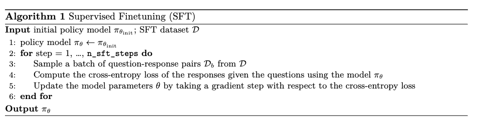
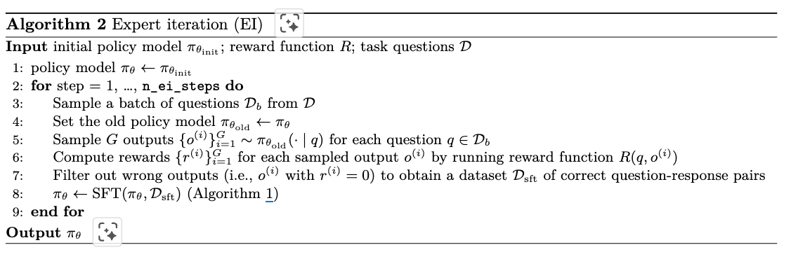

# CS336 作业 5 (对齐): 对齐与推理强化学习 

Version 1.0.2  
原内容：CS336 助教团队，翻译：徐虎   
Spring 2025

## 1 作业概述 

在本次作业中，你将获得一些关于训练语言模型在解决数学问题时进行推理的实践经验。

### 你将实现的内容

1. 在 Hendrycks 等人 [2021] 的 MATH 竞赛数学问题数据集上，建立一个零样本提示（Zero-shot prompting）基线。
2. 使用来自一个更强推理模型（DeepSeek R1, DeepSeek-AI 等，2025）的推理轨迹（reasoning traces）进行监督微调（Supervised finetuning）。
3. 使用经验证的奖励（verified rewards）通过专家迭代（Expert Iteration）来提升推理性能。
4. 使用经验证的奖励通过分组相对策略优化（Group-Relative Policy Optimization, GRPO）来提升推理性能。

对于感兴趣的同学，我们将在未来几天发布一个完全可选的部分，内容是将语言模型与人类偏好对齐。

### 你将运行的内容

1. 测量 Qwen 2.5 Math 1.5B 模型的零样本提示性能（我们的基线）。
2. 使用来自 R1 的推理轨迹对 Qwen 2.5 Math 1.5B 进行 SFT。
3. 使用经验证的奖励对 Qwen 2.5 Math 1.5B 运行专家迭代。
4. 使用经验证的奖励对 Qwen 2.5 Math 1.5B 运行 GRPO。 

### 代码结构 

所有作业代码以及本说明文档都已在 GitHub 上提供： github.com/stanford-cs336/assignment5-alignment

请 git clone 该仓库。 如果有任何更新，我们会通知您，您可以 git pull 获取最新版本。 

1. cs336_alignment/*：你将在其中编写作业5的代码。请注意，这里除了少量启动代码外没有其他代码，因此你可以从头开始自由编写。

2. cs336_alignment/prompts/：为方便起见，我们提供了包含提示（prompts）的文本文件，以尽量减少从 PDF 复制粘贴提示到代码中可能产生的错误。

3. tests/.py：这包含了你必须通过的所有测试。你只需要通过 tests/test_sft.py 和 tests/test_grpo.py 中的测试——其余测试是为作业的非强制部分准备的。这些测试会调用在 tests/adapters.py 中定义的钩子（hooks）。你需要实现这些适配器（adapters）以将你的代码连接到测试中。编写更多测试和/或修改测试代码对调试你的代码很有帮助，但你的实现需要通过原始提供的测试套件。

4. README.md：该文件包含了一些关于设置环境的基本说明。

### 您可以使用什么

我们期望你从头开始构建大部分与 RL 相关的组件。你可以使用像 vLLM 这样的工具来从语言模型生成文本（§3.1）。此外，你可以使用 HuggingFace Transformers 来加载 Qwen 2.5 Math 1.5B 模型和分词器（tokenizer）并运行前向传播（forward passes）（§4.1），但你不能使用任何训练工具（例如 Trainer 类）。

### 如何提交

你将向 Gradescope 提交以下文件：

- writeup.pdf：回答所有书面问题。请对你的回答进行排版。
- code.zip：包含你编写的所有代码。

## 2 使用语言模型进行推理 

### 2.1 动机 

语言模型的一个显著用例是构建能够处理各种自然语言处理任务的通用系统。在本次作业中，我们将专注于语言模型的一个新兴用例：数学推理。它将作为我们的试验平台，用于建立评估、执行监督微调，并尝试使用强化学习（RL）来教会 LMs 进行推理。这与我们过去作业的做法有两个不同之处。

- 首先，我们将不再使用早期作业中的语言模型代码库和模型。理想情况下，我们希望使用之前作业中从头训练的基础语言模型，但对这些模型进行微调不会得到令人满意的结果——这些模型太弱了，无法展示出非平凡的数学推理能力。因此，我们将转而使用一个现代的、高性能的语言模型（Qwen 2.5 Math 1.5B Base），我们的大部分工作都将在此模型之上完成。
- 我们将引入一个新的基准来评估我们的语言模型。到目前为止，我们都认为交叉熵（cross-entropy）是许多下游任务的良好代理。然而，本次作业的重点是弥合基础模型与下游任务之间的差距，因此我们必须使用与交叉熵分离的评估方法。我们将使用 Hendrycks 等人 [2021] 提出的 MATH 12K 数据集，该数据集包含具有挑战性的高中竞赛数学问题。我们将通过将语言模型的输出与参考答案进行比较来评估其性能。

### 2.2 思维链推理与推理强化学习 

语言模型领域的一个令人兴奋的近期趋势是使用思维链（Chain-of-Thought, CoT）推理来提高在各种任务上的表现。思维链是指通过逐步推理来解决问题，在得出最终答案之前生成中间推理步骤。

**使用 LLM 进行思维链推理** 早期的思维链方法通过微调语言模型，使用“草稿纸”（scratchpad）将问题分解为中间步骤来解决简单的数学任务（如算术）[Nye 等人, 2021]。其他工作则提示一个强大的模型在回答之前“一步一步地思考”，发现这能显著提高在年级数学问题等数学推理任务上的表现 [Wei 等人, 2023]。

**通过专家迭代学习推理**。Self-Taught Reasoner (STaR) [Zelikman 等人, 2022] 将推理视为一个自举（bootstrapping）循环：一个预训练模型首先采样多样化的思维链（CoTs），只保留那些能得出正确答案的链，然后在这些“专家”轨迹上进行微调。迭代这个循环可以提高 LMs 的推理能力和解题率。STaR 证明，这种基于专家迭代（expert iteration）[Anthony 等，2017] 的方法，通过自动的、基于字符串匹配的答案验证机制，可以在没有人工编写的推理轨迹的情况下，也能自举出推理能力。

**带验证奖励的推理强化学习，o1 和 R1**。最近的工作探索了使用更强大的强化学习算法配合经验证的奖励来提高推理性能。OpenAI 的 o1（及后续的 o3/o4）[OpenAI 等人, 2024]、DeepSeek 的 R1 [DeepSeek-AI 等人, 2025] 和 Moonshot 的 kimi k1.5 [Team 等人, 2025] 使用策略梯度方法 [Sutton 等人, 1999] 在数学和代码任务上进行训练，其中字符串匹配或单元测试验证正确性，在竞赛数学和编码性能方面展示了显著的改进。后续的工作，如 Open-R1 [Face, 2025]、SimpleRL-Zoo [Zeng 等人, 2025] 和 TinyZero [Pan 等人, 2025] 证实，即使是像 1.5B 参数这样小的模型，使用经验证奖励的纯强化学习也能提高推理性能。

**我们的设置：模型和数据集**。在接下来的章节中，我们将考虑越来越复杂的方法来训练一个基础语言模型，使其能够逐步推理以解决数学问题。在本次作业中，我们将使用 **Qwen 2.5 Math 1.5B Base** 模型，该模型是在 Qwen 2.5 1.5B 模型的基础上，使用高质量的合成数学预训练数据 [Yang 等人, 2024] 持续预训练得到的。MATH 数据集可在 Together 集群的 /data/a5-alignment/MATH 处获得。

> 本作业的核心部分依赖于 MATH 数据集，这是一个用于评估数学推理能力的竞赛数学问题数据集。然而，MATH 数据集由于版权声明，不公开可用（"not publicly available due to a copyright claim"）。这意味着，如果非课程学生想要运行作业中的实验，他们将无法直接获取 MATH 数据集。为了解决 MATH 数据集不可用的问题，本文档提供了多个替代的、公开可用的数学推理数据集。
> - Countdown [Pan et al., 2025]，[链接在此](https://huggingface.co/datasets/Jiayi-Pan/Countdown-Tasks-3to4)：一个基于英国电视节目 Countdown 的简单合成任务，该任务已成为小规模推理强化学习的流行测试平台。
> - GSM8K [Cobbe et al., 2021a]，[链接在此](https://huggingface.co/datasets/openai/gsm8k)：小学数学问题，比 MATH 简单，但应能帮助您调试正确性并熟悉推理强化学习流程。
> - Tulu 3 SFT Math [Lambert et al., 2025]，[链接在此](https://huggingface.co/datasets/allenai/tulu-3-sft-personas-math-filtered)：使用 GPT-4o 和 Claude 3.5 Sonnet 生成的合成数学问题。由于这些是合成数据，一些答案（甚至问题）可能不完全正确。
> - [此处链接](https://huggingface.co/datasets/hkust-nlp/dart-math-uniform#comparison-between-mathematical-instruction-tuning-datasets)的其他一些数学 SFT 数据集。
>
> 如果未直接提供简短的 ground-truth 标签（例如，1/2），您可以使用 Math-Verify 等数学答案解析器处理 ground-truth 列来获取它们。

## 3. 衡量 Zero-Shot MATH 性能

我们将首先测量我们的基础语言模型在 MATH 数据集的 5K 示例测试集上的表现。建立这个基线有助于我们理解后续每种方法对模型行为的影响。

除非另有说明，对于 MATH 上的实验，我们将使用来自 DeepSeek R1-Zero 模型 [DeepSeek-AI 等人, 2025] 的以下提示。我们将此提示称为 r1_zero 提示：

```
A conversation between User and Assistant. The User asks a question, and the Assistant solves it. The Assistant first thinks about the reasoning process in the mind and then provides the User with the answer. The reasoning process is enclosed within <think> </think> and answer is enclosed within <answer> </answer> tags, respectively, i.e., <think> reasoning process here </think> <answer> answer here </answer>.

User: {question}
Assistant: <think>
```

r1_zero提示位于文本文件 cs336_alignment/prompts/r1_zero.prompt 中。 在提示中， question 指的是我们插入的某个问题（例如，小明在四月卖给了 48 位朋友发夹，然后他在五月卖出了数量的一半。小明在四月和五月一共卖出了多少发夹？）。期望模型扮演助手的角色，并开始生成思考过程（因为我们已经包含了一个左思考标签<think>），用</think>结束思考过程，然后在答案标签内生成最终的符号答案，例如<answer> 4x + 10 </answer>。 让模型生成<answer> </answer>等标签的目的是为了方便我们解析模型的输出并与真实答案进行比较，以及为了在我们看到正确的答案标签</answer>时停止响应生成。 

**关于提示选择的说明**。事实证明，r1_zero 提示并不是最大化 RL 后下游性能的最佳选择，因为该提示与 Qwen 2.5 Math 1.5B 模型的预训练方式存在不匹配。Liu 等人 [2025] 发现，仅用问题（什么都不加）提示模型就能获得非常高的准确率，例如，在经过 100 多步 RL 后，其表现与 r1_zero 提示相当。他们的发现表明，Qwen 2.5 Math 1.5B 已经在这样的问答对上进行了预训练。

尽管如此，我们为本次作业选择 r1_zero 提示，是因为使用它进行 RL 可以在很短的步数内显示出明显的准确率提升，这使我们能够快速了解 RL 的机制并快速验证正确性，即使我们无法获得最佳的最终性能。作为一个现实检验，你将在作业后面直接与 question_only 提示进行比较。

### 3.1 使用 vLLM 进行离线语言模型推理

为了评估我们的语言模型，我们将不得不为各种提示生成续写（响应）。虽然你当然可以实现自己的生成功能（例如，像你在作业1中所做的那样），但 RL 的高效实现需要高性能的推理技术，而实现这些推理技术超出了本次作业的范围。因此，在本次作业中，我们将推荐使用 vLLM 进行离线批处理推理。vLLM 是一个用于语言模型的高吞吐量和内存高效的推理引擎，它结合了各种有用的效率技术（例如，优化的 CUDA 内核，用于高效注意力 KV 缓存的 PagedAttention [Kwon 等人, 2023] 等）。要使用 vLLM 为一组提示生成续写：

```
from vllm import LLM, SamplingParams
# Sample prompts.
prompts = [
    "Hello, my name is",
    "The president of the United States is",
    "The capital of France is",
    "The future of AI is",
]

# Create a sampling params object, stopping generation on newline.
sampling_params = SamplingParams(
    temperature=1.0, top_p=1.0, max_tokens=1024, stop=["\n"]
)

# Create an LLM.
llm = LLM(model=<path to model>)

# Generate texts from the prompts. The output is a list of RequestOutput objects
# that contain the prompt, generated text, and other information.
outputs = llm.generate(prompts, sampling_params)

# Print the outputs.
for output in outputs:
    prompt = output.prompt
    generated_text = output.outputs[0].text
    print(f"Prompt: {prompt!r}, Generated text: {generated_text!r}")
```

在上面的示例中，LLM 可以用 HuggingFace 模型的名称（如果没有在本地找到，它将被自动下载和缓存）或 HuggingFace 模型的路径来初始化。

由于下载可能需要很长时间（尤其是对于更大的模型，例如 70B 参数），并且为了节省集群磁盘空间（以免每个人都拥有预训练模型的独立副本），我们已在 Together 集群上的以下路径下载了以下预训练模型。请不要在 Together 集群上重新下载这些模型

- Qwen 2.5 Math 1.5B Base（用于推理实验）：/data/a5-alignment/models/Qwen2.5-Math-1.5B
- Llama 3.1 8B Base（用于可选的指令微调实验）：/data/a5-alignment/models/Llama-3.1-8B
- Llama 3.3 70B Instruct（用于可选的指令微调实验）：/data/a5-alignment/models/Llama-3.3-70B-Instruct

### 3.2 Zero-shot MATH 基线

**提示设置** 为了评估 MATH 测试集上的零样本性能，我们将简单地加载示例，并使用上述 r1_zero 提示提示语言模型回答问题。
**评估指标** 当我们评估多项选择或二元响应任务时，评估指标是明确的，即我们测试模型输出是否完全正确。

在数学问题中，我们假设存在一个已知的真值（例如 0.5），但我们不能简单地测试模型是否输出了 0.5——它也可以回答 `<answer> 1/2</answer>`。因此，我们必须解决一个棘手的问题，即在评估 MATH 时匹配来自 LM 的语义等价响应。

为此，我们希望提出一个答案解析函数，它以模型的输出和已知的真值作为输入，并返回一个布尔值，指示模型的输出是否正确。例如，一个奖励函数可以接收以 `<answer> She sold 15 clips.</answer>` 结尾的模型字符串输出和真值答案 72，如果模型的输出正确则返回 True，否则返回 False（在此情况下，应返回 False）。

在我们的 MATH 实验中，我们将使用最近推理 RL 工作中使用的快速且相当准确的答案解析器 [Liu 等人, 2025]。这个奖励函数在 cs336_alignment/drgrpo_grader.py 中的 `r1_zero_reward_fn` 实现，除非另有说明，你应该使用它来评估 MATH 上的性能。

**生成超参数**。 生成响应时，我们将以 `temperature=1.0、top_p=1.0、最大生成长度 1024` 进行采样。提示要求模型以字符串`</answer>` 结束其答案，因此我们可以指示 vLLM 在模型输出此字符串时停止：

```
# Based on Dr. GRPO: stop when the model completes its answer
# https://github.com/sail-sg/understand-r1-zero/blob/
# c18804602b85da9e88b4aeeb6c43e2f08c594fbc/train_zero_math.py#L167
sampling_params.stop = ["</answer>"]
sampling_params.include_stop_str_in_output = True
```

**问题 (math_baseline): 4 分** 
(a) 编写一个脚本来评估 Qwen 2.5 Math 1.5B 在 MATH 上的零样本性能。此脚本应 
    (1) 从 /data/a5-alignment/MATH/validation.jsonl 加载MATH验证示例，
    (2) 使用r1_zero提示将它们格式化为语言模型的字符串提示，以及 
    (3) 为每个示例生成输出。此脚本还应 
    (4) 计算评估指标，并 
    (5) 将示例、模型生成和相应的评估分数序列化到磁盘，以便在后续问题中进行分析。
    
为了便于你的实现，可以包含一个 evaluate_vllm 方法，其参数类似于以下内容，因为你可以在以后重用它：

```python

def evaluate_vllm(
    vllm_model: LLM,
    reward_fn: Callable[[str, str], dict[str, float]],
    prompts: List[str],
    eval_sampling_params: SamplingParams
) -> None:
    """
    Evaluate a language model on a list of prompts,
    compute evaluation metrics, and serialize results to disk.
    """
```

交付物： 一个评估基线零样本 MATH 性能的脚本。
    
(b) 在 Qwen 2.5 Math 1.5B 上运行你的评估脚本。有多少模型生成结果属于以下类别：(1) 格式和答案奖励均为 1（正确），(2) 格式奖励为 1 但答案奖励为 0，(3) 格式奖励为 0 且答案奖励为 0？观察至少 10 个格式奖励为 0 的案例，你认为问题出在基础模型的输出上，还是解析器上？为什么？对于（至少 10 个）格式奖励为 1 但答案奖励为 0 的情况呢？
    
交付物： 对模型和奖励函数性能的评论，包括每个类别的示例。


(c) Qwen 2.5 Math 1.5B 零样本基线在 MATH 上的表现如何？
    
交付物： 1-2 句话，包含评估指标。

## 4. 应用于 MATH 的 SFT



**用于推理的监督微调**。在本节中，我们将在 MATH 数据集上微调我们的基础模型（算法 1）。由于我们的目标是提高模型的推理能力，而不是微调它直接预测正确答案，因此我们将微调它首先生成一个思维链推理轨迹，然后是一个答案。为此，我们提供了一个来自 DeepSeek R1 [DeepSeek-AI 等人, 2025] 的此类推理轨迹数据集，位于 /data/a5-alignment/MATH/sft.jsonl。在实践中训练推理模型时，SFT 通常用作第二阶段 RL 微调的热启动（warm-start）。这主要有两个原因。首先，SFT 需要高质量的标注数据（即，带有预先存在的推理轨迹），而 RL 只需要正确的答案作为反馈。其次，即使在标注数据丰富的情况下，RL 仍然可以通过找到比 SFT 数据更好的策略来解锁性能增益。不幸的是，我们使用的模型还不够大，无法在组合 SFT 和 RL 时显示出效果，因此在本次作业中，我们将这两个阶段分开处理。

### 4.1 使用 HuggingFace 模型

**加载 HuggingFace 模型和分词器**。要从本地目录加载 HuggingFace 模型和分词器（使用 bfloat16 并配合 FlashAttention-2 以节省内存），你可以使用以下启动代码：

```python
ffrom transformers import AutoModelForCausalLM, AutoTokenizer

model = AutoModelForCausalLM.from_pretrained(
    "/data/a5-alignment/models/Qwen2.5-Math-1.5B",
    torch_dtype=torch.bfloat16,
    attn_implementation="flash_attention_2",
)
tokenizer = AutoTokenizer.from_pretrained("/data/a5-alignment/models/Qwen2.5-Math-1.5B")
```

**前向传播**。加载模型后，我们可以在输入 IDs 的批次上运行前向传播，并获取输出的 logits（通过 .logits） 属性。然后，我们可以计算模型预测的 logits 与实际标签之间的损失：
```python
input_ids = train_batch["input_ids"].to(device)
labels = train_batch["labels"].to(device)

logits = model(input_ids).logits
loss = F.cross_entropy(...)
```

**保存已训练模型**。 训练完成后，要将模型保存到某个目录，可以使用 .save_pretrained() 函数，传入目标输出目录的路径。 请确保保存在 /data/yourusername 下，因为模型可能非常大。我们建议也保存分词器（即使你没有修改它），这样模型和分词器就是自包含的，并且可以从单个目录加载。

```python
# Save the model weights
model.save_pretrained(save_directory=output_dir)
tokenizer.save_pretrained(save_directory=output_dir)
```

**梯度累积**。尽管以 bfloat16 加载模型并使用 FlashAttention-2，但即使是 80GB 的 GPU 也没有足够的内存来支持合理的批大小。为了使用更大的批大小，我们可以使用一种称为梯度累积的技术。梯度累积的基本思想是，我们不在每个批次后更新模型权重（即，不执行优化器步骤），而是先在多个批次上累积梯度，然后再进行一次梯度步骤。直观地说，如果我们有一个更大的 GPU，我们应该在一次处理 32 个示例的批次上计算梯度，或者将其拆分为 16 个批次，每个批次 2 个示例，然后在最后取平均，这两种方式应该会得到相同的结果。

在 PyTorch 中实现梯度累积非常简单。回想一下，每个权重张量都有一个 .grad 属性来存储其梯度。在我们调用 loss.backward() 之前，.grad 属性是 None。调用 loss.backward() 后，.grad 属性包含梯度。通常，我们会执行一个优化器步骤，然后用 optimizer.zero_grad() 将梯度清零，这会重置权重张量的 .grad 字段：

```python
for inputs, labels in data_loader:
    # Forward pass.
    logits = model(inputs)
    loss = loss_fn(logits, labels)
    
    # Backward pass.
    loss.backward()
    
    # Update weights.
    optimizer.step()
    
    # Zero gradients in preparation for next iteration.
    optimizer.zero_grad()
```

为了实现梯度累积，我们只需每 k 步调用一次 optimizer.step() 和 optimizer.zero_grad()，其中 k 是梯度累积步数。我们在调用 loss.backward() 之前将损失除以 gradient_accumulation_steps，以便在梯度累积步数上对梯度进行平均。

```
gradient_accumulation_steps = 4
for idx, (inputs, labels) in enumerate(data_loader):
    # Forward pass.
    logits = model(inputs)
    loss = loss_fn(logits, labels) / gradient_accumulation_steps
    
    # Backward pass.
    loss.backward()
    
    if (idx + 1) % gradient_accumulation_steps == 0:
        # Update weights every `gradient_accumulation_steps` batches.
        optimizer.step()
        # Zero gradients every `gradient_accumulation_steps` batches.
        optimizer.zero_grad()
```

因此，我们训练时的有效批大小乘以了 k，即梯度累积步数。

### 4.2 SFT 辅助方法

接下来，我们将实现一些在 SFT 和后续 RL 实验中会用到的辅助方法。

关于术语的快速说明：在接下来的章节中，我们将交替使用“输出”（output）、“完成”（completion）或“响应”（response）来指代模型给定提示的完成。 

**提示和输出的分词（Tokenizing prompts and outputs）** 对于每一对问题和目标输出 (q, o)，我们将分别对问题和输出进行 token 化，然后将它们连接起来。 然后，我们可以使用我们的 SFT 模型（或在后续章节中，我们的 RL policy）对输出的 log-probabilities 进行评分。 此外，我们需要构建一个 response_mask：一个布尔掩码，在响应中的所有 token 上为 True，在问题和填充 token 上为 False。我们将在训练循环中使用此掩码，以确保我们仅在响应 token 上计算损失。

**问题（tokenize_prompt_and_output）：提示和输出分词（2 分）**

交付物： 实现一个 tokenize_prompt_and_output 方法，该方法对问题和输出字符串分别进行分词，将它们连接在一起，并构造一个 response_mask。建议使用以下接口：

```python
def tokenize_prompt_and_output(
    prompt_strs: list[str],
    output_strs: list[str],
    tokenizer,
) -> dict[str, torch.Tensor]:
    """Tokenize the prompt and output strings, and construct a mask that is 1 for the response tokens and 0 for other tokens (prompt or padding).

    Args:
        prompt_strs: list[str] List of prompt strings.
        output_strs: list[str] List of output strings.
        tokenizer: PreTrainedTokenizer Tokenizer to use for tokenization.

    Returns:
        dict[str, torch.Tensor]. Let prompt_and_output_lens be a list containing the lengths of the tokenized prompt and output strings. Then the returned dictionary should have the following keys:
        - input_ids: torch.Tensor of shape (batch_size, max(prompt_and_output_lens) - 1): the tokenized prompt and output strings, with the final token sliced off.
        - labels: torch.Tensor of shape (batch_size, max(prompt_and_output_lens) - 1): shifted input ids, i.e., the input ids without the first token.
        - response_mask: torch.Tensor of shape (batch_size, max(prompt_and_output_lens) - 1): a mask on the response tokens in the labels.
    """

```

要测试你的代码，请实现 [adapters.run_tokenize_prompt_and_output]。然后，运行 uv run pytest -k test_tokenize_prompt_and_output 并确保你的实现通过测试。

**记录每 token 熵**。 进行 RL 时，跟踪每个 token 的熵通常很有用，以查看模型的预测分布是否变得（过度）自信。我们现在将实现这一点，并比较我们的每种微调方法对模型预测熵的影响。 离散分布 $p(x)$ (其支撑集为 X )的熵定义为：

$$
H(p) = - \sum_{x \in \mathcal{X}} p(x) \log p(x) &emsp;&emsp; (1)
$$

给定我们 SFT 或 RL 模型的 logits，我们将计算每个 token 的熵，即每个下一个 token 预测的熵。

**问题（compute_entropy）：每个 token 的熵（1 分）**

交付物： 实现一个 compute_entropy 方法，计算下一个 token 预测的每个 token 熵。
建议使用以下接口：

```python
def compute_entropy(logits: torch.Tensor) -> torch.Tensor:
    """
    获取下一 token 预测的熵（即，词汇表维度上的熵）。

    Args:
        logits: torch.Tensor 形状为 (batch_size, sequence_length, vocab_size) 的包含未归一化 logits 的张量。

    Returns:
        torch.Tensor 形状为 (batch_size, sequence_length)。每个下一 token 预测的熵。
    """
    # 注意：你应该使用数值稳定的方法（例如，使用 logsumexp）来避免溢出。
```

要测试你的代码，请实现 [adapters.run_compute_entropy]。然后运行 uv run pytest -k test_compute_entropy 并确保实现通过。

**从模型获取对数概率**。 从模型获取对数概率是在 SFT 和 RL 中都需要的一个基本操作。
对于前缀 x，产生下一 token logits $fθ(x) ∈ R^{|V|}$ 的 LM，以及标签 $y ∈ V$，y 的对数概率为 

$$
log pθ(y | x) = log [softmax(fθ(x))]_y  &emsp;&emsp; (2)
$$

其中符号 $[x]_y$ 表示向量 x 的第 y 个元素。

你将希望使用一种数值稳定的方法来计算它，并且可以自由使用 torch.nn.functional 中的方法。我们还建议包含一个参数来选择性地计算并返回 token 熵。

**问题 (get_response_log_probs)：响应对数概率（和熵）(2 分)**
交付物： 实现一个 get_response_log_probs 方法，该方法从因果语言模型获取每 token 条件对数概率（给定之前的 token），并可选择性地返回模型下一 token 分布的熵。
建议使用以下接口：

```
def get_response_log_probs(
    model: PreTrainedModel,
    input_ids: torch.Tensor,
    labels: torch.Tensor,
    return_token_entropy: bool = False,
) -> dict[str, torch.Tensor]:
    """
    Args:
        model: PreTrainedModel 用于评分的 HuggingFace 模型（放置在正确的设备上，并在不需要计算梯度时处于推理模式）。
        input_ids: torch.Tensor 形状为 (batch_size, sequence_length)，由你的分词方法产生的连接后的提示+响应 token。
        labels: torch.Tensor 形状为 (batch_size, sequence_length)，由你的分词方法产生的标签。
        return_token_entropy: bool 如果为 True，则通过调用 compute_entropy 也返回每 token 熵。

    Returns:
        dict[str, torch.Tensor]。
        "log_probs" 形状为 (batch_size, sequence_length)，条件对数概率 log pθ(xt | x<t)。
        "token_entropy" 可选，形状为 (batch_size, sequence_length)，每个位置的每 token 熵（如果 return_token_entropy=True 则存在）。
    """
```

实现提示：

- 使用 model(input_ids).logits 获取 logits。

要测试你的代码，请实现 [adapters.run_get_response_log_probs]。然后运行 uv run pytest -k test_get_response_log_probs 并确保测试通过。

**SFT 微批次训练步骤**。 我们在 SFT 中最小化的损失是给定提示的目标输出的负对数似然。为了计算这个损失，我们需要计算给定提示的目标输出的对数概率，并对输出中的所有 token 求和，同时对提示和填充 token 进行掩码。我们将为此实现一个辅助函数，我们稍后在 RL 期间也会用到它。

**问题 (masked_normalize)：掩码归一化 (1 分)**
交付物： 实现一个 masked_normalize 方法，该方法对张量元素求和并用一个常数进行归一化，同时尊重一个布尔掩码。
建议使用以下接口：

```
def masked_normalize(
    tensor: torch.Tensor,
    mask: torch.Tensor,
    normalize_constant: float,
    dim: int | None = None,
) -> torch.Tensor:
    """
    对一个维度求和并用一个常数进行归一化，只考虑掩码为 1 的元素。

    Args:
        tensor: torch.Tensor 要求和和归一化的张量。
        mask: torch.Tensor 与 tensor 形状相同；掩码为 1 的位置包含在求和中。
        normalize_constant: float 用于归一化的常数。
        dim: int | None 要在归一化前求和的维度。如果为 None，则对所有维度求和。

    Returns:
        torch.Tensor 归一化的和，其中掩码元素（mask==0）不贡献于求和。
    """
```

要测试你的代码，请实现 [adapters.run_masked_normalize]。然后运行 uv run pytest -k test_masked_normalize 并确保它通过。

**SFT 微批次训练步骤**。 我们现在准备实现 SFT 的单个微批次训练步骤（回想一下，对于一个训练小批次，如果 gradient_accumulation_steps > 1，我们会迭代多个微批次）。

**问题 (sft_microbatch_train_step)：微批次训练步骤 (3 分)**
交付物： 实现 SFT 的单个微批次更新，包括交叉熵损失、带掩码的求和和梯度缩放。
建议使用以下接口：

```
def sft_microbatch_train_step(
    policy_log_probs: torch.Tensor,
    response_mask: torch.Tensor,
    gradient_accumulation_steps: int,
    normalize_constant: float = 1.0,
) -> tuple[torch.Tensor, dict[str, torch.Tensor]]:
    """
    在微批次上执行前向和反向传递。

    Args:
        policy_log_probs: (batch_size, sequence_length)，正在训练的 SFT 策略的每 token 对数概率。
        response_mask: (batch_size, sequence_length)，对响应 token 为 1，对提示/填充为 0。
        gradient_accumulation_steps: 每个优化器步骤的微批次数量。
        normalize_constant: 用于除法的常数。留为 1.0 也可以。

    Returns:
        tuple[torch.Tensor, dict[str, torch.Tensor]]。
        loss: 标量张量。微批次损失，已根据梯度累积进行调整。我们返回它以便记录。
        metadata: 包含底层损失调用的元数据以及你可能想要记录的任何其他统计信息的字典。
    """
```

实现提示：

- 你应该在此函数中调用 loss.backward()。确保根据梯度累积进行调整。

要测试你的代码，请实现 [adapters.run_sft_microbatch_train_step]。然后运行 uv run pytest -k test_sft_microbatch_train_step 并确认它通过。

循环内日志记录生成。 始终是良好的实践，进行一些涉及从模型生成的循环内日志记录，推理 SFT/RL 也不例外。编写一个 log_generations 函数，用于提示你的模型为一些给定的提示（例如，从验证集中采样）生成响应。最好至少记录每个示例的以下内容：
1. 输入提示。
2. SFT/RL 模型生成的响应。
3. 真值答案。
4. 奖励信息，包括格式、答案和总奖励。
5. 响应的平均 token 熵。
6. 平均响应长度、正确响应的平均长度和错误响应的平均长度。

**问题 (log_generations)：日志记录生成 (1 分)**
交付物： 实现一个 log_generations 函数，可用于记录模型的生成。

### 4.3 SFT 实验

使用上述组件，你现在将实现完整的 SFT 过程（算法 1），以在 MATH 数据集上微调 Qwen 2.5 Math 1.5B Base 模型。/data/a5-alignment/MATH/sft.jsonl 中的每个示例都包含一个格式化的提示和一个目标响应，其中目标响应包含一个思维链推理轨迹和最终答案。特别是，每个示例都是一个 {"prompt": str, "response": str} 类型的 JSON 元素。

为了跟踪模型在训练过程中的进度，你应该定期在 MATH 验证集上对其进行评估。你应该使用 2 个 GPU 运行你的脚本，一个 GPU 用于策略模型，另一个用于 vLLM 实例以评估策略。要使其工作，以下是一些启动代码，用于初始化 vLLM 并在每次 rollout 阶段之前将策略权重加载到 vLLM 实例中：

```
from vllm.model_executor import set_random_seed as vllm_set_random_seed

def init_vllm(
    model_id: str,
    device: str,
    seed: int,
    gpu_memory_utilization: float = 0.85
):
    """
    启动推理过程，这里我们使用 vLLM 在一个与策略分离的 GPU 上持有一个模型。
    """
    vllm_set_random_seed(seed)

    # 来自 TRL 的猴子补丁：
    # https://github.com/huggingface/trl/blob/
    # 22759c820867c8659d00082ba8cf004e963873c1/trl/trainer/grpo_trainer.py
    # 补丁 vLLM 以确保我们能够
    # (1) 将 vLLM 模型放置在所需的设备上 (world_size_patch)
    # (2) 避免一个不适合我们设置的测试 (profiling_patch)。
    world_size_patch = patch("torch.distributed.get_world_size", return_value=1)
    profiling_patch = patch(
        "vllm.worker.worker.Worker._assert_memory_footprint_increased_during_profiling",
        return_value=None
    )
    with world_size_patch, profiling_patch:
        return LLM(
            model=model_id,
            device=device,
            dtype=torch.bfloat16,
            enable_prefix_caching=True,
            gpu_memory_utilization=gpu_memory_utilization,
        )

def load_policy_into_vllm_instance(policy: PreTrainedModel, llm: LLM):
    """
    复制自 https://github.com/huggingface/trl/blob/
    22759c820867c8659d00082ba8cf004e963873c1/trl/trainer/grpo_trainer.py#L670。
    """
    state_dict = policy.state_dict()
    llm_model = llm.llm_engine.model_executor.driver_worker.model_runner.model
    llm_model.load_weights(state_dict.items())
```

你可能会发现，以训练步和验证步为基准记录指标很有帮助（这在后续的 RL 实验中也会有用）。要在 wandb 中做到这一点，可以使用以下代码：

```
# 设置 wandb 指标
wandb.define_metric("train_step")  # 训练的 x 轴
wandb.define_metric("eval_step")   # 评估的 x 轴

# 所有以 train/ 开头的内容都与 train_step 关联
wandb.define_metric("train/*", step_metric="train_step")
# 所有以 eval/ 开头的内容都与 eval_step 关联
wandb.define_metric("eval/*", step_metric="eval_step")
```

最后，我们建议你使用梯度裁剪，裁剪值为 1.0。

**问题 (sft_experiment)：在 MATH 数据集上运行 SFT (2 分，2 H100 hrs)**

2 H100 hrs 表示在单个 H100 GPU 上运行，预计需要大约 2 小时的计算时间。

1. 在推理 SFT 示例（位于 /data/a5-alignment/MATH/sft.jsonl）上对 Qwen 2.5 Math 1.5B 基础模型运行 SFT，SFT 中唯一示例的数量在 {128, 256, 512, 1024} 范围内变化，并使用完整数据集。调整学习率和批量大小，以在使用完整数据集时至少达到 15% 的验证准确率。
交付物： 与不同数据集大小相关的验证准确率曲线。
2. 过滤推理 SFT 示例，只包含产生正确答案的示例。在（完整）过滤后的数据集上运行 SFT，并报告过滤后数据集的大小和你达到的验证准确率。
交付物： 报告数据集的大小和你达到的验证准确率曲线。将你的发现与之前的 SFT 实验进行比较。

## 5. 专家迭代

在上一节中，我们观察到，通过从 SFT 数据中过滤掉错误的示例，可以提高 SFT 模型的性能。在本节中，我们将更进一步：我们将对从我们自己的基础模型生成的推理轨迹应用此过滤过程。这一过程在文献中被称为专家迭代 [Anthony 等, 2017]，在语言模型的背景下已在 Cobbe 等 [2021b]、Zelikman 等 [2022]、Dohan 等 [2022]、Gulcehre 等 [2023] 中进行了探索。



接下来，我们将在 MATH 数据集上运行专家迭代。
作为一个提示，你应该将一个 min_tokens 值传递给你的 vLLM SamplingParams，以确保你不会生成空字符串（这可能会根据你的实现导致下游出现 NaN）。这可以通过以下方式完成：

```
sampling_min_tokens = 4
sampling_params = SamplingParams(
    temperature=sampling_temperature,
    max_tokens=sampling_max_tokens,
    min_tokens=sampling_min_tokens,
    n=G,
    seed=seed,
)
```

与 SFT 一样，你应该使用裁剪值为 1.0 的梯度裁剪。

**问题 (expert_iteration_experiment)：在 MATH 数据集上运行专家迭代 (2 分) (6 H100 hrs)**

在 MATH 数据集（位于 /data/a5-alignment/MATH/train.jsonl）上运行专家迭代，使用 Qwen 2.5 Math 1.5B Base 模型，每个问题的 rollout 次数 G 和 SFT 步骤中使用的 epoch 数量各不相同，并使用 n_ei_steps = 5。在 {512, 1024, 2048} 中变化每个专家迭代步骤的批量大小（即，Db 的大小）。（你不需要尝试所有可能的超参数组合。只要足够得出结论即可。）记录训练过程中模型响应的熵。确保 vLLM 在第二个答案标签 </answer> 处终止生成，如 SFT 部分所述。
- 交付物： 与不同 rollout 配置相关的验证准确率曲线。至少尝试 2 种不同的 rollout 次数和 epoch 次数。
- 交付物： 一个在 MATH 上达到至少 15% 验证准确率的模型。
- 交付物： 一段简短的 2 句话讨论，将其与你的 SFT 性能进行比较，并比较 EI 步骤之间的性能。
- 交付物： 一张训练过程中模型响应熵的曲线图。

## 6 策略梯度入门

语言模型研究中的一个新发现是，对强基础模型进行基于已验证奖励的强化学习（RL）可以显著提高其推理能力和性能 [OpenAI 等, 2024, DeepSeek-AI 等, 2025]。最强的此类开源推理模型，如 DeepSeek R1 和 Kimi k1.5 [Team 等, 2025]，都是使用策略梯度训练的，这是一种强大的强化学习算法，可以优化任意奖励函数。

我们在下面为语言模型上的 RL 提供一个简短的策略梯度介绍。我们的介绍很大程度上基于一些优秀的资源，这些资源更深入地讲解了这些概念：OpenAI 的《深度强化学习入门》[Achiam, 2018a] 和 Nathan Lambert 的《人类反馈强化学习 (RLHF) 书》[Lambert, 2024]。

### 6.1 作为策略的语言模型

有参数 θ 的因果语言模型（LM）定义了给定当前文本前缀 $s_t$ （状态/观测）的下一个 token $a_t$ ∈ V 的概率分布。在 RL 的上下文中，我们将下一个 token $a_t$ 视为动作，将当前文本前缀 $s_t$ 视为状态。因此，LM 是一个分类随机策略

$$
a_t ∼ πθ(· | s_t), πθ(a_t | s_t) = [softmax(f_θ(s_t))]_{a_t}.  &emsp;&emsp; (3)
$$

在使用策略梯度优化策略时，需要两个基本操作：

1. 从策略中采样：从上述分类分布中抽取一个动作 $a_t$；
2. 为动作评分对数似然：评估 $log πθ(a_t | s_t)$。

通常，在使用 LLMs 进行 RL 时，$s_t$ 是迄今为止产生的部分完成/解决方案，每个 $a_t$ 是解决方案的下一个 token；当发出一个文本结束 token 时，例如 <|end_of_text|>，或在我们的情况下是 </answer>（对于 r1_zero 提示），该 episode 就结束了。

### 6.2 轨迹 (Trajectories)

一个（有限时域）轨迹是代理（agent）经历的状态和动作的交错序列：

$$
τ = (s_0, a_0, s_1, a_1, ..., s_T, a_T), &emsp;&emsp; (4)
$$

其中 T 是轨迹的长度，即 $a_T$ 是一个文本结束 token，或者我们已经达到了最大生成 token 预算。

初始状态从起始分布中抽取 $s_0 ∼ ρ_0(s_0)$ ；在 LLMs 的 RL 中， $ρ_0(s_0)$ 是格式化提示的分布。在一般设置中，状态转换遵循某种环境动力学 $s_{t+1} ∼ P(· | s_t, a_t)$ 。在 LLMs 的 RL 中，环境是确定性的：下一个状态是旧前缀与发出的 token 的连接， $s_{t+1} = s_t ∥ a_t$ 。轨迹也称为 episodes 或 rollouts；我们将互换使用这些术语。

### 6.3 奖励和回报 (Rewards and Return)

标量奖励 $r_t = R(s_t, a_t)$ 评判了在状态 $s_t$ 采取动作 $a_t$ 的即时质量。对于已验证领域的 RL，通常为中间步骤分配零奖励，为终端动作分配已验证奖励

$$
r_T = R(s_T, a_T) := 
\begin{cases} 
1 & \text{if the trajectory } s_T \| a_T \text{ matches the ground-truth according to our reward function} \\
0 & \text{otherwise.}
\end{cases}
$$

回报 $R(τ)$ 沿轨迹聚合奖励。两种常见的选择是有限时域无折扣回报

$$
R(\tau) := \sum_{t=0}^{T} r_t, &emsp;&emsp; (5)
$$

和无限时域折扣回报

$$
R(\tau) := \sum_{t=0}^{∞} γ^t r_t, 0 < γ < 1. &emsp;&emsp; (6)
$$

在我们的案例中，我们将使用无折扣公式，因为 episodes 有自然的终止点（文本结束或最大生成长度）。

代理的目标是最大化期望回报 

$$
J(θ) = E_{τ∼πθ}[R(τ)], &emsp;&emsp; (7)
$$

从而导致优化问题 

$$
\theta^* = \arg\max_{\theta} J(\theta).
$$

### 6.4 原始策略梯度

接下来，让我们尝试使用期望回报上的梯度上升来学习策略参数 $\theta$：

$$
\theta_{k+1} = \theta_k + \alpha \nabla_\theta J(\theta_k). &emsp;&emsp; (9)
$$

我们将使用的核心恒等式是下面所示的 **REINFORCE 策略梯度**。

$$
\nabla_\theta J(\pi_\theta) = \mathbb{E}_{\tau \sim \pi_\theta} \left[ \sum_{t=0}^{T} \nabla_\theta \log \pi_\theta(a_t|s_t) R(\tau) \right]. &emsp;&emsp; (10)
$$

**推导策略梯度。** 我们是如何得到这个方程的？为了完整性，我们将在下面给出这个恒等式的推导。我们将用到几个恒等式。
1.  轨迹的概率由下式给出

$$
P(\tau | \theta) = \rho_0(s_0) \prod_{t=0}^{T} P(s_{t+1} | s_t, a_t) \pi_\theta(a_t | s_t). \quad (11)
$$

    因此，轨迹的对数概率为：
    
$$
\log P(\tau | \theta) = \log \rho_0(s_0) + \sum_{t=0}^{T} [\log P(s_{t+1} | s_t, a_t) + \log \pi_\theta(a_t | s_t)]. \quad (12)
$$

2.  **对数导数技巧**（log-derivative trick）：
    
$$
\nabla_\theta P = P \nabla_\theta \log P. \quad (13)
$$

3.  **环境项在 $\theta$ 中是常数**。 $\rho_0$ 、 $P(\cdot|\cdot)$ 和 $R(\tau)$ 不依赖于策略参数，所以 

$$
\nabla_\theta \rho_0 = \nabla_\theta P = \nabla_\theta R(\tau) = 0. \quad (14)
$$

应用以上事实：

$$
\begin{align}
\nabla_\theta J(\theta) &= \nabla_\theta \mathbb{E}_{\tau \sim \pi_\theta}[R(\tau)] \quad (15) \\
&= \nabla_\theta \sum_{\tau} P(\tau|\theta) R(\tau) \quad (16) \\
&= \sum_{\tau} \nabla_\theta P(\tau|\theta) R(\tau) \quad (17) \\
&= \sum_{\tau} P(\tau|\theta) \nabla_\theta \log P(\tau|\theta) R(\tau) \quad \text{(对数导数技巧)} \quad (18) \\
&= \mathbb{E}_{\tau \sim \pi_\theta}[\nabla_\theta \log P(\tau|\theta) R(\tau)], \quad (19)
\end{align}
$$

因此，代入轨迹的对数概率并利用环境项在 $\theta$ 中是常数这一事实，我们得到了原始的或 REINFORCE 策略梯度：

$$
\nabla_\theta J(\pi_\theta) = \mathbb{E}_{\tau \sim \pi_\theta} \left[ \sum_{t=0}^{T} \nabla_\theta \log \pi_\theta(a_t|s_t) R(\tau) \right]. \quad (20)
$$

直观地说，这个梯度会增加高回报轨迹中每个动作的对数概率，反之则会降低它们。

**梯度的样本估计。** 给定一个通过从起始状态 $s^{(i)}_0 \sim \rho_0(s_0)$ 采样，然后在环境中运行策略 $\pi_\theta$ 收集的 $N$ 个 rollout 批次 $\mathcal{D} = \{\tau^{(i)}\}_{i=1}^N$，我们形成梯度的无偏估计为

$$
\hat{g} = \frac{1}{N} \sum_{i=1}^{N} \sum_{t=0}^{T} \nabla_\theta \log \pi_\theta(a^{(i)}_t | s^{(i)}_t) R(\tau^{(i)}). \quad (21)
$$

该向量用于梯度上升更新 $\theta \leftarrow \theta + \alpha \hat{g}$。

### 6.5 策略梯度基线

原始策略梯度的主要问题是梯度估计的方差很高。减轻此问题的一种常用技术是从奖励中减去一个仅依赖于状态的**基线函数**（baseline function）$b$。这是一种**控制变量**（control variate）[Ross, 2022]：其思想是通过减去一个与它相关的项来降低估计器的方差，同时不引入偏差。

让我们将基于基线的策略梯度定义为：

$$
B = \mathbb{E}_{\tau \sim \pi_\theta} \left[ \sum_{t=0}^{T} \nabla_\theta \log \pi_\theta(a_t|s_t) (R(\tau) - b(s_t)) \right]. \quad (22)
$$

作为一个例子，一个合理的基线是**策略价值函数**（on-policy value function）$V^\pi(s) = \mathbb{E}_{\tau \sim \pi_\theta} [R(\tau) | s_t = s]$，即如果我们从 $s_t = s$ 开始并遵循策略 $\pi_\theta$，期望的回报是多少。那么，量 $(R(\tau) - V^\pi(s_t))$ 直观上表示实际轨迹比预期好多少。

只要基线只依赖于状态，基于基线的策略梯度就是无偏的。我们可以通过将基于基线的策略梯度重写为

$$
B = \mathbb{E}_{\tau \sim \pi_\theta} \left[ \sum_{t=0}^{T} \nabla_\theta \log \pi_\theta(a_t|s_t) R(\tau) \right] - \mathbb{E}_{\tau \sim \pi_\theta} \left[ \sum_{t=0}^{T} \nabla_\theta \log \pi_\theta(a_t|s_t) b(s_t) \right]. \quad (23)
$$

专注于基线项，我们看到

$$
\mathbb{E}_{\tau \sim \pi_\theta} \left[ \sum_{t=0}^{T} \nabla_\theta \log \pi_\theta(a_t|s_t) b(s_t) \right] = \sum_{t=0}^{T} \mathbb{E}_{s_t} \left[ b(s_t) \mathbb{E}_{a_t \sim \pi_\theta(\cdot|s_t)} [\nabla_\theta \log \pi_\theta(a_t | s_t)] \right]. \quad (24)
$$

一般来说，**得分函数**（score function）的期望为零：$\mathbb{E}_{x \sim P_\theta}[\nabla_\theta \log P_\theta(x)] = 0$ 。因此，公式 (24) 中的表达式为零，并且

$$
B = \mathbb{E}_{\tau \sim \pi_\theta} \left[ \sum_{t=0}^{T} \nabla_\theta \log \pi_\theta(a_t|s_t) R(\tau) \right] - 0 = \nabla_\theta J(\pi_\theta), \quad (25)
$$

所以我们得出结论，基于基线的策略梯度是无偏的。我们稍后将运行一个实验，看看基线是否能提高下游性能。

**关于策略梯度“损失”的说明。** 当我们在 PyTorch 这样的框架中实现策略梯度方法时，我们将定义一个所谓的**策略梯度损失**（pg_loss），使得调用 `pg_loss.backward()` 会用我们近似的策略梯度 $\hat{g}$ 填充模型参数的梯度缓冲区。用数学语言表达，即：

$$
\mathrm{pg\_loss} = \frac{1}{N} \sum_{i=1}^{N} \sum_{t=0}^{T} 
\log \pi_\theta\!\left( a^{(i)}_t \,\middle|\, s^{(i)}_t \right) 
\left( R(\tau^{(i)}) - b(s^{(i)}_t) \right)  &emsp;&emsp;(26)
$$

`pg_loss` 在规范意义上并不是一个损失——报告 `pg_loss` 作为训练或验证集上的评估指标是没有意义的，一个好的验证 `pg_loss` 并不表示我们的模型泛化得很好。`pg_loss` 实际上只是一个标量，当我们调用 `pg_loss.backward()` 时，通过反向传播得到的梯度就是近似的策略梯度 $\hat{g}$。

进行 RL 时，你应该始终记录和报告训练和验证奖励。这些是“有意义”的评估指标，也是我们试图用策略梯度方法优化的目标。

### 6.6 Off-Policy 策略梯度

REINFORCE 是一种**同策略**（on-policy）算法：训练数据是由我们正在优化的相同策略收集的。为了说明这一点，让我们写出 REINFORCE 算法：
1.  从当前策略 $\pi_\theta$ 中采样一批 rollout $\{\tau^{(i)}\}_{i=1}^N$。
2.  将策略梯度近似为 $\nabla_\theta J(\pi_\theta) \approx \hat{g} = \frac{1}{N} \sum_{i=1}^{N} \sum_{t=0}^{T} \nabla_\theta \log \pi_\theta(a^{(i)}_t | s^{(i)}_t) R(\tau^{(i)})$。
3.  使用计算出的梯度更新策略参数： $\theta \leftarrow \theta + \alpha \hat{g}$ 。

我们需要进行大量的推理来采样一个新的 rollout 批次，却只进行一次梯度步骤。LM 的行为通常在单个步骤中不会发生显著变化，因此这种在策略的方法效率非常低。

**异策略策略梯度**（Off-policy policy gradient）。在离策略学习中，我们使用的 rollout 是从不同于我们正在优化的策略中采样的。PPO 和 GRPO 等流行的策略梯度算法的离策略变体使用来自策略 $\pi_\theta$ 的先前版本 $\pi_{\theta_{\text{old}}}$ 的 rollout 来优化当前策略 $\pi_\theta$。离策略策略梯度估计为

$$
\hat{g}_{\text{off-policy}} = \frac{1}{N} \sum_{i=1}^{N} \sum_{t=0}^{T} \frac{\pi_\theta(a^{(i)}_t | s^{(i)}_t)}{\pi_{\theta_{\text{old}}}(a^{(i)}_t | s^{(i)}_t)} \nabla_\theta \log \pi_\theta(a^{(i)}_t | s^{(i)}_t) R(\tau^{(i)}). &emsp;&emsp;(27)
$$

这看起来像是原始策略梯度的重要性采样版本，带有重加权项

$$
\frac{\pi_\theta(a^{(i)}_t | s^{(i)}_t)}{\pi_{\theta_{\text{old}}}(a^{(i)}_t | s^{(i)}_t)}
$$ 

事实上，可以通过重要性采样并应用一个合理的近似来推导公式 (27)，只要 $\pi_\theta$ 和 $\pi_{\theta_{\text{old}}}$ 不是太不同即可：更多细节请参见 Degris 等人 [2013]。

## 7 分组相对策略优化（GRPO）

接下来，我们将描述**分组相对策略优化**（Group Relative Policy Optimization, GRPO），这是你将要为解决数学问题而实现和实验的策略梯度变体。

### 7.1 GRPO 算法

**优势估计**（Advantage estimation）。GRPO 的核心思想是从策略 $\pi_\theta$ 中为每个问题采样许多输出，并使用它们来计算一个基线。这很方便，因为我们避免了学习一个神经价值函数 $V_\phi(s)$ 的需要，而后者可能难以训练并且从系统角度看很麻烦。

对于一个问题 $q$ 和从 $\pi_\theta$ 采样的一组输出 $\{o^{(i)}\}_{i=1}^G$，令 $r^{(i)} = R(q, o^{(i)})$ 为第 $i$ 个输出的奖励。
DeepSeekMath [Shao 等人, 2024] 和 DeepSeek R1 [DeepSeek-AI 等人, 2025] 计算第 $i$ 个输出的**分组归一化奖励**（group-normalized reward）为

$$
A^{(i)} = \frac{r^{(i)} - \text{mean}(r^{(1)}, r^{(2)}, ..., r^{(G)})}{\text{std}(r^{(1)}, r^{(2)}, ..., r^{(G)}) + \text{advantage}_{\epsilon}} \qquad (28)
$$

其中 $advantage_{\epsilon}$ 是一个防止除零的小常数。请注意，这个优势 $A^{(i)}$ 对于响应中的每个 token 都是相同的，即 $A^{(i)}_t = A^{(i)}, \forall t \in 1, ..., |o^{(i)}|$，因此在下文中我们将省略下标 $t$。

**高级算法**（High-level algorithm）。在深入探讨 GRPO 目标之前，让我们首先通过写出 Shao 等人 [2024] 的算法 3 来了解训练循环的整体思路。

**GRPO 目标**（GRPO objective）。GRPO 目标结合了三个思想：
1.  **离策略策略梯度**，如公式 (27)。
2.  使用**分组归一化**（group normalization）计算优势，如公式 (28)。
3.  **裁剪机制**（clipping mechanism），如近端策略优化（Proximal Policy Optimization, PPO, Schulman 等人 [2017]）。

裁剪的目的是在对单个 rollout 批次进行多次梯度步骤时保持稳定性。它通过阻止策略 $\pi_\theta$ 过度偏离旧策略来实现。

让我们首先写出完整的 GRPO-Clip 目标，然后我们可以构建一些关于裁剪作用的直觉：

$$
J_{\text{GRPO-Clip}}(\theta) = \mathbb{E}_{q \sim \mathcal{D}, \{o^{(i)}\}_{i=1}^G \sim \pi_\theta(\cdot|q)} \left[ \frac{1}{G} \sum_{i=1}^{G} \frac{1}{|o^{(i)}|} \sum_{t=1}^{|o^{(i)}|} \min \left( \frac{\pi_\theta(o^{(i)}_t | q, o^{(i)}_{<t})}{\pi_{\theta_{\text{old}}}(o^{(i)}_t | q, o^{(i)}_{<t})} A^{(i)}, \text{clip}\left( \frac{\pi_\theta(o^{(i)}_t | q, o^{(i)}_{<t})}{\pi_{\theta_{\text{old}}}(o^{(i)}_t | q, o^{(i)}_{<t})}, 1 - \epsilon, 1 + \epsilon \right) A^{(i)} \right) \right]. \quad (29)
$$

超参数 $\epsilon > 0$ 控制策略可以改变的程度。为了看到这一点，我们可以按照 Achiam [2018a,b] 的方式重写每个 token 的目标。定义函数

$$
g(\epsilon, A^{(i)}) = \begin{cases} (1+\epsilon)A^{(i)} & \text{if } A^{(i)} \geq 0 \\ (1-\epsilon)A^{(i)} & \text{if } A^{(i)} < 0. \end{cases} \quad (30)
$$


我们可以将每个 token 的目标重写为

$$
\text{per-token objective} = \min \left( \frac{\pi_\theta(o^{(i)}_t | q, o^{(i)}_{<t})}{\pi_{\theta_{\text{old}}}(o^{(i)}_t | q, o^{(i)}_{<t})} A^{(i)}, g(\epsilon, A^{(i)}) \right)
$$

我们现在可以分情况讨论。当优势 $A^{(i)}$ 为正时，每个 token 的目标简化为

$$
\text{per-token objective} = \min \left( \frac{\pi_\theta(o^{(i)}_t | q, o^{(i)}_{<t})}{\pi_{\theta_{\text{old}}}(o^{(i)}_t | q, o^{(i)}_{<t})}, 1 + \epsilon \right) A^{(i)}.
$$

由于 $A^{(i)} > 0$，如果动作 $o_t^{(i)}$ 在 $\pi_\theta$ 下变得更有可能，即如果 $\pi_\theta(o_t^{(i)} \mid q, o_{<t}^{(i)})$ 增加，目标值就会上升。利用 `min` 进行的截断限制了目标值增加的幅度：一旦 $\pi_\theta(o_t^{(i)} \mid q, o_{<t}^{(i)}) > (1 + \epsilon)\pi_{\theta_{\mathrm{old}}}(o_t^{(i)} \mid q, o_{<t}^{(i)})$，该 token 的目标值就达到了其最大值 $(1 + \epsilon)A^{(i)}$。因此，策略 $\pi_\theta$ 不会受到激励去过分偏离旧策略 $\pi_{\theta_{\mathrm{old}}}$。

类似地，当优势 $A^{(i)}$ 为负时，模型试图降低 $\pi_\theta(o_t^{(i)} \mid q, o_{<t}^{(i)})$，但不会受到激励将其降低到 $(1 - \epsilon)\pi_{\theta_{\mathrm{old}}}(o_t^{(i)} \mid q, o_{<t}^{(i)})$ 以下（完整的论证请参阅 Achiam [2018b]）。

### 7.2 实现

现在我们对 GRPO 训练循环和目标有了高层次的理解，我们将开始实现它的各个部分。在 SFT 和 EI 部分实现的许多部分也将被重用于 GRPO。

**计算优势**（分组归一化奖励）。首先，我们将实现逻辑来计算 rollout 批次中每个示例的优势，即分组归一化的奖励。我们将考虑两种可能的获得分组归一化奖励的方法：上面在公式 (28) 中提出的和最近的一种简化方法。

Dr. GRPO [Liu 等人, 2025] 指出，通过 $\text{std}(r^{(1)}, r^{(2)}, ..., r^{(G)})$ 对奖励进行归一化会奖励批次中答案正确性变化较小的问题，这可能是不理想的。他们建议简单地移除归一化步骤，计算

$$
A^{(i)} = r^{(i)} - \text{mean}(r^{(1)}, r^{(2)}, ..., r^{(G)}). \quad (31)
$$

我们将实现这两种变体，并在作业的后面比较它们的性能。

**问题（compute_group_normalized_rewards）：分组归一化（2 分）**

**交付物：** 实现一个 `compute_group_normalized_rewards` 方法，该方法为每组 rollout 响应计算原始奖励，在组内对它们进行归一化，并返回归一化和原始奖励以及你认为有用的任何元数据。
建议使用以下接口：
```python
def compute_group_normalized_rewards(
    reward_fn,
    rollout_responses: list[str],
    repeated_ground_truths: list[str],
    group_size: int,
    advantage_eps: float,
    normalize_by_std: bool,
):
    """Compute rewards for each group of rollout responses, normalized by the group size.

    Args:
        reward_fn: Callable[[str, str], dict[str, float]] Scores the rollout responses against the ground truths, producing a dict with keys "reward", "format_reward", and "answer_reward".
        rollout_responses: list[str] Rollouts from the policy. The length of this list is rollout_batch_size = n_prompts_per_rollout_batch * group_size.
        repeated_ground_truths: list[str] The ground truths for the examples. The length of this list is rollout_batch_size, because the ground truth for each example is repeated group_size times.
        group_size: int Number of responses per question (group).
        advantage_eps: float Small constant to avoid division by zero in normalization.
        normalize_by_std: bool If True, divide by the per-group standard deviation; otherwise subtract only the group mean.

    Returns:
        tuple[torch.Tensor, torch.Tensor, dict[str, float]].
        - advantages: shape (rollout_batch_size,). Group-normalized rewards for each rollout response.
        - raw_rewards: shape (rollout_batch_size,). Unnormalized rewards for each rollout response.
        - metadata: your choice of other statistics to log (e.g. mean, std, max/min of rewards).
    """
```
要测试你的代码，请实现 `[adapters.run_compute_group_normalized_rewards]`。然后，运行 `uv run pytest -k test_compute_group_normalized_rewards` 并确保你的实现通过测试。

**朴素策略梯度损失**（Naive policy gradient loss）。接下来，我们将实现一些用于计算“损失”的方法。
作为一个提醒/免责声明，这些在规范意义上并不是真正的损失，不应该作为评估指标报告。说到 RL，你应该跟踪训练和验证回报以及其他指标（参见第 6.5 节的讨论）。

我们将从**朴素策略梯度损失**开始，它只是将优势与动作的对数概率相乘（并取负）。对于问题 $q$、响应 $o$ 和响应 token $o_t$，朴素的每个 token 策略梯度损失是：

$$
-A_t \cdot \log p_\theta(o_t \mid q, o_{\lt t}) \tag{32}
$$

**问题（compute_naive_policy_gradient_loss）：朴素策略梯度（1 分）**
**交付物：** 实现一个 `compute_naive_policy_gradient_loss` 方法，使用原始奖励或预先计算的优势来计算每个 token 的策略梯度损失。
建议使用以下接口：
```python
def compute_naive_policy_gradient_loss(
    raw_rewards_or_advantages: torch.Tensor,
    policy_log_probs: torch.Tensor,
) -> torch.Tensor:
    """Compute the policy-gradient loss at every token, where raw_rewards_or_advantages is either the raw reward or an already-normalized advantage.

    Args:
        raw_rewards_or_advantages: torch.Tensor Shape (batch_size, 1), scalar reward/advantage for each rollout response.
        policy_log_probs: torch.Tensor Shape (batch_size, sequence_length), logprobs for each token.

    Returns:
        torch.Tensor Shape (batch_size, sequence_length), the per-token policy-gradient loss (to be aggregated across the batch and sequence dimensions in the training loop).
    """
```
**实现提示：**
*   将 `raw_rewards_or_advantages` 广播到 `sequence_length` 维度。
要测试你的代码，请实现 `[adapters.run_compute_naive_policy_gradient_loss]`。然后运行 `uv run pytest -k test_compute_naive_policy_gradient_loss` 并确保测试通过。

**GRPO-Clip 损失**（GRPO-Clip loss）。接下来，我们将实现更有趣的 GRPO-Clip 损失。
每个 token 的 GRPO-Clip 损失是

$$
-\min \left( \frac{\pi_\theta(o_t|q, o_{<t})}{\pi_{\theta_{\text{old}}}(o_t|q, o_{<t})} A_t, \text{clip}\left( \frac{\pi_\theta(o_t|q, o_{<t})}{\pi_{\theta_{\text{old}}}(o_t|q, o_{<t})}, 1 - \epsilon, 1 + \epsilon \right) A_t \right). \quad (33)
$$

**问题（compute_grpo_clip_loss）：GRPO-Clip 损失（2 分）**
**交付物：** 实现一个 `compute_grpo_clip_loss` 方法，计算每个 token 的 GRPO-Clip 损失。
建议使用以下接口：
```python
def compute_grpo_clip_loss(
    advantages: torch.Tensor,
    policy_log_probs: torch.Tensor,
    old_log_probs: torch.Tensor,
    cliprange: float,
) -> tuple[torch.Tensor, dict[str, torch.Tensor]]:
    """Args:
        advantages: torch.Tensor Shape (batch_size, 1), per-example advantages A.
        policy_log_probs: torch.Tensor Shape (batch_size, sequence_length), per-token log probs from the policy being trained.
        old_log_probs: torch.Tensor Shape (batch_size, sequence_length), per-token log probs from the old policy.
        cliprange: float Clip parameter ϵ (e.g. 0.2).

    Returns:
        tuple[torch.Tensor, dict[str, torch.Tensor]].
        - loss: torch.Tensor of shape (batch_size, sequence_length), the per-token clipped loss.
        - metadata: dict containing whatever you want to log. We suggest logging whether each token was clipped or not, i.e., whether the clipped policy gradient loss on the RHS of the min was lower than the LHS.
    """
```
**实现提示：**
*   将 `advantages` 广播到 `sequence_length`。
要测试你的代码，请实现 `[adapters.run_compute_grpo_clip_loss]`。然后运行 `uv run pytest -k test_compute_grpo_clip_loss` 并确保测试通过。

**策略梯度损失包装器**（Policy gradient loss wrapper）。我们将运行消融实验，比较三种不同版本的策略梯度：
(a) `no_baseline`：没有基线的朴素策略梯度损失，即优势就是原始奖励 $A = R(q, o)$。
(b) `reinforce_with_baseline`：朴素策略梯度损失，但使用我们的分组归一化奖励作为优势。如果 $\bar{r}$ 是来自 `compute_group_normalized_rewards` 的分组归一化奖励（可能已按组标准差归一化，也可能没有），那么 $A = \bar{r}$。
(c) `grpo_clip`：GRPO-Clip 损失。

为了方便起见，我们将实现一个包装器，让我们可以轻松地在这三种策略梯度损失之间切换。

**问题（compute_policy_gradient_loss）：策略梯度包装器（1 分）**
**交付物：** 实现 `compute_policy_gradient_loss`，一个便利的包装器，用于分派到正确的损失例程（`no_baseline`、`reinforce_with_baseline` 或 `grpo_clip`），并返回每个 token 的损失和任何辅助统计信息。
建议使用以下接口：
```python
def compute_policy_gradient_loss(
    policy_log_probs: torch.Tensor,
    loss_type: Literal["no_baseline", "reinforce_with_baseline", "grpo_clip"],
    raw_rewards: torch.Tensor | None = None,
    advantages: torch.Tensor | None = None,
    old_log_probs: torch.Tensor | None = None,
    cliprange: float | None = None,
) -> tuple[torch.Tensor, dict[str, torch.Tensor]]:
    """Select and compute the desired policy-gradient loss.

    Args:
        policy_log_probs: (batch_size, sequence_length), per-token log-probabilities from the policy being trained.
        loss_type: One of "no_baseline", "reinforce_with_baseline", or "grpo_clip".
        raw_rewards: Required if loss_type=="no_baseline"; shape (batch_size, 1).
        advantages: Required for "reinforce_with_baseline" and "grpo_clip"; shape (batch_size, 1).
        old_log_probs: Required for "grpo_clip"; shape (batch_size, sequence_length).
        cliprange: Required for "grpo_clip"; scalar ϵ used for clipping.

    Returns:
        tuple[torch.Tensor, dict[str, torch.Tensor]].
        - loss: (batch_size, sequence_length), per-token loss.
        - metadata: dict, statistics from the underlying routine (e.g., clip fraction for GRPO-Clip).
    """
```
**实现提示：**
*   委托给 `compute_naive_policy_gradient_loss` 或 `compute_grpo_clip_loss`。
*   执行参数检查（参见上面的断言模式）。
*   将任何返回的元数据聚合到一个字典中。
要测试你的代码，请实现 `[adapters.run_compute_policy_gradient_loss]`。然后运行 `uv run pytest -k test_compute_policy_gradient_loss` 并验证它通过。

**掩码均值**（Masked mean）。到目前为止，我们已经具备了计算优势、对数概率、每个 token 的损失以及有用的统计信息（如每个 token 的熵和裁剪分数）所需的逻辑。为了将形状为 `(batch_size, sequence_length)` 的每个 token 损失张量减少为一个损失向量（每个示例一个标量），我们将在序列维度上计算损失的平均值，但**仅**在对应于响应的索引上（即，掩码为 `mask[i, j] == 1` 的 token 位置）。

在大多数用于 LLMs 的 RL 代码库中，按序列长度归一化是规范做法，但很明显这不是正确的事情——你可能会注意到，看我们在 (21) 中对策略梯度估计的陈述，那里没有归一化因子 $\frac{1}{T^{(i)}}$。我们将从这个标准原语开始，通常被称为 **`masked_mean`**，但稍后会测试使用我们在 SFT 期间实现的 `masked_normalize` 方法。

我们将允许指定计算均值的维度，如果 `dim` 为 `None`，我们将在所有掩码元素上计算均值。这对于在响应 token 上获取平均每个 token 的熵、裁剪分数等可能很有用。

**问题（masked_mean）：掩码均值（1 分）**
**交付物：** 实现一个 `masked_mean` 方法，在考虑布尔掩码的情况下对张量元素求平均。
建议使用以下接口：
```python
def masked_mean(
    tensor: torch.Tensor,
    mask: torch.Tensor,
    dim: int | None = None,
) -> torch.Tensor:
    """Compute the mean of tensor along a given dimension, considering only those elements where mask == 1.

    Args:
        tensor: torch.Tensor The data to be averaged.
        mask: torch.Tensor Same shape as tensor; positions with 1 are included in the mean.
        dim: int | None Dimension over which to average. If None, compute the mean over all masked elements.

    Returns:
        torch.Tensor The masked mean; shape matches tensor.mean(dim) semantics.
    """
```
要测试你的代码，请实现 `[adapters.run_masked_mean]`。然后运行 `uv run pytest -k test_masked_mean` 并确保它通过。

**GRPO 微批次训练步骤**（GRPO microbatch train step）。现在我们准备实现 GRPO 的单个微批次训练步骤（回想一下，对于一个训练小批次，如果 `gradient_accumulation_steps` > 1，我们会迭代多个微批次）。

具体来说，给定原始奖励或优势和对数概率，我们将计算每个 token 的损失，使用 `masked_mean` 聚合为每个示例的标量损失，在批次维度上取平均，调整梯度累积，然后进行反向传播。

**问题（grpo_microbatch_train_step）：微批次训练步骤（3 分）**
**交付物：** 实现 GRPO 的单个微批次更新，包括策略梯度损失、带掩码的平均和梯度缩放。
建议使用以下接口：
```python
def grpo_microbatch_train_step(
    policy_log_probs: torch.Tensor,
    response_mask: torch.Tensor,
    gradient_accumulation_steps: int,
    loss_type: Literal["no_baseline", "reinforce_with_baseline", "grpo_clip"],
    raw_rewards: torch.Tensor | None = None,
    advantages: torch.Tensor | None = None,
    old_log_probs: torch.Tensor | None = None,
    cliprange: float | None = None,
) -> tuple[torch.Tensor, dict[str, torch.Tensor]]:
    """Execute a forward-and-backward pass on a microbatch.

    Args:
        policy_log_probs: (batch_size, sequence_length), per-token log-probabilities from the policy being trained.
        response_mask: (batch_size, sequence_length), 1 for response tokens, 0 for prompt/padding.
        gradient_accumulation_steps: Number of microbatches per optimizer step.
        loss_type: One of "no_baseline", "reinforce_with_baseline", "grpo_clip".
        raw_rewards: Needed when loss_type=="no_baseline"; shape (batch_size, 1).
        advantages: Needed when loss_type != "no_baseline"; shape (batch_size, 1).
        old_log_probs: Required for GRPO-Clip; shape (batch_size, sequence_length).
        cliprange: Clip parameter ϵ for GRPO-Clip.

    Returns:
        tuple[torch.Tensor, dict[str, torch.Tensor]].
        - loss: scalar tensor. The microbatch loss, adjusted for gradient accumulation. We return this so we can log it.
        - metadata: Dict with metadata from the underlying loss call, and any other statistics you might want to log.
    """
```
**实现提示：**
*   你应该在此函数中调用 `loss.backward()`。请确保调整梯度累积。
要测试你的代码，请实现 `[adapters.run_grpo_microbatch_train_step]`。然后运行 `uv run pytest -k test_grpo_microbatch_train_step` 并确认它通过。

**整合：GRPO 训练循环**（Putting it all together: GRPO train loop）。现在我们将整合一个完整的 GRPO 训练循环。你应该参考第 7.1 节中的算法以了解整体结构，并在适当的地方使用我们已实现的方法。

下面提供了一些启动超参数。如果你的实现是正确的，你应该会看到使用这些超参数得到合理的结果：
```python
n_grpo_steps: int = 200
learning_rate: float = 1e-5
advantage_eps: float = 1e-6
rollout_batch_size: int = 256
group_size: int = 8
sampling_temperature: float = 1.0
sampling_min_tokens: int = 4  # As in Expiter, disallow empty string responses
sampling_max_tokens: int = 1024
epochs_per_rollout_batch: int = 1  # On-policy
train_batch_size: int = 256  # On-policy
gradient_accumulation_steps: int = 128  # microbatch size is 2, will fit on H100
gpu_memory_utilization: float = 0.85
loss_type: Literal[
    "no_baseline",
    "reinforce_with_baseline",
    "grpo_clip",
] = "reinforce_with_baseline"
use_std_normalization: bool = True

optimizer = torch.optim.AdamW(
    policy.parameters(),
    lr=learning_rate,
    weight_decay=0.0,
    betas=(0.9, 0.95),
)
```
这些默认超参数将使你处于**在策略**（on-policy）设置中——对于每个 rollout 批次，我们只进行一次梯度步骤。就超参数而言，这意味着 `train_batch_size` 等于 `rollout_batch_size`，而 `epochs_per_rollout_batch` 等于 1。

这里有一些健全性检查断言和常量，应该能消除一些边缘情况并为你指明正确的方向：
```python
assert train_batch_size % gradient_accumulation_steps == 0, (
    "train_batch_size must be divisible by gradient_accumulation_steps"
)
micro_train_batch_size = train_batch_size // gradient_accumulation_steps

assert rollout_batch_size % group_size == 0, (
    "rollout_batch_size must be divisible by group_size"
)
n_prompts_per_rollout_batch = rollout_batch_size // group_size

assert train_batch_size >= group_size, (
    "train_batch_size must be greater than or equal to group_size"
)

n_microbatches_per_rollout_batch = rollout_batch_size // micro_train_batch_size
```
还有一些额外的提示：
*   记住要使用 `r1_zero` 提示，并指示 vLLM 在第二个答案标签 `</answer>` 处终止生成，如之前的实验所示。
*   我们建议使用 `typer` 进行参数解析。
*   使用梯度裁剪，裁剪值为 1.0。
*   你应该定期记录验证奖励（例如，每 5 或 10 步）。你应该在至少 1024 个验证示例上进行评估以比较超参数，因为 CoT/RL 评估可能会有噪声。
*   在我们的损失实现中，只有在离策略（off-policy）时才应使用 GRPO-Clip（因为它需要旧的对数概率）。
*   在off-policy策略设置中，对每个 rollout 批次进行多个 epoch 的梯度更新时，为每个 epoch 重新计算旧的对数概率是浪费的。相反，我们可以计算一次旧的对数概率并为每个 epoch 重复使用它们。
*   你不应该对旧的对数概率进行微分。
*   对于每个优化器更新，你应该记录以下一些或全部内容：
    -   损失。
    -   梯度范数。
    -   Token 熵。
    -   裁剪分数（如果是离策略）。
    -   训练奖励（总奖励、格式奖励和答案奖励）。
    -   任何你认为对调试有用的其他内容。

**问题（grpo_train_loop）：GRPO 训练循环（5 分）**
**交付物：** 实现一个完整的 GRPO 训练循环。开始在 MATH 上训练一个策略，并确认你看到验证奖励在提高，以及随着时间的推移生成的 rollout 变得合理。提供一个验证奖励随步骤变化的图表，以及随着时间推移的几个 rollout 示例。

## 8 GRPO 实验

现在我们可以开始用我们的 GRPO 训练循环进行实验，尝试不同的超参数和算法调整。每个实验将使用 2 个 GPU，一个用于 vLLM 实例，一个用于策略。

**关于提前停止运行的说明。** 如果你在 200 个 GRPO 步骤之前就看到超参数之间存在显著差异（例如，某个配置发散或明显次优），你当然可以提前停止实验，从而为后续运行节省时间和计算资源。下面提到的 GPU 小时数是一个粗略估计。

**问题（grpo_learning_rate）：调整学习率（2 分）（6 H100 小时）**
从上面建议的超参数开始，对学习率进行扫描，并报告最终的验证答案奖励（或在优化器发散时注明）。
**交付物：** 与多个学习率相关的验证奖励曲线。
**交付物：** 一个在 MATH 上达到至少 25% 验证准确率的模型。
**交付物：** 一个简短的 2 句话讨论，说明你在其他记录的指标上注意到的任何其他趋势。
对于其余的实验，你可以使用在上述扫描中表现最好的学习率。

**基线的影响**（Effect of baselines）。在上面的超参数基础上继续（但使用你调整的学习率），我们现在将研究基线的影响。我们处于在策略设置中，因此我们将比较损失类型：
*   `no_baseline`
*   `reinforce_with_baseline`
请注意，在默认超参数中，`use_std_normalization` 为 `True`。

**问题（grpo_baselines）：基线的影响（2 分）（2 H100 小时）**
使用 `reinforce_with_baseline` 和 `no_baseline` 训练一个策略。
**交付物：** 与每种损失类型相关的验证奖励曲线。
**交付物：** 一个简短的 2 句话讨论，说明你在其他记录的指标上注意到的任何其他趋势。
对于接下来的几个实验，你应该使用在上述实验中找到的最佳损失类型。

**长度归一化**（Length normalization）。正如我们在实现 `masked_mean` 时所暗示的，对序列长度平均损失既不是必要的，甚至也不是正确的。如何对损失求和的选择是一个重要的超参数，它会导致对策略动作的不同类型的信用分配。

让我们通过 Lambert [2024] 的一个例子来说明这一点。检查 GRPO 训练步骤，我们首先获得每个 token 的策略梯度损失（暂时忽略裁剪）：
```python
advantages  # (batch_size, 1)
per_token_probability_ratios  # (batch_size, sequence_length)
per_token_loss = -advantages * per_token_probability_ratios
```
我们将 `advantages` 广播到序列长度上。让我们比较两种聚合这些每个 token 损失的方法：
*   我们实现的 `masked_mean`，它在每个序列的未掩码 token 上取平均。
*   在每个序列的未掩码 token 上求和，然后除以一个常数标量（我们的 `masked_normalize` 方法支持 `constant_normalizer != 1.0`）[Liu 等人, 2025, Yu 等人, 2025]。

我们将考虑一个批大小为 2 的例子，第一个响应有 4 个 token，第二个响应有 7 个 token。然后，我们可以看看这些归一化方法如何影响梯度。
```python
from your_utils import masked_mean, masked_normalize

ratio = torch.tensor([
    [1, 1, 1, 1, 1, 1, 1,],
    [1, 1, 1, 1, 1, 1, 1,],
], requires_grad=True)
advs = torch.tensor([
    [2, 2, 2, 2, 2, 2, 2,],
    [2, 2, 2, 2, 2, 2, 2,],
])
masks = torch.tensor([
    # generation 1: 4 tokens
    [1, 1, 1, 1, 0, 0, 0,],
    # generation 2: 7 tokens
    [1, 1, 1, 1, 1, 1, 1,],
])

# Normalize with each approach
max_gen_len = 7
masked_mean_result = masked_mean(ratio * advs, masks, dim=1)
masked_normalize_result = masked_normalize(
    ratio * advs, masks, dim=1, normalize_constant=max_gen_len
)

print("masked_mean", masked_mean_result)
print("masked_normalize", masked_normalize_result)
# masked_mean tensor([2., 2.], grad_fn=<DivBackward0>)
# masked_normalize tensor([1.1429, 2.0000], grad_fn=<DivBackward0>)

masked_mean_result.mean().backward()
print("ratio.grad", ratio.grad)
# ratio.grad:
# tensor([[0.2500, 0.2500, 0.2500, 0.2500, 0.0000, 0.0000, 0.0000],
#         [0.1429, 0.1429, 0.1429, 0.1429, 0.1429, 0.1429, 0.1429]])
ratio.grad.zero_()

masked_normalize_result.mean().backward()
print("ratio.grad", ratio.grad)
# ratio.grad:
# tensor([[0.1429, 0.1429, 0.1429, 0.1429, 0.0000, 0.0000, 0.0000],
#         [0.1429, 0.1429, 0.1429, 0.1429, 0.1429, 0.1429, 0.1429]])
```

**问题（think_about_length_normalization）：思考长度归一化（1 分）**
**交付物：** 比较这两种方法（在不运行实验的情况下）。每种方法的优缺点是什么？是否有任何特定的设置或例子表明一种方法似乎更好？

现在，让我们对 `masked_mean` 和 `masked_normalize` 进行实证比较。

**问题（grpo_length_normalization）：长度归一化的影响（2 分）（2 H100 小时）**
**交付物：** 通过端到端的 GRPO 训练运行，比较使用 `masked_mean` 和 `masked_normalize` 的归一化。报告验证答案奖励曲线。评论你的发现，包括任何有明显趋势的其他指标。
**提示：** 考虑与稳定性相关的指标，例如梯度范数。
对于以下实验，请固定使用表现更好的长度归一化方法。

**分组标准差归一化**（Normalization with group standard deviation）。回想一下我们标准的 `compute_group_normalized_rewards` 实现（基于 Shao 等人 [2024]，DeepSeek-AI 等人 [2025]），我们在其中按组标准差进行了归一化。Liu 等人 [2025] 指出，除以组标准差可能会给训练过程引入不必要的偏差：标准差较低的问题（例如，太简单或太难，奖励几乎全为 1 或全为 0 的问题）在训练中会获得更高的权重。

Liu 等人 [2025] 提议移除标准差归一化，我们已经在 `compute_group_normalized_rewards` 中实现了这一点，现在将对其进行测试。

**问题（grpo_group_standard_deviation）：标准差归一化的影响（2 分）（2 H100 小时）**
**交付物：** 比较 `use_std_normalization == True` 和 `use_std_normalization == False` 的性能。报告验证答案奖励曲线。评论你的发现，包括任何有明显趋势的其他指标。
**提示：** 考虑与稳定性相关的指标，例如梯度范数。
对于以下实验，请固定使用表现更好的分组归一化方法。

**离策略与在策略**（Off-policy versus on-policy）。到目前为止，我们实验的超参数都是**在策略**（on-policy）的：我们对每个 rollout 批次只进行一次梯度步骤，因此我们几乎完全使用了策略梯度的“原则性”近似 $\hat{g}$（除了上面提到的长度和优势归一化选择）。

虽然这种方法在理论上是合理的且稳定的，但效率低下。Rollouts 需要从策略中进行缓慢的生成，因此是 GRPO 的主要成本；只对每个 rollout 批次进行一次梯度步骤似乎是浪费的，而这可能不足以显著改变策略的行为。

我们现在将尝试**离策略**（off-policy）训练，即对每个 rollout 批次进行多次梯度步骤（甚至多个 epoch）。

**问题（grpo_off_policy）：实现离策略 GRPO**
**交付物：** 实现离策略 GRPO 训练。
根据你上面对完整 GRPO 训练循环的实现，你可能已经有了这样做的基础设施。如果没有，你需要实现以下内容：
*   你应该能够对每个 rollout 批次进行多个 epoch 的梯度步骤，其中每个 rollout 批次的 epoch 数和优化器更新数由 `rollout_batch_size`、`epochs_per_rollout_batch` 和 `train_batch_size` 控制。
*   编辑你的主训练循环，以便在每次 rollout 批次生成阶段之后、梯度步骤的内层循环之前，从策略中获取响应的对数概率——这些将是 `old_log_probs`。我们建议使用 `torch.inference_mode()`。
*   你应该使用 `"GRPO-Clip"` 损失类型。

现在，我们可以使用每个 rollout 批次的 epoch 数和优化器更新数来控制我们在多大程度上是离策略的。

**问题（grpo_off_policy_sweep）：离策略 GRPO 超参数扫描（4 分）（12 H100 小时）**
**交付物：** 固定 `rollout_batch_size = 256`，选择一个范围对 `epochs_per_rollout_batch` 和 `train_batch_size` 进行扫描。首先进行一个广泛的扫描（少于 50 个 GRPO 步骤）以了解性能格局，然后进行一个更集中的扫描（200 个 GRPO 步骤）。提供一个简短的实验日志，解释你选择的范围。
与你的在策略运行（`epochs_per_rollout_batch = 1` 和 `train_batch_size = 256`）进行比较，报告相对于验证步骤数量和相对于墙上时钟时间的图表。
报告验证答案奖励曲线。评论你的发现，包括任何有明显趋势的其他指标，例如熵和响应长度。将训练过程中模型响应的熵与你在 EI 实验中观察到的进行比较。
**提示：** 你需要更改 `gradient_accumulation_steps` 以保持内存使用恒定。

**在离策略设置中消融裁剪**（Ablating clipping in the off-policy setting）。回想一下，GRPO-Clip 中裁剪的目的是在对单个 rollout 批次进行多次梯度步骤时，防止策略过度偏离旧策略。接下来，我们将在离策略设置中消融裁剪，以测试它在多大程度上是真正必要的。换句话说，我们将使用每个 token 的损失
$$- \frac{\pi_\theta(o_t|q, o_{<t})}{\pi_{\theta_{\text{old}}}(o_t|q, o_{<t})} A_t. \quad (34)$$

**问题（grpo_off_policy_clip_ablation）：离策略 GRPO-Clip 消融（2 分）（2 H100 小时）**
**交付物：** 将未裁剪的每个 token 损失实现为一种新的损失类型 `"GRPO-No-Clip"`。采用你从前一个问题中表现最好的离策略超参数，并运行损失的未裁剪版本。报告验证答案奖励曲线。与你的 GRPO-Clip 运行相比评论你的发现，包括任何有明显趋势的其他指标，例如熵、响应长度和梯度范数。

**提示的影响**（Effect of prompt）。作为最后一个消融实验，我们将研究一个令人惊讶的现象：在 RL 中使用的提示可以根据模型的预训练方式对模型的性能产生巨大影响。

我们将不再使用 `cs336_alignment/prompts/r1_zero.prompt` 中的 R1-Zero 提示，而是改用 `cs336_alignment/prompts/question_only.prompt` 中的一个极其简单的提示：`{question}`。你将在训练和验证中都使用此提示，并将改变你的奖励函数（在训练和验证中都使用）为位于 `cs336_alignment/drgrpo_grader.py` 中的 `question_only_reward_fn`。

**问题（grpo_prompt_ablation）：提示消融（2 分）（2 H100 小时）**
**交付物：** 报告 R1-Zero 提示和仅问题提示的验证答案奖励曲线。指标如何比较，包括任何有明显趋势的其他指标，例如熵、响应长度和梯度范数？尝试解释你的发现。

## 9 排行榜：MATH 上的 GRPO

作为（强制）作业的最后一部分，你将尝试各种方法，以在 2 个 H100 GPU 上 4 小时的训练时间内获得尽可能高的验证奖励。

**模型。** 我们将继续使用 Qwen 2.5 Math 1.5B Base 模型。

**数据集。** 我们将继续使用集群上 `/data/a5-alignment/MATH/train.jsonl` 和 `/data/a5-alignment/MATH/validation.jsonl` 处的 MATH 训练和验证数据集。你不允许使用任何其他数据或对来自更强模型的推理链进行 SFT 等。你必须在**整个**验证集（所有 5K 个示例）上报告验证准确率，并使用上述给定的采样超参数（temperature 1.0, max tokens 1024）。你可以根据需要过滤训练集或设计数据课程。在验证时，你必须使用 **R1-Zero** 提示，并且在验证期间，你必须使用启动代码中提供的 `r1_zero_reward_fn` 奖励函数来计算验证准确率（你可以在训练期间开发另一个奖励函数）。

**算法。** 你可以自由调整超参数或完全改变训练算法，只要你不使用任何额外的数据或另一个模型（如果你想，可以自由使用该模型的多个副本）。

**系统优化**（Systems optimizations）。你可能会观察到，在我们上面简单的 GRPO 实现中，至少有一个 GPU 始终是空闲的。通过改进我们的管道的系统特性，你很可能会发现显著的改进。例如，你可以考虑在 rollout 或训练中使用更低的精度、`torch.compile` 以及其他系统优化。你不受限于将 vLLM 放在一个设备上而将训练策略放在另一个设备上，我们鼓励你思考更好的并行化方式。

**想法**（Ideas）。关于一些可能的改进想法，请参阅以下仓库：
*   `veRL`
*   `trl`
*   `torchtune`
*   `oat`

**关于 KL 散度**（On KL divergence）。我们还注意到，在上述实验中，我们没有包含关于某个参考模型（通常是冻结的 SFT 或预训练检查点）的 KL 散度项。在我们的实验和文献中的其他实验 [Liu 等人, 2025, NTT123, 2025] 中，我们发现省略 KL 项对性能没有影响，同时节省了 GPU 内存（不需要存储参考模型）。

然而，许多 GRPO 仓库默认包含它，我们鼓励你尝试 KL 或其他形式的正则化，只要你使用的是 **Qwen 2.5 Math 1.5B Base** 或通过你的算法获得的某个模型。

**问题（leaderboard）：排行榜（16 分）（16 H100 小时）**
**交付物：** 报告在 2 个 H100 GPU 上 4 小时训练内获得的验证准确率，以及你的验证准确率随墙上时钟时间变化的截图，其中 x 轴在 ≤ 4 小时处结束。作为提醒，我们对你的评估施加以下约束：
1.  你的验证准确率应该是**整个** MATH 验证集（所有 5K 个示例）上的平均准确率。
2.  你必须在验证时使用 **R1-Zero** 提示。
3.  你必须在评估时对 vLLM 使用 temperature 1.0 和 max tokens 1024。
4.  你必须通过平均启动代码中提供的 `r1_zero_reward_fn` 奖励函数产生的答案奖励来计算验证准确率。

## 10 尾声

恭喜你完成了本课程的最后一次作业！你应该为自己的辛勤工作感到自豪。
我们希望你喜欢通过从头开始构建现代语言模型的主要组件来学习其基础。

## 参考文献

Dan Hendrycks, Collin Burns, Saurav Kadavath, Akul Arora, Steven Basart, Eric Tang, Dawn Song, and Jacob Steinhardt. Measuring mathematical problem solving with the math dataset, 2021. URL https://arxiv.org/abs/2103.03874.

DeepSeek-AI, Daya Guo, Dejian Yang, Haowei Zhang, Junxiao Song, Ruoyu Zhang, Runxin Xu, Qihao Zhu, Shirong Ma, Peiyi Wang, Xiao Bi, Xiaokang Zhang, Xingkai Yu, Yu Wu, Z. F. Wu, Zhibin Gou, Zhihong Shao, Zhuoshu Li, Ziyi Gao, Aixin Liu, Bing Xue, Bingxuan Wang, Bochao Wu, Bei Feng, Chengda Lu, Chenggang Zhao, Chengqi Deng, Chenyu Zhang, Chong Ruan, Damai Dai, Deli Chen, Dongjie Ji, Erhang Li, Fangyun Lin, Fucong Dai, Fuli Luo, Guangbo Hao, Guanting Chen, Guowei Li, H. Zhang, Han Bao,
Hanwei Xu, Haocheng Wang, Honghui Ding, Huajian Xin, Huazuo Gao, Hui Qu, Hui Li, Jianzhong Guo, Jiashi Li, Jiawei Wang, Jingchang Chen, Jingyang Yuan, Junjie Qiu, Junlong Li, J. L. Cai, Jiaqi Ni, Jian Liang, Jin Chen, Kai Dong, Kai Hu, Kaige Gao, Kang Guan, Kexin Huang, Kuai Yu, Lean Wang, Lecong Zhang, Liang Zhao, Litong Wang, Liyue Zhang, Lei Xu, Leyi Xia, Mingchuan Zhang, Minghua Zhang, Minghui Tang, Meng Li, Miaojun Wang, Mingming Li, Ning Tian, Panpan Huang, Peng Zhang,
Qiancheng Wang, Qinyu Chen, Qiushi Du, Ruiqi Ge, Ruisong Zhang, Ruizhe Pan, Runji Wang, R. J. Chen, R. L. Jin, Ruyi Chen, Shanghao Lu, Shangyan Zhou, Shanhuang Chen, Shengfeng Ye, Shiyu Wang, Shuiping Yu, Shunfeng Zhou, Shuting Pan, S. S. Li, Shuang Zhou, Shaoqing Wu, Shengfeng Ye, Tao Yun, Tian Pei, Tianyu Sun, T. Wang, Wangding Zeng, Wanjia Zhao, Wen Liu, Wenfeng Liang, Wenjun Gao, Wenqin Yu, Wentao Zhang, W. L. Xiao, Wei An, Xiaodong Liu, Xiaohan Wang, Xiaokang Chen, Xiaotao Nie, Xin Cheng, Xin Liu, Xin Xie, Xingchao Liu, Xinyu Yang, Xinyuan Li, Xuecheng Su, Xuheng Lin, X. Q. Li, Xiangyue Jin, Xiaojin Shen, Xiaosha Chen, Xiaowen Sun, Xiaoxiang Wang, Xinnan Song, Xinyi Zhou, Xianzu Wang, Xinxia Shan, Y. K. Li, Y. Q. Wang, Y. X. Wei, Yang Zhang, Yanhong Xu, Yao Li, Yao Zhao, Yaofeng Sun, Yaohui Wang, Yi Yu, Yichao Zhang, Yifan Shi, Yiliang Xiong, Ying He, Yishi Piao, Yisong Wang, Yixuan Tan, Yiyang Ma, Yiyuan Liu, Yongqiang Guo, Yuan Ou, Yuduan Wang, Yue Gong, Yuheng Zou, Yujia He, Yunfan Xiong, Yuxiang Luo, Yuxiang You, Yuxuan Liu, Yuyang Zhou, Y. X. Zhu, Yanhong Xu, Yanping Huang, Yaohui Li, Yi Zheng, Yuchen Zhu, Yunxian Ma, Ying Tang, Yukun Zha, Yuting Yan, Z. Z. Ren, Zehui Ren, Zhangli Sha, Zhe Fu,Zhean Xu, Zhenda Xie, Zhengyan Zhang, Zhewen Hao, Zhicheng Ma, Zhigang Yan, Zhiyu Wu, Zihui Gu, Zijia Zhu, Zijun Liu, Zilin Li, Ziwei Xie, Ziyang Song, Zizheng Pan, Zhen Huang, Zhipeng Xu, Zhongyu Zhang, and Zhen Zhang. Deepseek-r1: Incentivizing reasoning capability in llms via reinforcement learning, 2025. URL https://arxiv.org/abs/2501.12948.

Maxwell Nye, Anders Johan Andreassen, Guy Gur-Ari, Henryk Michalewski, Jacob Austin, David Bieber, David Dohan, Aitor Lewkowycz, Maarten Bosma, David Luan, Charles Sutton, and Augustus Odena. Show your work: Scratchpads for intermediate computation with language models, 2021. URL https:
//arxiv.org/abs/2112.00114.

Jason Wei, Xuezhi Wang, Dale Schuurmans, Maarten Bosma, Brian Ichter, Fei Xia, Ed Chi, Quoc Le, and Denny Zhou. Chain-of-thought prompting elicits reasoning in large language models, 2023. URL https://arxiv.org/abs/2201.11903.

Eric Zelikman, Yuhuai Wu, Jesse Mu, and Noah D. Goodman. Star: Bootstrapping reasoning with reasoning,
2022. URL https://arxiv.org/abs/2203.14465.

Thomas Anthony, Zheng Tian, and David Barber. Thinking fast and slow with deep learning and tree search, 2017. URL https://arxiv.org/abs/1705.08439.

OpenAI, :, Aaron Jaech, Adam Kalai, Adam Lerer, Adam Richardson, Ahmed El-Kishky, Aiden Low, Alec Helyar, Aleksander Madry, Alex Beutel, Alex Carney, Alex Iftimie, Alex Karpenko, Alex Tachard Passos, Alexander Neitz, Alexander Prokofiev, Alexander Wei, Allison Tam, Ally Bennett, Ananya Kumar, Andre Saraiva, Andrea Vallone, Andrew Duberstein, Andrew Kondrich, Andrey Mishchenko, Andy Applebaum, Angela Jiang, Ashvin Nair, Barret Zoph, Behrooz Ghorbani, Ben Rossen, Benjamin Sokolowsky, Boaz
Barak, Bob McGrew, Borys Minaiev, Botao Hao, Bowen Baker, Brandon Houghton, Brandon McKinzie, Brydon Eastman, Camillo Lugaresi, Cary Bassin, Cary Hudson, Chak Ming Li, Charles de Bourcy, Chelsea Voss, Chen Shen, Chong Zhang, Chris Koch, Chris Orsinger, Christopher Hesse, Claudia Fischer, Clive Chan, Dan Roberts, Daniel Kappler, Daniel Levy, Daniel Selsam, David Dohan, David Farhi, David Mely, David Robinson, Dimitris Tsipras, Doug Li, Dragos Oprica, Eben Freeman, Eddie Zhang, Edmund Wong,
Elizabeth Proehl, Enoch Cheung, Eric Mitchell, Eric Wallace, Erik Ritter, Evan Mays, Fan Wang, Felipe Petroski Such, Filippo Raso, Florencia Leoni, Foivos Tsimpourlas, Francis Song, Fred von Lohmann, Freddie Sulit, Geoff Salmon, Giambattista Parascandolo, Gildas Chabot, Grace Zhao, Greg Brockman, Guillaume Leclerc, Hadi Salman, Haiming Bao, Hao Sheng, Hart Andrin, Hessam Bagherinezhad, Hongyu Ren, Hunter Lightman, Hyung Won Chung, Ian Kivlichan, Ian O’Connell, Ian Osband, Ignasi Clavera Gilaberte, Ilge Akkaya, Ilya Kostrikov, Ilya Sutskever, Irina Kofman, Jakub Pachocki, James Lennon, Jason Wei, Jean Harb, Jerry Twore, Jiacheng Feng, Jiahui Yu, Jiayi Weng, Jie Tang, Jieqi Yu, Joaquin Quiñonero Candela, Joe Palermo, Joel Parish, Johannes Heidecke, John Hallman, John Rizzo, Jonathan Gordon, Jonathan Uesato, Jonathan Ward, Joost Huizinga, Julie Wang, Kai Chen, Kai Xiao, Karan Singhal, Karina Nguyen, Karl Cobbe, Katy Shi, Kayla Wood, Kendra Rimbach, Keren Gu-Lemberg, Kevin Liu, Kevin Lu, Kevin Stone, Kevin Yu, Lama Ahmad, Lauren Yang, Leo Liu, Leon Maksin, Leyton Ho, Liam Fedus, Lilian Weng, Linden Li, Lindsay McCallum, Lindsey Held, Lorenz Kuhn, Lukas Kondraciuk, Lukasz Kaiser, Luke Metz, Madelaine Boyd, Maja Trebacz, Manas Joglekar, Mark Chen, Marko Tintor, Mason Meyer, Matt Jones, Matt Kaufer, Max Schwarzer, Meghan Shah, Mehmet Yatbaz, Melody Y. Guan, Mengyuan Xu, Mengyuan Yan, Mia Glaese, Mianna Chen, Michael Lampe, Michael Malek, Michele Wang,
Michelle Fradin, Mike McClay, Mikhail Pavlov, Miles Wang, Mingxuan Wang, Mira Murati, Mo Bavarian, Mostafa Rohaninejad, Nat McAleese, Neil Chowdhury, Neil Chowdhury, Nick Ryder, Nikolas Tezak, Noam Brown, Ofir Nachum, Oleg Boiko, Oleg Murk, Olivia Watkins, Patrick Chao, Paul Ashbourne, Pavel Izmailov, Peter Zhokhov, Rachel Dias, Rahul Arora, Randall Lin, Rapha Gontijo Lopes, Raz Gaon, Reah Miyara, Reimar Leike, Renny Hwang, Rhythm Garg, Robin Brown, Roshan James, Rui Shu, Ryan Cheu, Ryan Greene, Saachi Jain, Sam Altman, Sam Toizer, Sam Toyer, Samuel Miserendino, Sandhini Agarwal, Santiago Hernandez, Sasha Baker, Scott McKinney, Scottie Yan, Shengjia Zhao, Shengli Hu, Shibani Santurkar, Shraman Ray Chaudhuri, Shuyuan Zhang, Siyuan Fu, Spencer Papay, Steph Lin, Suchir Balaji, Suvansh Sanjeev, Szymon Sidor, Tal Broda, Aidan Clark, Tao Wang, Taylor Gordon, Ted Sanders, Tejal Patwardhan, Thibault Sottiaux, Thomas Degry, Thomas Dimson, Tianhao Zheng, Timur Garipov, Tom Stasi Trapit Bansal, Trevor Creech, Troy Peterson, Tyna Eloundou, Valerie Qi, Vineet Kosaraju, Vinnie Monaco, Vitchyr Pong, Vlad Fomenko, Weiyi Zheng, Wenda Zhou, Wes McCabe, Wojciech Zaremba, Yann Dubois, Yinghai Lu, Yining Chen, Young Cha, Yu Bai, Yuchen He, Yuchen Zhang, Yunyun Wang, Zheng Shao, and Zhuohan Li. Openai o1 system card, 2024. URL https://arxiv.org/abs/2412.16720.

Kimi Team, Angang Du, Bofei Gao, Bowei Xing, Changjiu Jiang, Cheng Chen, Cheng Li, Chenjun Xiao, Chenzhuang Du, Chonghua Liao, Chuning Tang, Congcong Wang, Dehao Zhang, Enming Yuan, Enzhe Lu, Fengxiang Tang, Flood Sung, Guangda Wei, Guokun Lai, Haiqing Guo, Han Zhu, Hao Ding, Hao Hu, Hao Yang, Hao Zhang, Haotian Yao, Haotian Zhao, Haoyu Lu, Haoze Li, Haozhen Yu, Hongcheng Gao, Huabin Zheng, Huan Yuan, Jia Chen, Jianhang Guo, Jianlin Su, Jianzhou Wang, Jie Zhao, Jin Zhang, Jingyuan Liu, Junjie Yan, Junyan Wu, Lidong Shi, Ling Ye, Longhui Yu, Mengnan Dong, Neo Zhang, Ningchen Ma, Qiwei Pan, Qucheng Gong, Shaowei Liu, Shengling Ma, Shupeng Wei, Sihan Cao, Siying Huang, Tao Jiang, Weihao Gao, Weimin Xiong, Weiran He, Weixiao Huang, Wenhao Wu, Wenyang He, Xianghui Wei, Xianqing Jia, Xingzhe Wu, Xinran Xu, Xinxing Zu, Xinyu Zhou, Xuehai Pan, Y. Charles, Yang Li, Yangyang Hu, Yangyang Liu, Yanru Chen, Yejie Wang, Yibo Liu, Yidao Qin, Yifeng Liu, Ying Yang, Yiping Bao, Yulun Du, Yuxin Wu, Yuzhi Wang, Zaida Zhou, Zhaoji Wang, Zhaowei Li, Zhen Zhu, Zheng Zhang, Zhexu Wang, Zhilin Yang, Zhiqi Huang, Zihao Huang, Ziyao Xu, and Zonghan Yang. Kimi
k1.5: Scaling reinforcement learning with llms, 2025. URL https://arxiv.org/abs/2501.12599.

Richard S Sutton, David McAllester, Satinder Singh, and Yishay Mansour. Policy gradient methods for reinforcement learning with function approximation. In S. Solla, T. Leen, and K. Müller, editors, Advances in Neural Information Processing Systems, volume 12. MIT Press, 1999. URL https://proceedings.neurips.cc/paper_files/paper/1999/file/464d828b85b0bed98e80ade0a5c43b0f-Paper.pdf.

Hugging Face. Open r1: A fully open reproduction of deepseek-r1, January 2025. URL https://github.com/huggingface/open-r1. 

Weihao Zeng, Yuzhen Huang, Qian Liu, Wei Liu, Keqing He, Zejun Ma, and Junxian He. Simplerl-zoo: Investigating and taming zero reinforcement learning for open base models in the wild, 2025. URL https://arxiv.org/abs/2503.18892.

Jiayi Pan, Junjie Zhang, Xingyao Wang, Lifan Yuan, Hao Peng, and Alane Suhr. Tinyzero. https://github.com/Jiayi-Pan/TinyZero, 2025. Accessed: 2025-01-24.

An Yang, Beichen Zhang, Binyuan Hui, Bofei Gao, Bowen Yu, Chengpeng Li, Dayiheng Liu, Jianhong Tu, Jingren Zhou, Junyang Lin, Keming Lu, Mingfeng Xue, Runji Lin, Tianyu Liu, Xingzhang Ren, and Zhenru Zhang. Qwen2.5-math technical report: Toward mathematical expert model via self-improvement,
2024. URL https://arxiv.org/abs/2409.12122.

Karl Cobbe, Vineet Kosaraju, Mohammad Bavarian, Mark Chen, Heewoo Jun, Lukasz Kaiser, Matthias Plappert, Jerry Tworek, Jacob Hilton, Reiichiro Nakano, Christopher Hesse, and John Schulman. Training verifiers to solve math word problems, 2021a. URL https://arxiv.org/abs/2110.14168.

Nathan Lambert, Jacob Morrison, Valentina Pyatkin, Shengyi Huang, Hamish Ivison, Faeze Brahman, Lester James V. Miranda, Alisa Liu, Nouha Dziri, Shane Lyu, Yuling Gu, Saumya Malik, Victoria Graf, Jena D. Hwang, Jiangjiang Yang, Ronan Le Bras, Oyvind Tafjord, Chris Wilhelm, Luca Soldaini, Noah A. Smith, Yizhong Wang, Pradeep Dasigi, and Hannaneh Hajishirzi. Tulu 3: Pushing frontiers in open language model post-training, 2025. URL https://arxiv.org/abs/2411.15124.

Zichen Liu, Changyu Chen, Wenjun Li, Penghui Qi, Tianyu Pang, Chao Du, Wee Sun Lee, and Min Lin. Understanding r1-zero-like training: A critical perspective, 2025. URL https://arxiv.org/abs/2503.20783.

Woosuk Kwon, Zhuohan Li, Siyuan Zhuang, Ying Sheng, Lianmin Zheng, Cody Hao Yu, Joseph E. Gonzalez, Hao Zhang, and Ion Stoica. Effcient memory management for large language model serving with pagedattention, 2023. arXiv:2309.06180.

Karl Cobbe, Vineet Kosaraju, Mohammad Bavarian, Mark Chen, Heewoo Jun, Lukasz Kaiser, Matthias Plappert, Jerry Tworek, Jacob Hilton, Reiichiro Nakano, Christopher Hesse, and John Schulman. Training verifiers to solve math word problems, 2021b. arXiv:2110.14168.

David Dohan, Winnie Xu, Aitor Lewkowycz, Jacob Austin, David Bieber, Raphael Gontijo Lopes, Yuhuai Wu, Henryk Michalewski, Rif A. Saurous, Jascha Sohl-dickstein, Kevin Murphy, and Charles Sutton. Language model cascades, 2022. URL https://arxiv.org/abs/2207.10342.

Caglar Gulcehre, Tom Le Paine, Srivatsan Srinivasan, Ksenia Konyushkova, Lotte Weerts, Abhishek Sharma, Aditya Siddhant, Alex Ahern, Miaosen Wang, Chenjie Gu, Wolfgang Macherey, Arnaud Doucet, Orhan Firat, and Nando de Freitas. Reinforced self-training (rest) for language modeling, 2023. URL https://arxiv.org/abs/2308.08998.

Joshua Achiam. Spinning up in deep reinforcement learning. 2018a. Nathan Lambert. Reinforcement learning from human feedback, 2024. URL https://rlhfbook.com.

Sheldon M Ross. Simulation. academic press, 2022. Thomas Degris, Martha White, and Richard S. Sutton. Off-policy actor-critic, 2013. URL https://arxiv.org/abs/1205.4839.

Zhihong Shao, Peiyi Wang, Qihao Zhu, Runxin Xu, Junxiao Song, Xiao Bi, Haowei Zhang, Mingchuan Zhang, Y. K. Li, Y. Wu, and Daya Guo. Deepseekmath: Pushing the limits of mathematical reasoning in open language models, 2024. URL https://arxiv.org/abs/2402.03300.

John Schulman, Filip Wolski, Prafulla Dhariwal, Alec Radford, and Oleg Klimov. Proximal policy optimization algorithms, 2017. URL https://arxiv.org/abs/1707.06347.

Joshua Achiam. Simplified ppo-clip objective, 2018b. URL https://drive.google.com/file/d/1PDzn9RPvaXjJFZkGeapMHbHGiWWW20Ey/view.

Qiying Yu, Zheng Zhang, Ruofei Zhu, Yufeng Yuan, Xiaochen Zuo, Yu Yue, Tiantian Fan, Gaohong Liu, Lingjun Liu, Xin Liu, Haibin Lin, Zhiqi Lin, Bole Ma, Guangming Sheng, Yuxuan Tong, Chi Zhang, Mofan Zhang, Wang Zhang, Hang Zhu, Jinhua Zhu, Jiaze Chen, Jiangjie Chen, Chengyi Wang, Hongli Yu, Weinan Dai, Yuxuan Song, Xiangpeng Wei, Hao Zhou, Jingjing Liu, Wei-Ying Ma, Ya-Qin Zhang, Lin Yan, Mu Qiao, Yonghui Wu, and Mingxuan Wang. Dapo: An open-source llm reinforcement learning system at scale, 2025. URL https://arxiv.org/abs/2503.14476.

NTT123. Grpo-zero. https://github.com/policy-gradient/GRPO-Zero, 2025. Accessed: 2025-05-22.