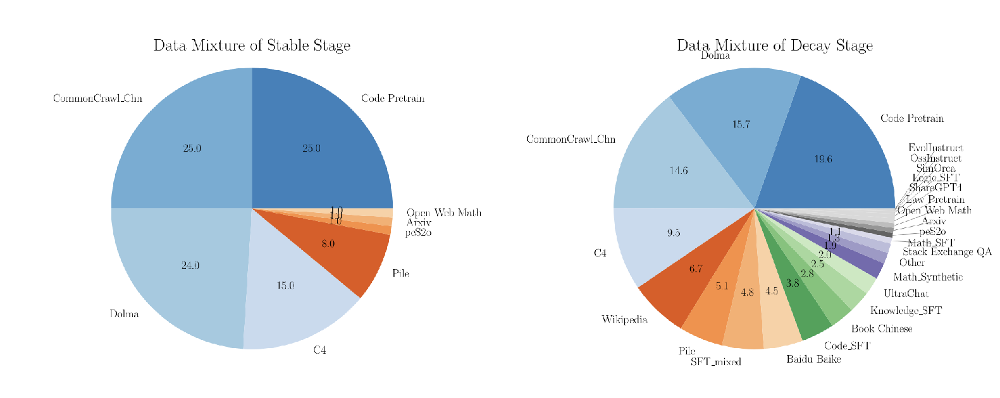
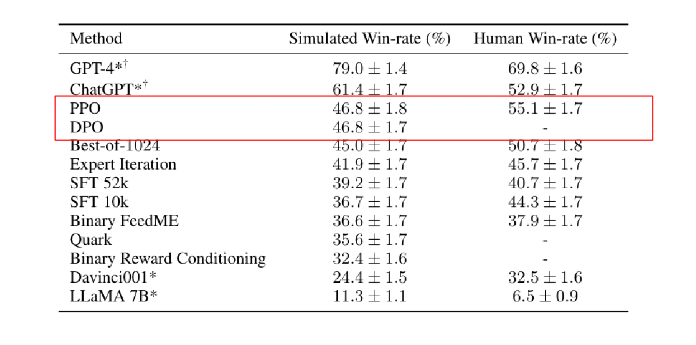
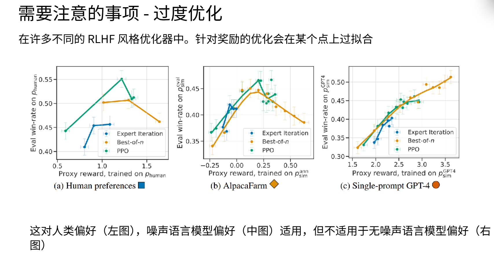

# 第十三章：大模型的基本训练流程

经过之前的章节，我们基本掌握了模型的结构，pytorch和如何推理等等，在这节课我们重点介绍一下模型的训练过程。主要介绍大语言模型（LLM）的训练过程，在这个过程中我们会介绍预训练、监督微调、强化学习方法等，主要讲解模型SFT的过程，简单介绍预训练和强化学习方法。**本节课会穿插扩展2025年cs336没有的内容，在下一章详细介绍强化学习方法。**

## 13.1. 机器学习的常见的学习方式

### 13.1.1监督学习（Supervised Learning）

监督学习是机器学习中**最常用、最直接**的一种范式：

给定一组**输入–输出成对**的标注样本 $(x_1, y_1), (x_2, y_2), \dots, (x_n, y_n)$
目标是让模型学会一个映射函数 $f: x \mapsto y$ 
使得对新输入 $x_{\text{new}}$ 能尽可能准确地预测出对应的输出 $y_{\text{new}}$。

**特点**

1. **有“标准答案”**：每个样本的输出 $y$ 都是人工或可靠系统事先标注好的。  
2. **损失可计算**：预测值 $\hat{y}$ 与真值 $y$ 之间的误差（交叉熵、MSE 等）可直接作为优化信号。  
3. **目标明确**：最小化训练集上的预测误差，同时兼顾泛化能力（防止过拟合）。

**典型任务**常见的有**分类任务**（离散标签）比如图像识别：图片 到 “猫/狗/车”，**回归任务**（连续值） 房价预测：房屋特征 到 价格，等等，有监督学习就是“老师把答案写在卷子上”——模型通过对比自己的答案和标准答案不断纠正错误（通过一些算法，比如梯度下降），从而学会对新题目给出正确结果。它的数据集是有**标准答案**的，标准答案就是一个**监督信号**，所以叫做有监督学习。

---

### 13.1.2 无监督学习（Unsupervised Learning）

**没有“标准答案”、只有“原材料”即原始数据**，算法的目标不是预测某个具体标签，而是**从数据本身里挖掘出隐藏的结构或分布特征**。

与有监督学习相比，有监督学习的输入为 $(x_1, y_1), (x_2, y_2),...., (x_n, y_n)$ ，它是有标签的，比如说实现一个猫图识别，判断图片是否是猫，是则输出1，不是则输出0，零和一就是标签。输入的 $y$ 就是标签。而无监督学习是没有标签的

**只给输入 x，不给输出 y**，让机器自己找规律、找相似、找低维表示或生成新样本。常见的无监督任务就有**聚类（Clustering）** 把相似样本自动分到一组。  无监督学习就是**不给答案、只给卷子**，让机器自己把题目分堆、找规律、画重点，甚至还能照猫画虎出一份新卷子。

**自监督学习**（Self-supervised Learning）是无监督学习的一个子集，它**把“没有标签”的原始数据自己生成伪标签**，然后再按“有监督”的方式去训练。因此它既属于无监督大家庭，又带上了“假装有监督”的味道。比如说大模型的预训练，bert的Masked Language Modeling，还有对比学习等等

无监督学习的优点就是它**不需要标注，无需昂贵标注，数据拿来就能用；常作为预训练或探索工具**。在机器学习或者说深度学习中有标签的数据一直都是一个难题，他们往往都需要昂贵的人工标注，但是无监督学习能帮工程师省下标注的费用，当然不是所有的任务都能使用无监督的，还得回到具体，实事求是。

---

### 13.1.4 强化学习（Reinforcement Learning）

强化学习比较复杂，我们会在下一章中详细介绍。强化学习是用延迟、稀疏的奖励信号，让智能体在序列决策中通过试错+价值估计，自己摸索出长期最赚的行动策略。如果说有监督学习是老师给每题标准答案，无监督学习就是没老师，自己找结构和规律，强化学习就是老师只期末给总评（奖励），学生全程自己摸索哪一步对哪一步错。

## 13.2 大模型训练的第一个阶段：预训练（Pre-training，PT）

第一个明确采用“预训练 + 下游微调”这一范式的大型语言模型是 2018 年 OpenAI 发布的 GPT-1。它首次把“无监督预训练 到 有监督微调”的路线系统化：先在 5 GB 的 BooksCorpus 上用**自回归语言模型目标**做大规模无监督预训练，再在少量标注数据上微调具体任务，从而显著超越当时只能从头训练的模型。

**大模型的预训练**（Pre-training）是让模型 先在海量无标注数据上“自学”通用知识，得到一个强大的底座，然后再用少量标注数据去微调解决具体任务。它本质上是迁移学习的极端放大版：把“从数据里学通用表示”这一步做到极致。


当时语言模型没有预训练的范式，每个模型训练都要耗费大量时间和人力去获取训练数据，当时已经出现了预训练 + 特定任务微调的范式，但是是在图像任务上--ImageNet,先在ImageNet上训练分类网络，再在增加**小批量标注数据**继续训练。只需要**少量数据**就训练出一个很好的模型，只需要训练**一个预训练模型**就可以在各种下游任务轻松应用。

### 13.2.1 大模型预训练的范式

大模型通常都是decoder-only的结构，大模型的预训练的范式是不断的预测下一个词。是next-token预测。最终训练得到一个续写模型，能根据输入来不断续写，此时大模型已经通过预训练获取到了许多先验的知识。

模型的输入（input）和标签（label）它们共同用于训练模型以预测下一个词或字符。


- **目标序列**：对于输入序列 $[x_1, x_2, \dots, x_{t-1}]$，目标（标签）是序列中的下一个词 $x_t$。
- **训练目标**：模型的目标是学习如何根据输入序列 $[x_1, x_2, \dots, x_{t-1}]$ 准确地预测出下一个词 $x_t$ 的概率分布 $P(x_t | x_1, x_2, \dots, x_{t-1})$。

假设我们有一个文本序列：

```markdown
"自然语言处理是人工智能的一个重要分支"
```

我们将这个序列分词成长度为4的子序列（假设）进行训练。

输入和标签的对应关系：

- **输入序列**：`["自然", "语言", "处理"]`
  - **标签**：`"是"`
- **输入序列**：`["语言", "处理", "是"]`
  - **标签**：`"人工智能"`
- **输入序列**：`["处理", "是", "人工智能"]`
  - **标签**：`"的一个"`
- **输入序列**：`["是", "人工智能", "的一个"]`
  - **标签**：`"重要分支"`

这就是next-token的预训练范式。

---

### 13.2.2 大模型的预训练的数据规模

大模型的预训练数据通过抓取公开网页、书籍、论文、代码、多语种语料，再进行去重、数据清洗得到，训练词表。一个8B的模型比如Qwen3-8B就会用到36T tokens，**更大的模型只会随着参数量，数据的规模变得更大**。现在的大模型大概会用到50–200 T tokens。

大模型预训练的数据**基本包含人类的所有知识**，因此模型蕴含的知识是十分丰富的，但是模型现在只是一个**续写模型**，你给出一段文本，模型就会进行续写，因为它是不断预测下一个字来训练的。想要更好的利用模型的能力还需要一个SFT的流程才能得到今天问答形式的大模型，可以处理各种任务。

虽然预训练规模巨大，但模型**不能很好地遵循指令**，缺乏产品化价值。预训练模型需要经过特定的训练后处理，才能变得实用和安全。

我们期望模型能够**遵循复杂指令**，具备实用性。同时增强**模型的安全性**，防止滥用和生成有害内容。

---

### 13.2.3 GPT3（Generative Pre-trained Transformer 3）

GPT-3（Generative Pre-trained Transformer 3）是 OpenAI 于 2020 年 7 月发布的 **自回归语言模型**，它的出现把“提示即编程”带进现实，被视为大模型时代的里程碑。GPT-3 用 **1750 亿参数 + 自回归语言模型 + 纯提示** 第一次证明：  **“只要够大，模型就能在没有任何梯度更新的情况下，看懂任务并给出像模像样的答案。”**，为后来的 InstructGPT、ChatGPT、GPT-4 铺平道路。

GPT-3 在骨子里就是一个 **“续写”模型**——它的训练目标只有 **“给定上文，预测下一个 token”**（自回归语言模型）。无论把提示写成问答、翻译、对话还是代码补全，它都当成 **“前面这段话还没完，我来续写”** 来处理。

GPT3是一个175B参数量的模型，在大约570GB的文本上进行训练。它是头一个把参数量设置设置非常大的模型，这是一个非常大胆的尝试。**规模定律第一次“肉眼可见”**  从 GPT-2 的 1.5 B 跳到 175 B，参数 ×100，结果下游任务出现 **“涌现”**——只靠提示就能解决翻译、问答、算术、代码补全等任务。

| 任务 | 指标 | 成绩 |
|---|---|---|
| 英文阅读理解（RACE） | 准确率 | 86.8 %，超越人类平均 73 % |
| 翻译（WMT’14 法到英） | BLEU | 43.9 ，接近当时最佳有监督系统 |
| 数学加法（2～5 位数） | 准确率 | 随示例数从 0 % 提升到 80 % |
| 代码补全（HumanEval） | 通过率 | 37 %（Codex 继续微调后提到 72 %） |

- **幻觉严重**：一本正经地编新闻、假引用。  
- **偏见大**：性别、种族、宗教刻板印象随提示直接输出。  

**那如何使用GPT3**

GPT3是一个预训练大模型，是一个具备续写能力的模型，要使用它要比现在的模型麻烦的多。

首先要将输入改动用户把任务包装成自然语言上下文，例如： 

```
Translate English to French:
sea otter 到
```  

形式上像“翻译”，本质仍是“补全”。

GPT3这个卓越却不够实用的系统，尽管预训练规模和算力惊人，但既不能遵循指令，也缺乏产品化价值，再到突然横空出世的ChatGPT。这个能执行各种惊人任务、遵循复杂指令的系统，彻底改变了社会生态。可能大多数同学从未接触过可控生成或早期文本生成系统，但现代指令遵循模型的表现确实令人惊叹，模型能理解嵌套复合指令，结合代码能力直接输出matplotlib可视化代码。各位可能已对此习以为常，但细想之下，ChatGPT能同时执行十条指令的设定依然堪称奇迹，实现这些的重要步骤就是SFT。

## 13.3大模型训练的第二个阶段：监督微调（SFT，Supervised Fine-Tuning）

如果你查阅InstructGPT论文，会看到这张示意图，大致描述了构建指令遵循模型的三步流程。

### 13.3.1 SFT的定义与作用：

通过专家演示数据对预训练模型进行微调，使其能够模仿SFT数据中的行为。它也是构建指令遵循模型的第一步。SFT是监督微调，通过预训练大模型已经掌握了通用的知识，同时通过大规模的预训练，我们避免了大规模的数据标注，只需要一些远比预训练数据集**小的多**的SFT数据集（10 k～100 k），这其实就是预训练的意义之一。SFT数据通常都是问答的形式，Q...，A....的形式，通过交叉熵损失等等损失函数来训练，使得模型学到SFT数据的格式，增加了模型的可用性。

**预训练底座模型**有许多**缺点**：

1. 只会“续写”，不会“问答” 
2. 可能会输出**有害或者偏见**内容
3. 答案散漫，跑题，**有严重的幻觉，也不会角色扮演**、工具调用。

我们**期待的模型**长什么样子呢？

1. 学会指令格式，**QA的形式来使用模型**，比如让模型写一篇鲁迅风格的文章，李白风格的诗。我们说一，模型就不会回答二。
2. **会拒绝有害内容**，当用户使用大模型生成一些有害内容的时候，大模型会学会拒绝。
3. 学会SFT中的回答格式，学会工具调用。

这些都可以通过SFT实现。

---

### 13.3.2 SFT数据的格式

SFT（Supervised Fine-Tuning）数据的核心是“给模型看**人写的标准回答**”，让它模仿。主流格式就两类：

1. **Alpaca 格式（单轮/指令）**

每行一条 JSON，字段一目了然：

```json
{
  "instruction": "翻译成英文",
  "input": "你好",
  "output": "Hello"
}
```

- `instruction` 说明任务  
- `input` 放用户问题（可为空）  
- `output` 是**人工写的理想答案**  

文件整体是 `.jsonl`：一行一条，训练时只计算 `output` 部分的交叉熵损失 。

---

2. **ChatML / ShareGPT 格式（多轮对话）**

把多轮对话按角色堆成数组，同样一行一条：

```json
{
  "messages": [
    {"role": "system", "content": "你是客服助手"},
    {"role": "user", "content": "怎么修改收货地址？"},
    {"role": "assistant", "content": "请在订单详情页点击…"}
  ]
}
```

它支持任意轮次，训练时只对 **assistant** 角色的 token 计算损失 。

SFT 数据就是“**问题 + 人类示范答案**”的配对，单轮用 Alpaca，多轮用 ChatML，格式简单，关键是答案要干净、安全、风格一致。

---

### 13.3.3 高质量的专家演示数据对SFT效果至关重要

有许多论文都论证高质量SFT数据的重要性，SFT阶段和预训练阶段不同，预训练需要庞大的数据，数据越多越好，在这种思维惯性下，你可能会任务SFT数据也是越多越好，忽略的质量的重要性。数据量虽少，但能显著塑造模型行为。若要模仿专家演示，就必须拥有高质量的专家演示数据

许多论文都提到这种现象：MergeIT（arXiv2503.00034）用小模型筛出6k高质量指令，再与全量模型做权重插值，最终 LLaMA-7B 仅用1/11数据就在 AlpacaEval 上追平65k全量训练，From Quantity to Quality（arXiv:2308.12032，已被 NAACL 2024 接收）做了实验用 9 k 精选样本即可在 5 个公开benchmark上持续优于原始50k全量训练的同款模型，且消融实验完整，代码与数据均已开源。

李飞飞团队的在2025年发表的S1论文提到：用**1000条**蒸馏自 Gemini-2.0-Flash-Thinking 的高质量推理样本（s1K）对Qwen2.5-32B-Instruct做26分钟监督微调（16×H100），再配合“预算强制” 解码策略，即可在 AIME24 等数学基准上与 OpenAI-o1-preview 打平甚至略超，训练云成本 ≈ 50 美元，他们从16个数学/科学题库收集59k题，**难度/多样性/质量三重过滤蒸馏**Gemini思维链，最终s1K 仅1000样本。而且是纯纯监督微调，证明了1k高质量示范>几十k普通标注，呼应“Less is More”趋势。高质量数据的概念非常复杂，需要谨慎论证其构建方法。最后值得注意的是，在当前阶段，即使少量数据也能显著改变模型行为模式。

**为什么会这样**？传统的思维告诉我们一个经验：**越多越好，或者量变产生质变**，这种经验在这里就失去了作用。

**核心原因**是：机器学习模型的参数完全由**数据驱动**，“学什么”决定“会什么”。劣质数据（**错误标签、噪声、缺失、偏见**）不会被模型忘记，反而会被参数记忆，导致性能下降、泛化变差、健壮性不足。

有一篇论文[《The Effects of Data Quality on Machine Learning Performance》](https://ar5iv.labs.arxiv.org/html/2207.14529)专门介绍了这件事情：

他们9个公开表格数据集，15种经典算法（逻辑回归、SVM、DT、KNN、MLP 等）使用6类污染机制——Target Accuracy（标签错误）、Feature Accuracy（特征噪声）、Completeness（缺失值）、Uniqueness（重复样本）、Consistent Representation（取值不一致）、Class Balance（类别不平衡）来污染逐步污染数据来测试。

**核心结论（对应小语言模型/经典算法场景）**

1. **标签错误（Target Accuracy）（最直接影响）**

训练集标签每**翻转 1%**，F1 分数**线性下降约 2–5%**；  当翻转率 ≥ 20% 时，多数分类器性能**低于多数类 baseline**（即“学不如猜”）。

2. **特征噪声（Feature Accuracy）**

同样呈现**线性衰减**；在小型数据集（Credit, 1 000 条）上，MLP 与 SVM 方差显著增大，**对噪声最敏感**。

3. **缺失值（Completeness）**

若训练阶段**从未见过缺失值**，而测试时出现 20% 缺失，F1 可掉 10% 以上，若在训练阶段就引入 ≤40% 缺失，模型可学会“容忍”，性能下降不显著。

4. **重复样本（Uniqueness）**

在万级样本以上的数据集，**去重与否几乎不影响准确率**，但在**小样本**（<1 k）场景，5% 重复就能让决策树/MLP 显著过拟合，**F1 掉 4–6%**，因此仍需去重。

5. **类别不平衡（Class Balance）**

只要**少数类样本数 ≥ 1/类别数**，分类器仍能保持高于 baseline 的表现，一旦少数类被“稀释”到 <1/类别数，所有算法性能**迅速滑向 majority baseline**。

这个团队一共做了**15 算法 × 5 折 × 6 质量维度 × 3 场景 = 4 050 组实验**，论文的结论是**标签准确率 ≥ 80%** 即可接受，不必追求 100% 人工重标；**测试集必须人工二次校验**，否则 40% 标签错误会把“好模型”误判为不如 majority baseline；**小数据集一定要先去重、再训练**；大数据集可跳过去重步骤，把预算投入标签修正。

在经典小模型场景，该论文用4050组实验证实：**标签错误 1% 到 性能线性掉 2–5%；>20% 错误率直接让模型“学不如猜”**，为**数据质量 > 数据数量**提供了可量化的统计学证据。

- **数据集的构建方式**：

**FLAN数据集**：聚合多个自然语言处理任务的数据集，如问答、主题分类等。
**OpenAssistant数据集**：由线上爱好者共同编写，包含大量人工撰写的指令和回复。
**斯坦福Alpaca项目**：使用语言模型生成指令调优数据，通过人类编写的指令种子集扩展数据。

---

### 13.3.4 大模型幻觉与灾难性遗忘

大模型幻觉，模型生成看似合理、实则错误或根本不存在的内容，且自信地将其表述为事实。


左侧是关于经济学中买方垄断的引言，右侧回应则附有参考文献。假设我们微调模型使其以左侧为输入、右侧为输出，这个过程会同时引发两种效应：其一是让模型建立“买方垄断”与特定引用的关联，这属于有效的知识学习；其二是形成条件反射机制，只要遇到复杂概念就自动在输出末尾添加引用。这就构成了双重作用机制：前者传授新知值得肯定，后者却可能诱导模型虚构内容。如果模型参数中本不存在买方垄断与Bivens和Mishel著作的关联，它**可能仅习得“遇到复杂输入就编造引用”的行为模式**。

JohnSchulman在伯克利的演讲中精辟指出：**强迫模型回答超出其知识范围的问题，本质上是在鼓励幻觉生成**。模型确实能在抽象层面学习知识，但同步习得的**还有“为符合响应格式而杜撰内容”的坏习惯**。（现场提问）关于人类作者撰写论文时的引用行为：当意识到需要引证时，我们会通过记忆检索或数据库查询寻找相关文献。

语言模型学习“此处应插入引用”这个行为本身是正确的，问题在于虚构引文。这既可能是记忆缺陷，也可能通过工具使用来弥补。只要解决记忆或工具使用问题，要求添加引用的行为模式并不构成问题。这个问题更偏向观点陈述——学习添加引用并非坏事，配合工具使用确实能生成正确引文。token预测的根本问题在于：模型被训练去预测符合结构的token。此时系统会默认“虚构引用”相比“完全缺失引用”对**损失函数的影响更小**，因为**响应结构**必须被完整填充。

若SFT数据含模型**预训练未覆盖的事实**，模型会学会“编造引用”而非“检索事实”，而是鼓励幻觉。指令调优存在反直觉现象，完全正确且丰富的指令数据集可能适得其反，因为它会驱使语言模型虚构内容来匹配知识深度。这也解释了为何需要对**蒸馏数据**保持警惕，特别是当教师模型远强于学生模型时。并且在真正的人工标注中，人类可能比模型拥有更丰富的知识。**先验知识**不足时，宁可标注“我不知道”，也别强答。原则上，强化学习式的正确性训练会有所帮助。

另一点是安全性问题，因为这可能无法仅通过指令微调解决。我们知道语言模型需要设置防护机制。它们直接面向终端用户部署，功能非常强大，因此可能被用于**传播错误信息或生成诈骗内容、垃圾信息**等。这就需要对模型进行安全调优。在指令微调过程中加入少量安全调优数据，也能**显著提升模型安全性**，这与指令调优的发现类似：只要**预训练模型足够强大，即使少量指令调优数据也能达到相当效果**。确实能达到合理水平。但是核心权衡在于“拒绝回答”的尺度把握：既要拒绝不安全内容，又不能过度拒绝。例如“如何终止Python进程”这类本质安全但表面敏感的查询，就需要**模型理解其中的细微差别**。纯粹通过指令微调实现这一点非常困难，因此研究者通常通过精心构建的小型指令微调数据集来平衡这种权衡。有研究表明，仅**500个示例就能让模型遵循基本安全准则**。

总体而言，指令微调的效果令人惊讶。虽然像ChatGPT这样的系统看似复杂，但使用标准指令微调数据集（如OpenHermes或OpenAssistant），配合基础模型和合理超参数进行微调，也能获得类似Llama或ChatGPT的模型行为，当然效果会稍逊一筹，需要额外优化工作。第二点是**高质量数据的概念非常复杂**，需要谨慎论证其构建方法。最后值得注意的是，**在当前阶段，即使少量数据也能显著改变模型行为模式**。

---

现代指令微调流程已开始接近预训练流程的规模，**二者界限正逐渐模糊**：因为指令微调数据本质上仍是token序列，完全可以融入预训练过程。这种融合做法正变得越来越普遍。目前许多**中国的开源团队基本上都在采用这种方式**。具体操作是：完成纯粹的预训练后，在预训练末期，特别是在**学习率衰减阶段**开始混入指令调优数据。这样在**预训练尾声**会注入大量**高质量数据或指令调优数据**，最后可能再进行第二轮短周期的指令调优。不过第二轮规模可能较小，因为大部分数据已融入被称为“中期训练”的第二阶段。这种方式的好处在于既能扩展规模又不会导致**灾难性遗忘**，同时能更充分地利用数据，因为数据已深度整合到预训练中。



举个具体案例：这是miniCPM论文中的一张图。这篇优秀论文展示了一个中国团队的双阶段训练流程：**第一阶段纯预训练**，从饼图可以看到全是预训练数据集（CommonCrawl代码、Pile、Dolma等）；第二阶段称为“**衰减阶段**”。这就是WSD（预热-稳定-衰减）框架的衰减阶段。在衰减阶段的数据构成中，既包含**维基百科这类高质量数据**，也保留部分预训练数据（并非纯后训练数据），右侧还包含代码SFT、中文书籍、UltraChat、StackExchange问答、Evol-Instruct、OSS-Instruct等各种指令调优或相关数据集。这些都被融入预训练的后半程。当前大多数模型（包括CPM及其衍生模型）都公开采用了这种方法，实践证明极其有效，**已成为行业普遍做法**。

这种流程使得区分预训练模型与后训练模型变得非常困难。当观察Qwen等公司发布的“基础模型”时，这些模型其实已走完整个流程，在训练过程中隐性地经历了指令调优阶段。关于数据配比调整时机：确实在最后阶段损失值会大幅下降，这正是众多团队采用两阶段训练的核心动机，他们利用**损失值的断崖式下跌作为模型进入正确模式的标志**，虽然实际情况可能更加复杂。

第一个问题关于**灾难性遗忘**：如果直接使用大量SFT数据，需要权衡正则化策略，而这种预训练与后训练混合的方式能规避该问题。

第二个关于**引文激励问题**：这种方法并无帮助，因为其本质是**无条件注入数据点**，无法自适应地确保模型掌握引文事实，要么在SFT前就**确保模型知晓引文**事实，要么需验证模型知识后再注入对应数据，而当前方案不具备这种适应性调整能力。必须考虑使用微小的步长，以避免破坏预训练效果。它能让模型保持更强的通用性。

以**约翰·舒尔曼关于幻觉的例子**来说，如果模型不再引用训练数据中包含的分析内容，或者如果它过快地这样做，那么它是否就不会表现出相同的行为？没错。这个观点是，如果模型确实知道这里引用的内容，那么模型不一定会在这两种相互竞争的机制中做出选择。它会学到的可能是：每当我看到这个例子时，我应该检索关于比文斯和米歇尔的知识，然后将其作为引用。实际情况总是非常复杂的。模型“知道”某件事意味着什么，还是它知道某件事的可靠程度如何，这两种机制对模型而言可能始终处于叠加状态。真正的问题在于哪一种机制更占主导地位，如果模型对此一无所知，那么第二种机制可能更占主导。如果模型能可靠地掌握这些知识，它更可能学会正确引用，**而不是助长广泛的普遍性幻觉**。

那是否有人做过类似研究，在训练过程中插入思维标记，让模型在训练时自我核查对事实的掌握程度呢？根据对这个具体想法的解读或实现方式，它会变得非常接近强化学习。这里有人提出的Quiet-STaR方法（诺亚·古德曼、埃里克·泽利克曼等人开发），本质上是通过预测答案标记的表现来学习。

### 13.3.5 相关的数据集

以下分别介绍 FLAN、OpenAssistant 与斯坦福 Alpaca 三个经典指令微调（SFT）数据集的**构建方式**、数据来源与加工流程，并给出最新统计规格与典型样例，方便直接引用或复现。


**1.FLAN（Finetuned Language Net）**

首先是FLAN数据集，由谷歌团队构建。其本质是通过聚合自然语言处理任务中的多个训练数据集而成。仔细观察会发现其中包含各类任务：自然指令V2（含大量问答任务）、T0-SF、对抗性问答、主题分类等。这种构建方法的核心是将执行独立任务的现有NLP数据集整合成大型元数据集。

包含62 - 1836 个公开 NLP 子任务（MNLI、SQuAD、GSM8K、WikiSQL 等），外加后续 Muffin、NIV2、T0-SF、CoT 四个扩展包 。

**加工流程**  
1. 人工编写 10–15 句**任务无关模板**（“If you were asked to…, what would you answer?”）。  
2. 每任务随机采样 1–2 k 样本 到 套模板变成“指令-输入-输出”三元组。  
3. 保留原始验证集，用于 early stop 与零样本测评。

数量大、免费；缺点：形式僵硬、非真实对话、短答案为主。

---

**2.OpenAssistant Conversations（OASST1）**

一群线上爱好者共同为语言模型编写指令调优数据。在ChatGPT发布后，此类尝试的热情空前高涨，因此产生了大量优质的人工撰写数据。提供**纯人工手写、多语言、多轮对话**数据，兼顾 SFT 与 RLHF 偏好对训练。GitHub + 官网众包平台；志愿者**完全手写**，禁止爬虫或模型生成 。

**加工流程**
1. **树状对话**：用户可多次回复同一消息 到 形成多叉树结构。  
2. **众包投票**：对每个回复打“helpful / harmful / spam”标签。  
3. 人工审核 到 去 PII 到 过滤短文本 < 5 词。  
4. 拆成两份 SFT 子集：只保留“chosen”主分支，Preference 子集：同一父节点下 chosen vs rejected

---

**3.Stanford Alpaca**

**构建目的**  
零人工重标、低预算验证“**Self-Instruct 即可解锁指令跟随能力**”。

**原始来源**  
175 条**人工手写种子指令**（涵盖写作、问答、数学、代码等 8 类。

**加工流程**  
1. Self-Instruct 循环：  

每次随机选 8 条已有指令作为示例 到 送入 text-davinci-003，生成**新指令** + **对应输入（可选）** + **输出** 

2. 去重、长度截断、关键词过滤 到 得到 52 k 样本。  

3. **无人工二次修正**，60 % 示例为“纯指令”无输入字段。

便宜、可任意扩量；缺点：易继承教师模型幻觉、风格单调。

---

需要平衡模型的拒绝回答能力，避免过度拒绝或生成有害内容。即使是少量的安全调优数据，也能显著提升模型安全性。

## 13.4 第三个阶段：人类强化反馈强化学习（Reinforcement Learning from Human Feedback, RLHF）

**人类反馈强化学习**（Reinforcement Learning from Human Feedback, RLHF）是一种让机器学习模型——尤其是大语言模型——**“对齐”人类偏好与价值观**的训练范式。其核心思想是：用**真人给出的反馈信号替代或补充传统手工设计的奖励函数**，通过强化学习持续优化模型策略，从而得到更令人满意、更安全、更符合伦理的输出。SFT数据收集昂贵，成对反馈相对更易获得（下面会讲如何获得成对的反馈）。从某种意义上看，RLHF（人类反馈强化学习）和对齐工作处于流程末端，正因如此，它们对模型行为会产生极强的影响。Percy和Shivani 、Essen合作的一篇论文就研究了这个问题：如何让语言模型的主观意见与不同人群保持一致？我们发现的有趣模式之一是，InstructGPT这类旧模型（虽然过时但仍具使用价值）竟变得比**以往更契合东南亚宗教观念**。当我们查阅InstructGPT的附录时发现——标注人员的国籍构成是什么？**主要是菲律宾、孟加拉国和17%的美国人**。这令我惊讶，但间接证据确实与此**吻合**。因此必须格外谨慎，因为这类因素会**直接影响最终产出效果**。其他研究也指出，标注者的关注点会因其**背景差异**而大相径庭。同时人类标注或者ai标注都更倾向于**更长**的回答，意味着更长的回答的得分更高，模型会越来越倾向更长的回答，哪怕都是些废话。我们在标注时发现，很多人看到较长回复会认为‘更详细=更优质’。不仅人类，模型同样存在这种偏见。研究表明，某些被认定更优的模型可能仅仅因为生成**了更长文本**。而AI反馈似乎会进一步助长模型生成冗长内容。因此**必须警惕长度作为干扰因素对偏好评判的影响**。

### 13.4.1 RLHF的基本流程

1. **监督微调（SFT）**

先收集高质量的人工标注数据（SFT数据），对**预训练模型做常规监督微调**，得到“基线策略” （ $\pi_{SFT}$），为后续强化学习提供起点，就是上述的第二个阶段SFT的过程，经过SFT后的模型已经具备问答能力，但是还没有**对齐人类偏好**。比如问到一些恶意的问题模型可以选择不回答，同时普通问题的回答更贴近我们想要的答案。

2. **奖励模型训练（Reward Modeling）**

奖励模型通常是一个**打分模型**,其底层结构则**复用监督微调**（SFT）后的大语言模型，仅把最顶层的语言建模头替换成**一个线性层**，即“回归头”或“奖励头”，训练好的模型就相当于一个有人类偏好的打分器，它会为**接近人类偏好的回答打高分**，同时模型底座会复用大模型的参数，这样的原因能**继承语言理解能力**。

训练数据通常是一个模型的**同一条prompt**推理得到的不同答案，针对同一输入的 $X$，让模型生成多条**候选输出** $(y₁, y₂, …)$。首先让模型生成输出，然后**比较不同输出结果**，通常我们只需比较两个输出（比如A和B），核心问题就是**判断A是否优于B**。基于**这些成对反馈**，我们将训练一个奖励模型，其核心功能是为每个输出赋予标量分值，进而**驱动强化学习**。

以 $InstructGPT$ 指南为例，这是少数公开的企业级标注规范之一。指南明确标注员需要从三个维度评估输出：**实用性（语言清晰、准确理解问题意图、注意国际差异——如football不应默认指美式足球）、真实性（避免虚构内容）和无害性（杜绝有害不当内容）**。这些要求都很合理，但可以看出它们与OpenAI公开的模型规范之间存在微妙关联。实际应用的标注指南远比这份简版详细，**通常会列示详细要点分发给标注员**。InstructGPT通过Scale和Upwork平台，收集了约40人提供的数据，每个标注员对每个问题大概有**一分钟**的时间用来标注，大部分时候这个时间都是足够的，因为相比幸苦的撰写输出，标注往往简单的多。

我们也可以借助模型来标注，用强模型（GPT-4/Claude）替代人类：一致性高、成本低、可无限放大，但是这将面临一些风险比如**自我偏好、长度膨胀、模型幻觉循环放大**。因为这样循环标注会放大最初标注的误差。

这个训练的奖励模型就此成为我们的奖励机制，目标是**让模型最大化这些奖励人工对这些输出进行排序或打分**，形成偏好对。用这些偏好数据训练一个奖励模型 R_φ，让它学会给“人更喜欢的答案”打更高分。人类评估输出比生成输出更容易，且可能更偏好AI生成结果，评价总是比生成难，如果我们去找人类专家去撰写长长的回答，那么**成本**实在太高了，这也是使用RLHF的原因之一。

3. **强化学习优化（Policy Optimization）**

我们有了奖励模型后就能进行强化学习来对齐人类偏好了，我们会讲解两种代表的算法：PPO和DPO，这两种算法在界内被广泛使用，下面我们会详细介绍这两种算法：**PPO 和 DPO算法**。传统 RL 奖励函数由设计者手工编写，难以精细描述“什么是好答案”；RLHF 用真实用户的偏好作奖励，更灵活也更符合主观需求。通过“奖励模型”把昂贵的人类标注转化为可自动计算的密集奖励，实现大规模优化。再到DPO直接偏好优化，不用训练奖励模型

---

## 13.5 PPO（Proximal Policy Optimization，近端策略优化）算法

PPO（Proximal Policy Optimization，近端策略优化）是一种在强化学习中非常常用的策略优化算法，由 Schulman 等人在 2017 年提出，是 TRPO（Trust Region Policy Optimization）的改进版本。PPO 相比 TRPO 计算更简单，表现更稳定，在机器人控制、游戏类任务（如 Atari、MuJoCo）中表现十分优秀。

---

### 13.5.1 PPO 核心思想

PPO 是一种基于策略梯度的方法，通过优化策略函数 $\pi(a|s)$ 最大化累积奖励。它的核心思想是**保持策略更新而且不能离旧策略太远**

传统策略梯度方法（如 REINFORCE）容易出现：**策略更新过大导致训练不稳定甚至崩溃**，**样本效率低 到 采集一次轨迹只能用一次**，我们可能希望在采样一次后执行多次梯度更新（这本质上相当于从一个推演轨迹中采样并转向近似离线策略）。为了实现这一点，必须引入重要性权重修正，因为随着更新步数增加，原始样本会逐渐过时。这就是TRPO的核心思想，对所有梯度步进行修正，并约束策略保持接近原始策略。而PPO则更进一步提出：与其使用KL散度显式约束策略接近旧策略，不如直接裁剪概率比率，这样自然能激励模型保持与原始策略的接近。这就是PPO的核心思想。

PPO 通过以下方式解决这些问题：**1. 通过剪切的概率比值来限制策略更新幅度**，确保新策略不会偏离旧策略太远，提高训练稳定性。 **2. 使用重要性采样来提高样本效率**旧数据仍然可以用于更新，从而提升样本利用率。

下面就来详细介绍这种强化学习算法。

### 13.5.2. PPO 

**Step 1**  
强化学习没有真标签，只有奖励。  
我们拿旧策略 $\pi_{\text{old}}$ 采样，得到一条轨迹，算每一步的“优势” $A_t$（正 = 好动作，负 = 坏动作）。  
用**重要性采样**把“旧数据”拿来练新策略：  

$$
L^{\text{PG}}(\theta)=- \frac{\pi_\theta(a_t|s_t)}{\pi_{\text{old}}(a_t|s_t)}\,A_t
$$

记概率比为

$$
r_t(\theta)=\frac{\pi_\theta(a_t|s_t)}{\pi_{\text{old}}(a_t|s_t)}
$$

于是

$$
L^{\text{PG}}(\theta)=- r_t(\theta)\,A_t
$$

如果 $A_t>0$，就把 $r_t$ 往大了推；$A_t<0$ 就往小了推。  
当然这里会存在一个步长的问题，步子太大容易“翻车”——概率比可以暴涨到 10 或跌到 0.01，策略直接崩掉。

这里插播一下什么是**重要性采样** 和**优势函数** 。

重要性采样（Importance Sampling, IS）是一种统计学方法，用于在难以直接从目标分布采样的情况下，通过从另一个提议分布采样，并加权调整样本，以估计目标分布下的期望值。**重要性采样就是“用旧数据算新答案”——把旧策略收集的轨迹，乘一个“权重”后，当成新策略的轨迹来用。**你想知道自己改完发型后有多帅，可今天没空再拍一张新照片，于是你拿出**上周的旧照片**，但上周头发还不一样。怎么办？给旧照片贴一个“相似度系数”：如果新发型和旧发型几乎一样 到 系数 ≈ 1，照片可信；如果差别巨大 到 系数 ≈ 0，照片基本作废。这个系数就是**重要性权重** $w$ 。 

$$w = \frac{\pi_{\text{new}}(\text{动作}|\text{状态})}{\pi_{\text{old}}(\text{动作}|\text{状态})}$$

权重 $w$ 自动把“旧轨迹里已经不像新策略的部分”降权，像的部分保留。

1. **省样本**：不用每改一次参数就重新去环境采样，同一批数据可反复用几次。  
2. **省时间**：深度强化学习里最耗时的就是跟环境交互，重要性采样让“交互一次，训练多次”成为可能。  
3. **稳定**：配合 clip 或惩罚，可防止权重爆炸（PPO 里把权重限制在 0.8~1.2 区间）。

**优势函数**

优势函数（Advantage Function）用来衡量一个动作在某个状态下，比起该状态的平均水准到底好多少。它的基本想法是 $Q(s,a)$ 表示在状态 $s$ 执行动作 $a$ 的价值， $V(s)$ 表示在状态 $s$ 下所有动作平均后的价值，那么二者的差值就是动作 $a$ 的“相对好坏程度”，**这意味着我可以在减去任意设定的基线值后重新定义奖励**，我们称之为优势函数。

数学表达为：

$$
A(s,a) = Q(s,a) - V(s)
$$

如果 $A(s,a) > 0$ ,表示动作 $a$ 比该状态的平均策略更好，应当提升它的概率。如果 $A(s,a) < 0$ ，表示动作 $a$ 比平均水平差，应减少它的概率。如果 $A(s,a) = 0$ 表示动作 $a$ 和平均水准一样，没有特别优劣。

直接用 $Q$ 或者 $Return$ 进行策略梯度优化时，方差会很大，减去 $V(s)$ 后可以降低方差，但不改变期望，，因此策略更新变得更稳定、更高效，在实际算法中，优势函数通常采用 GAE（**广义优势估计**）等方法去近似，用于 PPO、A2C、TRPO 等主流强化学习算法的策略更新。

**GAE（广义优势估计）**

**TD 误差**

$$
\delta_t^V = r_t + \gamma V(s_{t+1}) - V(s_t)
$$

**GAE 定义**

$$
A_t^{GAE} = \sum_{b=0}^\infty (\gamma\lambda)^b\delta_{t+b}^V
$$

GAE 在偏差–方差之间提供可调平衡。

---

**Step 2**  
PPO 的剪切概率：给 $r_t$ 画一条**安全通道**，只允许它在 $[1-\varepsilon,\,1+\varepsilon]$ 之间动。  
定义 clipped 比例  

$$
r_t^{\text{clip}}=\text{clip}\!\bigl(r_t(\theta),\,1-\varepsilon,\,1+\varepsilon\bigr)
$$

把损失改成“两条路取更保守的那条”：  

$$
L^{\text{CLIP}}(\theta)=-\min\!\Bigl(r_t(\theta)\,A_t,\;r_t^{\text{clip}}\,A_t\Bigr)
$$

- 当 $A_t>0$（动作好）  
  若 $r_t>1+\varepsilon$，梯度被掐断，不再继续狂增概率。  
- 当 $A_t<0$（动作差）  
  若 $r_t<1-\varepsilon$，梯度也被掐断，不再继续狂降概率。  

---

**Step 3**  

实际代码里还会加两项常见配角：  
- 价值误差 $L^{\text{VF}}$：让 critic 网络把未来奖励估得更准。  
- 熵正则 $H(\pi)$：别让策略一下子变得确定（保持探索）。  
最终 PPO 损失长这样：

$$
L^{\text{PPO}}=\underbrace{-\min\!\Bigl(r_t(\theta)\,A_t,\;r_t^{\text{clip}}\,A_t\Bigr)}_{\text{policy}} + c_1\,\underbrace{L^{\text{VF}}}_{\text{value}} - c_2\,\underbrace{H(\pi)}_{\text{entropy}}
$$  

系数典型值： $\varepsilon=0.2,\;c_1=0.5,\;c_2=0.01$。

$$
\boxed{L^{\text{PPO}}=-\min\!\Bigl(r_t\,A_t,\;\text{clip}(r_t,\,1-\varepsilon,\,1+\varepsilon)\,A_t\Bigr)+\text{(value + entropy)}}
$$

**左边是概率的剪切防止步幅对模型的影响过大，右边是“辅助配角”**。它能够抑制单步太大变化，避免强化学习难以收敛。

## 13.6 DPO算法（Direct Preference Optimization，DPO，直接偏好优化）

### 13.6.1 DPO算法的核心思想

最终真正奏效的是DPO方法。其成功原因在于它**消除了PPO的诸多复杂性且表现良好**：移除了PPO中的**奖励模型**（原本用于计算优势函数），**摒弃了所有策略优化相关机制**（比如重要性比率）。回归基础本质，对优质结果计算对数损失执行正向梯度更新，对劣质结果计算对数损失执行负向梯度更新。



**从上图中可以看出，DPO没有那么繁琐，并且性能相同。**

**“不用额外训练一个奖励模型，也不用复杂的强化学习循环；只要把‘人类偏好’直接写进一条‘比较式’监督损失，就能让语言模型学会‘好答案多生成、差答案少生成’。”** 换句话说，DPO 把原来“先训练奖励模型, 用 PPO 最大化奖励”的两段式流程，压缩成“一条最大似然损失”的单段式流程，从而把**强化学习问题变成了监督学习问题**。

没有奖励网络，没有 advantage，没有clip只要一对 $(y_w, y_l)$ 就能算梯度，训练时只像普通微调那样。  

把模型想成“学生”，参考模型想成“原来的自己”。  老师递来两篇作文：范文和反面教材。  
DPO 损失就是一句评语，“**你要比昨天的你更像范文，同时比昨天的你更不像反面教材，否则就扣分。**” 学生每次只比较“今天的自己 vs 昨天的自己”，根本不用知道绝对分数（奖励），就能持续进步。不用额外训练“打分器”。

### 13.6.2 DPO算法

DPO 把“强化学习”变成了“带权重的监督学习”，而且只需要一对“好/差”答案，就能让模型学会“像好的，别像差的”。DPO数据收集就是基于SFT训练的模型作为推理模型，用户输入prompt，模型多次推理，找到好的答案和不好的答案。

在 RLHF 中，PPO 通过奖励模型来优化模型生成的输出，但需要训练价值网络（Value Network）,多轮策略更新,PPO 的梯度剪切与 KL 正则, 这些步骤对大模型来说**计算成本高、训练复杂**。DPO 提出**直接使用偏好对进行优化**，不需要 RL 循环，也不需要复杂的价值网络训练。

---

**Step 1：先写一条“偏好概率”**

假设我们已经知道模型的输出背后有个看不见的“奖励” $r(x,y)$。人类说“我喜欢 $y_w$ 胜过 $y_l$ ”，那么在 $Bradley-Terry$ 模型里。

$$
P(\text{win})=\sigma\!\bigl(r(x,y_w)-r(x,y_l)\bigr)
$$

$\sigma$ 是 S 形函数，把差值压到 0~1。

---

**Step 2： DPO的优化目标**

给定两段文本生成结果 $y_1$ 和 $y_2$ 对于同一个 $prompt (x)$ ，有人工或模型标注偏好.如 $y_1 \succ y_2$。DPO 的目标是让模型生成偏好文本的概率更高，直接优化概率比：

$$
r(x,y)=\beta\,\ln\frac{\pi_\theta(y|x)}{\pi_{\text{ref}}(y|x)} + \text{C(常数)}
$$

- $π_θ$：我们现在要训练的模型  
- $π_{ref}$：最初的 SFT 模型（也叫参考模型）  
- $\beta$：温度系数，默认 0.1~0.5。 

$\sigma$ 是 S 形函数，把差值压到 0~1。把这条 $r(x,y)$ 代回 Step 1

$$
P(\text{win})=\sigma\!\Bigl(\beta\,\ln\frac{\pi_\theta(y_w|x)}{\pi_{\text{ref}}(y_w|x)} - \beta\,\ln\frac{\pi_\theta(y_l|x)}{\pi_{\text{ref}}(y_l|x)}\Bigr)
$$

---

**Step 3：最大似然 到 最小化负对数**  
我们想让“人类偏好”被模型猜中的概率最大，于是:

$$
\mathcal{L}_{\text{DPO}}=-\ln\sigma\!\Bigl(\beta\,\ln\frac{\pi_\theta(y_w|x)}{\pi_{\text{ref}}(y_w|x)} - \beta\,\ln\frac{\pi_\theta(y_l|x)}{\pi_{\text{ref}}(y_l|x)}\Bigr)
$$

这就是 DPO 的**损失**：  

前半截 $\ln\frac{\pi_\theta(y_w|x)}{\pi_{\text{ref}}(y_w|x)}$ 叫“好答案的相对对数概率”,后半截 $\ln\frac{\pi_\theta(y_l|x)}{\pi_{\text{ref}}(y_l|x)}$ 叫“差答案的相对对数概率”, 整个括号里 = “好比差好多少” 到 被 $\sigma$ 压成 $(0,1)$ 到 取负对数就是交叉熵  

---

**Step 4：训练流程**  


**数据准备**:收集 prompt 和对应的生成输出对 $(y_1, y_2)$ ，还有人类或小模型标注偏好 $(y_\text{preferred} \succ y_\text{less-preferred})$

**概率计算**:将每个输出输入大模型，计算生成概率 $\pi_\theta(y|x)$ , 可以使用 $log-probability$ 累加得到序列概率

**计算损失**: 使用 DPO 损失函数 $\mathcal{L}_\text{DPO}$ , 通过反向传播直接优化大模型参数

**迭代训练**: 批量计算偏好对损失, 梯度更新模型参数, 不需要价值网络，也不需要 RL 环节.

### 13.6.3 DPO算法的两种变体


**SimPO**：直接去掉参考模型省显存

核心思想是不再和“旧模型”比，而是让“好答案的概率”直接大于“差答案的概率”，并且要求好答案概率领先一个**margin**。它做了两处简单修改：一是根据回复长度标准化更新幅度（这个思路后续还会出现），二是移除了参考策略。虽然这破坏了DPO基于策略比值的数学论证，但更纯粹地体现了加权优质/降权劣质的思想。

原始 DPO 公式：

$$
\mathcal{L}_{\text{DPO}}(\pi_\theta; \pi_{\text{ref}}) = -\mathbb{E}\left[\log\sigma\left(\beta\log\frac{\pi_\theta(y_w \mid x)}{\pi_{\text{ref}}(y_w \mid x)} - \beta\log\frac{\pi_\theta(y_l \mid x)}{\pi_{\text{ref}}(y_l \mid x)}\right)\right]
$$

SimPO 公式：

$$
\mathcal{L}_{\text{SimPO}}(\pi_\theta) = -\mathbb{E}\left[\log\sigma\left(\frac{\beta}{|y_w|}\log\pi_\theta(y_w \mid x) - \frac{\beta}{|y_l|}\log\pi_\theta(y_l \mid x) - \gamma\right)\right]
$$

- $\beta$ 温度系数，用于控制概率比的敏感度， $\gamma$ 是一个超参数，用于在 SimPO 中引入一个固定的 margin，确保“好”的回答的概率比“差”的回答的概率高至少 $\gamma$   
- **显存减半**（不用加载 π_ref），训练速度更快；效果与原版 DPO 基本持平。
- $|y_w|$ 和 $|y_l|$：分别表示“好”的回答和“差”的回答的长度（以 token 为单位）。

---

**长度归一化 DPO**，防止模型靠“写长文”作弊

核心思想是把概率换成**平均每 token 的概率**，再比大小；长文不再天然占优。

公式：

$$
\max_{\pi_\theta}\mathbb{E}_{y_c,y_r,y_r\sim\mathcal{D}}\left[\log\sigma\left(\frac{\beta}{|y_c|}\log\frac{\pi_\theta(y_c \mid x)}{\pi_{\text{ref}}(y_c \mid x)} - \frac{\beta}{|y_r|}\log\frac{\pi_\theta(y_r \mid x)}{\pi_{\text{ref}}(y_r \mid x)}\right)\right]
$$

分母 $|y_c|$ 和 $|y_r|$  是答案长度（token 数）  

在**长度归一化的 DPO** 中，通过将对数概率除以回答的长度，可以**减少模型倾向于生成更长回答的倾向**，因为**较长的回答即使在概率上只有轻微的优势**，也可能因为长度而获得更高的未归一化的对数概率。

### 13.6.3 强化学习的注意事项 

强化学习的**发现往往高度依赖具体环境**。根据运行环境、基础模型和训练后偏好数据的不同，结论可能大相径庭。例如AI2团队在比较DPO与PPO时，曾发现PPO因在线策略特性更优，并精确展示了DPO到PPO的差距。但在后续Tulu3研究中，他们发现如果采用更精巧的SFT方法，PPO和DPO的增益都会消失，唯有标准化DPO能保持优势——结论截然不同。这两项研究存在诸多差异，但并非孰对孰错的问题。重要的是我们不应基于单篇论文过度推广结论。这个注意事项同样适用于后续我将讨论的PPO和GRPO——切,**勿将任何单一实验结果视为金科玉律**。



**过度优化问题**。这其实是就是过度拟合，但这个术语很重要，因为它本质上揭示了一个现象：当持续优化策略时，想象横轴代表强化学习的实施程度，初始阶段奖励值会持续上升，但最终基于人类偏好拟合的奖励模型会与实际人类偏好产生偏离。越是优化偏离程度越大，最终陷入**看似优化实则奖励并无提升的境地**。

这种现象在RLHF中几乎无处不在，是个非常严重的问题。过度优化现象的产生根源在于人类偏好的噪声特性及其复杂性。有人曾进行过一项研究：分别对含噪声的AI反馈、无噪声的AI反馈以及人类反馈实施RLHF。结果清晰表明，人类反馈和含噪声AI反馈均出现明显过度优化现象，而洁净的无噪声AI反馈则未见此状况。因此在实际后训练过程中，您应该预期会看到类似左侧图表所示的曲线——当模型在代理奖励指标上表现愈发出色时，其人类偏好胜率未必会同步提升。

