# 第十四章：可验证奖励的强化学习 (RLVR)

在之前的课程中，我们讨论了 RLHF（基于人类反馈的强化学习）。虽然 RLHF 是使模型遵循指令的关键，但它面临着巨大的扩展性挑战：人类反馈昂贵、缓慢且容易被“过度优化”（Goodhart's Law）。

本章我们将目光转向 **o1** 和 **DeepSeek R1** 等推理模型背后的核心技术——**RLVR (Reinforcement Learning from Verifiable Rewards)**。

**核心目标：**
1.  **算法演进**：理解从 PPO 到 GRPO 的演变逻辑，以及为什么 GRPO 更适合大模型推理训练。
2.  **工程实现**：深入 PPO 和 GRPO 的代码实现细节，掌握 Advantage 计算与 Loss 设计。
3.  **前沿案例**：解构 DeepSeek R1、Kimi k1.5 和 Qwen 3 的训练流水线，理解“冷启动数据”、“思维链（CoT）”与“长度控制”的关键作用。

---

## 14.1 为什么需要 RLVR？

在 AlphaGo 或 AlphaFold 等领域，强化学习取得了巨大成功，因为它们拥有**完美的模拟器**和**明确的奖励函数**（赢/输，蛋白质折叠能级）。

在语言模型中，如果我们能找到类似的领域——**答案客观、可验证**（如数学题、代码生成），我们就能利用大规模的计算资源来替代昂贵的人类标注，通过强化学习让模型自我进化。这就是 RLVR 的核心愿景。

### 14.1.1 RLHF 的困境

传统的 RLHF 依赖人类对模型输出的成对偏好判断（如 “A 比 B 好”）。然而，这种方法存在三大根本性问题：

- 奖励噪声高：人类判断主观、不一致，且易被表面修辞迷惑；
- 难以规模化：高质量偏好数据标注成本极高，无法支撑万亿 token 级训练；
- 过优化（Over-optimization）：模型学会“讨好”奖励模型，生成看似合理但内容空洞、冗长甚至幻觉的输出。

> RLHF 优化的是代理目标（人类偏好），而非真实目标（任务正确性）。


### 14.1.2 成功案例的启示

回顾 AlphaGo、AlphaFold 等 RL 成功案例，其共同点是：**奖励函数是明确、可验证、可自动计算的**。例如：
- 围棋：最终是否获胜（0/1）；
- 蛋白质折叠：预测蛋白质结构与真实结构的 RMSD（Root Mean Square Deviation，均方根偏差） 距离。

这类任务中，RL 算法可直接优化**真实目标**，无需人类中介。这启发我们：**能否将 RL 引入语言模型的“可验证任务”中？**

### 14.1.3 RLVR 的定位

RLVR 聚焦于一类特殊任务：**输出可被程序自动判分**。典型场景包括：
- **数学推理**：答案是否与标准解一致（如 GSM8K、MATH）；
- **代码生成**：生成的程序是否通过所有测试用例；
- **形式化证明**：证明步骤是否逻辑自洽。

在这些场景中，奖励函数 $R(z)$ 可定义为：

$$
R(z) = 
\begin{cases}
1 & \text{若 } z \text{ 正确} \\
0 & \text{否则}
\end{cases}
$$

或更精细的**过程奖励**（如每步推理得分）。这种**高信噪比、可规模化**的奖励，正是 RL 大展身手的舞台。

> ✅ **RLVR 的本质**：在那些“对错可被自动判定”的窄域任务中，绕过人类偏好，直接用形式化验证机制提供强化学习的奖励信号，从而实现更可靠、可扩展、可验证的智能体训练

下面是对 RLHF 和 RLVR 的简单对比：

| 维度 | RLHF | RLVR |
|------|------|------|
| 奖励来源 | 人类偏好（如 ranking） | 自动验证（如测试、证明、规则） |
| 任务领域 | 通用、开放域（如聊天） | 窄域、结构化（如编程、数学） |
| 奖励质量 | 主观、有噪声、成本高 | 客观、精确、可扩展 |
| 对齐目标 | “让人觉得好” | “在形式意义上正确” |


---

## 14.2 算法演进：从 PPO 到 GRPO

要理解现在的 DeepSeek-R1 等推理模型背后的 GRPO 算法，我们必须先回顾它的前身 PPO，并明白为什么要抛弃它。

### 14.2.1 PPO

#### 强化学习中策略优化方法的发展脉络

从原始的策略梯度（Policy Gradient） → 到更稳定的TRPO（Trust Region Policy Optimization） → 再到更实用的PPO（Proximal Policy Optimization）

在强化学习中，我们有一个**策略**（policy）$\pi_\theta(a|s)$，它用参数 $\theta$ 控制智能体如何根据状态 $s$ 选择动作 $a$。  
目标是：**最大化期望回报**（expected return）：

$$
J(\theta) = \mathbb{E}_{\tau \sim \pi_\theta} \left[ R(\tau) \right]
$$

其中 $\tau = (s_1, a_1, s_2, a_2, ..., s_T)$ 是一条轨迹（trajectory）， $R(\tau)$ 是总奖励。

我们需要计算 $\nabla_\theta J(\theta)$ 来用梯度上升更新 $\theta$。


🔹 尝试 1: 策略梯度（Policy Gradient）

利用**似然比技巧**（likelihood ratio trick），可以推出：

$$
\nabla_\theta J(\theta) = \mathbb{E}_{\tau \sim \pi_\theta} \left[ R(\tau) \nabla_\theta \log \pi_\theta(\tau) \right]
$$

而 $\pi_\theta(\tau) = p(s_1) \prod_{t=1}^T \pi_\theta(a_t|s_t) p(s_{t+1}|s_t, a_t)$ ，所以 $\nabla_\theta \log \pi_\theta(\tau) = \sum_{t=1}^T \nabla_\theta \log \pi_\theta(a_t|s_t)$

于是得到**REINFORCE**算法（最基础的策略梯度）：

$$
\nabla_\theta J(\theta) = \mathbb{E}_{\tau \sim \pi_\theta} \left[ \left( \sum_{t=1}^T R_t \right) \sum_{t=1}^T \nabla_\theta \log \pi_\theta(a_t|s_t) \right]
$$

其中 $R_t = \sum_{k=t}^T \gamma^{k-t} r_k$ 是从时间 $t$ 开始的折扣回报。

策略梯度存在哪些问题：
- **高方差（high variance）**：因为整个轨迹的总奖励 $R(\tau)$ 被用作每个动作的“信号”，但很多动作其实和最终结果无关。
- **更新不稳定**：一次更新可能太大，导致策略崩溃（“catastrophic collapse”）。

> ✅ 所以策略梯度**理论上正确，但实践中难用**。

🔹 尝试 2: TRPO（Trust Region Policy Optimization）

核心思想：不要直接用原始梯度更新，而是**每次只允许策略变动一点点**，确保新策略 $\pi_{\theta_{\text{new}}}$ 和旧策略 $\pi_{\theta_{\text{old}}}$ 足够接近。

具体做法：解一个**带约束的优化问题**：

$$
\max_\theta \quad \mathbb{E}_{s,a \sim \pi_{\theta_{\text{old}}}} \left[ \frac{\pi_\theta(a|s)}{\pi_{\theta_{\text{old}}}(a|s)} A^{\pi_{\text{old}}}(s,a) \right] \\
\text{subject to} \quad \mathbb{E}_s \left[ D_{\text{KL}} \left( \pi_{\theta_{\text{old}}}(\cdot|s) \,\|\, \pi_\theta(\cdot|s) \right) \right] \leq \delta
$$

- 这个目标是**近似**策略改进（使用重要性采样 + 优势函数 $A$）
- 约束项限制 KL 散度不超过一个小常数 $\delta$


TRPO 特点：
- ✅ 稳定，理论保证单调改进
- ❌ 实现极其复杂：需要用共轭梯度（conjugate gradient）或二阶优化，难以扩展到大模型（如 LLM）

> 所以 TRPO 是“理想但笨重”的方法。


🔹 尝试 3: PPO（Proximal Policy Optimization）

动机：能不能**用一个简单的方法，近似 TRPO 的“小步更新”思想**，而不用解复杂的约束优化？

PPO 的核心创新：**裁剪概率比（Clipped Probability Ratio）**

定义**概率比**（likelihood ratio）：

$$
r_t(\theta) = \frac{\pi_\theta(a_t|s_t)}{\pi_{\theta_{\text{old}}}(a_t|s_t)}
$$

在 TRPO 中，我们希望 $r_t(\theta) \approx 1$（即新旧策略输出概率接近）。

PPO 的想法是：**如果 $r_t(\theta)$ 太大或太小，就把它“裁剪”掉**！

于是提出**裁剪目标函数**（Clipped Surrogate Objective）：

$$
L^{\text{CLIP}}(\theta) = \mathbb{E}_t \left[ \min\left( r_t(\theta) A_t, \ \text{clip}(r_t(\theta), 1-\epsilon, 1+\epsilon) \cdot A_t \right) \right]
$$

直观解释：
- 如果 $A_t > 0$（这个动作好）：
  - 我们希望增大 $\pi_\theta(a_t|s_t)$，即让 $r_t > 1$
  - 但如果 $r_t > 1+\epsilon$，说明更新太大 → 裁剪掉，只取 $1+\epsilon$
- 如果 $A_t < 0$（这个动作差）：
  - 我们希望减小 $\pi_\theta(a_t|s_t)$，即让 $r_t < 1$
  - 但如果 $r_t < 1-\epsilon$，说明惩罚太猛 → 裁剪为 $1-\epsilon$

> 🎯 这样，PPO **自动限制了策略更新的步长**，无需显式 KL 约束！


🔁 三者关系总结

| 方法 | 核心思想 | 是否约束更新步长？ | 实现难度 | 适合 LLM 吗？ |
|------|--------|------------------|--------|-------------|
| **Policy Gradient** | 直接梯度上升 | ❌ 否 | 简单 | ❌（方差大） |
| **TRPO** | 用 KL 散度约束更新 | ✅ 是（硬约束） | 极难 | ❌（内存/计算高） |
| **PPO** | 用裁剪近似小步更新 | ✅ 是（软约束） | 中等 | ✅（主流选择） |


####  PPO 的痛点

下图展示了强化学习从人类反馈（RLHF）中，使用近端策略优化（PPO）算法训练语言模型的整体流程。

<div align="center">
   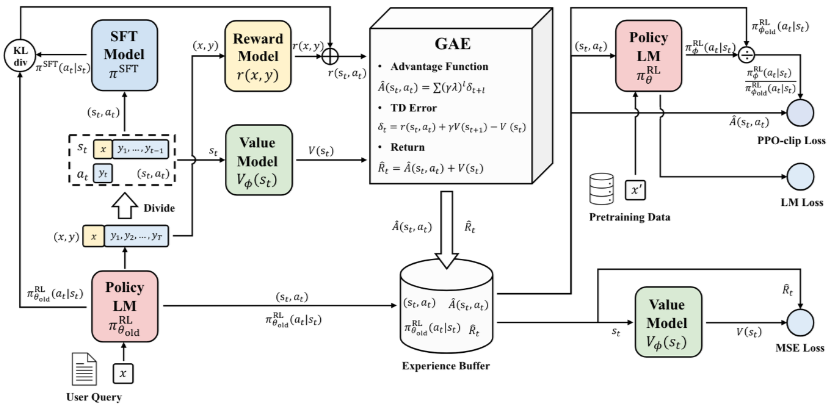
   <p>图14.1 ppo算法流程图</p>
</div>

流程以一个用户查询 x 开始，旧策略模型（**Policy LM**），根据输入 x 生成响应序列 $y_1, y_2, ..., y_{t-1}$。将(x,y)分解成**状态-动作对$(s_t, a_t)$**。在语言模型中：
- 状态 $s_t$ = 当前上下文（如已生成的部分 token）
- 动作 $a_t$ = 下一个要生成的 token

将`用户问题+模型生成的回答 (x, y)` 输入给**奖励模型（Reward Model）**，输出一个标量奖励值r(x, y)，表示该回答的质量（越高越好）。

**价值模型（Value Model）** 的输入是当前状态 $s_t$，输出 $V(s_t)$ 是估计从该状态开始未来能获得的总回报（Return） 。

**广义优势估计（GAE, Generalized Advantage Estimation）** 模块计算得到的优势 $A(s_t, a_t)$，以及估计返回 $R̂_t$。

**Return**： $R̂_t = Â(s_t, a_t) + V(s_t)$

**优势函数（Advantage Function）**：$Â(s_t, a_t) = Σ(γλ)^{l} δ_{t+l}$，对未来多个时间步的 TD error 加权求和，λ 是 GAE 参数（控制偏差-方差权衡）。

**时序差分误差（TD Error，Temporal Difference Error）**：$δ_t = r(s_t, a_t) + γV(s_{t+1}) - V(s_t)$，衡量的是“实际回报”与“当前价值估计”之间的差距。

- \( r_t \)：在状态 \( s_t \) 下执行动作 \( a_t \) 后获得的**即时奖励**
- \( \gamma \in [0,1] \)：折扣因子（discount factor），通常取 0.95~1.0
- \( V(s_t) \)：价值网络对状态 \( s_t \) 的估值

**经验回放缓冲区（Experience Buffer）** 用来存储每次 rollout 的数据，包括状态-动作对（$s_t, a_t$）、优势函数估计值（$Â(s_t, a_t)$）、估计回报（$R̂_t$）和旧策略下该动作的概率（$π_θ^old(a_t|s_t)$）。

**策略更新模块** Policy LM $π_θ^RL(a_t|s_t)$ 是当前正在优化的策略模型。它接收状态 $s_t$，输出动作 $a_t$ 的概率分布。

**PPO-clip Loss** 是 PPO 的核心损失函数，目标是在保证策略更新稳定的前提下，最大化期望回报（即 Reward Model 给出的分数）。

$$
\mathcal{L}^{\text{CLIP}}(\theta) = \mathbb{E}_t \left[ \min\left( 
r_t(\theta) \cdot \hat{A}_t,\ 
\text{clip}\big(r_t(\theta), 1-\epsilon, 1+\epsilon\big) \cdot \hat{A}_t 
\right) \right]
$$

其中：
- $r_t(\theta) = \frac{\pi_\theta(a_t | s_t)}{\pi_{\theta_{\text{old}}}(a_t | s_t)}$：**新旧策略概率比**
- \( \hat{A}_t \)：GAE 计算出的**优势函数**（来自 TD Error）
- \( \epsilon \)：超参数（通常 0.1~0.2），控制更新步长
- `clip`：将比率裁剪到 \([1-\epsilon, 1+\epsilon]\) 区间

**LM Loss** 是标准的 自回归语言建模交叉熵损失，目标是防止策略在优化奖励时“忘记”如何说人话（灾难性遗忘）。

**MSE Loss** 是价值函数的学习目标，让价值网络 $V_\phi(s_t)$ **准确预测**从状态 \( s_t \) 开始的**期望总回报**。

> PPO-clip Loss 决定“往哪里走”（偏好方向），LM Loss 确保“不走偏”（语言合理），MSE Loss 提供“地图”（价值估计）——三者合力让 LLM 在人类偏好空间中稳健航行。

一个完整的训练流程应该是：
- **采样阶段**：用 $π_θ^{old}$ 根据用户输入 x 生成回答 y ---> 用 Reward Model 给 $(x,y)$ 打分 $r(x,y)$ ---> 用 Value Model 和 GAE 计算每个 token 的优势函数 $Â(s_t, a_t)$ 和回报 $R̂_t$ ---> 存入 Experience Buffer。
- **更新阶段**：从 Buffer 中采样 mini-batch 数据 ---> 计算 PPO-clip Loss、LM Loss、MSE Loss ---> 反向传播更新 Policy LM 和 Value Model --->  更新后的新策略成为下一轮的 $π_θ^old$
- **迭代循环**：重复采样 → 计算奖励与优势 → 更新策略 → 新策略采样...

当我们看 OPENAI 关于 [PPO](https://spinningup.openai.com/en/latest/algorithms/ppo.html) 算法的文档，他看起来很简单：

<div align="center">
   
   <p>图14.1 ppo算法伪代码</p>
</div>

但在实践上，PPO 的理论和实现完全是两回事。PPO 理论简洁，但实际调参和实现陷阱极多（如价值函数训练、优势估计、KL 控制、奖励归一化等），有篇博客甚至列出了[37个PPO实现细节](https://iclr-blog-track.github.io/2022/03/25/ppo-implementation-details/)，发现不同的 PPO 变体在 RL 的 benchmarks 表现出了不同的得分。

<div align="center">
   
   <p>图14.2 ppo实现细节对性能的影响.png

</p>
 </div>

而且还有一篇论文，专门探讨为什么细节对于 PPO 如此重要，请参考 [Implementation Matters in Deep Policy Gradients: A Case Study on PPO and TRPO](https://arxiv.org/abs/2005.12729)。以及如果你真的把他们搞砸了，甚至没有正确计算策略梯度，但效果反而更好。如果你去看 PPO 的实现细节，会发现情况非常复杂，所以我们确实需要通过代码看下 PPO 的具体实现：

参考 [alpaca_farm 中关于 PPO 的实现](https://github.com/tatsu-lab/alpaca_farm/blob/30717ddae735365de756ee2085191b491a71788d/src/alpaca_farm/rl/ppo_trainer.py)，该实现遵循典型的 on-policy RL 循环，实现了 PPO 算法在 语言模型（LLM） 上的完整训练循环，包含：

- Rollout（采样）：用当前策略生成 responses
- 奖励计算与塑形（Reward Shaping）：结合任务奖励 + KL 惩罚
- 优势估计（GAE）
- 损失计算（Policy + Value Loss with Clipping）：用 PPO 损失函数优化策略（Actor）和价值网络（Critic）
- 日志记录与模型保存

**奖励塑形（Reward Shaping）：** 将稀疏的任务奖励（只在序列末尾）与密集的KL 惩罚（每个 token）结合起来，形成可训练的 reward signal

```
def _shape_reward(self, rewards, responses, logprobs, ref_logprobs):
    # 计算 KL 散度：用 (logp - ref_logp) 的正值部分（即新策略比参考策略更“自信”才惩罚）
    kl = torch.clamp(logprobs - ref_logprobs, min=0.0)

    # 非任务奖励 = -β * KL（β 由 self.kl_ctl 控制，可动态调整）
    non_score_rewards = -self.kl_ctl.value * kl

    # 初始化塑形奖励：先填入 KL 惩罚（每个 token 都有）
    shaped_rewards = non_score_rewards.clone()

    # 找到每个序列的最后一个非 padding token 的位置（即 EOS 或真实结尾）
    terminal_positions = (responses != self.tokenizer.pad_token_id).sum(dim=1) - 1

    # 在最后一个 token 处加上任务奖励（如数学题是否答对）
    shaped_rewards[list(range(rewards.size(0))), terminal_positions] += rewards

    return dict(shaped_rewards=shaped_rewards, non_score_rewards=non_score_rewards, kl=kl)
```


**广义优势估计（GAE）：** 用 GAE 估计每个 token 的优势函数（Advantage），替代原始奖励，大幅降低策略梯度方差。

```
def _estimate_advantage(self, rewards, values):
    if self.args.whiten_rewards:
        rewards = torch_ops.whiten(rewards, shift_mean=False)  # 奖励标准化（可选）

    lastgaelam = 0
    advantages_reversed = []
    gen_length = self.args.response_len  # 生成长度（如 128）

    # 从后往前计算 GAE（反向遍历 token）
    for t in reversed(range(gen_length)):
        nextvalues = values[:, t + 1] if t < gen_length - 1 else 0.0
        # TD error: δ_t = r_t + γ * V(s_{t+1}) - V(s_t)
        delta = rewards[:, t] + self.args.gamma * nextvalues - values[:, t]
        # GAE: A_t = δ_t + γλ A_{t+1}
        lastgaelam = delta + self.args.gamma * self.args.lam * lastgaelam
        advantages_reversed.append(lastgaelam)

    advantages = torch.stack(advantages_reversed[::-1], dim=1)  # 反转回正常顺序
    returns = advantages + values  # Q(s,a) ≈ A(s,a) + V(s)

    # 优势函数标准化（减均值、除标准差）→ 降低方差
    advantages = torch_ops.whiten(advantages, shift_mean=True)

    return dict(returns=returns, advantages=advantages)
```

**rollout（采样轨迹）：** 完成一次完整的 采样 → 评估 → 奖励计算 → 优势估计 流程，为后续 PPO 更新准备数据

```
@torch.inference_mode()
def rollout(self, queries_data):
    self.policy.eval()
    unwrapped_policy = self.accelerator.unwrap_model(self.policy, keep_fp32_wrapper=True)
    self.ref_policy.eval()
    self.reward_model.eval()

    rollouts = []
    for batch in tqdm.tqdm(queries_data, desc="rollout"):
        # 1. 从当前策略生成 responses
        queries, masks = batch['queries'], batch['query_attn_masks']
        responses = unwrapped_policy.respond(queries, masks, temperature=...)  # 生成

        # 2. 用当前策略计算 logprobs 和 values（critic 输出）
        policy_outputs = self.policy(queries, masks, responses, ...)  # forward

        # 3. 用参考策略（SFT 模型）计算 ref_logprobs（用于 KL）
        ref_outputs = self.ref_policy(queries, masks, responses, ...)

        # 4. 将 response 转为文本，再用 reward tokenizer 重新 tokenize
        #    （因为 policy 和 reward model 的 tokenizer 可能不同）
        text_queries = decode(queries); text_responses = decode(responses)
        text_sequences = [q + r for q, r in zip(text_queries, text_responses)]
        sequences = reward_tokenizer(text_sequences, ...)  # 重新 tokenize

        # 5. 用 reward model 计算任务奖励
        reward_outputs = self.reward_model(**sequences)
        reward_outputs = self.post_reward(reward_outputs, responses)  # 处理未正常结束的序列

        # 6. 奖励塑形：加入 KL 惩罚
        shaped = self._shape_reward(rewards=reward_outputs['rewards'], ...)

        # 7. 保存所有数据到 rollouts
        rollouts_batch.update(policy_outputs, ref_outputs, reward_outputs, shaped)
        rollouts.append(rollouts_batch.cpu())

    # 合并所有 batch
    rollouts = common.merge_dict(rollouts, merge_fn=torch.cat)

    # 8. 统一计算 GAE（用整个 rollout 数据集，更稳定）
    advantages = self._estimate_advantage(
        rewards=rollouts["shaped_rewards"].to(device),
        values=rollouts["values"].to(device),
    )

    return {**rollouts, **advantages}
```

**PPO 损失计算：** 使用裁剪机制防止策略更新过大

```
def compute_loss(self, rollouts):
    # 提取旧策略数据（from rollout）
    values, old_logprob, returns, advantages, ... = rollouts

    # 用当前策略重新计算 logprobs 和 values
    outputs = self.policy(queries, masks, responses, ...)
    vpred = outputs["values"]      # 新的 value 预测
    logprob = outputs["logprobs"]  # 新的 log prob

    # --- Value Loss (Critic) ---
    # 裁剪 value 预测（类似 PPO 裁剪）
    vpredclipped = torch.clamp(vpred, values ± cliprange_value)
    vf_losses1 = (vpred - returns) ** 2
    vf_losses2 = (vpredclipped - returns) ** 2
    vf_loss = 0.5 * max(vf_losses1, vf_losses2).mean()  # PPO-style value loss

    # --- Policy Loss (Actor) ---
    ratio = exp(logprob - old_logprob)  # 新旧策略概率比
    pg_losses = -advantages * ratio
    pg_losses2 = -advantages * clip(ratio, 1-ε, 1+ε)
    pg_loss = max(pg_losses, pg_losses2).mean()  # PPO 裁剪目标

    # 总损失 = 策略损失 + vf_coef * 价值损失
    loss = pg_loss + self.args.vf_coef * vf_loss

    # 记录统计量
    approxkl = 0.5 * (logprob - old_logprob)^2 的均值
    entropy = outputs["entropies"].mean()

    return loss, stats
```


在语言模型的 PPO 训练过程中，一个健康、合理的训练曲线是什么样？


<div align="center">
   
   <p>图14.3 ppo训练过程曲线</p>
 </div>

- Increasing overall rewards：总奖励上升。`kl_sum_seq` 这个名字有点误导性，它实际上代表的是每个序列的塑形奖励（shaped rewards）的总和，这个“塑形奖励” = 任务奖励（如数学题答对得高分） + KL惩罚项（负值），衡量模型的整体表现是否在变好。
- Incl. reward model： 任务奖励上升。这个指标衡量的是模型直接从奖励模型那里获得的任务奖励，不包括KL惩罚。它反映了模型在核心任务上的表现，比如回答问题的准确性、遵循指令的能力等。
- Negative KL rewards： 负的KL奖励。这个指标就是 KL 惩罚项，也就是前面提到的 -β * KL。说明模型确实在探索和改进，但没有失控。这是PPO算法“近端”思想的体现——允许一定程度的偏离，但限制其幅度。

这三条曲线共同描绘了一个健康的PPO训练过程：模型在奖励模型的引导下，逐步学会生成更好的回复，同时通过KL惩罚保持一定的稳定性，避免过度偏离初始的良好行为。

### 14.2.2 为什么我们需要另一个强化学习（RL）算法？

**1. 为什么不直接用 PPO？**
PPO 是目前最成功的在线强化学习算法之一，尤其在语言模型的对齐（Alignment）中被广泛应用。但它有两个主要缺点：

- **实现复杂 (complicated implementation)**：PPO 不是一个简单的“开箱即用”的算法。它包含多个复杂的组件，如：**Rollout 采样**、**奖励塑形**、 **优势估计**、**损失计算**等。这些步骤需要精心设计和调试，对于新手或追求快速迭代的研究者来说，门槛很高。

- **价值模型 (Value model) 的负担**：PPO 需要一个额外的 **价值网络（Value Model）** 来估计状态的价值（`V(s)`），从而计算优势函数（`A = Q - V`）。
    - **内存消耗大 (memory hungry)**：价值网络与策略网络共享主干结构，但需要额外的参数和计算资源。
    - **额外的调参 (additional tuning)**：价值网络本身也需要训练和优化，这增加了整个系统的复杂性和超参数搜索空间。你需要同时调优策略网络和价值网络，确保它们协同工作。

> ✅ **总结**：PPO 虽然强大且有效，但其**工程复杂度高、资源消耗大、调参困难**，尤其是在低资源或追求高效开发的场景下，显得不够轻便。

**2. 为什么不直接用 DPO？**

DPO（Direct Preference Optimization）是近年来兴起的一种替代方案，它绕过了传统的强化学习框架，直接从人类偏好数据中进行优化。但其也存在以下限制：

- **数据形式不匹配 (Data not inherently pairwise)**：DPO 的核心思想是基于**成对比较（pairwise comparisons）** 数据，即给定一个提示（prompt），有两个不同的回复（response A 和 response B），并标注哪个更好。然而，在许多实际应用场景中，我们拥有的数据并非天然就是成对的。例如，在“可验证奖励”（Verifiable Rewards）领域，数据通常是单个序列加上一个客观的分数（如数学题答对得1分，答错得0分）。这种**标量奖励信号**无法直接用于 DPO。

- **离线算法 (Offline)**：DPO 是一种**离线算法**。它在固定的、预先收集好的偏好数据集上进行一次性训练。这与 PPO 的**在线学习**特性不同。PPO 可以在训练过程中不断生成新的样本、获得新的反馈，并据此迭代更新策略。DPO “理论上可以通过迭代使其在线化”，但这会增加复杂性，失去了其作为简单离线方法的优势。

> ✅ **总结**：DPO 在处理**人类偏好数据**时非常优雅和高效，但它**不适用于非成对的、可验证的标量奖励场景**，并且其离线特性限制了它在需要持续探索和在线学习任务中的应用。


### 14.2.3 GRPO：去掉了价值函数的 PPO

**GRPO (Group Relative Policy Optimization)** 是在 [DeepSeekMath](https://arxiv.org/pdf/2402.03300) 论文中提出并在 [Deepseek-R1](https://arxiv.org/abs/2501.12948) 中发扬光大的算法。GRPO 在 PPO 的基础上，移除了价值函数（Value Function）和优势计算（Advantage Computation）。这是对 PPO 最大的改动，也是其轻量化的根本原因。并且采用了一种全新的方式来估算“优势”——即 “组内 z-score”（z-score within group）。

<div align="center">
   
   <p>图14.4 PPO与GRPO的对比</p>
 </div>

> ✅ 简单来说，GRPO = PPO - Value Model + Group Z-Score Advantage。


#### GRPO 的目标函数

$$
\mathcal{J}_{GRPO}(\theta) = \mathbb{E} \left[ q \sim P(Q), \{o_i\}_{i=1}^G \sim \pi_{\theta_{old}}(O|q) \right] \frac{1}{G} \sum_{i=1}^{G} \left( \min\left( \frac{\pi_\theta(o_i|q)}{\pi_{\theta_{old}}(o_i|q)} A_i, \text{clip}\left( \frac{\pi_\theta(o_i|q)}{\pi_{\theta_{old}}(o_i|q)}, 1-\epsilon, 1+\epsilon \right) A_i \right) - \beta \mathbb{D}_{KL} \left( \pi_\theta || \pi_{ref} \right) \right)
$$

- `min(...)`部分：是 PPO 的经典裁剪目标函数，用于更新策略 $π_θ$。
    - $\frac{\pi_\theta(o_i|q)}{\pi_{\theta_{old}}(o_i|q)}$ 是新旧策略的概率比。
    - $A_i$ 是第 $i$ 个输出 $o_i$ 的“优势”，这是 GRPO 最大的创新点。
    - `clip(...)` 是 PPO 的裁剪机制，防止策略更新过大。
- $-β D_KL(...)$ 部分：这是 KL 散度惩罚项，用于防止新策略 `π_θ` 偏离参考策略 `π_ref` 太远，保证生成结果的稳定性。
    - `β` 是控制 KL 惩罚强度的超参数。

PPO 的目标函数：
$$
\min \left( \frac{\pi_\theta(a|s)}{\pi_{\theta_k}(a|s)} A^{\pi_{\theta_k}}(s,a), \text{ clip} \left( \frac{\pi_\theta(a|s)}{\pi_{\theta_k}(a|s)}, 1-\epsilon, 1+\epsilon \right) A^{\pi_{\theta_k}}(s,a) \right)
$$

GRPO 与 PPO 两者的目标函数结构非常相似，都包含概率比和裁剪。核心区别在于 `A` 的来源：
- **PPO**: `A` 是通过价值网络 `V(s)` 和 GAE 计算出来的，这是一个复杂且资源密集的过程。
- **GRPO**: `A` 是通过组内 z-score 计算出来的，这是一个简单、快速、无需额外模型的过程。


#### KL 散度的计算

$$
\mathbb{D}_{KL} \left( \pi_\theta || \pi_{ref} \right) = \frac{\pi_{ref}(o_i|q)}{\pi_\theta(o_i|q)} - \log \frac{\pi_{ref}(o_i|q)}{\pi_\theta(o_i|q)} - 1
$$

这是一个近似的 KL 散度公式。它不是标准的积分形式，而是在每个采样点 $o_i$ 上进行近似。它的作用是衡量当前策略 $π_θ$ 和参考策略 $π_{ref}$ 在生成特定输出 $o_i$ 时的概率差异。

#### 组内 z-score 优势

$$
A_i = \frac{r_i - \text{mean}(\{r_1, r_2, \cdots, r_G\})}{\text{std}(\{r_1, r_2, \cdots, r_G\})}
$$

这是 GRPO 的灵魂所在！它完全抛弃了 PPO 中复杂的 GAE 计算。

**如何计算？**
- 对于每一个问题 $q$，从旧策略 $π_{old}$ 中**采样一组（G个）不同的回复** ${o_1, o_2, ..., o_G}$。
- 用奖励模型或可验证规则，为这 G 个回复**分别打分**，得到一组奖励 ${r_1, r_2, ..., r_G}$。
- 计算这组奖励的**均值（mean）和标准差（std）**。
- 将每个回复 $o_i$ 的奖励 $r_i$ 减去均值，再除以标准差，得到它的 $A_i$。

**为什么叫 “z-score”？**

在统计学中，z-score 表示一个数据点距离平均值有多少个标准差。这里，$A_i$ 表示回复 $o_i$ 的奖励在本组中的“相对优劣程度”。如果 $A_i > 0$，说明这个回复比组内平均水平好；如果 $A_i < 0$，则说明它比平均水平差。

**为什么有效？**

- **简单高效**：不需要训练额外的价值网络，也不需要复杂的 GAE 计算。
- **自归一化**：通过组内比较，自动消除了不同问题之间奖励尺度不一致的问题。例如，一个数学题可能最高得10分，另一个可能最高得5分，但它们在同一组内比较时，z-score 能公平地反映相对好坏。
- **适用于可验证奖励**：对于一个数学题，你可以让模型生成多个答案，然后用程序自动判断每个答案是否正确（得分为1或0），再用 z-score 来区分哪个答案“更好”。

> 在在线学习（边采样边更新）的场景下，GRPO 本质上就是一种使用了组内标准化奖励的策略梯度方法。

#### 💻 代码解读：一个极简的 GRPO 实现

GRPO 的实现非常简单，不需要复杂的 GAE 计算。下面我们基于 [nano-aha-moment](https://github.com/McGill-NLP/nano-aha-moment/blob/main/nano_r1_script.py) 项目中对于 GRPO 算法的实现，对关键代码进行分析。如下compute_pg_loss 是一个典型的 GRPO 损失计算函数：

```python
def compute_pg_loss(
    policy_model: Union[DeepSpeedEngine, PreTrainedModel], # 当前要训练的语言模型
    batch: Dict[str, torch.Tensor], # 一个包含训练数据的字典
    total_response_len: torch.Tensor, # 一个包含训练数据的字典
    TEMPERATURE: float, # 生成时的温度参数（影响 log-prob 计算）
    KL_COEFFICIENT: float, # 控制 KL 惩罚强度的超参数
) -> Tuple[torch.Tensor, Dict[str, float]]:
    """
    Compute the policy gradient loss with KL penalty between policy and reference models.

    This function:
    1. Calculates KL divergence penalty between the models
    2. Computes policy gradient loss using advantages
    3. Combines the losses with KL coefficient

    Args:
        policy_model: The model being trained
        batch: Dictionary containing:
            - input_ids: Tensor of shape [batch_size, seq_len]
            - attention_mask: Tensor of shape [batch_size, seq_len]
            - labels: Tensor of shape [batch_size, seq_len] with -100 for ignored positions
            - advantages: Tensor of shape [batch_size, seq_len]
            - ref_log_probs: Tensor of shape [batch_size, seq_len-1]
        total_response_len: Total number of valid tokens in the batch. This is a scalar tensor.

    Returns:
        Tuple containing:
            - loss: Combined policy gradient and KL penalty loss (scalar tensor)
            - metrics: Dictionary with detailed loss components:
                - policy_loss: Pure policy gradient loss
                - kl_penalty: KL divergence penalty
                - entropy: Policy entropy
    """

    # 1. 从 batch 中提取关键张量
    input_ids = batch["input_ids"]  # [batch_size, seq_len]，完整序列（prompt + response）
    attention_mask = batch["attention_mask"]  # [batch_size, seq_len]，指示有效 token
    labels = batch["labels"]  # [batch_size, seq_len]，通常与 input_ids 相同或右移一位
    labels_mask = batch["labels_mask"]  # [batch_size, seq_len]，1 表示该位置是 response token，0 表示 prompt 或 padding
    advantages = batch["advantages"]  # [batch_size, seq_len]，每个 token 的“优势”值（来自组内归一化）
    ref_logps = batch["ref_log_probs"]  # [batch_size, seq_len-1]，参考模型在 response token 上的 log-prob（长度比 input_ids 少 1）

    # 2. 构建模型输入
    model_inputs = {
        "input_ids": input_ids,
        "attention_mask": attention_mask,
        "labels": labels,
        "labels_mask": labels_mask,
    }

    # 3. 计算当前策略的 token log-probabilities
    logps = compute_token_log_probs(policy_model, model_inputs, TEMPERATURE)  # 让 policy_model 对 input_ids 做前向传播，得到每个 token 的 log-probability，输出形状是 [batch_size, seq_len-1]，因为模型预测的是 input_ids[1:]

    # 4. 对齐 mask 并计算 KL 惩罚项
    labels_mask = labels_mask[..., 1:].to(logps.dtype)  # 将 labels_mask 也右移一位，与 logps 对齐，只保留 response token 的 mask，输出形状是 [batch_size, seq_len-1]，
    
    # 直接计算 KL 需要对整个词汇表求和（sum(p * log(p/q))），计算量极大。使用了 Bregman divergence 的一种近似，而这个近似只依赖于 logps 和 ref_logps（即 token-level 的 log-prob），非常高效。
    ref_logratio = ref_logps - logps
    kl_penalty = torch.exp(ref_logratio) - 1 - ref_logratio  # [batch_size, seq_len-1]
    kl_penalty = kl_penalty * labels_mask  # [batch_size, seq_len-1]，只对 response token 计算 KL 惩罚，忽略 prompt

    # 5. 计算辅助统计量（不参与梯度）
    with torch.no_grad():
        entropy = -logps.sum() / labels_mask.sum()  # scalar
        zero_advantages = close_to_zero(advantages[..., 1:], labels_mask)  # scalar

    # 6. 计算策略梯度损失
    policy_loss = -logps * advantages[..., 1:]  # [batch_size, seq_len-1]，advantages[..., 1:]取 advantage 从第 2 个 token 开始，与 logps 对齐
    policy_loss = policy_loss * labels_mask  # [batch_size, seq_len-1]

    # 7. 组合总损失并归一化
    loss = (policy_loss + KL_COEFFICIENT * kl_penalty).sum() / total_response_len  # 将策略损失和 KL 惩罚加权求和，除以 total_response_len，将总损失归一化为每个有效 token 的平均损失，使 loss 值在不同 batch size 下可比。

    # 8. 构建返回的指标字典
    metrics = {
        "policy_loss": policy_loss.sum().item() / total_response_len.item(),
        "kl_penalty": kl_penalty.sum().item() / total_response_len.item(),
        "entropy": entropy.item() / total_response_len.item(),
        "zero_advantages_ratio": zero_advantages.item() / total_response_len.item(),
    }

    return loss, metrics

```

在 GRPO 中，优势（Advantage）的计算过程极其简单，其核心就是“组内 z-score 归一化”，并且为了数值稳定，添加了一个微小的常数 1e-4。下面使其实现代码：

```python
# 1. 数据校验与分组

assert len(all_generations) == len(all_finish_reasons) # all_generations 是模型生成的所有回复，all_finish_reasons 是每个回复的结束原因（如 "stop" 或 "length"），samples 是原始输入样本
assert len(all_generations) == len(samples) * GENERATIONS_PER_SAMPLE # GENERATIONS_PER_SAMPLE 是一个超参数，表示对每个输入样本 sample，要生成多少个不同的回复（例如 3 个）。所以总回复数 = 样本数 × 每样本生成数。

# 将所有生成的回复按样本分组。例如，如果 GENERATIONS_PER_SAMPLE=3，那么 groups = [[0,1,2], [3,4,5], ...]，其中 [0,1,2] 对应第一个样本生成的三个回复
groups = [
    list(range(i, i + GENERATIONS_PER_SAMPLE)) for i in range(0, len(all_generations), GENERATIONS_PER_SAMPLE)
]

# 2. 初始化存储变量

all_query_token_ids, all_responses_token_ids, all_samples, all_rewards = [], [], [], []
stats = { "response_lengths": [], "rewards": [], "non_stop_rate": [], }

# 3. 核心循环：对每个样本及其生成的回复组进行处理
# 对于当前样本 sample，获取它对应的 group_indices（如 [0,1,2]），然后提取出该组的结束原因、token ID 和解码后的文本
for sample, group_indices in zip(samples, groups):
    finish_reasons = [all_finish_reasons[i] for i in group_indices]
    response_token_ids = [all_generations[i] for i in group_indices]
    responses = tokenizer.batch_decode(response_token_ids, skip_special_tokens=False)

    # 对组内的每一个回复 resp，调用 compute_reward 函数计算其奖励分数。compute_reward 是你自定义的函数，比如判断数学题是否答对、代码是否能运行等
    rewards_and_metrics = [compute_reward(resp, sample, EOS_TOKEN) for resp in responses]
    rewards, reward_metrics = zip(*rewards_and_metrics) # zip(*rewards_and_metrics) 将 (reward, metrics) 元组解包成两个列表：rewards 和 reward_metrics

    # 4. 关键步骤：计算组内归一化的“优势” (Advantages)
    rewards = np.array(rewards)
    advantages = (rewards - rewards.mean()) / (rewards.std() + 1e-4) # rewards - rewards.mean()：计算每个回复的奖励相对于组内平均值的偏差; 除以组内标准差，得到 z-score; 当组内所有奖励都相同时（标准差为 0），直接除以 0 会导致 NaN 错误。加上一个极小的常数 1e-4 可以避免这种情况，保证计算稳定

    # 将每个回复的标量优势值 resp_adv 扩展为一个序列，使其长度与回复的 token 数相同,目的是为了让优势信号可以与每个 token 的 log-probability 对齐，从而计算策略梯度损失
    per_token_advantages = [[adv] * len(resp) for adv, resp in zip(advantages, response_token_ids)]

    # 5. 收集最终数据并返回
    # 将当前组的数据（奖励、样本、token ID）追加到全局列表中，以便后续统一处理
    all_query_token_ids.extend([sample["input_ids"]] * GENERATIONS_PER_SAMPLE)
    all_responses_token_ids.extend(response_token_ids)
    all_advantages.extend(per_token_advantages)

    # 记录一些有用的统计信息，如平均奖励、未正常结束的比例、回复长度等
    stats["rewards"].extend(rewards)
    stats["non_stop_rate"].extend([fr != "stop" for fr in finish_reasons])
    stats["response_lengths"].extend([len(ids) for ids in response_token_ids])

    for rm in reward_metrics:
        for k, v in rm.items():
            stats.setdefault(f"reward_metrics/{k}", []).append(v)

# 将所有数据打包成一个字典 episodes 返回，供后续的 compute_pg_loss 函数使用
episodes = {
        "all_query_token_ids": all_query_token_ids,
        "all_response_token_ids": all_responses_token_ids,
        "all_advantages": all_advantages,
    }

    return episodes, stats
```

#### GRPO 的实际效果

GRPO 的实际效果如何呢？下图展示了在两个数学推理基准测试上的模型性能：

<div align="center">
   
   <p>图14.5 GRPO与其他训练方法在两个数学推理基准测试上的模型性能对比</p>
 </div>

左图 GSM8K 是一个小学数学应用题数据集，右图 MATH 这是一个更难的高中数学竞赛题数据集。Y轴是准确率（Acc %），X轴是训练步数（Steps）。图中有多条曲线，代表不同的训练方法：

- RFT (Reinforcing Fine-Tuning)：这是最基础的方法。它只奖励“正确答案”，而不考虑生成过程。可以理解为“只要结果对，不管过程”。在图中用紫色线表示。
- Online RFT：这是 RFT 的在线版本，可能意味着它在训练过程中会动态地采样和更新，而不是使用固定的数据集。在图中用绿色线表示。
- GRPO+OS (Group Relative Policy Optimization + Online Sampling)：这是标准的 GRPO 方法，即我们之前讨论的“组内 z-score 归一化”优势计算。在图中用橙色线表示。
- GRPO+PS (Group Relative Policy Optimization + Process Supervision)：这是在 GRPO 基础上，额外加入了“过程监督”（Process Supervision）。这意味着不仅奖励最终答案，还奖励正确的解题步骤。在图中用蓝色线表示。

从两张图中我们可以得出以下结论：

- GRPO 显著优于 RFT：无论是 GSM8K 还是 MATH，橙色线（GRPO+OS）和蓝色线（GRPO+PS）都明显高于紫色线（RFT）。这说明 GRPO 算法本身是有效的，它能帮助模型学习到更好的策略，从而获得更高的准确率。
- 过程监督（PS）带来额外增益：在大多数训练步数下，蓝色线（GRPO+PS）略高于橙色线（GRPO+OS）。这表明，如果能够提供关于“解题过程”的监督信号，模型的性能可以得到进一步提升。
- GRPO 的稳定性：相比于波动较大的 RFT 和 Online RFT 曲线，GRPO 的曲线相对更平滑，这反映了其算法设计的稳定性。

### 14.2.4 GRPO 的潜在缺陷：长度偏差 (Length Bias)

虽然 GRPO 效果拔群，但学术界（如 "Dr. GRPO" 论文）指出其数学上存在瑕疵：
#### 1. **有偏梯度**

GRPO 通过“组内 z-score”来归一化奖励或计算优势，这样做是为了在不引入值函数的情况下提高训练稳定性。然而，计算这个 z-score 中涉及的标准差（stdev）可能依赖于所观察到的样本（可能与当前策略的输出有关），从而使得整个过程不再是严格意义上无偏的基线减法，可能会在理论上引入微小的偏差。

一个无偏梯度版本的 GRPO 是怎样的？

<div align="center">
   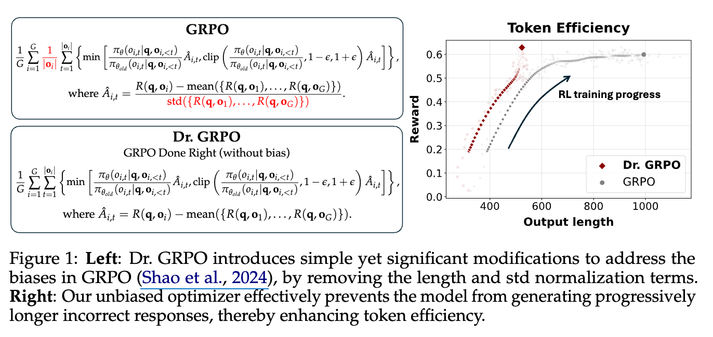
   <p>图14.6 Dr.GRPO与标准的GRPO的数学公式与性能对比</p>
 </div>

Dr. GRPO 的核心改动在于移除了 GRPO 原有的 $\frac{1}{|o_i|}$​（响应长度归一化）和 $\frac{1}{\text{std}(\{R(q, o_1), \dots, R(q, o_G)\})}$​（标准差归一化），从而修正了 GRPO 中存在的响应长度偏见和问题难度偏见。

右图展示了 GRPO 和 Dr. GRPO 在训练过程中的奖励（Reward）与输出长度（Output length）之间的关系。Dr. GRPO 通过移除偏见，有效地阻止了模型生成不必要的冗长响应（尤其是在回答错误时），从而提高了 token 效率。


#### 2. **长度偏见**

标准差被用来“加权”（upweights）那些“太容易”或“太难”的问题。

这种偏见源于在GRPO（Group Relative Policy Optimization）的目标函数中，将优势函数（Advantage）除以响应的长度 \(|o_i|\)。

GRPO的目标函数中，针对单个响应 \(o_i\) 在时间步 \(t\) 的梯度更新部分会涉及以下项：
\[ \dots \times \frac{\hat{A}_{i,t}}{|o_i|} \dots \]
其中：
*   \(|o_i|\)：表示响应 \(o_i\) 的长度（token数量）。
*   \(\hat{A}_{i,t}\)：是优势函数，其计算方式为 \(\hat{A}_{i,t} = R(q, o_i) - \text{mean}(\{R(q, o_1), \dots, R(q, o_G)\}) / \text{std}(\{R(q, o_1), \dots, R(q, o_G)\})\)，其中 \(R(q, o_i)\) 是响应 \(o_i\) 的回报（reward）。

**对正确回答的影响（正优势）：** 当优势函数 \(\hat{A}_{i,t}\) 为正（\(\hat{A}_{i,t} > 0\)，表示一个正确的回答）时，将 \(\hat{A}_{i,t}\) 除以较小的响应长度 \(|o_i|\) 会得到一个更大的值。这意味着模型会收到更大的梯度更新，从而激励模型倾向于生成更短的正确答案，即偏好简洁性。
**对错误回答的影响（负优势）：** 当优势函数 \(\hat{A}_{i,t}\) 为负（\(\hat{A}_{i,t} < 0\)，表示一个错误的回答）时，将 \(\hat{A}_{i,t}\) 除以较大的响应长度 \(|o_i|\) 会得到一个相对较小（即负得不那么厉害）的惩罚。这意味着模型对较长的错误回答的惩罚会减轻。

这种机制导致模型在生成错误回答时，更倾向于生成更长的响应，这是一种“越错越长”的现象。

## 14.3 案例研究

这里我们介绍三个关于 RLVR 的工作：
- Deepseek R1：是许多近期 RLVR 工作的核心，包含许多有趣的细节。 
- Kimi K1.5：与 R1 同时期，RLVR 提供了与 R1 互补的细节。 
- Qwen 3：最新的开源推理模型尝试，低数据量 RLVR

### 14.3.1 DeepSeek R1

[DeepSeek R1](https://arxiv.org/pdf/2501.12948)这篇论文引起了不小的轰动。

<div align="center">
   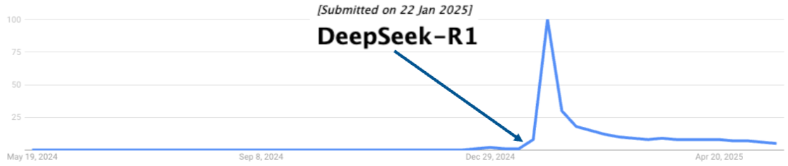
   <p>图14.7 DeepSeek-R1引起广泛的关注</p>
 </div>

R1 有何特别之处？

- 性能超越 OpenAI O1 
- 开放的 RL 配方（且相当简单） 
    - 终结了关于 MCTS/PRM 必要性的猜测 
- SFT 见解（包括 R1-zero 和 distil-r1）

他们沿用来自 DeepSeekMath 这篇论文里的 GRPO 成果。

<div align="center">
   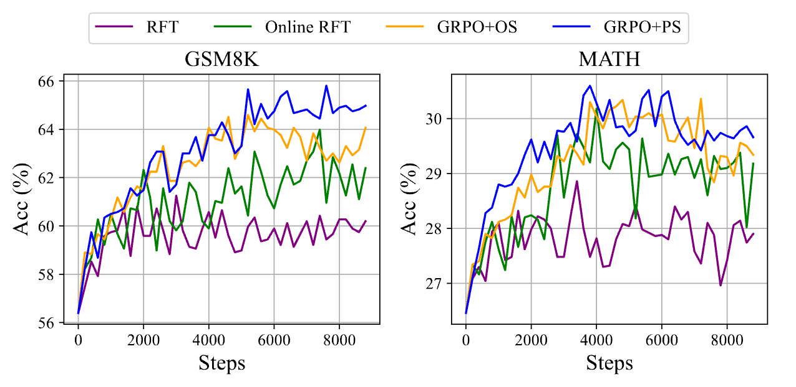
   <p>图14.8 GRPO和其他算法的对比</p>
</div>

该图展示了在两个数据集——GSM8K（左图）和 MATH（右图）——上，四种不同算法（RFT、Online RFT、GRPO+OS、GRPO+PS）在训练过程中准确率（Acc %）随训练步数（Steps）的变化。

DeepSeek R1 的成功证明了**纯强化学习**在推理任务上的巨大潜力。

#### R1-Zero：纯粹的 RL
*   **设置**: 直接在 Base 模型（DeepSeek-V3）上运行 GRPO。
*   **奖励**:
    *   **准确性奖励**: 答案对不对？（通过规则匹配或编译器验证）。
    *   **格式奖励**: 强制模型使用 `<think>` 和 `</think>` 标签包裹思维过程。
    - 数据：未公开

<div align="center">
   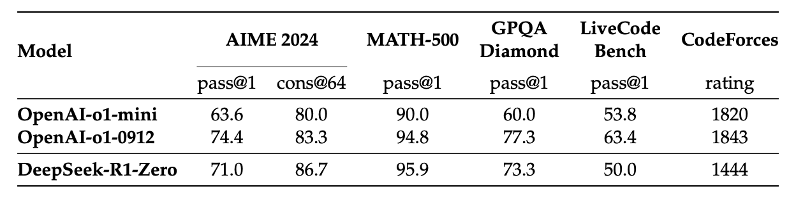
   <p>图14.9 Deepseek-R1-Zero和OpenAI-o1在相关推理基准上的性能对比</p>
</div>

在大多数情况下，DeepSeek-R1 与 o1-mini 的表现相当或更好，并且在几个任务上与 o1-0912 的表现相当。但在代码领域 DeepSeek-R1 的表现不如 o1 模型。

**Deepseek-R1-Zero 产生了有趣的现象** **Aha Moment (顿悟时刻)**: 模型在训练中期开始学会自我反思（Self-correction），例如“等等，我算错了，应该重新尝试...”。
    
<div align="center">
   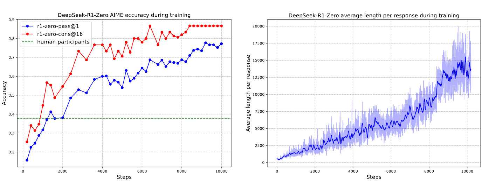
   <p>图14.10 DeepSeek-R1-Zero在训练期间的AIME准确率和在训练集上的平均响应长度</p>
</div>

思维时间的增加促进了复杂行为的自主发展。 具体而言，DeepSeek-R1-Zero 越来越多地展现出高级推理策略，例如反思性推理和系统性地探索替代解决方案，显著提升了其在数学和编码等可验证任务上的表现。 

<div align="center">
   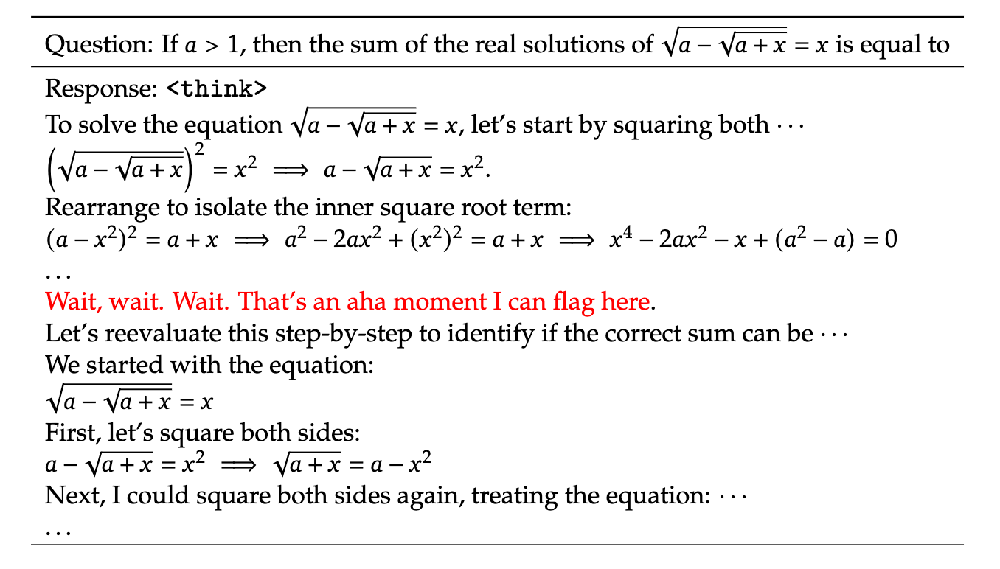
   <p>图14.11 aha moment的发现</p>
</div>

值得注意的是，在训练过程中，DeepSeek-R1-Zero 表现出一个“顿悟时刻”，其特征是在反思过程中使用“等等”一词的频率突然增加。这一时刻标志着推理模式的显著变化，并清晰地展示了 DeepSeek-R1-Zero 的自我演化过程。

##### 但也许有点言过其实？

GRPO 使用的是有偏的优化目标，当优化目标（无论是奖励模型还是 DPO 的损失函数）无意中偏向于特定长度的输出时，模型在追求最大化该目标的过程中，就会表现出“长度偏见”。

<div align="center">
   
   <p>图14.6 Dr.GRPO与标准的GRPO的数学公式与性能对比</p>
 </div>

基础模型早已表现出“aha moment”：

<div align="center">
   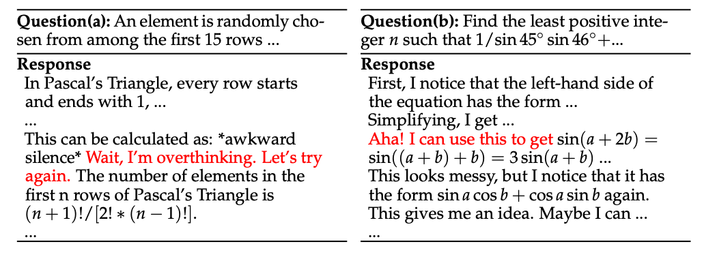
   <p>图14.6 Dr.GRPO与标准的GRPO的数学公式与性能对比</p>
</div>

####  DeepSeek-R1

尽管 DeepSeek-R1-Zero 展现出强大的推理能力，但它也面临一些问题。DeepSeek-R1-Zero 在可读性差和语言混合等方面存在挑战，因为 DeepSeek-V3-Base 是在多种语言上进行训练的，特别是英语和中文。为解决这些问题，Deepseek 团队开发了 DeepSeek-R1，其流程如图 2 所示。

<div align="center">
   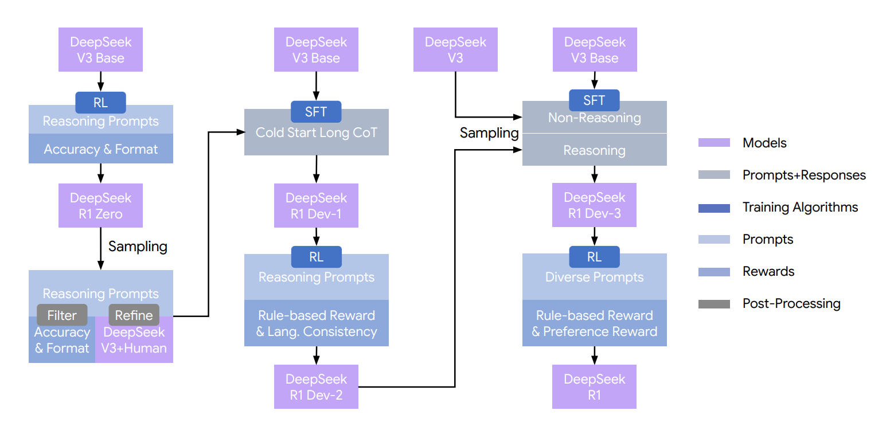
   <p>图14.13 Deepseek-R1开发流程</p>
</div>

##### 阶段 1：DeepSeek-R1-Zero

使用 DeepSeek-V3-Base 作为基础模型， 完全依赖于强化学习，奖励信号主要来自规则型奖励（Rule-based Reward），包括准确性（Accuracy）和格式（Format）奖励。

##### 阶段 2：搞数据

DeepSeek-V3-Base 作为基座模型，使用**冷启动长思维链数据**进行 **SFT** 训练得到 **DeepSeek-R1-Dev1**。

对于冷启动长思维链数据的收集，具体来说，他们首先收集了数千个高质量、多样化的推理提示。对于每个提示，使用 DeepSeek-R1-Zero 以 1.0 的相对较高 temperature 生成多个推理轨迹。接下来，过滤这些生成内容，只保留具有正确最终答案和可读格式的。对于数学输出，我们使用 sympy(https://www.sympy.org/) 进行解析和表达式比较；对于格式化，我们应用诸如重复检测和语言混合过滤之类的规则。最后，提示 DeepSeek-V3 来精炼推理和摘要，以确保正确的格式和人类友好的表达。特别是，为了解决语言混合问题，他们指示 DeepSeek-V3：“Translate the thinking process to the same language as the question.”。由于 DeepSeek-R1-Zero 的摘要仅提供最终答案，我们使用 Listing 1 中的摘要提示来生成一个简洁、易于人类阅读的解决方案，该解决方案概述了推理步骤和最终结果。

<div align="center">
   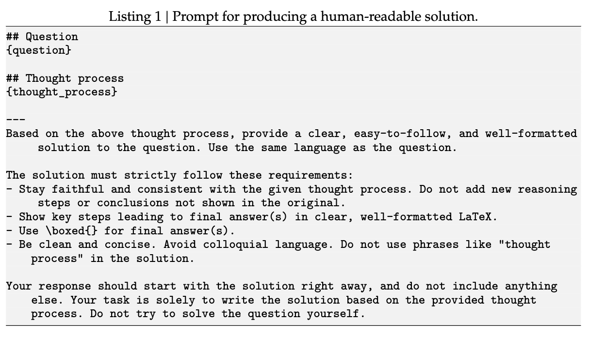
   <p>图14.14 产生人类可读回答的提示</p>
</div>

在 DeepSeek-R1-Dev1 的基础上，奖励信号使用基于规则的奖励（准确性+格式）和语言一致性奖励，进行 RL 训练得到 **DeepSeek-R1-Dev2**。

##### 阶段 3：后训练

将 **DeepSeek-V3-Base** 作为基座模型，使用 **800k**（600k推理相关数据+200k非推理数据） 监督数据进行 **SFT** 训练得到 **DeepSeek-R1-Dev3**。

通过从 DeepSeek-R1-Dev2 的检查点进行拒绝采样来生成推理轨迹，收集了大约 600k 个与推理相关的训练样本。

对于非推理数据，例如写作、事实 QA、自我认知和翻译，采用 DeepSeek-V3 pipeline 并重用 DeepSeek-V3 的 SFT 数据集的部分内容。还整合了软件工程相关数据，包括程序修复和前端网页开发，以增强模型解决现实世界问题的能力。对于某些非推理任务，我们在通过提示回答问题之前，会调用 DeepSeek-V3 来生成潜在的 chain-of-thought。然而，对于较简单的查询，例如“hello”，我们不会提供 CoT 作为回应。最终，我们收集了约 200k 与推理无关的训练样本。

在 DeepSeek-R1-Dev3上继续进行 RL，对于推理数据使用基于规则的奖励；通用数据由于没有一个明确的对错规则奖励信号，采用 Reward Models 来捕捉复杂且细致场景中的人类偏好，从 helpful 和 safety 两个角度计算奖励。

##### DeepSeek-R1 效果如何呢？

<div align="center">
   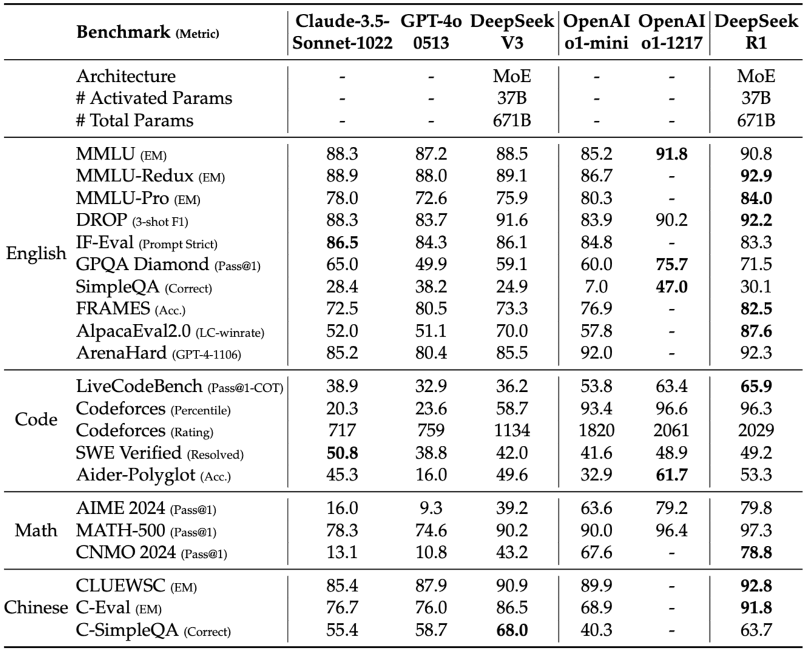
   <p>图14.15 DeepSeek-R1和其他模型的比较</p>
</div>

##### 蒸馏：我们可以将非推理模型转换为推理模型吗？

R1 的另一个巨大贡献是证明了**大模型的推理能力可以蒸馏给小模型**。使用 R1 生成的 800k 条数据微调 Qwen2.5，让学生模型（Qwen2.5）学会教师模型（R1）的推理能力！

<div align="center">
   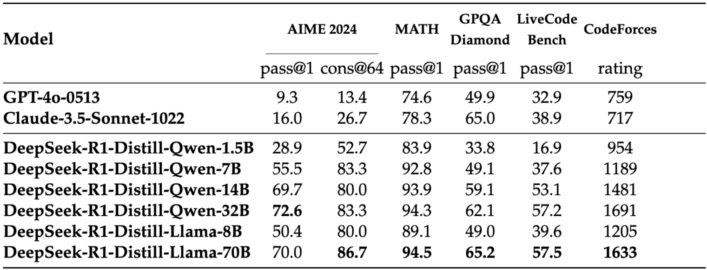
   <p>图14.16 Deepseek-R1蒸馏模型和其他模型的比较</p>
</div>

##### 使用少量高质量 SFT 样本提升数学推理能力

除了 Deepseek-R1 这种范式可以得到一个强大的推理模型外，我们直接使用 Base+SFT 也可以得到一个性能不错的推理模型。

<div align="center">
   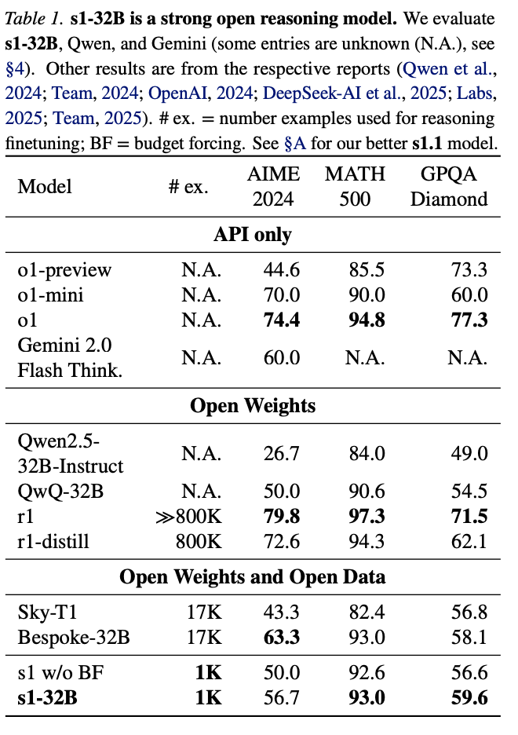
   <p>图14.17 s1使用1k高质量样本提高数学推理能力</p>
</div>

李飞飞团队的文章[s1: Simple test-time scaling](https://arxiv.org/pdf/2501.19393)使用 1k 个高质量、带有长思维链的数据，在 Qwen2.5-32B-Instruct 上进行 SFT 从而获得了强大的数学推理能力。

上海交通大学的刘鹏飞团队在[LIMO: Less is More for Reasoning](https://arxiv.org/pdf/2502.03387)中也得到了相似的结论，使用 800 个高质量个高质量、带有长思维链的数据，在 Qwen2.5-32B-Instruct 上进行 SFT 大大提高了模型的数学推理能力。

<div align="center">
   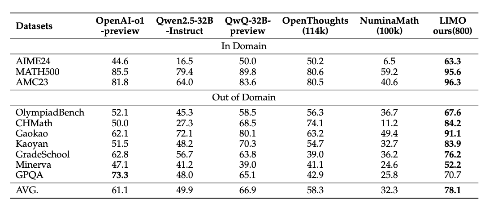
   <p>图14.18 s1使用1k高质量样本提高数学推理能力</p>
</div>

> 但需要注意的是，通过少量样本来提高模型推理能力对于基座模型的能力要求比较高，上述结果在 Qwen2.5-32B-Instruct 效果较好，但是在 Qwen2.5-7B-Instruct 和 Qwen2.5-3B-Instruct 上效果较差。

##### 使用少量高质量样本进行 RL提升数学推理能力

通过 Base+RL 这种路线同样可以获得推理模型，除了 Deepseek-R1-Zero外，[LIMR](https://arxiv.org/abs/2502.11886)（Qwen2.5-Math-7B+PPO）和[Less is More: Improving LLM Alignment via Preference Data Selection](https://arxiv.org/abs/2502.14560)（llama3-8B+DPO）两篇工作也证明了这条路线的可行性。

<div align="center">
   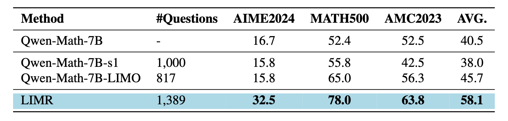
   <p>图14.19 limr与其他模型的性能比较</p>
</div>

##### 不成功的尝试

Deepseek-R1 团队也分享了他们在 DeepSeek-R1 开发的早期阶段，做的一些失败的尝试：

**过程奖励模型（Process Reward Model, PRM）**：PRM试图通过对中间推理步骤进行评估来 rerank、引导搜索或改进思路，但在实际应用中存在若干问题。
- 难以明确界定细粒度的中间步骤。很难给出一个通用、可自动化评估的“正确中间步骤”定义，导致对中间过程的逐步注释和评估困难。
- 判断当前中间步骤是否正确的挑战性。自动标注一个中间步骤的正确性往往不可靠，人工标注规模难以扩展，难以在大规模训练中落地。
- 引入模型后易产生奖励黑客行为，且成本高。一旦引入基于模型的奖励，模型可能找到作弊路径来提升奖励，从而偏离真实目标；另外，重新训练奖励模型需要额外的算力和数据，增加训练管线的复杂度和成本。


 **蒙特卡洛树搜索（MCTS）**：受 AlphaGo 和 AlphaZero 的启发，他们探索了使用蒙特卡洛树搜索（MCTS）来增强测试时计算的可扩展性。 这种方法涉及将答案分解成更小的部分，以允许模型系统地探索解空间。 为了实现这一点，提示模型生成多个标签，这些标签对应于搜索所需的特定推理步骤。

- 与搜索空间相对明确的国际象棋不同，token 生成呈现出指数级更大的搜索空间。 为了解决这个问题，我们为每个节点设置了最大扩展限制，但这可能导致模型陷入局部最优。 
- 其次，价值模型直接影响生成质量，因为它指导着搜索过程的每一步。 训练一个细粒度的价值模型本身就很困难，这使得模型难以进行迭代改进。 虽然 AlphaGo 的核心成功依赖于训练一个价值模型来逐步提升其性能，但由于 token 生成的复杂性，这一原理在我们当前的设置中难以复制。 

总之，虽然 MCTS 在与预训练的价值模型配对时可以在推理过程中提高性能，但通过自我搜索迭代地提升模型性能仍然是一个重大挑战。


### 14.3.2 Kimi k1.5

#### 长思维链推理策略

<div align="center">
   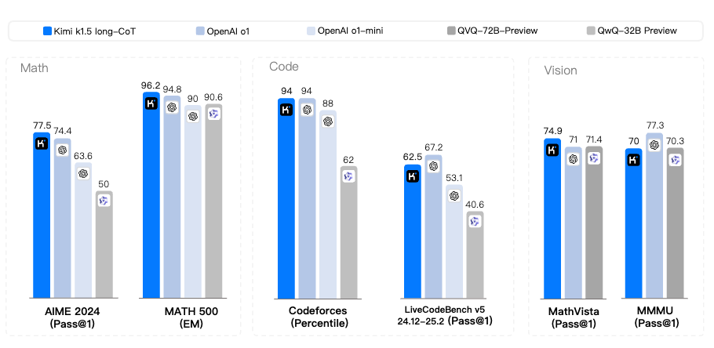
   <p>图14.20 Kimi-k1.5的长思维链结果</p>
</div>

关键步骤：
- 数据构建（困难度过滤）
- Long-CoT SFT
- RL（使用它们自己的策略梯度损失）

##### 数据管理

RL 提示集（Prompt Set）的质量和多样性在确保强化学习的有效性方面起着关键作用。一个精心构建的提示集不仅能引导模型进行鲁棒推理，还能减轻奖励黑客和对表面模式过拟合的风险。具体来说，三个关键属性定义了一个高质量的 RL 提示集：

- 多样化覆盖：提示应涵盖广泛的学科，如 STEM、编码和通用推理，以增强模型的适应性并确保在不同领域的广泛适用性。kimi 团队开发了一个标签系统，按领域和学科对提示进行分类，确保在不同学科领域之间保持均衡的代表性
- 平衡的难度：提示集应包含易、中、难等不同难度问题的良好分布范围，以促进渐进式学习并防止对特定复杂程度的过拟合。采用一种基于模型的方法，该方法利用模型自身的能力来适应性地评估每个提示的难度。通过利用这种方法，可以预先过滤掉大多数非常简单的样本，并在 RL 训练期间轻松探索不同的采样策略。
- 精确的可评估性：提示应允许验证者进行客观可靠的评估，确保模型性。为了避免潜在的奖励黑客，需要确保每个提示的推理过程和最终答案都可以被准确验证。实证观察表明，一些复杂的推理问题可能具有相对简单且易于猜测的答案，这会导致错误的正面验证——即模型通过错误的推理过程得出正确答案。为了解决这个问题，他们排除了容易出现此类错误的问题，例如选择题、判断题和证明题。此外，对于通用问答任务，我们提出了一种简单而有效的方法来识别和移除易于被黑客攻击的提示。具体来说，我们提示模型在没有任何 CoT 推理步骤的情况下猜测潜在答案。如果模型在 N 次尝试内预测出正确答案，则该提示被认为太容易被黑客攻击而被移除。他们发现设置 N = 8 可以移除大多数易于被黑客攻击的提示。

##### 长思维链（Long-CoT）SFT

在模型进入复杂的强化学习阶段之前，通过监督微调，让模型初步学会并内化一套高质量、类似人类的复杂推理能力。这就像给模型进行“预热”，确保它在后续的 RL 训练中能更好地理解和利用奖励信号，生成有价值的推理过程。

从精炼过的 RL 提示集（RL prompt set）中选取问题。利用“提示工程”（prompt engineering）技术，为这些问题构建出少量但高质量的“长 CoT 推理路径”。这些路径包含经过精确验证的推理步骤，适用于文本和图像输入。类似拒绝采样（RS），但其侧重点是通过精心设计的提示来“引导”模型生成长 CoT 推理路径，而非简单地从大量随机生成中选择最佳结果。通过以上步骤我们就构建好了一个用于 SFT 的数据集。

##### Kimi RL

我们希望最大化模型在参考答案上的期望奖励，同时不让模型偏离原始行为太多，目标函数为：

$$
\max_{\theta} \mathbb{E}_{(x,y^*) \sim \mathcal{D}} \left[ \mathbb{E}_{(y,z) \sim \pi_\theta} \left[ r(x, y, y^*) \right] - \tau \text{KL}(\pi_\theta(x) || \pi_{\theta_i}(x)) \right]
$$

借鉴了 DPO 的无奖励偏好优化思想，不直接设计奖励函数，而是通过比较当前策略与参考策略的差异，间接地定义一个“伪奖励”，再用平方损失去逼近它。

这里假设存在一个“理想策略”$\pi^*$（可以理解为人类偏好分布或专家策略），然后通过 DPO 的思路，把奖励函数 $r$ 与策略比值联系起来。具体地说，**奖励减去一个归一化常数 $\tau \log Z$，等于 $\tau$ 倍的理想策略与参考策略的对数比值**。这个推导基于“非参数假设”，意思是不显式建模奖励函数，而是让它隐含地由策略差异决定（类似 DPO 的核心思想）。最终目的是为了“解出 $r$”，即把奖励函数表达成策略的函数。

$
r(x, y, y^*) - \tau \log Z = \tau \log \frac{\pi^*(y, z|x)}{\pi_{\theta_i}(y, z|x)}
$

因为直接优化原始目标可能困难，这里用了一个**平方误差损失**来近似优化。它的目标是让当前策略 $\pi_\theta$ 的输出，尽可能匹配“理想策略 $\pi^*$”所对应的奖励表达式。注意这里采样是从**参考策略 $\pi_{\theta_i}$** 中进行的，而不是当前策略 $\pi_\theta$ —— 这是为了稳定训练，避免自举（bootstrapping）带来的偏差。最终损失 $L(\theta)$ 是对所有样本和采样结果取期望后的平方误差。

$
L(\theta) = \mathbb{E}_{(x,y^*) \sim \mathcal{D}} \left[ \mathbb{E}_{(y,z) \sim \pi_{\theta_i}} \left[ \left( r(x, y, y^*) - \tau \log Z - \tau \log \frac{\pi_\theta(y, z|x)}{\pi_{\theta_i}(y, z|x)} \right)^2 \right] \right]
$

最终用于更新模型参数 θ 的带正则化的基线策略梯度：

$$
\frac{1}{k} \sum_{j=1}^{k} \left( \nabla_\theta \log \pi_\theta(y_j, z_j | x) \left( r(x, y_j, y^*) - \bar{r} \right) - \frac{\tau}{2} \nabla_\theta \left( \log \frac{\pi_\theta(y_j, z_j | x)}{\pi_{\theta_i}(y_j, z_j | x)} \right)^2 \right)
$$


对每个采样得到的 $(y_j, z_j)$，计算其梯度贡献。梯度由两部分组成：1. 奖励驱动的策略改进；2. 正则化驱动的行为约束。最后取平均（$\frac{1}{k} \sum$），得到最终更新方向。

##### 长度控制

Kimi 团队观察到一个“过度思考”现象，即模型响应的长度在 RL 训练期间显著增加。
虽然这会带来更好的性能，但过长的推理过程在训练和推理时成本很高，而且过度思考通常不被人类所偏好。为了解决这个问题，他们引入了一个长度奖励来抑制 token 长度的快速增长，从而提高模型的 token 效率。

\[
\text{len\_reward}(i) = \begin{cases}
    \lambda & \text{If } r(x, y_i, y^*) = 1 \\
    \min(0, \lambda) & \text{If } r(x, y_i, y^*) = 0
\end{cases}\text{, where } \lambda = 0.5 - \frac{\text{len}(i) - \text{min\_len}}{\text{max\_len} - \text{min\_len}}.
\]

该长度惩罚机制鼓励模型在给出正确答案的同时，尽量生成简洁的响应。对于错误的答案，它绝不会给予任何正向的长度奖励，并且会对过长的错误答案施加额外的惩罚。


#### 额外细节

采样策略：
- 为数据集分配难度标签，从易到难
- 问题的采样比例与(1-success_rate)成正比，以避免重复已解决的问题 

奖励：
- 对于代码——采用具有 ground truth 解的问题，生成新的测试用例 
- 对于数学——使用800k个样本来训练一个CoT奖励模型，用于答案等价性检查 

#### Scaling 结果

Kimi-k1.5 在性能上与“o1”大致相当，甚至可能更优:

<div align="center">
   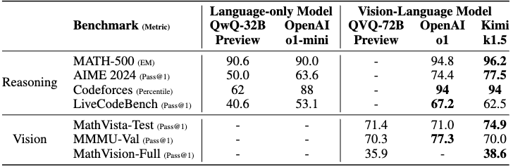
   <p>图14.21 Kimi-k1.5的长思维链结果</p>
</div>

其他有趣的结果：

<div align="center">
   
   <p>图14.22 Kimi-k1.5的长思维链结果</p>
</div>

#### 消融实验

<div align="center">
   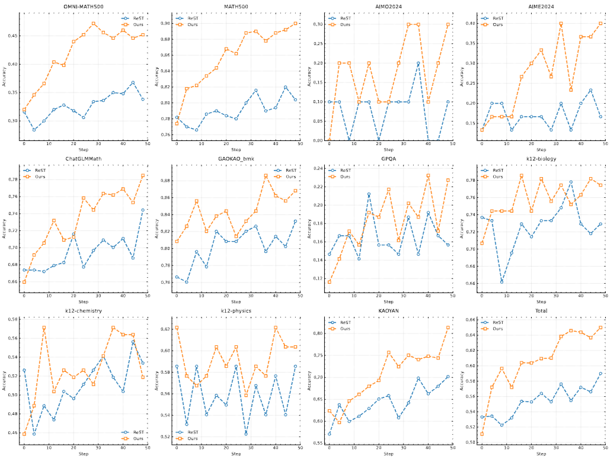
   <p>图14.22 和ReST用于策略梯度优化的比较</p>
</div>

> 注意，上述分数来自一个内部的 long-cot 模型，其模型尺寸远小于 k1.5 long-CoT 模型


### 14.3.3 Qwen 3：思维模式融合

Qwen3 家族最大型号的模型 Qwen3-235B-A22B 性能超过了 OpenAI-o1 和 Deepseek-R1，哪怕是 Qwen3-32B 也与 o1 性能相当。

<div align="center">
   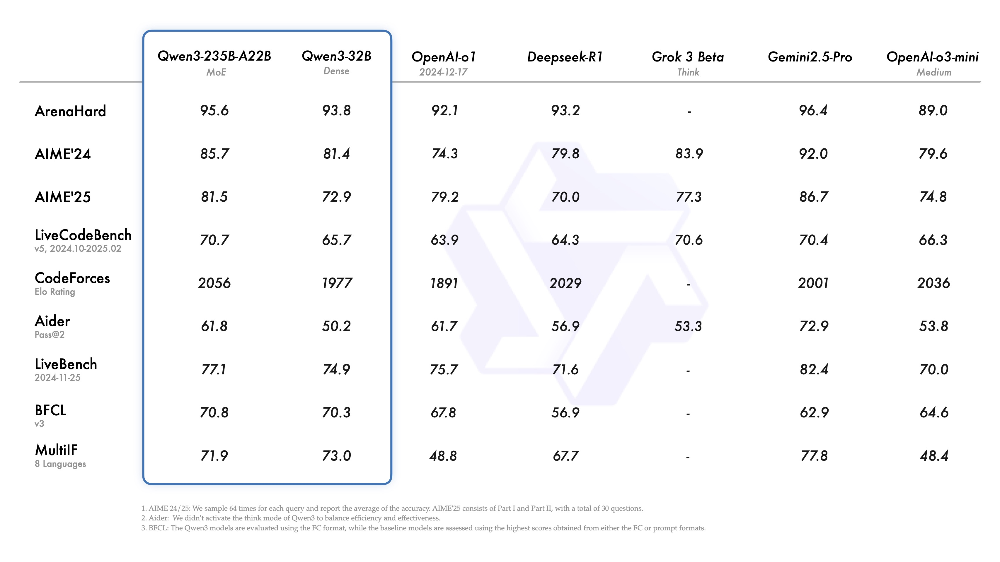
   <p>图14.24 Qwen3和其他模型的性能比较</p>
</div>

Qwen3 的后训练流程精心设计了两个核心目标：

<div align="center">
   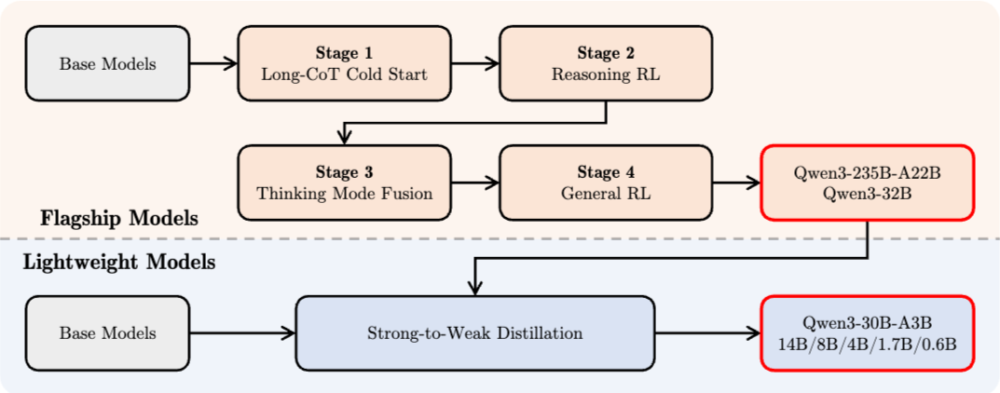
   <p>图14.25 Qwen3系列模型的后训练管道</p>
</div>

- **思考控制**：这涉及两种不同模式的集成，即“非思考”模式和“思考”模式，使用户能够灵活选择模型是否进行推理，并通过指定思考过程的 token 预算来控制思考的深度
- **强到弱蒸馏**：这旨在简化和优化轻量级模型的训练后流程。 通过利用大型模型的知识，大大降低了构建小型模型所需的计算成本和开发工作量。

#### SFT + 推理强化学习 

我们现在都知道这个套路了，Qwen 也用了很多。 

- 按难度过滤（通过 best-of-n，例如 kimi） 
    - 移除模型在没有 CoT 的情况下就能正确回答的问题 
    - 移除与验证数据过于相似的内容 
- 手动过滤 CoT 的质量（猜测 vs 正确回答） 
- 使用 GRPO 在仅 3995 个示例上进行强化学习

#### Qwen 3 特有的新内容

思考模式融合——控制 CoT 的长度。

1.混合带标签的非思考和思考数据

<div align="center">
   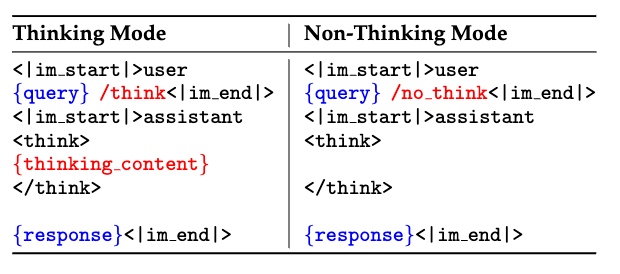
   <p>图14.26 思考模式融合阶段的SFT数据示例</p>
</div>

2. 通过特殊字符串的早停

思考模式融合的一个额外优势是，一旦模型学会以非思考和思考模式进行响应，它自然会发展出处理中间情况的能力——根据不完整的思考生成响应。 这种能力为实现模型思考过程的预算控制奠定了基础。 具体来说，当模型的思考长度达到用户定义的阈值时，我们手动停止思考过程并插入停止思考指令：“考虑到用户的时间有限，我必须直接根据思考给出解决方案。\n</think>.\n\n”。 插入此指令后，模型将根据其迄今为止积累的推理生成最终响应。 值得注意的是，这种能力并非显式训练，而是通过应用思考模式融合自然产生的。

#### 测试时间扩展（Test time scaling，TTS）

这张图表展示了在不同基准测试（AIME'24, AIME'25, LiveCodeBench (v5), GPQA Diamond）上，两种模式（“思考模式”和“非思考模式”）下的模型性能（Pass@1）如何随“思考预算”（Thinking Budget，以K tokens为单位）的变化而变化。

<div align="center">
   
   <p>图14.27 Qwen3-235B-A22B随thinking budget的性能表现</p>
</div>

#### 不同阶段的组成 

下图展示了 Qwen3-32B 模型在不同后训练阶段（Post-training）的性能变化：

<div align="center">
   
   <p>图14.27 Qwen3-32B在不同阶段的性能</p>
</div>

需要注意的是，以通用为目的的 RLHF 对数学/STEM 能力会略有下降。


Qwen 3 提出了 **Thinking Mode Fusion**，试图在一个模型中融合“思考”与“不思考”两种模式：
*   **训练**: 混合使用带 `<think>` 的数据和直接输出答案的数据。
*   **效果**: 用户可以通过 Prompt 控制模型是否进行长推理。
*   **测试时计算 (Test-time Compute)**: 可以在推理阶段通过截断 `<think>` 过程来动态调整计算量和性能的平衡。

