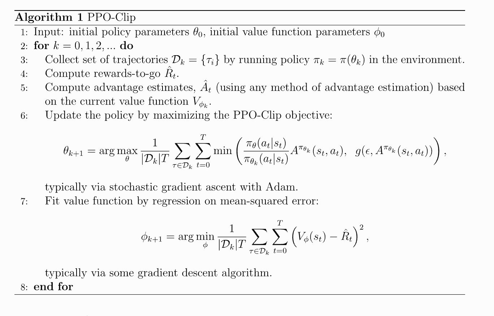
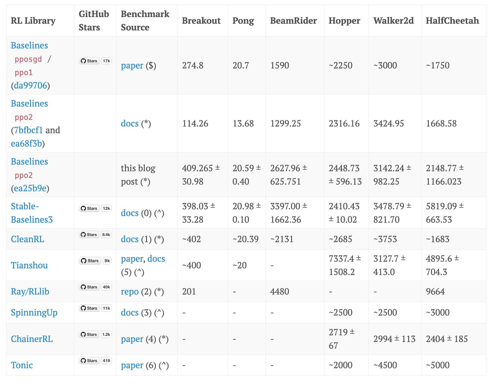
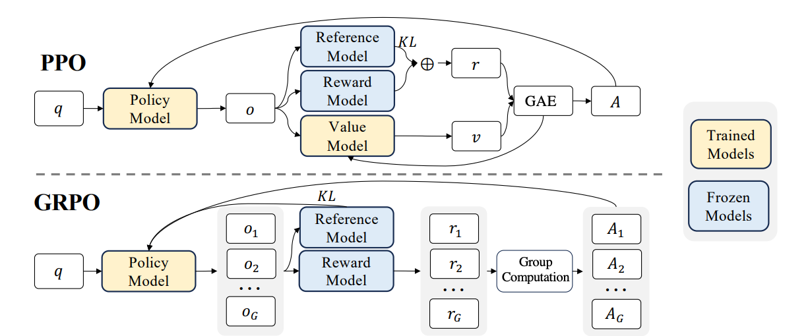
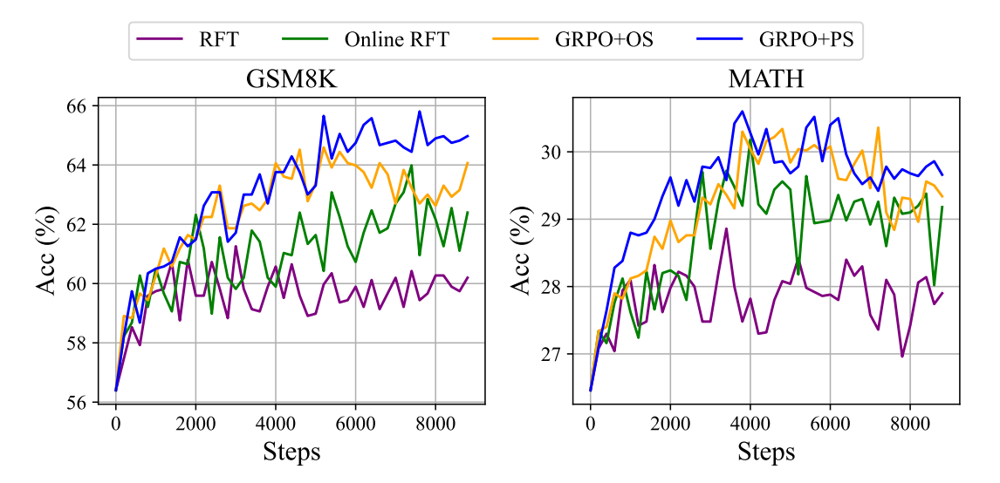

# 第十四章：可验证奖励的强化学习 (RLVR)

在之前的课程中，我们讨论了 RLHF（基于人类反馈的强化学习）。虽然 RLHF 是使模型遵循指令的关键，但它面临着巨大的扩展性挑战：人类反馈昂贵、缓慢且容易被“过度优化”（Goodhart's Law）。

本章我们将目光转向 **o1** 和 **DeepSeek R1** 等推理模型背后的核心技术——**RLVR (Reinforcement Learning from Verifiable Rewards)**。

**核心目标：**
1.  **算法演进**：理解从 PPO 到 GRPO 的演变逻辑，以及为什么 GRPO 更适合大模型推理训练。
2.  **工程实现**：深入 PPO 和 GRPO 的代码实现细节，掌握 Advantage 计算与 Loss 设计。
3.  **前沿案例**：解构 DeepSeek R1、Kimi k1.5 和 Qwen 3 的训练流水线，理解“冷启动数据”、“思维链（CoT）”与“长度控制”的关键作用。

---

## 14.1 为什么需要 RLVR？

在 AlphaGo 或 AlphaFold 等领域，强化学习取得了巨大成功，因为它们拥有**完美的模拟器**和**明确的奖励函数**（赢/输，蛋白质折叠能级）。

在语言模型中，如果我们能找到类似的领域——**答案客观、可验证**（如数学题、代码生成），我们就能利用大规模的计算资源来替代昂贵的人类标注，通过强化学习让模型自我进化。这就是 RLVR 的核心愿景。

### 14.1.1 RLHF 的困境

传统的 RLHF 依赖人类对模型输出的成对偏好判断（如 “A 比 B 好”）。然而，这种方法存在三大根本性问题：

- 奖励噪声高：人类判断主观、不一致，且易被表面修辞迷惑；
- 难以规模化：高质量偏好数据标注成本极高，无法支撑万亿 token 级训练；
- 过优化（Over-optimization）：模型学会“讨好”奖励模型，生成看似合理但内容空洞、冗长甚至幻觉的输出。

> RLHF 优化的是代理目标（人类偏好），而非真实目标（任务正确性）。


### 14.1.2 成功案例的启示

回顾 AlphaGo、AlphaFold 等 RL 成功案例，其共同点是：**奖励函数是明确、可验证、可自动计算的**。例如：
- 围棋：最终是否获胜（0/1）；
- 蛋白质折叠：预测蛋白质结构与真实结构的 RMSD（Root Mean Square Deviation，均方根偏差） 距离。

这类任务中，RL 算法可直接优化**真实目标**，无需人类中介。这启发我们：**能否将 RL 引入语言模型的“可验证任务”中？**

### 14.1.3 RLVR 的定位

RLVR 聚焦于一类特殊任务：**输出可被程序自动判分**。典型场景包括：
- **数学推理**：答案是否与标准解一致（如 GSM8K、MATH）；
- **代码生成**：生成的程序是否通过所有测试用例；
- **形式化证明**：证明步骤是否逻辑自洽。

在这些场景中，奖励函数 $R(z)$ 可定义为：

$$
R(z) = 
\begin{cases}
1 & \text{若 } z \text{ 正确} \\
0 & \text{否则}
\end{cases}
$$

或更精细的**过程奖励**（如每步推理得分）。这种**高信噪比、可规模化**的奖励，正是 RL 大展身手的舞台。

> ✅ **RLVR 的本质**：在那些“对错可被自动判定”的窄域任务中，绕过人类偏好，直接用形式化验证机制提供强化学习的奖励信号，从而实现更可靠、可扩展、可验证的智能体训练

下面是对 RLHF 和 RLVR 的简单对比：

| 维度 | RLHF | RLVR |
|------|------|------|
| 奖励来源 | 人类偏好（如 ranking） | 自动验证（如测试、证明、规则） |
| 任务领域 | 通用、开放域（如聊天） | 窄域、结构化（如编程、数学） |
| 奖励质量 | 主观、有噪声、成本高 | 客观、精确、可扩展 |
| 对齐目标 | “让人觉得好” | “在形式意义上正确” |


---

## 14.2 算法演进：从 PPO 到 GRPO

要理解现在的 DeepSeek-R1 等推理模型背后的 GRPO 算法，我们必须先回顾它的前身 PPO，并明白为什么要抛弃它。

### 14.2.1 PPO

#### 强化学习中策略优化方法的发展脉络

从原始的策略梯度（Policy Gradient） → 到更稳定的TRPO（Trust Region Policy Optimization） → 再到更实用的PPO（Proximal Policy Optimization）

在强化学习中，我们有一个**策略**（policy）$\pi_\theta(a|s)$，它用参数 $\theta$ 控制智能体如何根据状态 $s$ 选择动作 $a$。  
目标是：**最大化期望回报**（expected return）：

$$
J(\theta) = \mathbb{E}_{\tau \sim \pi_\theta} \left[ R(\tau) \right]
$$

其中 $\tau = (s_1, a_1, s_2, a_2, ..., s_T)$ 是一条轨迹（trajectory）， $R(\tau)$ 是总奖励。

我们需要计算 $\nabla_\theta J(\theta)$ 来用梯度上升更新 $\theta$。


🔹 尝试 1: 策略梯度（Policy Gradient）

利用**似然比技巧**（likelihood ratio trick），可以推出：

$$
\nabla_\theta J(\theta) = \mathbb{E}_{\tau \sim \pi_\theta} \left[ R(\tau) \nabla_\theta \log \pi_\theta(\tau) \right]
$$

而 $\pi_\theta(\tau) = p(s_1) \prod_{t=1}^T \pi_\theta(a_t|s_t) p(s_{t+1}|s_t, a_t)$ ，所以 $\nabla_\theta \log \pi_\theta(\tau) = \sum_{t=1}^T \nabla_\theta \log \pi_\theta(a_t|s_t)$

于是得到**REINFORCE**算法（最基础的策略梯度）：

$$
\nabla_\theta J(\theta) = \mathbb{E}_{\tau \sim \pi_\theta} \left[ \left( \sum_{t=1}^T R_t \right) \sum_{t=1}^T \nabla_\theta \log \pi_\theta(a_t|s_t) \right]
$$

其中 $R_t = \sum_{k=t}^T \gamma^{k-t} r_k$ 是从时间 $t$ 开始的折扣回报。

策略梯度存在哪些问题：
- **高方差（high variance）**：因为整个轨迹的总奖励 $R(\tau)$ 被用作每个动作的“信号”，但很多动作其实和最终结果无关。
- **更新不稳定**：一次更新可能太大，导致策略崩溃（“catastrophic collapse”）。

> ✅ 所以策略梯度**理论上正确，但实践中难用**。

🔹 尝试 2: TRPO（Trust Region Policy Optimization）

核心思想：不要直接用原始梯度更新，而是**每次只允许策略变动一点点**，确保新策略 $\pi_{\theta_{\text{new}}}$ 和旧策略 $\pi_{\theta_{\text{old}}}$ 足够接近。

具体做法：解一个**带约束的优化问题**：

$$
\max_\theta \quad \mathbb{E}_{s,a \sim \pi_{\theta_{\text{old}}}} \left[ \frac{\pi_\theta(a|s)}{\pi_{\theta_{\text{old}}}(a|s)} A^{\pi_{\text{old}}}(s,a) \right] \\
\text{subject to} \quad \mathbb{E}_s \left[ D_{\text{KL}} \left( \pi_{\theta_{\text{old}}}(\cdot|s) \,\|\, \pi_\theta(\cdot|s) \right) \right] \leq \delta
$$

- 这个目标是**近似**策略改进（使用重要性采样 + 优势函数 $A$）
- 约束项限制 KL 散度不超过一个小常数 $\delta$


TRPO 特点：
- ✅ 稳定，理论保证单调改进
- ❌ 实现极其复杂：需要用共轭梯度（conjugate gradient）或二阶优化，难以扩展到大模型（如 LLM）

> 所以 TRPO 是“理想但笨重”的方法。


🔹 尝试 3: PPO（Proximal Policy Optimization）

动机：能不能**用一个简单的方法，近似 TRPO 的“小步更新”思想**，而不用解复杂的约束优化？

PPO 的核心创新：**裁剪概率比（Clipped Probability Ratio）**

定义**概率比**（likelihood ratio）：

$$
r_t(\theta) = \frac{\pi_\theta(a_t|s_t)}{\pi_{\theta_{\text{old}}}(a_t|s_t)}
$$

在 TRPO 中，我们希望 $r_t(\theta) \approx 1$（即新旧策略输出概率接近）。

PPO 的想法是：**如果 $r_t(\theta)$ 太大或太小，就把它“裁剪”掉**！

于是提出**裁剪目标函数**（Clipped Surrogate Objective）：

$$
L^{\text{CLIP}}(\theta) = \mathbb{E}_t \left[ \min\left( r_t(\theta) A_t, \ \text{clip}(r_t(\theta), 1-\epsilon, 1+\epsilon) \cdot A_t \right) \right]
$$

直观解释：
- 如果 $A_t > 0$（这个动作好）：
  - 我们希望增大 $\pi_\theta(a_t|s_t)$，即让 $r_t > 1$
  - 但如果 $r_t > 1+\epsilon$，说明更新太大 → 裁剪掉，只取 $1+\epsilon$
- 如果 $A_t < 0$（这个动作差）：
  - 我们希望减小 $\pi_\theta(a_t|s_t)$，即让 $r_t < 1$
  - 但如果 $r_t < 1-\epsilon$，说明惩罚太猛 → 裁剪为 $1-\epsilon$

> 🎯 这样，PPO **自动限制了策略更新的步长**，无需显式 KL 约束！


🔁 三者关系总结

| 方法 | 核心思想 | 是否约束更新步长？ | 实现难度 | 适合 LLM 吗？ |
|------|--------|------------------|--------|-------------|
| **Policy Gradient** | 直接梯度上升 | ❌ 否 | 简单 | ❌（方差大） |
| **TRPO** | 用 KL 散度约束更新 | ✅ 是（硬约束） | 极难 | ❌（内存/计算高） |
| **PPO** | 用裁剪近似小步更新 | ✅ 是（软约束） | 中等 | ✅（主流选择） |


####  PPO 的痛点

当我们看 OPANAI 关于 [PPO](https://spinningup.openai.com/en/latest/algorithms/ppo.html) 算法的文档，他看起来很简单：

<div align="center">
   
   <p>图14.1 ppo算法伪代码
</p>
 </div>


但在实践上，PPO 的理论和实现完全是两回事。PPO 理论简洁，但实际调参和实现陷阱极多（如价值函数训练、优势估计、KL 控制、奖励归一化等），有篇博客甚至列出了[37个PPO实现细节](https://iclr-blog-track.github.io/2022/03/25/ppo-implementation-details/)，发现不同的 PPO 变体在 RL 的 benchmarks 表现出了不同的得分。

<div align="center">
   
   <p>图14.2 ppo实现细节对性能的影响.png

</p>
 </div>

而且还有一篇论文，专门探讨为什么细节对于 PPO 如此重要，请参考 [Implementation Matters in Deep Policy Gradients: A Case Study on PPO and TRPO](https://arxiv.org/abs/2005.12729)。以及如果你真的把他们搞砸了，甚至没有正确计算策略梯度，但效果反而更好。如果你去看 PPO 的实现细节，会发现情况非常复杂，所以我们确实需要通过代码看下 PPO 的具体实现：

参考 [alpaca_farm 中关于 PPO 的实现](https://github.com/tatsu-lab/alpaca_farm/blob/30717ddae735365de756ee2085191b491a71788d/src/alpaca_farm/rl/ppo_trainer.py)，该实现遵循典型的 on-policy RL 循环，实现了 PPO 算法在 语言模型（LLM） 上的完整训练循环，包含：

- Rollout（采样）：用当前策略生成 responses
- 奖励计算与塑形（Reward Shaping）：结合任务奖励 + KL 惩罚
- 优势估计（GAE）
- 损失计算（Policy + Value Loss with Clipping）：用 PPO 损失函数优化策略（Actor）和价值网络（Critic）
- 日志记录与模型保存

**奖励塑形（Reward Shaping）：** 将稀疏的任务奖励（只在序列末尾）与密集的KL 惩罚（每个 token）结合起来，形成可训练的 reward signal

```
def _shape_reward(self, rewards, responses, logprobs, ref_logprobs):
    # 计算 KL 散度：用 (logp - ref_logp) 的正值部分（即新策略比参考策略更“自信”才惩罚）
    kl = torch.clamp(logprobs - ref_logprobs, min=0.0)

    # 非任务奖励 = -β * KL（β 由 self.kl_ctl 控制，可动态调整）
    non_score_rewards = -self.kl_ctl.value * kl

    # 初始化塑形奖励：先填入 KL 惩罚（每个 token 都有）
    shaped_rewards = non_score_rewards.clone()

    # 找到每个序列的最后一个非 padding token 的位置（即 EOS 或真实结尾）
    terminal_positions = (responses != self.tokenizer.pad_token_id).sum(dim=1) - 1

    # 在最后一个 token 处加上任务奖励（如数学题是否答对）
    shaped_rewards[list(range(rewards.size(0))), terminal_positions] += rewards

    return dict(shaped_rewards=shaped_rewards, non_score_rewards=non_score_rewards, kl=kl)
```


**广义优势估计（GAE）：** 用 GAE 估计每个 token 的优势函数（Advantage），替代原始奖励，大幅降低策略梯度方差。

```
def _estimate_advantage(self, rewards, values):
    if self.args.whiten_rewards:
        rewards = torch_ops.whiten(rewards, shift_mean=False)  # 奖励标准化（可选）

    lastgaelam = 0
    advantages_reversed = []
    gen_length = self.args.response_len  # 生成长度（如 128）

    # 从后往前计算 GAE（反向遍历 token）
    for t in reversed(range(gen_length)):
        nextvalues = values[:, t + 1] if t < gen_length - 1 else 0.0
        # TD error: δ_t = r_t + γ * V(s_{t+1}) - V(s_t)
        delta = rewards[:, t] + self.args.gamma * nextvalues - values[:, t]
        # GAE: A_t = δ_t + γλ A_{t+1}
        lastgaelam = delta + self.args.gamma * self.args.lam * lastgaelam
        advantages_reversed.append(lastgaelam)

    advantages = torch.stack(advantages_reversed[::-1], dim=1)  # 反转回正常顺序
    returns = advantages + values  # Q(s,a) ≈ A(s,a) + V(s)

    # 优势函数标准化（减均值、除标准差）→ 降低方差
    advantages = torch_ops.whiten(advantages, shift_mean=True)

    return dict(returns=returns, advantages=advantages)
```

**rollout（采样轨迹）：** 完成一次完整的 采样 → 评估 → 奖励计算 → 优势估计 流程，为后续 PPO 更新准备数据

```
@torch.inference_mode()
def rollout(self, queries_data):
    self.policy.eval()
    unwrapped_policy = self.accelerator.unwrap_model(self.policy, keep_fp32_wrapper=True)
    self.ref_policy.eval()
    self.reward_model.eval()

    rollouts = []
    for batch in tqdm.tqdm(queries_data, desc="rollout"):
        # 1. 从当前策略生成 responses
        queries, masks = batch['queries'], batch['query_attn_masks']
        responses = unwrapped_policy.respond(queries, masks, temperature=...)  # 生成

        # 2. 用当前策略计算 logprobs 和 values（critic 输出）
        policy_outputs = self.policy(queries, masks, responses, ...)  # forward

        # 3. 用参考策略（SFT 模型）计算 ref_logprobs（用于 KL）
        ref_outputs = self.ref_policy(queries, masks, responses, ...)

        # 4. 将 response 转为文本，再用 reward tokenizer 重新 tokenize
        #    （因为 policy 和 reward model 的 tokenizer 可能不同）
        text_queries = decode(queries); text_responses = decode(responses)
        text_sequences = [q + r for q, r in zip(text_queries, text_responses)]
        sequences = reward_tokenizer(text_sequences, ...)  # 重新 tokenize

        # 5. 用 reward model 计算任务奖励
        reward_outputs = self.reward_model(**sequences)
        reward_outputs = self.post_reward(reward_outputs, responses)  # 处理未正常结束的序列

        # 6. 奖励塑形：加入 KL 惩罚
        shaped = self._shape_reward(rewards=reward_outputs['rewards'], ...)

        # 7. 保存所有数据到 rollouts
        rollouts_batch.update(policy_outputs, ref_outputs, reward_outputs, shaped)
        rollouts.append(rollouts_batch.cpu())

    # 合并所有 batch
    rollouts = common.merge_dict(rollouts, merge_fn=torch.cat)

    # 8. 统一计算 GAE（用整个 rollout 数据集，更稳定）
    advantages = self._estimate_advantage(
        rewards=rollouts["shaped_rewards"].to(device),
        values=rollouts["values"].to(device),
    )

    return {**rollouts, **advantages}
```

**PPO 损失计算：** 使用裁剪机制防止策略更新过大

```
def compute_loss(self, rollouts):
    # 提取旧策略数据（from rollout）
    values, old_logprob, returns, advantages, ... = rollouts

    # 用当前策略重新计算 logprobs 和 values
    outputs = self.policy(queries, masks, responses, ...)
    vpred = outputs["values"]      # 新的 value 预测
    logprob = outputs["logprobs"]  # 新的 log prob

    # --- Value Loss (Critic) ---
    # 裁剪 value 预测（类似 PPO 裁剪）
    vpredclipped = torch.clamp(vpred, values ± cliprange_value)
    vf_losses1 = (vpred - returns) ** 2
    vf_losses2 = (vpredclipped - returns) ** 2
    vf_loss = 0.5 * max(vf_losses1, vf_losses2).mean()  # PPO-style value loss

    # --- Policy Loss (Actor) ---
    ratio = exp(logprob - old_logprob)  # 新旧策略概率比
    pg_losses = -advantages * ratio
    pg_losses2 = -advantages * clip(ratio, 1-ε, 1+ε)
    pg_loss = max(pg_losses, pg_losses2).mean()  # PPO 裁剪目标

    # 总损失 = 策略损失 + vf_coef * 价值损失
    loss = pg_loss + self.args.vf_coef * vf_loss

    # 记录统计量
    approxkl = 0.5 * (logprob - old_logprob)^2 的均值
    entropy = outputs["entropies"].mean()

    return loss, stats
```


在语言模型的 PPO 训练过程中，一个健康、合理的训练曲线是什么样？


<div align="center">
   
   <p>图14.3 ppo训练过程曲线</p>
 </div>

- Increasing overall rewards：总奖励上升。`kl_sum_seq` 这个名字有点误导性，它实际上代表的是每个序列的塑形奖励（shaped rewards）的总和，这个“塑形奖励” = 任务奖励（如数学题答对得高分） + KL惩罚项（负值），衡量模型的整体表现是否在变好。
- Incl. reward model： 任务奖励上升。这个指标衡量的是模型直接从奖励模型那里获得的任务奖励，不包括KL惩罚。它反映了模型在核心任务上的表现，比如回答问题的准确性、遵循指令的能力等。
- Negative KL rewards： 负的KL奖励。这个指标就是 KL 惩罚项，也就是前面提到的 -β * KL。说明模型确实在探索和改进，但没有失控。这是PPO算法“近端”思想的体现——允许一定程度的偏离，但限制其幅度。

这三条曲线共同描绘了一个健康的PPO训练过程：模型在奖励模型的引导下，逐步学会生成更好的回复，同时通过KL惩罚保持一定的稳定性，避免过度偏离初始的良好行为。

### 14.2.2 为什么我们需要另一个强化学习（RL）算法？

**1. 为什么不直接用 PPO？**
PPO 是目前最成功的在线强化学习算法之一，尤其在语言模型的对齐（Alignment）中被广泛应用。但它有两个主要缺点：

- **实现复杂 (complicated implementation)**：PPO 不是一个简单的“开箱即用”的算法。它包含多个复杂的组件，如：**Rollout 采样**、**奖励塑形**、 **优势估计**、**损失计算**等。这些步骤需要精心设计和调试，对于新手或追求快速迭代的研究者来说，门槛很高。

- **价值模型 (Value model) 的负担**：PPO 需要一个额外的 **价值网络（Value Model）** 来估计状态的价值（`V(s)`），从而计算优势函数（`A = Q - V`）。
    - **内存消耗大 (memory hungry)**：价值网络与策略网络共享主干结构，但需要额外的参数和计算资源。
    - **额外的调参 (additional tuning)**：价值网络本身也需要训练和优化，这增加了整个系统的复杂性和超参数搜索空间。你需要同时调优策略网络和价值网络，确保它们协同工作。

> ✅ **总结**：PPO 虽然强大且有效，但其**工程复杂度高、资源消耗大、调参困难**，尤其是在低资源或追求高效开发的场景下，显得不够轻便。

**2. 为什么不直接用 DPO？**

DPO（Direct Preference Optimization）是近年来兴起的一种替代方案，它绕过了传统的强化学习框架，直接从人类偏好数据中进行优化。但其也存在以下限制：

- **数据形式不匹配 (Data not inherently pairwise)**：DPO 的核心思想是基于**成对比较（pairwise comparisons）** 数据，即给定一个提示（prompt），有两个不同的回复（response A 和 response B），并标注哪个更好。然而，在许多实际应用场景中，我们拥有的数据并非天然就是成对的。例如，在“可验证奖励”（Verifiable Rewards）领域，数据通常是单个序列加上一个客观的分数（如数学题答对得1分，答错得0分）。这种**标量奖励信号**无法直接用于 DPO。

- **离线算法 (Offline)**：DPO 是一种**离线算法**。它在固定的、预先收集好的偏好数据集上进行一次性训练。这与 PPO 的**在线学习**特性不同。PPO 可以在训练过程中不断生成新的样本、获得新的反馈，并据此迭代更新策略。DPO “理论上可以通过迭代使其在线化”，但这会增加复杂性，失去了其作为简单离线方法的优势。

> ✅ **总结**：DPO 在处理**人类偏好数据**时非常优雅和高效，但它**不适用于非成对的、可验证的标量奖励场景**，并且其离线特性限制了它在需要持续探索和在线学习任务中的应用。


### 14.2.3 GRPO：去掉了价值函数的 PPO

**GRPO (Group Relative Policy Optimization)** 是在 [DeepSeekMath](https://arxiv.org/pdf/2402.03300) 论文中提出并在 [Deepseek-R1](https://arxiv.org/abs/2501.12948) 中发扬光大的算法。GRPO 在 PPO 的基础上，移除了价值函数（Value Function）和优势计算（Advantage Computation）。这是对 PPO 最大的改动，也是其轻量化的根本原因。并且采用了一种全新的方式来估算“优势”——即 “组内 z-score”（z-score within group）。

<div align="center">
   
   <p>图14.4 PPO与GRPO的对比</p>
 </div>

> ✅ 简单来说，GRPO = PPO - Value Model + Group Z-Score Advantage。


#### GRPO 的目标函数

$$
\mathcal{J}_{GRPO}(\theta) = \mathbb{E} \left[ q \sim P(Q), \{o_i\}_{i=1}^G \sim \pi_{\theta_{old}}(O|q) \right] \frac{1}{G} \sum_{i=1}^{G} \left( \min\left( \frac{\pi_\theta(o_i|q)}{\pi_{\theta_{old}}(o_i|q)} A_i, \text{clip}\left( \frac{\pi_\theta(o_i|q)}{\pi_{\theta_{old}}(o_i|q)}, 1-\epsilon, 1+\epsilon \right) A_i \right) - \beta \mathbb{D}_{KL} \left( \pi_\theta || \pi_{ref} \right) \right)
$$

- `min(...)`部分：是 PPO 的经典裁剪目标函数，用于更新策略 $π_θ$。
    - $\frac{\pi_\theta(o_i|q)}{\pi_{\theta_{old}}(o_i|q)}$ 是新旧策略的概率比。
    - $A_i$ 是第 $i$ 个输出 $o_i$ 的“优势”，这是 GRPO 最大的创新点。
    - `clip(...)` 是 PPO 的裁剪机制，防止策略更新过大。
- $-β D_KL(...)$ 部分：这是 KL 散度惩罚项，用于防止新策略 `π_θ` 偏离参考策略 `π_ref` 太远，保证生成结果的稳定性。
    - `β` 是控制 KL 惩罚强度的超参数。

PPO 的目标函数：
$$
\min \left( \frac{\pi_\theta(a|s)}{\pi_{\theta_k}(a|s)} A^{\pi_{\theta_k}}(s,a), \text{ clip} \left( \frac{\pi_\theta(a|s)}{\pi_{\theta_k}(a|s)}, 1-\epsilon, 1+\epsilon \right) A^{\pi_{\theta_k}}(s,a) \right)
$$

GRPO 与 PPO 两者的目标函数结构非常相似，都包含概率比和裁剪。核心区别在于 `A` 的来源：
- **PPO**: `A` 是通过价值网络 `V(s)` 和 GAE 计算出来的，这是一个复杂且资源密集的过程。
- **GRPO**: `A` 是通过组内 z-score 计算出来的，这是一个简单、快速、无需额外模型的过程。


#### KL 散度的计算

$$
\mathbb{D}_{KL} \left( \pi_\theta || \pi_{ref} \right) = \frac{\pi_{ref}(o_i|q)}{\pi_\theta(o_i|q)} - \log \frac{\pi_{ref}(o_i|q)}{\pi_\theta(o_i|q)} - 1
$$

这是一个近似的 KL 散度公式。它不是标准的积分形式，而是在每个采样点 $o_i$ 上进行近似。它的作用是衡量当前策略 $π_θ$ 和参考策略 $π_{ref}$ 在生成特定输出 $o_i$ 时的概率差异。

#### 组内 z-score 优势

$$
A_i = \frac{r_i - \text{mean}(\{r_1, r_2, \cdots, r_G\})}{\text{std}(\{r_1, r_2, \cdots, r_G\})}
$$

这是 GRPO 的灵魂所在！它完全抛弃了 PPO 中复杂的 GAE 计算。

**如何计算？**
- 对于每一个问题 $q$，从旧策略 $π_{old}$ 中**采样一组（G个）不同的回复** ${o_1, o_2, ..., o_G}$。
- 用奖励模型或可验证规则，为这 G 个回复**分别打分**，得到一组奖励 ${r_1, r_2, ..., r_G}$。
- 计算这组奖励的**均值（mean）和标准差（std）**。
- 将每个回复 $o_i$ 的奖励 $r_i$ 减去均值，再除以标准差，得到它的 $A_i$。

**为什么叫 “z-score”？**

在统计学中，z-score 表示一个数据点距离平均值有多少个标准差。这里，$A_i$ 表示回复 $o_i$ 的奖励在本组中的“相对优劣程度”。如果 $A_i > 0$，说明这个回复比组内平均水平好；如果 $A_i < 0$，则说明它比平均水平差。

**为什么有效？**

- **简单高效**：不需要训练额外的价值网络，也不需要复杂的 GAE 计算。
- **自归一化**：通过组内比较，自动消除了不同问题之间奖励尺度不一致的问题。例如，一个数学题可能最高得10分，另一个可能最高得5分，但它们在同一组内比较时，z-score 能公平地反映相对好坏。
- **适用于可验证奖励**：对于一个数学题，你可以让模型生成多个答案，然后用程序自动判断每个答案是否正确（得分为1或0），再用 z-score 来区分哪个答案“更好”。

> 在在线学习（边采样边更新）的场景下，GRPO 本质上就是一种使用了组内标准化奖励的策略梯度方法。


#### 💻 代码解读：一个极简的 GRPO 实现

GRPO 的实现非常简单，不需要复杂的 GAE 计算。下面我们基于 [nano-aha-moment](https://github.com/McGill-NLP/nano-aha-moment/blob/main/nano_r1_script.py) 项目中对于 GRPO 算法的实现，对关键代码进行分析。如下compute_pg_loss 是一个典型的 GRPO 损失计算函数：

```python
def compute_pg_loss(
    policy_model: Union[DeepSpeedEngine, PreTrainedModel], # 当前要训练的语言模型
    batch: Dict[str, torch.Tensor], # 一个包含训练数据的字典
    total_response_len: torch.Tensor, # 一个包含训练数据的字典
    TEMPERATURE: float, # 生成时的温度参数（影响 log-prob 计算）
    KL_COEFFICIENT: float, # 控制 KL 惩罚强度的超参数
) -> Tuple[torch.Tensor, Dict[str, float]]:
    """
    Compute the policy gradient loss with KL penalty between policy and reference models.

    This function:
    1. Calculates KL divergence penalty between the models
    2. Computes policy gradient loss using advantages
    3. Combines the losses with KL coefficient

    Args:
        policy_model: The model being trained
        batch: Dictionary containing:
            - input_ids: Tensor of shape [batch_size, seq_len]
            - attention_mask: Tensor of shape [batch_size, seq_len]
            - labels: Tensor of shape [batch_size, seq_len] with -100 for ignored positions
            - advantages: Tensor of shape [batch_size, seq_len]
            - ref_log_probs: Tensor of shape [batch_size, seq_len-1]
        total_response_len: Total number of valid tokens in the batch. This is a scalar tensor.

    Returns:
        Tuple containing:
            - loss: Combined policy gradient and KL penalty loss (scalar tensor)
            - metrics: Dictionary with detailed loss components:
                - policy_loss: Pure policy gradient loss
                - kl_penalty: KL divergence penalty
                - entropy: Policy entropy
    """

    # 1. 从 batch 中提取关键张量
    input_ids = batch["input_ids"]  # [batch_size, seq_len]，完整序列（prompt + response）
    attention_mask = batch["attention_mask"]  # [batch_size, seq_len]，指示有效 token
    labels = batch["labels"]  # [batch_size, seq_len]，通常与 input_ids 相同或右移一位
    labels_mask = batch["labels_mask"]  # [batch_size, seq_len]，1 表示该位置是 response token，0 表示 prompt 或 padding
    advantages = batch["advantages"]  # [batch_size, seq_len]，每个 token 的“优势”值（来自组内归一化）
    ref_logps = batch["ref_log_probs"]  # [batch_size, seq_len-1]，参考模型在 response token 上的 log-prob（长度比 input_ids 少 1）

    # 2. 构建模型输入
    model_inputs = {
        "input_ids": input_ids,
        "attention_mask": attention_mask,
        "labels": labels,
        "labels_mask": labels_mask,
    }

    # 3. 计算当前策略的 token log-probabilities
    logps = compute_token_log_probs(policy_model, model_inputs, TEMPERATURE)  # 让 policy_model 对 input_ids 做前向传播，得到每个 token 的 log-probability，输出形状是 [batch_size, seq_len-1]，因为模型预测的是 input_ids[1:]

    # 4. 对齐 mask 并计算 KL 惩罚项
    labels_mask = labels_mask[..., 1:].to(logps.dtype)  # 将 labels_mask 也右移一位，与 logps 对齐，只保留 response token 的 mask，输出形状是 [batch_size, seq_len-1]，
    
    # 直接计算 KL 需要对整个词汇表求和（sum(p * log(p/q))），计算量极大。使用了 Bregman divergence 的一种近似，而这个近似只依赖于 logps 和 ref_logps（即 token-level 的 log-prob），非常高效。
    ref_logratio = ref_logps - logps
    kl_penalty = torch.exp(ref_logratio) - 1 - ref_logratio  # [batch_size, seq_len-1]
    kl_penalty = kl_penalty * labels_mask  # [batch_size, seq_len-1]，只对 response token 计算 KL 惩罚，忽略 prompt

    # 5. 计算辅助统计量（不参与梯度）
    with torch.no_grad():
        entropy = -logps.sum() / labels_mask.sum()  # scalar
        zero_advantages = close_to_zero(advantages[..., 1:], labels_mask)  # scalar

    # 6. 计算策略梯度损失
    policy_loss = -logps * advantages[..., 1:]  # [batch_size, seq_len-1]，advantages[..., 1:]取 advantage 从第 2 个 token 开始，与 logps 对齐
    policy_loss = policy_loss * labels_mask  # [batch_size, seq_len-1]

    # 7. 组合总损失并归一化
    loss = (policy_loss + KL_COEFFICIENT * kl_penalty).sum() / total_response_len  # 将策略损失和 KL 惩罚加权求和，除以 total_response_len，将总损失归一化为每个有效 token 的平均损失，使 loss 值在不同 batch size 下可比。

    # 8. 构建返回的指标字典
    metrics = {
        "policy_loss": policy_loss.sum().item() / total_response_len.item(),
        "kl_penalty": kl_penalty.sum().item() / total_response_len.item(),
        "entropy": entropy.item() / total_response_len.item(),
        "zero_advantages_ratio": zero_advantages.item() / total_response_len.item(),
    }

    return loss, metrics

```

在 GRPO 中，优势（Advantage）的计算过程极其简单，其核心就是“组内 z-score 归一化”，并且为了数值稳定，添加了一个微小的常数 1e-4。下面使其实现代码：

```python
# 1. 数据校验与分组

assert len(all_generations) == len(all_finish_reasons) # all_generations 是模型生成的所有回复，all_finish_reasons 是每个回复的结束原因（如 "stop" 或 "length"），samples 是原始输入样本
assert len(all_generations) == len(samples) * GENERATIONS_PER_SAMPLE # GENERATIONS_PER_SAMPLE 是一个超参数，表示对每个输入样本 sample，要生成多少个不同的回复（例如 3 个）。所以总回复数 = 样本数 × 每样本生成数。

# 将所有生成的回复按样本分组。例如，如果 GENERATIONS_PER_SAMPLE=3，那么 groups = [[0,1,2], [3,4,5], ...]，其中 [0,1,2] 对应第一个样本生成的三个回复
groups = [
    list(range(i, i + GENERATIONS_PER_SAMPLE)) for i in range(0, len(all_generations), GENERATIONS_PER_SAMPLE)
]

# 2. 初始化存储变量

all_query_token_ids, all_responses_token_ids, all_samples, all_rewards = [], [], [], []
stats = { "response_lengths": [], "rewards": [], "non_stop_rate": [], }

# 3. 核心循环：对每个样本及其生成的回复组进行处理
# 对于当前样本 sample，获取它对应的 group_indices（如 [0,1,2]），然后提取出该组的结束原因、token ID 和解码后的文本
for sample, group_indices in zip(samples, groups):
    finish_reasons = [all_finish_reasons[i] for i in group_indices]
    response_token_ids = [all_generations[i] for i in group_indices]
    responses = tokenizer.batch_decode(response_token_ids, skip_special_tokens=False)

    # 对组内的每一个回复 resp，调用 compute_reward 函数计算其奖励分数。compute_reward 是你自定义的函数，比如判断数学题是否答对、代码是否能运行等
    rewards_and_metrics = [compute_reward(resp, sample, EOS_TOKEN) for resp in responses]
    rewards, reward_metrics = zip(*rewards_and_metrics) # zip(*rewards_and_metrics) 将 (reward, metrics) 元组解包成两个列表：rewards 和 reward_metrics

    # 4. 关键步骤：计算组内归一化的“优势” (Advantages)
    rewards = np.array(rewards)
    advantages = (rewards - rewards.mean()) / (rewards.std() + 1e-4) # rewards - rewards.mean()：计算每个回复的奖励相对于组内平均值的偏差; 除以组内标准差，得到 z-score; 当组内所有奖励都相同时（标准差为 0），直接除以 0 会导致 NaN 错误。加上一个极小的常数 1e-4 可以避免这种情况，保证计算稳定

    # 将每个回复的标量优势值 resp_adv 扩展为一个序列，使其长度与回复的 token 数相同,目的是为了让优势信号可以与每个 token 的 log-probability 对齐，从而计算策略梯度损失
    per_token_advantages = [[adv] * len(resp) for adv, resp in zip(advantages, response_token_ids)]

    # 5. 收集最终数据并返回
    # 将当前组的数据（奖励、样本、token ID）追加到全局列表中，以便后续统一处理
    all_query_token_ids.extend([sample["input_ids"]] * GENERATIONS_PER_SAMPLE)
    all_responses_token_ids.extend(response_token_ids)
    all_advantages.extend(per_token_advantages)

    # 记录一些有用的统计信息，如平均奖励、未正常结束的比例、回复长度等
    stats["rewards"].extend(rewards)
    stats["non_stop_rate"].extend([fr != "stop" for fr in finish_reasons])
    stats["response_lengths"].extend([len(ids) for ids in response_token_ids])

    for rm in reward_metrics:
        for k, v in rm.items():
            stats.setdefault(f"reward_metrics/{k}", []).append(v)

# 将所有数据打包成一个字典 episodes 返回，供后续的 compute_pg_loss 函数使用
episodes = {
        "all_query_token_ids": all_query_token_ids,
        "all_response_token_ids": all_responses_token_ids,
        "all_advantages": all_advantages,
    }

    return episodes, stats
```

#### GRPO 的实际效果

GRPO 的实际效果如何呢？下图展示了在两个数学推理基准测试上的模型性能：

<div align="center">
   
   <p>图14.5 GRPO与其他训练方法在两个数学推理基准测试上的模型性能对比</p>
 </div>

左图 GSM8K 是一个小学数学应用题数据集，右图 MATH 这是一个更难的高中数学竞赛题数据集。Y轴是准确率（Acc %），X轴是训练步数（Steps）。图中有多条曲线，代表不同的训练方法：

- RFT (Reinforcing Fine-Tuning)：这是最基础的方法。它只奖励“正确答案”，而不考虑生成过程。可以理解为“只要结果对，不管过程”。在图中用紫色线表示。
- Online RFT：这是 RFT 的在线版本，可能意味着它在训练过程中会动态地采样和更新，而不是使用固定的数据集。在图中用绿色线表示。
- GRPO+OS (Group Relative Policy Optimization + Online Sampling)：这是标准的 GRPO 方法，即我们之前讨论的“组内 z-score 归一化”优势计算。在图中用橙色线表示。
- GRPO+PS (Group Relative Policy Optimization + Process Supervision)：这是在 GRPO 基础上，额外加入了“过程监督”（Process Supervision）。这意味着不仅奖励最终答案，还奖励正确的解题步骤。在图中用蓝色线表示。

从两张图中我们可以得出以下结论：

- GRPO 显著优于 RFT：无论是 GSM8K 还是 MATH，橙色线（GRPO+OS）和蓝色线（GRPO+PS）都明显高于紫色线（RFT）。这说明 GRPO 算法本身是有效的，它能帮助模型学习到更好的策略，从而获得更高的准确率。
- 过程监督（PS）带来额外增益：在大多数训练步数下，蓝色线（GRPO+PS）略高于橙色线（GRPO+OS）。这表明，如果能够提供关于“解题过程”的监督信号，模型的性能可以得到进一步提升。
- GRPO 的稳定性：相比于波动较大的 RFT 和 Online RFT 曲线，GRPO 的曲线相对更平滑，这反映了其算法设计的稳定性。


### 14.2.4 GRPO 的潜在缺陷：长度偏差 (Length Bias)

虽然 GRPO 效果拔群，但学术界（如 "Dr. GRPO" 论文）指出其数学上存在瑕疵：
1.  **有偏梯度**：除以标准差（std）使得它不再是一个无偏的梯度估计。它会过度放大那些“全对”或“全错”的简单/困难样本的权重（因为 std 很小）。
2.  **长度激励**：如果模型发现自己答错了（奖励为负），为了最大化 $A_i$，它会倾向于生成**极长**的废话（如果奖励未做长度归一化）。反之，如果答对了，它会倾向于极短的回答。

> **💡 顿悟时刻 (Aha Moment) 还是 长度偏置？**
> DeepSeek R1 报告中提到的“顿悟时刻”（模型在长思维链中自我纠错）令人兴奋。但也有研究指出，这种长思维链的出现，部分原因可能是 GRPO 的奖励机制无意中激励了模型输出更长的内容。

---


## 14.3 案例研究

### 14.3.1 DeepSeek R1

DeepSeek R1 的成功证明了**纯强化学习**在推理任务上的巨大潜力。

### 14.4.1 R1-Zero：纯粹的 RL
*   **设置**: 直接在 Base 模型（DeepSeek-V3）上运行 GRPO。
*   **奖励**:
    *   **准确性奖励**: 答案对不对？（通过规则匹配或编译器验证）。
    *   **格式奖励**: 强制模型使用 `<think>` 和 `</think>` 标签包裹思维过程。
*   **现象**:
    *   **Aha Moment (顿悟时刻)**: 模型在训练中期开始学会自我反思（Self-correction），例如“等等，我算错了，应该重新尝试...”。
    *   **语言混杂**: 由于没有语言一致性约束，模型会在思维链中混合使用中英文。

####  R1 正式版流水线
为了解决 R1-Zero 的可读性问题并提升性能，R1 采用了多阶段训练：
1.  **冷启动 (Cold Start)**: 使用少量高质量的长思维链数据（Long CoT）进行 SFT。这让模型在 RL 之前就学会了“像人一样思考”的格式，解决了语言混杂和不可读问题。
2.  **推理 RL (Reasoning RL)**: 使用 GRPO 进行大规模强化学习，专注于数学、代码等可验证任务。
3.  **通用 RLHF**: 加入通用任务（写作、问答），确保模型不仅会做题，还能以此为基础进行通用对话。

**🚀 蒸馏 (Distillation)**: R1 的另一个巨大贡献是证明了**大模型的推理能力可以蒸馏给小模型**。使用 R1 生成的 800k 条数据微调 Qwen-7B，能使其数学能力从 50% 飙升至 80%+。


### 14.3.2 Kimi k1.5：长度控制与 DPO 变体
Kimi k1.5 与 R1 同期发布，展示了另一种路径：
*   **算法**: 使用了一种类似 DPO 的目标函数，通过最小化平方损失来逼近最优策略。
*   **长度控制**: 他们意识到推理成本是关键。引入了 **Length Reward**：
    *   如果答对，奖励越短越好。
    *   如果答错，奖励保持中等长度（防止模型因无法答对而直接放弃输出，陷入局部最优）。
*   **基础设施**: 论文详细讨论了如何解耦训练（Actor）和推理（Rollout），使用 vLLM 进行高效采样。

### 14.3.3 Qwen 3：思维模式融合
Qwen 3 提出了 **Thinking Mode Fusion**，试图在一个模型中融合“思考”与“不思考”两种模式：
*   **训练**: 混合使用带 `<think>` 的数据和直接输出答案的数据。
*   **效果**: 用户可以通过 Prompt 控制模型是否进行长推理。
*   **测试时计算 (Test-time Compute)**: 可以在推理阶段通过截断 `<think>` 过程来动态调整计算量和性能的平衡。

---

##  总结与展望

1.  **RLVR 是趋势**: 在数学、代码等拥有 **Ground Truth** 的领域，基于结果的强化学习（Outcome-based RL）已经超越了单纯的 SFT。
2.  **GRPO 的胜利**: 简单的算法往往更有效。移除 Value Model 极大地降低了训练门槛。
3.  **数据为王**: 无论是 R1 的冷启动数据，还是 Kimi 的难度筛选，高质量、高难度的 Prompt 集合是 RL 成功的关键。
4.  **过程奖励 (PRM) vs. 结果奖励 (ORM)**: 目前 R1 等模型主要依赖结果奖励。虽然过程奖励（每一步都打分）理论上更好，但标注成本极高且难以自动化，目前尚未在大规模模型中展现出超越 ORM 的统治力。


---

### 📚 参考资料
*   [DeepSeek-R1 Paper](https://arxiv.org/abs/2501.12948)
*   [Kimi k1.5 Technical Report](https://github.com/MoonshotAI/Kimi-k1.5)
*   [PPO Algorithm (OpenAI)](https://spinningup.openai.com/en/latest/algorithms/ppo.html)
*   [Understanding GRPO (HuggingFace Blog)](https://huggingface.co/blog/grpo)
