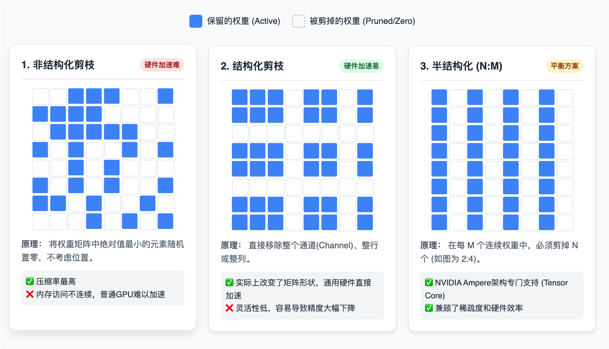
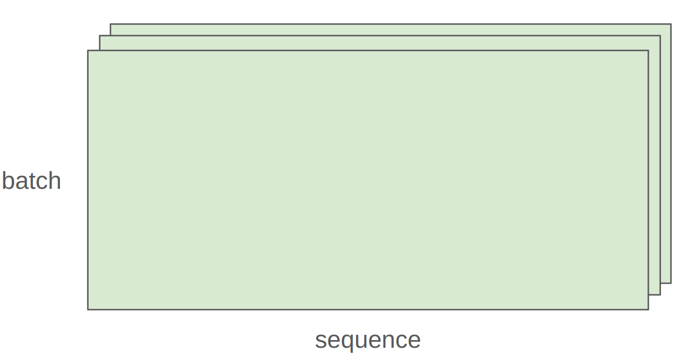
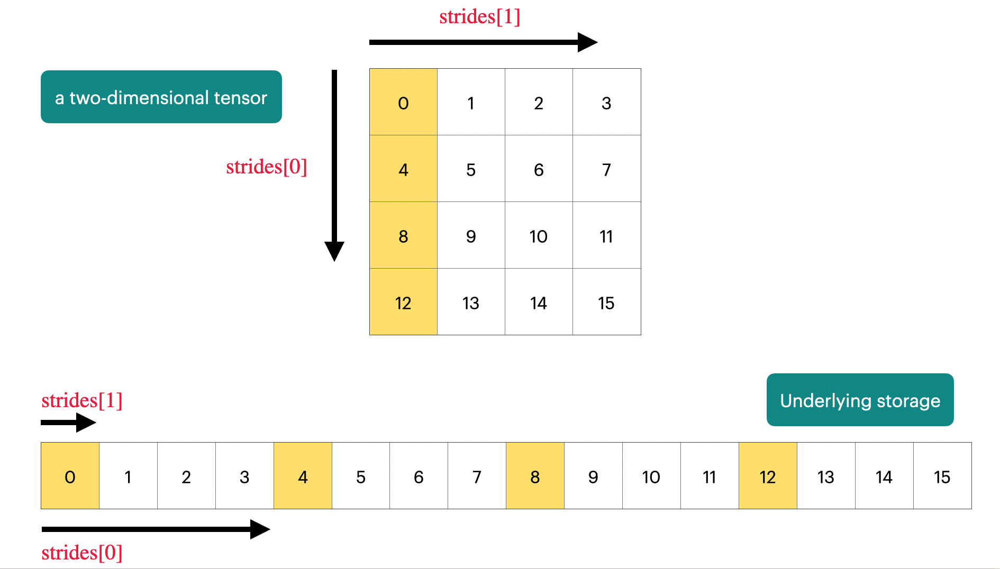

# 第三章：pytorch 与资源核算

第二章中我们讨论了分词（Tokenization）。本节课我们将深入**模型训练的机制**。我们不会直接讲解 Transformer 架构（那是下节课的内容），而是通过构建简单的线性模型，掌握训练任何深度学习模型都通用的“原语”（Primitives）。

**核心目标：**
1.  **机制（Mechanics）：** 掌握 PyTorch 的基础操作（自底向上：张量 -> 构建模型 -> 优化器 -> 训练循环）。
2.  **思维模式（Mindset）：** 养成**资源核算**的习惯。你需要清楚每一行代码消耗了多少内存（GB）和算力（FLOPs）。
3.  **直觉（Intuitions）：** 理解为什么大模型需要特定的硬件和算法优化。


---

## 3.1 为什么需要资源核算？

在训练大型语言模型时，资源消耗直接转化为成本和时间。让我们通过两个实际问题来理解其重要性：

#### 场景一：时间估算

> **问题：** 假设你是一个 AI 工程师，老板问你：“在 1024 张 H100 显卡上，训练一个 70B（700亿参数）的模型，数据量是 15T（15万亿 tokens），大概要多久？”

如果你直接跑去写代码测试，那可能几天甚至几个月都出不来结果。因此，我们需要学会“Napkin math”（餐巾纸计算，即**快速估算**）。

##### 第一步：计算总工作量
FLOPs（Floating Point Operations，浮点运算次数）是衡量计算复杂度的常用指标，表示一个算法或模型在执行过程中所需的浮点加减乘除等运算的总次数。而训练模型本质上是进行浮点运算（FLOPs）。有一个经验公式：
$$总计算量 \approx 6 \times \text{参数量} \times \text{Token数量}$$

> 为什么是 **6** 倍？
> *   **前向传播 (Forward Pass):** 计算一次约为 $2 \times$ 参数量（乘法+加法）。
> *   **反向传播 (Backward Pass):** 计算梯度约为前向传播的 2 倍工作量，即 $4 \times$ 参数量。

代入数据：
$$6 \times (70 \times 10^9) \times (15 \times 10^{12}) \approx 6.3 \times 10^{24} \text{ FLOPs}$$

##### 第二步：计算硬件算力

查阅 [NVIDIA H100 的白皮书](https://www.nvidia.com/en-sg/data-center/h100/)，其 FP16/BF16 的峰值算力约为 **1979 TFLOPS**（每秒万亿次浮点运算）。


但是要注意，这个值是 NVIDIA H100 GPU 在使用 FP16 或 BF16 数据类型、且启用结构化稀疏（Structured Sparsity）时可达到的理论最大计算吞吐量。对于我们训练普通的稠密模型（如标准的 LLaMA-1到LLaMA-3系列、Qwen3-0.6B/1.7B/4B/8B/14B/32B等），理论峰值减半，约 990 TFLOPS。


> 结构化稀疏，是一种模型压缩的方法，通常是对稠密模型按照50%的稀疏度进行剪枝（稀疏形式为n:m，即m个连续权重里必须剪掉n个，类型有 2:4、4:8、8:16)。还有一种灵活度更高的非结构化剪枝方法，可以按照百分比进行剪枝，但通常相对于结构化剪枝性能更差。



上述 990 TFLOPS 是 H100 的理论峰值，但实际运行模型时，由于各种软硬件开销，你几乎不可能达到 100% **模型算力利用率 (MFU, Model FLOPs Utilization)**，通常按 30%–60% 的利用率估算更现实。这里取 50% 用作后续估计。

- 单卡实际算力 $\approx (990 \times 10^{12}) \times 0.5 \approx 5 \times 10^{14} \text{ FLOPS}$
- 1024 张卡总算力 $\approx 5 \times 10^{17} \text{ FLOPS}$。

##### 第三步：得出结果
$$ \text{时间} = \frac{\text{总工作量}}{\text{总算力}} = \frac{6.3 \times 10^{24}}{5 \times 10^{17}} \approx 1.26 \times 10^7 \text{ 秒} \approx \textbf{146 天} $$

\
这是一个巨大的工程。如果不进行优化，需要五个月才能训练完，这还是训练不中断的情况下需要的时间。

---

#### 场景二：内存估算

> **问题：** 在 8 张 H100 GPU 上，使用 AdamW 优化器（朴素实现，即所有数据都用 float32 存储，没有混合精度或压缩），你能训练的最大模型参数量是多少？

很多初学者认为：8 张 H100（每张 80GB 显存），显存总共 640GB。参数采用 `float32`存储，一个参数 4 字节，所以 $640GB / 4$ 字节 = 1600亿参数（160B）？**错！**

训练时，显存里存的不只是**参数 (Parameters)**，还有：
- **梯度 (Gradients):** 和参数一样大，需要 4 字节
- **优化器状态 (Optimizer States):** 比如常用的 AdamW 优化器，需要存储每个参数的一阶矩估计（梯度的指数移动平均）和二阶矩估计（梯度平方的指数移动平均）

因此，每个参数在训练时大约占用 16 字节：
*   参数 (FP32): 4 bytes
*   梯度 (FP32): 4 bytes
*   优化器状态 (FP32): 8 bytes (2 个变量 × 4 bytes)

$$ \text{最大参数量} = \frac{640 \times 10^9 \text{ bytes}}{16 \text{ bytes/param}} \approx \textbf{400 亿 (40B)} $$

当然，这个估算较为粗略，因为它未考虑依赖于批次大小和序列长度的激活值内存占用，所以如果不考虑混合精度或压缩，实际能训练的模型可能会更小。

---

## 3.2 张量 (Tensors)

### 3.2.1 张量基础

在深度学习中，张量（tensor）是存储一切的基础数据结构：模型参数、梯度、优化器状态、输入数据、中间激活值等都以张量形式存在。更多关于张量的知识可见 [PyTorch docs on tensors](https://docs.pytorch.org/docs/stable/tensors.html)。

PyTorch提供了多种创建张量的方法：

```
# 基础创建方式
x = torch.tensor([[1., 2, 3], [4, 5, 6]])  # 从Python列表创建
x = torch.zeros(4, 8)  # 4x8的零矩阵
x = torch.ones(4, 8)   # 4x8的全1矩阵
x = torch.randn(4, 8)  # 4x8的正态分布随机数

# 分配但不初始化值（用于自定义初始化的值）
x = torch.empty(4, 8)  # 未初始化的4x8矩阵
nn.init.trunc_normal_(x, mean=0, std=1, a=-2, b=2)  # 截断正态分布初始化，分布均值为0，标准差为1，截断范围，只保留[-2, 2]区间内的值，超出此范围的值会被重新采样
```

### 3.2.2 张量的操作

大多数张量都是通过对其他张量执行操作来创建的，每个操作都会占用一定的内存和计算资源。


#### 张量视图（view）

许多操作只是提供张量的一个不同“视图”。这不会创建副本，因此在一个张量中的修改会影响另一个。

```
x = torch.tensor([[1., 2, 3], [4, 5, 6]])

# 这些操作不复制数据
y = x[0]           # 获取第0行
y = x[:, 1]        # 获取第1列
y = x.view(3, 2)   # 重塑为3x2
y = x.transpose(1, 0)  # 转置

# 验证是否共享存储
assert same_storage(x, y)  # same_storage检查底层存储是否相同

# 注意：修改x会影响y
x[0][0] = 100
assert y[0][0] == 100  # 值也被修改
```

> 注意：并非所有视图都是“连续”的。当一个视图的数据在内存中不是按顺序存储时，它就是非连续的（Non-contiguous）。

转置后的张量是非连续的：
```
x = torch.tensor([[1., 2, 3], [4, 5, 6]])
y = x.transpose(1, 0)
assert not y.is_contiguous()  # 非连续张量
```

你不能对非连续张量直接执行某些操作，比如再次 view: 

```
# 尝试重塑会失败
try:
    y.view(2, 3)
except RuntimeError as e:
    assert "view size is not compatible with input tensor's size and stride" in str(e)
```
如果需要对一个非连续张量进行进一步操作，可以先调用 .contiguous() 方法：

```
# 解决方案：先使张量连续
y = x.transpose(1, 0).contiguous().view(2, 3)
assert not same_storage(x, y)  # 现在创建了新存储
```

`.contiguous()` 会创建一个新的张量，并将数据按顺序复制到新的连续内存块中，这样后续操作就不会出错。

#### 逐元素操作（Element-wise Operations）

逐元素操作是对每个元素独立应用函数，并返回相同形状的新张量。这意味着，当你对一个张量执行 `x.pow(2)` 或 `x + x` 时，操作会独立地作用于张量中的每一个数字，而不会像矩阵乘法那样考虑元素之间的行列关系。

下面代码演示了几个常用的逐元素数学函数：
```
x = torch.tensor([1, 4, 9])
assert torch.equal(x.pow(2), torch.tensor([1, 16, 81]))    # 幂运算 (pow)，每个元素平方
assert torch.equal(x.sqrt(), torch.tensor([1, 2, 3]))      # 对每个元素开平方根
assert torch.equal(x.rsqrt(), torch.tensor([1, 1/2, 1/3])) # rsqrt 是 reciprocal of sqrt 的缩写，即对每个元素先开方再取倒数
```
基本的逐元素算术运算：
```
assert torch.equal(x + x, torch.tensor([2, 8, 18])) # 每个元素自加
assert torch.equal(x * 2, torch.tensor([2, 8, 18])) # 每个元素乘以标量2
assert torch.equal(x / 0.5, torch.tensor([2, 8, 18])) # 每个元素除以标量0.5
```
最后，我们介绍了一个非常实用的工具函数 **triu**，这在计算 **因果注意力掩码（causal attention mask）** 时非常有用。在语言模型中，为了确保模型在预测第 j 个词时只能看到第 j 个词之前的词（即不能“偷看”未来信息），就需要使用这种上三角矩阵作为掩码。其中 M[i, j] 表示位置 i 对位置 j 的贡献，当 i > j 时（即 i 在 j 之后），贡献应为0。

```
# 实用操作：上三角矩阵（用于因果注意力掩码）
x = torch.ones(3, 3).triu()  # 创建一个3x3全1矩阵，然后取其上三角部分
# 结果：
# [[1, 1, 1],
#  [0, 1, 1],
#  [0, 0, 1]]
```

#### 矩阵乘法（Matrix Multiplication）

矩阵乘法是深度学习的基础。矩阵乘法是神经网络中最核心、最频繁的计算操作，无论是全连接层、卷积层还是注意力机制，其底层都离不开矩阵运算。

一个标准的矩阵乘法形式为：一个 M×K 的矩阵乘以一个 K×N 的矩阵，得到一个 M×N 的结果矩阵。示例如下：

```
# 基本矩阵乘法
x = torch.ones(16, 32)  # 16x32矩阵
w = torch.ones(32, 2)   # 32x2权重矩阵
y = x @ w               # 结果：16x2矩阵
assert y.size() == torch.Size([16, 2])
```

在实际应用中，我们很少只处理单个数据样本。为了提高效率，我们会将多个样本打包成一个“批次”（batch），并对整个批次同时进行计算。下图展示了批量处理的操作：



- `batch` 标签指向堆叠起来的多个矩形，代表一个批次中包含的多个样本。
- `sequence` 标签指向每个矩形内部，代表每个样本可能包含的序列长度（例如，一个句子中的词元数量）。


下面案例中，我们对前两个维度（批次和序列）中的每个样本执行矩阵乘法

```
x = torch.ones(4, 8, 16, 32) # 形状为 [批大小, 序列长度, 样本特征, 特征维度]
w = torch.ones(32, 2)        # 权重矩阵
y = x @ w                    # 矩阵乘法
assert y.size() == torch.Size([4, 8, 16, 2]) # 结果形状
```

在 PyTorch 进行上述运算时，会自动遍历 x 的前两个维度（即 4 和 8），对每一个 16×32 的子矩阵执行与 w 的矩阵乘法。最终结果 y 的形状是 (4, 8, 16, 2)，其中前两个维度保持不变，后两个维度根据矩阵乘法规则变化。

### 3.2.3 使用 Einops 库对张量操作进行优化

在 pytorch 中，张量维度通常是 `[batch, sequence, hidden]`。用 PyTorch 原生的 `.view()` 和 `.transpose()` 操作维度时，需要时刻记住张量的维度顺序，很容易搞晕。并且，如果你未来修改了张量形状（比如在 transformers 模型中加了 heads 维度），这个代码就可能出错。

```
x = torch.ones(2, 2, 3)  # batch, sequence, hidden
y = torch.ones(2, 2, 3)  # batch, sequence, hidden
z = x @ y.transpose(-2, -1)  # 得到 (batch, sequence, sequence)
```
那么该如何解决这个问题呢？在这里我们推荐几个工具（**使用 jaxtyping 先声明维度含义，再使用 einops 来操作张量**），让代码像写公式一样清晰。

#### 1. 用 jaxtyping 命名维度

```python
# 传统方式（容易写错维度顺序）
x = torch.ones(2, 2, 1, 3)  # batch seq heads hidden

# Jaxtyping方式（在类型注解中命名维度）
from jaxtyping import Float
x: Float[torch.Tensor, "batch seq heads hidden"] = torch.ones(2, 2, 1, 3)
```

`jaxtyping` 提供的维度命名（如 "batch seq hidden"）在当前 PyTorch 生态中主要是“文档性质”的，不会在运行时自动强制检查维度是否真的匹配名称，但它能极大地提升代码的清晰度和可靠性。也就是说PyTorch 在运行时不会检查 x 的形状是否真的是 (batch=2, seq=3, hidden=4)，即使你写成：
```
y: Float[torch.Tensor, "batch seq hidden"] = torch.randn(100, 5)  # 形状与注解严重不符
```
代码依然会正常运行，不会抛出任何错误。Python 的类型注解（Type Hints）本身是可选的、非强制的，主要用于工具（如 IDE、mypy）做静态分析，而不是运行时校验。尽管不强制校验，jaxtyping 仍带来巨大工程价值，当你将来修改模型（比如增加 heads 维度）：
- 类型注解会提醒你哪里需要同步更新。
- IDE（如 VS Code、PyCharm）能基于注解提供：
    - 自动补全
    - 重构支持（rename dimension）
    - 错误高亮（如果你在 einsum 中拼错了维度名）
> 注意：另外需要注意的一点是，`jaxtyping`也提供了可选地运行时检验，第三方库如 beartype 也提供了类型注解做运行时校验的功能，读者感兴趣可自行探索。

#### 2. 用 einops.einsum 替代矩阵乘法 + 转置

广义矩阵乘法，具有清晰的维度跟踪：

```
from einops import einsum

# 定义两个张量
x: Float[torch.Tensor, "batch seq1 hidden"] = torch.ones(2, 3, 4)  
y: Float[torch.Tensor, "batch seq2 hidden"] = torch.ones(2, 3, 4)  

# 传统方式
z = x @ y.transpose(-2, -1)  # batch, sequence, sequence

# Einops方式
z = einsum(x, y, "batch seq1 hidden, batch seq2 hidden -> batch seq1 seq2")
# 未在输出中命名的维度（hidden）会被自动求和
```
这种方法会将没在输出中出现的 hidden 维度，自动对该维度做求和。这本质上是爱因斯坦求和约定（Einstein summation） 的直观实现。更通用的写法是（支持任意前导维度）：
```
z = einsum(x, y, "... seq1 hidden, ... seq2 hidden -> ... seq1 seq2")
```

`...` 表示“任意数量的前导维度”，比如可能是 (device, batch) 或 (ensemble, batch, time)，代码依然适用。好处是维度逻辑显式、通用、不易出错，且天然支持广播。

#### 3. 用 einops.reduce 替代 mean(dim=...)

```
from einops import reduce

x: Float[torch.Tensor, "batch seq hidden"] = torch.ones(2, 3, 4)

# 传统写法
y = x.mean(dim=-1)  # 对最后一个维度 hidden 上求平均

# Einops 写法
y = reduce(x, "... hidden -> ...", "mean")
```

从 `... hidden` 变成 `...`，说明 hidden 维度被“聚合”了，聚合方式是 `"mean"`（也可用 `"sum"`, `"max"` 等）。
同样`...` 表示“任意数量的前导维度”。这种写法的好处是明确表达了“我打算把哪个维度压缩掉”，语义清晰。

#### 4. 用 einops.rearrange 拆分/合并维度

这是 Einops 最强大的功能之一，用于处理扁平化与重组。

假设你有一个维度 total_hidden = 8，它实际上是 heads=2 和 hidden1=4 的乘积（即 2 * 4 = 8），也就是 total_hidden 维度实际上是 heads×hidden1 的扁平化表示。

```
from einops import rearrange

# 情景：hidden维度实际上是heads×hidden1的扁平化表示
x: Float[torch.Tensor, "batch seq total_hidden"] = torch.ones(2, 3, 8)
w: Float[torch.Tensor, "hidden1 hidden2"] = torch.ones(4, 4)
```

现在你想对 hidden1 做矩阵乘法，但当前维度是扁平的，我们需要对其进行**维度拆分**（flatten → multi-dim）：

```
# 拆分 total_hidde n为 heads 和 hidden1
x = rearrange(x, "... (heads hidden1) -> ... heads hidden1", heads=2)
```
(heads hidden1) 表示“这两个维度被乘在一起，现在我要拆开它”。因为 8 可以拆成 (2,4), (4,2), (8,1) 等，所以必须指定 heads=2 用来固定拆分后的维度。

接下来，对拆分后的维度做矩阵乘法：

```
x = einsum(x, w, "... hidden1, hidden1 hidden2 -> ... hidden2")
```
最后，我们进行**维度合并**（multi-dim → flatten）的操作：
```
合并维度
x = rearrange(x, "... heads hidden2 -> ... (heads hidden2)")
```

尽管Einops增加了少量语法开销，但其清晰的维度命名显著降低了调试难度，特别是在复杂的模型架构中，更多用法可见 [Einops tutorial](https://einops.rocks/1-einops-basics/)。

## 3.3 内存（Memory）


张量的内存占用由两个因素决定：

- 元素数量：张量的形状（如4×8矩阵有32个元素）
- 数据类型：每个元素占用的字节数

### 3.3.1 浮点类型

在 LLM 训练中，选择数据类型本质上是在做显存占用、计算速度与数值稳定性之间的权衡（Trade-off）。我们关注的大多数张量（参数、梯度、激活值、优化器状态）都以浮点数形式进行存储，让我们深入理解不同的浮点数据类型：

1. Float32 (FP32 / 单精度浮点数)


*   **规格**：占用 **4 字节** (32 bits)。结构为：1位符号位 + **8位指数位** + 23位尾数位。
*   **地位**：PyTorch 的默认数据类型，也是科学计算领域的“黄金标准”。
*   **优点**：数值精度高，动态范围大，训练最稳定，几乎不会出现数值溢出问题。
*   **缺点**：对于大模型而言太“奢侈”。它占用的显存是 16位格式的两倍，且在现代 GPU（如 H100）上的计算吞吐量远低于低精度格式。
*   **炼丹用途**：通常用于存储**参数的主副本 (Master Weights)** 和 **优化器状态 (Optimizer States)**，以确保在梯度累积和参数更新时不会因为精度丢失而导致模型无法收敛。


2. Float16 (FP16 / 半精度浮点数)


*   **规格**：占用 **2 字节** (16 bits)。结构为：1位符号位 + **5位指数位** + 10位尾数位。
*   **优点**：显存占用比 FP32 减少一半，计算速度快。
*   **致命缺陷**：**动态范围（Dynamic Range）太窄**。
    *   由于指数位只有 5 位，它无法表示非常小的数（会发生下溢 Underflow，直接变成 0）或非常大的数（会发生上溢 Overflow，变成 Infinity）。
    *   例如：在 FP16 中，`1e-8` 这样的小数会被直接当作 `0` 处理，导致梯度消失。
*   **用途**：这是上一代 GPU（如 V100）混合精度训练的主流。为了解决溢出问题，必须使用复杂的**损失缩放 (Loss Scaling)** 技术。目前在 LLM 训练中正逐渐被 BF16 取代。

3. BFloat16 (BF16 / Brain Floating Point)


*   **规格**：占用 **2 字节** (16 bits)。结构为：1位符号位 + **8位指数位** + 7位尾数位。
*   **来源**：由 Google Brain 专为深度学习设计。
*   **设计逻辑**：**“要范围，不要精度”**。
    *   深度学习模型（尤其是神经网络）对小数点的后几位精度不敏感，但对数值的范围非常敏感。
    *   BF16 直接截断了 FP32 的尾数，但**保留了和 FP32 相同的 8 位指数位**。
*   **优点**：
    *   拥有和 FP32 一样宽广的动态范围，**不需要 Loss Scaling** 也能稳定训练。
    *   显存占用和 FP16 一样少。
    *   在 A100/H100 等新硬件上计算速度极快。
*   **用途**：**当前 LLM 训练的绝对主流选择**。通常用于存储**激活值 (Activations)** 以及进行前向和反向传播的矩阵乘法计算。

4. FP8 (8位浮点数)


*   **规格**：占用 **1 字节** (8 bits)。
*   **变体**：
    *   **E4M3**：4位指数，3位尾数（精度稍高，范围稍小）。
    *   **E5M2**：5位指数，2位尾数（范围稍大，精度更低）。
*   **优点**：极致的显存压缩和计算吞吐量。
*   **硬件限制**：仅在 NVIDIA H100 及更新的架构（配合 Transformer Engine）上才被原生支持。
*   **炼丹用途**：目前主要用于**推理阶段的量化 (Quantization)**。虽然理论上可以用于训练（H100 支持），但由于精度极低，训练极不稳定，属于比较前沿的研究领域。

\
**🪜 为什么 BF16 优于 FP16？**
> 在深度学习中，我们通常不关心小数点后第10位的精确度（精度），但非常关心能否表示非常大或非常小的数（动态范围）。FP16 的指数位太少，导致训练中经常出现 `NaN` 或 `0`（下溢）。BF16 截断了 FP32 的尾数，保留了指数位，因此它能表示的数值范围与 FP32 一样大，极大地提升了训练稳定性。


### 3.3.2 张量在内存中的存储机制

你有没有思考过一个问题，在 pytorch 中张量到底在底层是如何存储的呢？实际上，在早期的 pytorch 版本中，张量在一台机器上的存储，占用了两部分内存，一个内存储存了这个张量的形状（size）、步长（stride）、数据类型（dtype）等元数据信息，我们把这一部分称之为头信息区（Tensor）；另一个内存储存的就是真正的数据，我们称为存储区 （Storage）。但是将“存储区”作为一个独立的、可公开访问的对象，其带来的复杂性和潜在风险，远大于它为用户提供的一些灵活性。

因此，在现在的 pytorch 版本中，PyTorch 的设计者们选择将这一层实现细节进行封装，让 Tensor 对象本身成为一个集成了“**指针+元数据**”的单一实体。这意味着一个张量本身并不直接“包含”数据，而是指向一块连续的内存区域，并附带一套规则（元数据），告诉程序如何根据你请求的索引去这块内存里找到对应的数据。让我们定义一个4x4的二维张量作为例子：

```
x = torch.tensor([
    [0., 1, 2, 3],
    [4, 5, 6, 7],
    [8, 9, 10, 11],
    [12, 13, 14, 15],
])
```
张量在底层可以是按行存储也可以是按列存储。Numpy 和 Pytorch 都采用了**按行存储**的方式，任何维度的张量在底层存储都占据着内存中连续的空间，那么问题来了，我们如何访问到我们想要的位置的数据？




答案就是**步长（Strides）**！步长是一个元组，定义了在每个**维度**上移动一个单位时，在底层存储中需要“跳过”的元素数量。


```
# 步长（stride）：在每个维度上移动时跳过的元素数
assert x.stride(0) == 4  # 行维度：移动到下一行需跳过4个元素
assert x.stride(1) == 1  # 列维度：移动到下一列需跳过1个元素

# 计算元素位置：行索引r，列索引c
r, c = 1, 2
index = r * x.stride(0) + c * x.stride(1)  # 位置6
```

用一句话来说，**PyTorch通过“步长”这一元数据，巧妙地将多维张量的逻辑结构映射到一维的物理内存上**。


**关键点：** 很多操作（如 `view`, `transpose`, `slice`）**不会复制数据**，只是修改了 stride。这叫 **Zero-copy**，非常高效。

```python
x = torch.randn(32, 32)
y = x.view(1024) # 只是改变了看待数据的方式，内存地址没变
z = x.transpose(0, 1) # 修改了 stride，没有复制数据
```

**坑点：** 如果你对转置后的张量调用 `.view()`，可能会报错。因为转置后内存不再连续（Contiguous）。你需要先调用 `.contiguous()`，这会触发数据复制（消耗内存和时间）。


### 3.3.3 将张量（tensors）从CPU内存移动到GPU内存

默认情况下，张量是存储在 CPU 内存上的，让我们来检查下：

```
x = torch.zeros(32, 32)
assert x.device == torch.device("cpu")
```

但是，为了利用 GPU 的大规模并行性计加速计算，我们需要将它们移至 GPU 内存中。


上图左侧包含中央处理器（CPU）和系统内存（RAM），右侧包含图形处理器（GPU）及其专用的高速显存（DRAM），GPU内部由多个“流式多处理器”（streaming multiprocessor）组成，这是其并行计算能力的来源。CPU和GPU通过“PCI BUS”（PCI总线）相连，数据在CPU和GPU之间传输需要经过这条总线，这通常是一个性能瓶颈，因为它的带宽远小于GPU内部的内存带宽。因此，在实际应用中，我们应尽量减少CPU和GPU之间的数据传输


在 PyTorch 中，想要将张量从 CPU 移至 GPU ，需要以下几个步骤：

- 首先，我们先来看下我们当前机器上有没有GPU：
    ```
    if not torch.cuda.is_available():
            return
    ```

- 接下来，获取GPU信息:
    ```
    num_gpus = torch.cuda.device_count() # 获取GPU数量
    for i in range(num_gpus):
        properties = torch.cuda.get_device_properties(i) # 获取第i块GPU的属性（如型号、显存大小等）
    memory_allocated = torch.cuda.memory_allocated() # 获取当前已分配给PyTorch的显存总量
    ```
- 移动张量到GPU上有两种方法：

    - 方法一：移动现有张量
        ```
        y = x.to("cuda:0") # 将张量x移动到编号为0的GPU上
        assert y.device == torch.device("cuda", 0) # 验证移动成功
        ```
    - 方法二：直接在GPU上创建张量
        ```
        z = torch.zeros(32, 32, device="cuda:0") # 在GPU上直接创建一个32x32的零矩阵
        ```
    这种方法更高效，因为它避免了先在CPU创建再移动的过程。


- 最后，验证内存分配

    ```
    new_memory_allocated = torch.cuda.memory_allocated() # 再次查询当前显存占用
    memory_used = new_memory_allocated - memory_allocated # 计算新增的显存占用
    assert memory_used == 2 * (32 * 32 * 4) # 验证：新增了2个32x32的矩阵，每个元素是4字节的float
    ```


---

## 3.4 计算效率

### 3.4.1 浮点运算总数（FLOPs）

#### 概述

一个浮点运算（FLOP, Floating Point Operation）是一个基本的算术操作，比如加法 x + y 或乘法 x * y，理解 FLOPs 对性能分析至关重要。

首先，我们先辨析几个常见概念：
- **FLOPs**（小写s）：执行的浮点运算总数，这是一个衡量计算量的指标，
- **FLOP/s**（每秒浮点运算）：指硬件每秒能执行的浮点运算次数，也写作 **FLOPS**（大写S）。这是一个衡量“速度”的指标。例如，H100 GPU峰值性能为 990 TFLOP/s。

> 重要提示：这两个缩写写法相似，但含义完全不同！本教程中会明确区分它们，避免混淆。

接下来，让我们通过几个例子让你对 FLOPs 和 FLOP/s 有一个直观认识：

- GPT-3 (2020年)：训练耗时约 $3.14 \times 10^{23}$ FLOPs [文章](https://lambda.ai/blog/demystifying-gpt-3)
- GPT-4 (2023年)：据推测训练耗时约 $2 \times 10^{25}$ FLOPs [文章](https://patmcguinness.substack.com/p/gpt-4-details-revealed)
- 政策背景：美国曾有一项行政命令，要求任何训练FLOPs超过 1 × 10²⁶ 的基础模型必须向政府报告（该命令已于2025年被撤销）
- NVIDIA A100：峰值性能为 312 TFLOP/s (即 $3.12 × 10^{14}$ FLOP/s) [官方手册](https://www.nvidia.com/content/dam/en-zz/Solutions/Data-Center/a100/pdf/nvidia-a100-datasheet-nvidia-us-2188504-web.pdf)
- NVIDIA H100：峰值性能为 1979 TFLOP/s，但这通常是在启用“稀疏性”（sparsity）的情况下。对于密集矩阵乘法，其性能约为一半，即 989.5 TFLOP/s [官方手册](https://resources.nvidia.com/en-us-tensor-core/nvidia-tensor-core-gpu-datasheet)

#### 线性模型的计算量

为了具体化FLOPs的计算方法，我们引入了一个简单的线性模型作为例子。这个线性模型有 B 个数据点，每个点是 D 维的，模型将其映射到 K 维输出。我们要做的核心操作是矩阵乘法 y = x @ w，目标是计算这个操作总共需要多少次浮点运算（FLOPs）？

```
if torch.cuda.is_available():
    B = 16384  # Number of points
    D = 32768  # Dimension
    K = 8192   # Number of outputs
else:
    B = 1024
    D = 256
    K = 64
device = get_device()
x = torch.ones(B, D, device=device)
w = torch.randn(D, K, device=device)
y = x @ w
```

接下来让我们进行分析：

- x 是输入数据，形状为 (B, D)
- B：batch size（数据点数量）
- D：每个数据点的维度（输入特征数）
- w 是权重矩阵，形状为 (D, K)
- K：输出维度（比如分类任务的类别数）
- y 是输出，形状为 (B, K)

考虑 y = x @ w 中的一个输出元素 y[i, k]：

```
y[i, k] = x[i, 0] * w[0, k] +
           x[i, 1] * w[1, k] +
           ...
           x[i, D-1] * w[D-1, k]
```
这个求和过程包含 D 次乘法（x[i, j] * w[j, k]）和 D - 1 次加法，总共 ≈ 2D 次 FLOPs（因为 D 通常很大，D - 1 ≈ D）

因此，矩阵乘法的计算量：**总 FLOPs** $\approx 2 \times M \times N \times K$

因为 D × K 正好是这个线性层的参数数量！所以我们可以重写为：$FLOPs = 2 \times 数据量 \times 模型参数量$

或者在语言模型中，常用 token 代替数据点：$FLOPs = 2 \times token 数量 \times 模型参数量$。 

> 虽然相较于线性模型， Transformer 还有注意力、LayerNorm 等额外操作，但矩阵乘法占主导，所以这个公式对 Transformer 也基本成立

#### 其他操作的 FLOPs

- 逐元素操作（Element-wise Operations）：对张量中每个元素独立应用某个函数（如 x + 1、x.sqrt()、torch.relu(x) 等）。若张量形状为 m × n，则逐元素操作的 FLOPs 为 O(m × n)。
- 张量加法（Tensor Addition）：两个相同形状张量的对应元素相加，如 z = x + y。若 x 和 y 均为 m × n，则总 FLOPs = m × n（每个元素 1 次加法）。

对比矩阵乘法 A (m×k) @ B (k×n) 的 FLOPs = 2 × m × k × n。当 k 较大时（如 k = 1024），矩阵乘法的 FLOPs 是加法的上千倍。对于现代深度学习模型（尤其是 Transformer、MLP 等），90%+ 的 FLOPs 来自矩阵乘法（线性层、QKV 投影、FFN 等）。其他操作（LayerNorm、Softmax、激活函数、加法残差连接等）虽然存在，但 FLOPs 可忽略不计。因此，**在进行粗略但有效的资源估算时，只需计算所有矩阵乘法的 FLOPs 总和即可**。

理论上的 FLOPs 只是一个衡量计算量的数字，如何将 FLOPs 转化为实际运行时间呢？

```
actual_time = time_matmul(x, w)  # 实际执行矩阵乘法所需的时间（秒）
actual_flop_per_sec = actual_num_flops / actual_time  # 实际每秒能完成多少次浮点运算
```

另外，FLOP/s 的性能很大程度上取决于数据类型！
```
promised_flop_per_sec = get_promised_flop_per_sec(device, x.dtype)  # 获取硬件的理论峰值性能
```

### 3.4.2 MFU (Model FLOPs Utilization)

MFU = (实际FLOP/s) / (硬件峰值FLOP/s)，即：

$$ \text{MFU} = \frac{\text{实测 FLOPS}}{\text{硬件理论峰值 FLOPS}} $$
*   MFU >= 0.5：被认为是相当不错的性能
*   MFU 接近 1.0：非常难达到，因为硬件不可能100%满负荷运转，总会有内存访问、数据传输等开销

> 注意：这个公式**忽略了通信和系统开销**，只关注纯粹的计算效率。

接下来我们在 bfloat16 上计算一下 MFU：

```
# 将张量转换为 bfloat16
x = x.to(torch.bfloat16)
w = w.to(torch.bfloat16)

# 测量实际性能
bf16_actual_time = time_matmul(x, w)
bf16_actual_flop_per_sec = actual_num_flops / bf16_actual_time

# 获取 bfloat16 的理论峰值
bf16_promised_flop_per_sec = get_promised_flop_per_sec(device, x.dtype)

# 计算 MFU
bf16_mfu = bf16_actual_flop_per_sec / bf16_promised_flop_per_sec
```

使用 bfloat16 时，actual_flop_per_sec 通常比 float32 更高，因为硬件对低精度计算进行了优化。这里的 MFU 值相当低，可能是因为硬件厂商公布的 promised_flop_per_sec 往往是过于乐观的估计。


### 3.4.3 PyTorch 中的梯度计算

到目前为止，我们已经构建了张量（对应于参数或数据），并将它们传递给操作（前向传播）。现在，我们将计算梯度（反向传播）。

#### 梯度反向传播

我们继续以一个简单的线性模型为例：
```
y = 0.5 * (x * w - 5)²
```
这里，x 是输入数据，w 是模型参数，y 是损失值。

前向传播代码:
```
x = torch.tensor([1., 2, 3]) # 输入数据，不需要计算梯度
w = torch.tensor([1., 1, 1], requires_grad=True) # 模型参数，需要计算梯度
pred_y = x @ w # 预测值（矩阵乘法）
loss = 0.5 * (pred_y - 5).pow(2) # 计算损失值
```
requires_grad=True 这个参数它告诉 PyTorch “请为这个张量 w 构建计算图，并在反向传播时计算它的梯度。” 对于输入数据 x，我们通常不需要它的梯度，所以不设置此标志。

反向传播代码：
```
loss.backward() # 触发反向传播
assert loss.grad is None # 损失值 loss 本身是一个标量，它没有“上游”的梯度，所以它的 .grad 属性是 None
assert pred_y.grad is None # 中间变量 pred_y 默认情况下也不会保存梯度，除非你显式地调用 pred_y.retain_grad()
assert x.grad is None # 因为 x 在创建时没有设置 requires_grad=True，所以它不会被追踪，其 .grad 也为 None
assert torch.equal(w.grad, torch.tensor([1, 2, 3])) # 验证模型参数 w 的梯度是否计算正确
```
调用 loss.backward() 后，PyTorch 会从 loss 开始，沿着计算图回溯，自动计算出每个需要梯度的张量的梯度。

#### 计算反向传播（梯度）所需的浮点运算次数

我们首先回顾 3.4.1 中定义的 定义的线性模型，并将其扩展为一个简单的两层的线性模型：

```
if torch.cuda.is_available():
    B = 16384  # Number of points
    D = 32768  # Dimension
    K = 8192   # Number of outputs
else:
    B = 1024
    D = 256
    K = 64
device = get_device()
x = torch.ones(B, D, device=device)
w1 = torch.randn(D, D, device=device, requires_grad=True)
w2 = torch.randn(D, K, device=device, requires_grad=True)

Model: x --w1--> h1 --w2--> h2 -> loss
h1 = x @ w1 # 第一层：输入x乘以权重w1得到隐状态h1
h2 = h1 @ w2 # 第二层：h1乘以权重w2得到输出h2
loss = h2.pow(2).mean()  # 计算损失（均方误差）
```
回顾一下前向传播 FLOPs 的计算，第一层 x @ w1 需要 2 * B * D * D FLOPs；第二层 h1 @ w2 需要 2 * B * D * K FLOPs，总计为 num_forward_flops = **(2 * B * D * D) + (2 * B * D * K)**

接下来让我们计算反向传播 FLOPs，调用 loss.backward() 后，PyTorch 需要计算以下四个梯度：
- h1.grad = d(loss) / d(h1) （中间激活值的梯度）
- h2.grad = d(loss) / d(h2) （最后一层输出的梯度）
- w1.grad = d(loss) / d(w1) （第一层权重的梯度）
- w2.grad = d(loss) / d(w2) （第二层权重的梯度）

让我们重点分析 w2.grad 的计算，根据链式法则：
```
w2.grad[j,k] = sum_i h1[i,j] * h2.grad[i,k]
```
这本质上是一个矩阵乘法，h1 的形状是 (B, D)，h2.grad 的形状是 (B, K)，它们的乘积 h1.T @ h2.grad 的形状是 (D, K)，正好是 w2.grad 的形状。因此，计算 w2.grad 的 FLOPs 为：**2 * B * D * K**

为了继续反向传播到 w1，我们还需要计算 h1.grad。根据链式法则：
```
h1.grad[i, j] = sum_k w2[j, k] * h2.grad[i, k]
```

这同样是一个矩阵乘法，w2 的形状是 (D, K)，h2.grad 的形状是 (B, K)。它们的乘积 h2.grad @ w2.T 的形状是 (B, D)，正好是 h1.grad 的形状。因此，计算 h1.grad 的 FLOPs 也是：**2 * B * D * K**

同理，计算 w1.grad 的公式是：
```
w1.grad[j, k] = sum_i x[i, j] * h1.grad[i, k]
```
这又是一个矩阵乘法，其 FLOPs 为：**2 * B * D * D**

将这个过程[可视化](https://medium.com/@dzmitrybahdanau/the-flops-calculus-of-language-model-training-3b19c1f025e4)：


- 对于 w2：计算 w2.grad 和 h1.grad 总共需要 4 * B * D * K 次 FLOPs。
- 对于 w1：计算 w1.grad 总共需要 4 * B * D * D 次 FLOPs。

总计反向 FLOPs = (4 * B * D * D) + (4 * B * D * K)

通过上述计算，我们得出了一个普适性的结论：在深度学习中，**训练一次（前向+反向）的总 FLOPs 约等于 6 倍的“数据点数量 × 参数数量”**。这个结论也是我们在 3.1 中估算公式的由来。

---

## 3.5 模型构建与训练基础

### 3.5.1 参数初始化 (Initialization)

现在我们动手写代码。我们将构建一个简单的深度线性网络（Deep Linear Network），并手动实现优化器。

#### 模型参数的存储

在 PyTorch 中，可训练的模型参数被封装为 nn.Parameter 对象：

```
w = nn.Parameter(torch.randn(input_dim, output_dim))
```
nn.Parameter 是 torch.Tensor 的子类，因此它“表现得像一个张量”，可以进行所有张量操作。它有一个 .data 属性，用于访问其底层的 torch.Tensor 数据。

#### 参数初始化的重要性及常用方法

如果你直接用 `torch.randn` 进行**标准高斯分布初始化**参数，随着层数变深，数值会变得非常大（爆炸）或非常小（消失）。
```
x = nn.Parameter(torch.randn(input_dim)) # 输入向量
output = x @ w # 输出向量
```
当 input_dim = 16384 时，输出值的大小约为 18.9，这是一个非常大的数值。这种大数值会逐层放大，导致梯度爆炸（gradient explosion），使训练过程变得极不稳定，甚至无法收敛。

为了克服这个问题，我们需要一种对输入维度 input_dim 不敏感的初始化方法。解决方法是使用 **Xavier (Kaiming) 初始化**([paper](https://proceedings.mlr.press/v9/glorot10a/glorot10a.pdf))。通过除以 $\sqrt{\text{输入维度}}$ 来缩放权重，保持数值稳定性。

```python
w = nn.Parameter(torch.randn(input_dim, output_dim) / np.sqrt(input_dim))
```
经过缩放后，输出 output 的每个元素的值变得稳定在一个较小的范围内，不再随 input_dim 增长。

即使使用了 Xavier 初始化，由于正态分布的尾部是无界的，仍然存在产生极端值（outliers）的可能性。解决方案是使用**截断正态分布（truncated normal distribution）**，将生成的随机数限制在一个合理的范围内（如 [-3, 3]）。

```
w = nn.Parameter(nn.init.trunc_normal_(torch.empty(input_dim, output_dim), 
                                      std=1 / np.sqrt(input_dim), 
                                      a=-3, b=3))
```

### 3.5.2 使用 pytorch 自定义模型

这一节是关于如何在 PyTorch 中从零开始构建一个自定义的深度线性模型（deep linear model）。它展示了使用 nn.Parameter 来定义可学习参数，并通过组合这些参数来创建一个简单的神经网络。

**定义模型结构**。这里定义了一个名为 Cruncher 的自定义模型类，它是一个“深度线性模型”，包含 num_layers 个隐藏层和一个输出层。

```
D = 64 # Dimension
num_layers = 2
model = Cruncher(dim=D, num_layers=num_layers)
```
Cruncher 类将多个 Linear 层组合在一起，形成一个更深的网络。在 __init__ 方法中，使用 nn.ModuleList 创建一个包含 num_layers 个 Linear 层的列表。每个 Linear 层的输入和输出维度都是 dim，这意味着它们是“恒等”变换，但内部的权重是可学习的。
```
class Cruncher(nn.Module):
    def __init__(self, dim: int, num_layers: int):
        super().__init__()
        self.layers = nn.ModuleList([
            Linear(dim, dim)
            for i in range(num_layers)
        ])
        self.final = Linear(dim, 1)  # 创建一个最终的 Linear 层，它将 dim 维的特征映射到 1 维的标量输出
    def forward(self, x: torch.Tensor) -> torch.Tensor:
        # Apply linear layers
        B, D = x.size()
        for layer in self.layers:
            x = layer(x)
        # Apply final head
        x = self.final(x)
        assert x.size() == torch.Size([B, 1])
        # Remove the last dimension
        x = x.squeeze(-1) # 移除最后一个维度（即大小为1的那个维度），使得最终输出是一个一维张量 (B,)，更符合我们对“预测值”的直观理解（例如，对每个样本输出一个分数）
        assert x.size() == torch.Size([B])
        return x

```
Linear 类实现了神经网络中最基本的构建块——线性层（也称为全连接层或密集层）。
```
class Linear(nn.Module):
    """Simple linear layer."""
    def __init__(self, input_dim: int, output_dim: int):
        super().__init__()
        self.weight = nn.Parameter(torch.randn(input_dim, output_dim) / np.sqrt(input_dim))
    def forward(self, x: torch.Tensor) -> torch.Tensor:
        return x @ self.weight
```


**检查模型参数**。使用 model.state_dict() 将返回一个字典，包含了模型中所有可学习参数（nn.Parameter）的名称和值

```
param_sizes = [
    (name, param.numel())  # param.numel()：返回该参数张量中的元素总数
    for name, param in model.state_dict().items()
]
assert param_sizes == [
    ("layers.0.weight", D * D),
    ("layers.1.weight", D * D),
    ("final.weight", D),
]
```

**将模型移至 GPU**。在实际训练中，为了利用 GPU 的并行计算能力，需要将模型和数据移动到 GPU 上。get_device() 函数会自动选择可用的 GPU 或 CPU。

```
device = get_device()
model = model.to(device)
```
**在数据上运行模型**。创建一个批次大小为 B=8 的随机输入数据 x，调用 model(x) 执行前向传播，得到输出 y。验证输出 y 的形状为 (B,)，即每个样本对应一个标量输出。
```
B = 8 # Batch size
x = torch.randn(B, D, device=device)
y = model(x)
assert y.size() == torch.Size([B])
```


### 3.5.3 如何管理随机性（Randomness）以确保结果的可重现性

#### 随机性的来源
随机性在深度学习的许多地方都会出现：

- 参数初始化：模型权重通常从随机分布（如正态分布）中采样。
- Dropout：训练时随机“关闭”一部分神经元。
- 数据排序：数据加载器通常会打乱数据顺序。
- 其他：如数据增强、优化器中的动量等。

这些随机性会导致每次运行代码时得到不同的结果，这在调试和比较不同模型时是一个巨大的障碍。为了确保实验的可靠性和可比性，我们需要让程序的行为是确定性的（Deterministic）。

#### 设置随机种子的方法

有三个主要的库需要分别设置随机种子，通常在程序开始时一次性全部设置。

1. PyTorch

下面是设置 PyTorch 自身随机数生成器的种子，影响所有使用 torch.randn、torch.randint 等函数的操作。

```
seed = 0
torch.manual_seed(seed)
```

2. NumPy

许多数据预处理操作（如数据加载、划分）都依赖于 NumPy 的随机函数，因此也需要单独设置其种子。

```
import numpy as np
np.random.seed(seed)
```

3. Python 标准库 (random)

Python 内置的 random 模块也常用于数据打乱等操作，同样需要设置种子。
```
import random
random.seed(seed)
```

> 关键提示：虽然你也可以为每个随机源设置不同的种子（例如，固定初始化但允许数据变化），但在大多数情况下，为了确保完全的可重现性，最简单、最安全的做法就是将这三个种子都设为同一个值。


### 3.5.4 数据加载

在语言建模中，输入数据通常是经过分词器（tokenizer）处理后的整数序列。例如，句子 "Hello world" 可能被编码为 [1, 2]。为了方便处理，这些整数序列通常会被保存为 NumPy 数组文件（.npy 格式）。

```
orig_data = np.array([1, 2, 3, 4, 5, 6, 7, 8, 9, 10], dtype=np.int32)
orig_data.tofile("data.npy") # 将数组保存到文件
```

对于像 LLaMA 这样高达 2.8TB 的超大数据集，不可能将其全部加载到内存中。解决方案是使用 `numpy.memmap` 创建一个“内存映射”对象。

```
data = np.memmap("data.npy", dtype=np.int32) # 创建内存映射
assert np.array_equal(data, orig_data) # 验证加载的数据是否正确
```
data 对象本身不包含数据，而是一个指向磁盘上文件的“指针”。当你访问 data[0] 或 data[1:10] 时，系统才会按需将这部分数据从磁盘加载到内存中。这种方式极大地节省了内存占用，允许你在内存有限的情况下处理远超内存大小的数据集。

在实际训练中，我们不会直接操作整个数据集，而是通过一个“数据加载器”来生成训练所需的批次。

```
B = 2  # 批次大小，即一次训练处理多少个样本
L = 4  # 序列长度，即每个样本包含多少个词元（token）
x = get_batch(data, batch_size=B, sequence_length=L, device=get_device())
assert x.size() == torch.Size([B, L]) # 验证输出张量的形状
```
调用 `get_batch` 函数会从 data 中随机采样 B 个起始位置，然后截取每个位置后长度为 L 的序列，最终返回一个形状为 (B, L) 的张量 x

接下来，我们详细看下`get_batch` 函数的内部处理逻辑：

```
def get_batch(data: np.array, batch_size: int, sequence_length: int, device: str) -> torch.Tensor:
    # 随机采样起始位置
    start_indices = torch.randint(len(data) - sequence_length, (batch_size,)) # 使用 torch.randint 在 [0, len(data) - sequence_length] 范围内随机生成 batch_size 个起始索引。这样可以确保每个序列都能完整地从数据中截取出来，不会越界
    assert start_indices.size() == torch.Size([batch_size]) # 断言验证了生成的索引数量正确

    # 根据起始索引提取数据
    x = torch.tensor([data[start:start + sequence_length] for start in start_indices]) # 遍历 start_indices 中的每一个起始位置 start，从 data 中切片出长度为 sequence_length 的子序列。最后将这些子序列转换成一个 PyTorch 张量 x，其形状为 (batch_size, sequence_length)
    assert x.size() == torch.Size([batch_size, sequence_length])

    # 固定内存（Pinned Memory）优化
    if torch.cuda.is_available():
    x = x.pin_memory()

    # 异步数据传输
    x = x.to(device, non_blocking=True) 
```
这个函数的核心功能是从一个巨大的一维数组 data 中随机抽取 batch_size 个序列，每个序列长度为 sequence_length。

参数说明：
- data: 输入数据，是一个 NumPy 数组，通常是经过分词器处理后的整数序列。
- batch_size: 要采样的批次大小。
- sequence_length: 每个序列的长度。
- device: 目标设备（如 "cuda:0" 或 "cpu"）。

**固定内存（Pinned Memory）优化**：默认情况下 CPU 上的张量存储在“分页内存”（paged memory）中。当需要将数据从 CPU 传输到 GPU 时，操作系统必须先将数据复制到一个“非分页”的内存区域，然后再通过 PCIe 总线发送给 GPU。这个过程是同步的，会阻塞当前进程。通过调用 `.pin_memory()`，我们可以将 CPU 张量显式地标记为“固定”，这意味着它的物理内存地址是固定的，不会被操作系统换出到磁盘。这使得 GPU 驱动程序可以直接访问这块内存，无需额外的拷贝步骤。

**异步传输**：设置 non_blocking=True 参数，这告诉 PyTorch 数据传输可以在后台异步进行，不会阻塞当前的 Python 线程

通过结合“固定内存”和“异步传输”，我们可以实现以下高效的流水线操作：
- 在 GPU 上处理当前批次的数据。
- 在 CPU 上同时加载下一个批次的数据（例如，从硬盘读取或从内存映射文件中加载）。

这种并行化可以显著减少 GPU 的空闲等待时间，从而大幅提升整体训练吞吐量


关于数据加载更多优化的知识，可以参考 [How to Optimize Data Transfers in CUDA C/C++](https://developer.nvidia.com/blog/how-optimize-data-transfers-cuda-cc/)、[Tricks to Speed Up Data Loading with PyTorch](https://gist.github.com/ZijiaLewisLu/eabdca955110833c0ce984d34eb7ff39?permalink_comment_id=3417135)


### 3.5.5 优化器 (Optimizer)

#### 常用优化器介绍

- SGD (随机梯度下降)：最基础的优化器，直接用学习率乘以梯度更新参数。
- Momentum (动量法)：在 SGD 基础上增加了一个“动量”项，即梯度的指数移动平均值，有助于加速收敛并减少震荡。
- AdaGrad：根据历史梯度的平方值来调整每个参数的学习率，对稀疏特征更友好。
- RMSProp：对 AdaGrad 的改进，使用梯度平方的指数加权平均代替简单累加，避免学习率过早衰减。
- Adam：融合了 RMSProp 和 Momentum 的思想，是目前最流行的优化器。

我们以 AdaGrad 为例（虽然现在常用 AdamW，但原理类似）。优化器不仅要更新参数，还要记住每个参数的历史梯度信息（状态）。

```
class AdaGrad(torch.optim.Optimizer):
    def step(self):
        for group in self.param_groups:
            for p in group['params']:
                grad = p.grad.data
                # 获取状态（梯度平方和）
                state = self.state[p]
                if 'sum_squared_grad' not in state:
                    state['sum_squared_grad'] = torch.zeros_like(p.data)
                
                # 更新状态：累加梯度的平方
                state['sum_squared_grad'] += grad ** 2
                
                # 更新参数：除以 根号下(状态)
                std = state['sum_squared_grad'].sqrt() + 1e-10
                p.data -= group['lr'] * grad / std
```

#### 优化器的使用

在 PyTorch 中实例化和使用一个 AdaGrad 优化器：

```
# 实例化优化器
optimizer = AdaGrad(model.parameters(), lr=0.01) # model.parameters()：将模型中所有可学习的参数传递给优化器

# 计算梯度
loss.backward() # 计算损失函数对所有参数的梯度

# 执行一步更新
optimizer.step() # 根据梯度和优化器内部状态，更新模型参数
```

释放内存（可选）

在每次迭代开始前，需要清空上一次计算得到的梯度，否则梯度会累积。优化器在调用 `zero_grad` 函数清空梯度时，设置 set_to_none=True 是一种更高效的内存管理方式，它会将梯度指针设为 None，而不是将其置零，可以节省内存。

```
optimizer.zero_grad(set_to_none=True)
```

#### 优化器的底层实现

这部分展示了 SGD 和 [AdaGrad](https://www.jmlr.org/papers/volume12/duchi11a/duchi11a.pdf) 两个优化器的自定义实现，让你深入理解其内部工作原理。

下面是最基础的梯度下降算法
```
class SGD(torch.optim.Optimizer):
    def __init__(self, params: Iterable[nn.Parameter], lr: float = 0.01):
        super(SGD, self).__init__(params, dict(lr=lr)) # 调用父类 Optimizer 的初始化方法，并将学习率 lr 存储在参数组的字典中

    def step(self):
        for group in self.param_groups: # 遍历所有的参数组（通常只有一个组）
            lr = group["lr"]
            for p in group["params"]: # 遍历该组中的每一个参数 p
                grad = p.grad.data  # 获取该参数的梯度 grad
                p.data -= lr * grad # 更新参数
```

AdaGrad 的核心思想是“自适应学习率”，它根据每个参数的历史梯度信息来动态调整其学习率，从而在处理稀疏数据时表现更好。
```
class AdaGrad(torch.optim.Optimizer):
    def __init__(self, params: Iterable[nn.Parameter], lr: float = 0.01):
        super(AdaGrad, self).__init__(params, dict(lr=lr))

    def step(self):
        for group in self.param_groups:
            lr = group["lr"]
            for p in group["params"]:
                state = self.state[p] # 获取优化器状态
                grad = p.grad.data

                g2 = state.get("g2", torch.zeros_like(grad)) # 获取或初始化梯度平方和
                g2 += torch.square(grad) # 累加当前梯度的平方
                state["g2"] = g2 # 更新状态

                p.data -= lr * grad / torch.sqrt(g2 + 1e-5) # 更新参数
```

- state：这是一个字典，用于存储每个参数的优化器状态。对于 AdaGrad，状态是 g2，即历史梯度平方的累加和。
- state.get("g2", torch.zeros_like(grad))：如果 g2 不存在，则初始化为全零张量；如果存在，则获取其值。
- g2 += torch.square(grad)：将当前梯度的平方累加到 g2 中。
- p.data -= lr * grad / torch.sqrt(g2 + 1e-5)：更新参数。这里的除法操作使得学习率会随着 g2 的增大而减小，从而对频繁更新的参数进行惩罚，对稀疏更新的参数给予更大的步长。1e-5 是为了防止除零错误。

### 3.5.6 资源核算

这部分旨在教你如何估算一个模型在训练过程中所需的内存和计算资源。

#### 内存占用分析

对于一个深度线性模型，总内存需求由四部分组成：

- 参数 (Parameters)：模型中所有可学习权重的数量。
- 激活值 (Activations)：前向传播过程中产生的中间结果，需要保存下来用于反向传播。
- 梯度 (Gradients)：反向传播计算出的梯度，其数量与参数相同。
- 优化器状态 (Optimizer States)：优化器维护的额外状态信息（如 AdaGrad 的 g2），其数量也与参数相同。

假设所有数据都使用 float32 格式（每个元素占 4 字节），则总内存为：

```
total_memory = 4 * (num_parameters + num_activations + num_gradients + num_optimizer_states)
```

- 参数数量：(D * D * num_layers) + D
- 激活值数量：B * D * num_layers （每个批次、每个样本、每层都需要保存激活值）
- 梯度数量：num_parameters
- 优化器状态数量：num_parameters

> 重要提示：这只是一个简化模型。在实际的 Transformer 模型中，由于注意力机制等复杂结构，内存占用会更复杂，但基本框架保持一致。


#### 计算量（FLOPs）分析

根据前面课程的内容，我们知道训练一次（前向+反向）的总 FLOPs 约等于 6 × (数据量) × (参数量)。因此，对于一个训练步骤，其计算量为：

```
flops = 6 * B * num_parameters
```

Transformer 的处理会更加复杂，但原理相同，在作业 1 中我们会要求你去完成对其的内存和计算量的分析。下面两篇博客文章会帮到你：
- [Transformer训练的内存使用情况](https://erees.dev/transformer-memory/)
- [Transformer的FLOPs](https://www.adamcasson.com/posts/transformer-flops)


### 3.5.7 训练循环：整合所有组件

这部分是一个完整的、从零开始的深度学习训练循环（Training Loop）。它们以一个简单的线性回归任务为例，清晰地演示了如何将之前学到的所有组件——数据生成、模型构建、优化器、前向传播、反向传播和参数更新——整合在一起，形成一个可运行的训练流程。

```
def train_loop():
    # 数据生成
    D = 16
    true_w = torch.arange(D, dtype=torch.float32, device=get_device()) # 创建一个真实的权重向量 [0, 1, 2, ..., 15]

    # 数据加载器，用于生成训练批次
    def get_batch(B: int) -> tuple[torch.Tensor, torch.Tensor]:
        x = torch.randn(B, D).to(get_device()) # 从标准正态分布中随机采样 B 个 D 维的输入样本
        true_y = x @ true_w # 根据真实的权重 true_w 计算出对应的“真实标签”，即 y = x @ w_true
        return (x, true_y) # 作为模型的输入和目标输出

    # 执行训练
    train("simple", get_batch, D=D, num_layers=0, B=4, num_train_steps=10, lr=0.01)
    # 超参数调优（hyperparameter tuning）
    train("simple", get_batch, D=D, num_layers=0, B=4, num_train_steps=10, lr=0.1) # 通过改变学习率 lr 从 0.01 到 0.1，观察不同学习率对训练效果的影响
```

`train()` 函数详细实现了深度学习的标准训练步骤

```
def train(name: str, get_batch,
          D: int, num_layers: int,
          B: int, num_train_steps: int, lr: float):

    # 初始化模型和优化器
    model = Cruncher(dim=D, num_layers=0).to(get_device())
    optimizer = SGD(model.parameters(), lr=0.01)

    # 主训练循环
    for t in range(num_train_steps): # 循环执行 num_train_steps 次，每次迭代称为一个“训练步”
        # 获取数据
        x, y = get_batch(B=B) # 获取当前批次的输入 x 和目标输出 y

        # 前向传播（计算损失）
        pred_y = model(x)
        loss = F.mse_loss(pred_y, y) # 计算预测值 pred_y 和真实值 y 之间的均方误差（Mean Squared Error），作为损失值 loss

        # 反向传播（计算梯度）
        loss.backward() # 调用 loss.backward()，触发自动微分机制，计算损失函数对所有模型参数的梯度，并将这些梯度存储在 .grad 属性中
        
        # 更新参数
        optimizer.step() # 根据计算出的梯度和优化器的更新规则（这里是 SGD），更新模型参数
        optimizer.zero_grad(set_to_none=True) # 清空上一步计算得到的梯度，为下一次迭代做准备
```

`train()` 函数参数说明：
- "simple": 实验名称。
- get_batch: 数据生成函数。
- D=16: 输入维度。
- num_layers=0: 模型层数为0，意味着这是一个单层线性模型。
- B=4: 批次大小。
- num_train_steps=10: 训练步数。
- lr=0.01: 学习率。

### 3.5.8 检查点（Checkpointing）

大型语言模型的训练耗时极长，过程中几乎不可避免地会发生崩溃或中断，我们需要一种机制来保存进度，以便在中断后能够从中断点恢复，而不是从头开始。

#### 为什么需要检查点？

- 训练时间长：训练一个大型语言模型可能需要数天、数周甚至数月。
- 系统不稳定：硬件故障、软件错误、电源中断、人为操作失误等都可能导致训练进程意外终止。
- 避免损失：如果没有任何备份，一次崩溃就意味着之前所有的计算和时间都付诸东流。

因此，定期保存“检查点”是保证项目顺利进行的基本保障。

#### 检查点包含哪些内容？

为了能够完整地恢复训练，检查点必须包含所有必要的状态信息。主要包括两个核心部分：

- 模型参数：这是模型的核心，包含了所有可学习权重（nn.Parameter）的当前值。通过 model.state_dict() 可以获取一个字典，其中键是参数名称，值是对应的张量数据。
- 优化器状态 (optimizer.state_dict())：这是很多人容易忽略但极其关键的部分。优化器（如 Adam、AdaGrad）不仅存储了当前的学习率，还维护着一些内部状态变量。例如：
    - Adam：存储了动量（momentum）和方差（variance）的移动平均值。
    - AdaGrad：存储了历史梯度平方的累加和。

如果只保存了模型参数而没有保存优化器状态，那么在恢复训练时，优化器会从零开始，这会导致训练过程不连续，性能下降，甚至可能无法收敛。

#### 如何保存和加载检查点？

##### 保存检查点

```
# 1. 创建一个字典，包含模型和优化器的状态
checkpoint = {
    "model": model.state_dict(),
    "optimizer": optimizer.state_dict(),
}

# 2. 使用 torch.save 将字典序列化并保存到磁盘文件
torch.save(checkpoint, "model_checkpoint.pt") # 文件名通常使用 .pt 或 .pth 后缀
```

##### 加载检查点

```
# 1. 从磁盘文件加载保存的字典
loaded_checkpoint = torch.load("model_checkpoint.pt")

# 2. （后续步骤）将状态加载回模型和优化器
# model.load_state_dict(loaded_checkpoint["model"])
# optimizer.load_state_dict(loaded_checkpoint["optimizer"])
```
> 注意：上述代码只展示了加载步骤，完整的恢复流程还需要调用 load_state_dict() 方法将加载的数据应用到相应的对象上


### 3.5.9 混合精度训练 (Mixed Precision)

#### 混合精度训练概述

**混合精度训练（Mixed Precision Training）**，这是现代深度学习中一项至关重要的技术，旨在在保持模型训练稳定性的前提下，大幅减少内存占用并提升计算速度。

- 高精度（如 float32）的优点是计算更精确、训练过程更稳定；缺点是占用更多内存，需要更多的计算资源（FLOPs），速度较慢。
- 低精度（如 bfloat16, fp8）的优点是占用更少内存，计算速度更快；缺点是计算精度较低，可能导致训练不稳定（如梯度下溢或上溢）。

如何在“高精度的稳定性”和“低精度的效率”之间取得平衡？

解决方案是采用混合精度策略。默认使用 float32，确保关键部分的计算精度。在可能的情况下使用 {bfloat16, fp8}，利用其高效的内存和计算特性。如下给出一个经典的混合精度训练方案：

- 前向传播（Forward Pass）：使用 bfloat16 或 fp8。这包括所有中间激活值（activations）。因为激活值通常不需要极高的精度，使用低精度可以显著节省内存。
- 其余部分：使用 float32。这包括模型参数（parameters）、梯度（gradients）以及优化器状态（optimizer states）。这些是训练的核心，需要更高的精度来保证数值稳定性和收敛性。

> 核心思想：将低精度用于“消耗大但对精度要求不高”的部分（激活值），将高精度用于“对精度敏感”的部分（参数和梯度）。

#### 自动实现混合精度训练的工具

这里我们介绍两个主要的工具库，它们可以自动化地实现混合精度训练：

- PyTorch 的 AMP 库 (Automatic Mixed Precision)：这是一个内置的库，可以自动管理不同部分的精度转换，无需手动修改代码 - [PyTorch AMP 文档](https://pytorch.org/docs/stable/amp.html)
- NVIDIA Transformer Engine：这是一个专门针对 Transformer 模型优化的库，它支持在矩阵乘法等核心操作中使用 FP8 精度。目标是实现全链路的 FP8 训练，即在整个训练过程中都使用 FP8，以达到极致的性能和效率。- [FP8-LM: Training FP8 Large Language Models](https://arxiv.org/pdf/2310.18313)


---

### 📚 参考资料
*   [PyTorch Docs on Tensors](https://pytorch.org/docs/stable/tensors.html)
*   [Einops Tutorial](https://einops.rocks/) (强烈推荐用于处理复杂的维度变换)
*   [FlashAttention Paper](https://arxiv.org/abs/2205.14135) (关于 IO 感知的高效计算)
*   [NVIDIA H100 Datasheet](https://resources.nvidia.com/en-us-tensor-core/nvidia-tensor-core-gpu-datasheet)