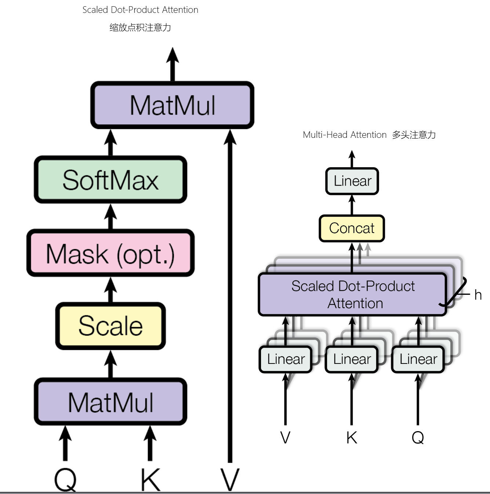
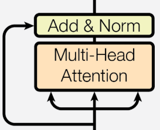
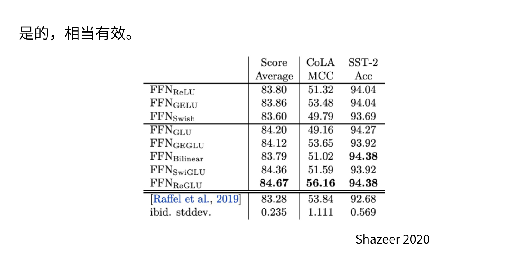
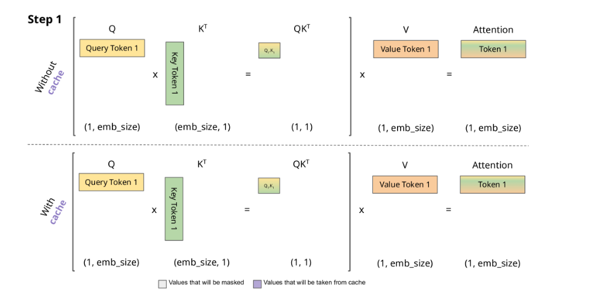
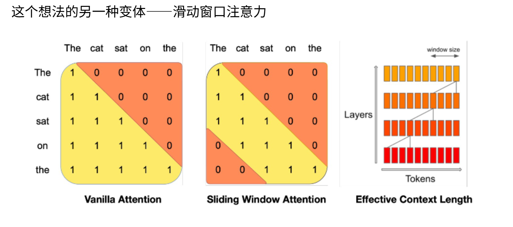
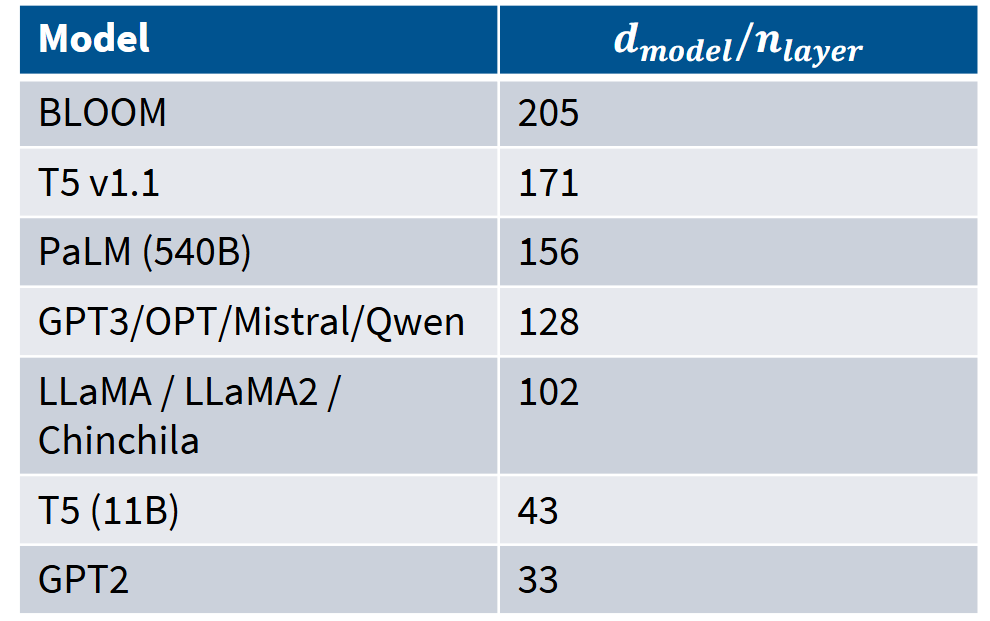

## 一、快速回顾标准的Transformer架构

transformer模型的起源可以追溯到2017年，当时由Google研究团队在论文[《Attention Is All You Need》](https://arxiv.org/abs/1706.03762)中首次提出。该模型的核心创新是引入了**自注意力机制**（Self-Attention Mechanism），摒弃了传统的循环神经网络（RNN）和卷积神经网络（CNN）结构。自注意力机制允许模型在处理序列数据时并行计算，从而大幅提高了计算效率，并解决了长距离依赖问题。


上述图中是Transformer 的 Block 结构，右边是**解码器Block**和**编码器Block，解码器和编码器堆叠*N就是transformer结构**

---

### 1. 位置编码(Positional Encoding)--正余弦位置编码

$$
\begin{align*}
PE_{(pos,2i)} &= \sin\left(\frac{pos}{10000^{2i/d_{\text{model}}}}\right) \\
PE_{(pos,2i+1)} &= \cos\left(\frac{pos}{10000^{2i/d_{\text{model}}}}\right)
\end{align*}
$$

**变量说明**：

- `pos`：token在序列中的位置（0, 1, 2, ..., N-1）

- `i`：维度索引（0到d_model/2-1）

- `d_model`：模型嵌入维度（论文中512）

- `10000`：基础频率（可配置）

带入公式计算出位置编码后直接和词嵌入相加`X = Token + PE(pos)`

---


- 提问：为什么需要位置编码

**答**：由于Transformer没有循环或卷积结构，模型本身是**排列不变**的。位置编码通过与token嵌入相加，为模型提供必要的顺序信息。


- 提问：正余弦位置编码如何提供位置信息的

**答**：对于不同位置 `pos`，位置编码向量的每个维度都有不同的取值，形成**独特模式，模型会学习到这种模式来区分远近。**

---


### 2.多头注意力机制


注意力机制仿照人类注意力的运行原理，人类在看一张图片时不会将注意力均匀的放在照片的每个角落，而是有选择的观察图片中亮眼和突出的部分。注意力机制也是这样，会关注输入中重要的部分，表现为权重大。注意力机制本质是加权求和。

--- 

#### **1. 单头注意力机制的做法：**

对输入序列 `X`（形状: `[batch_size, seq_len, d_model]`）：

$$
\begin{align*}
Q &= X W^Q \\
K &= X W^K \\
V &= X W^V
\end{align*}
$$

其中：

- `W^Q, W^K, W^V` 是权重矩阵，形状 `[d_model, d_model]`

- `Q, K, V` 形状：`[batch_size, seq_len, d_model]`

$\text{Attention}(Q, K, V) = \text{softmax}\left(\frac{Q K^T}{\sqrt{d_k}}\right)V$

在《Attention Is All You Need》中：

- **d_model** = 512（模型维度）

- **h** = 8（头数）

- **d_k = d_v** = 64（每头维度，512/8=64）

- **缩放因子**：`√d_k = 8`

多头注意力（Multi-Head Attention）是Transformer的核心创新，通过**并行执行多个注意力"头"**，让模型同时关注不同位置、不同语义层面的信息。

---


#### **2.单头注意力的局限**

单个注意力头只能计算一种**查询-键-值**关系，如同只用一双眼睛观察。这会导致：

- 难以同时捕获**语法结构**和**语义关联**

- 注意力分布过于分散，无法聚焦多种模式

**动机**：将注意力机制**重复多次**，让每头学习不同的子空间表示，最后合并结果。

---


#### **3.切分为多头**

将 `d_model` 拆分为 `h` 个头，每头维度 `d_k = d_model / h`：

```Plain Text
Q = Q.reshape(batch_size, seq_len, h, d_k)  # [bs, seq_len, h, d_k]
Q = Q.transpose(1, 2)                       # [bs, h, seq_len, d_k]
```

现在形状：`[batch_size, h, seq_len, d_k]`（同理处理K, V）

对每个头 `i`：

$\text{Head}_i = \text{Attention}(Q_i, K_i, V_i) = \text{softmax}\left(\frac{Q_i K_i^T}{\sqrt{d_k}}\right)V_i$

- `Q_i K_i^T` 形状：`[batch_size, h, seq_len, seq_len]`

- 输出 `Head_i` 形状：`[batch_size, h, seq_len, d_k]`

拼接所有头

$\text{MultiHead}(Q,K,V) = \text{Concat}(\text{Head}_1, ..., \text{Head}_h)$

拼接后形状：`[batch_size, seq_len, d_model]`（`h × d_k = d_model`）

最终线性变换

$\text{Output} = \text{MultiHead}(Q,K,V) W^O$

`W^O` 形状：`[d_model, d_model]`，输出保持 `d_model` 维度。

---

**原始论文中的具体参数**

在《Attention Is All You Need》中：

- **d_model** = 512（模型维度）

- **h** = 8（头数）

- **d_k = d_v** = 64（每头维度，512/8=64）

- **缩放因子**：`√d_k = 8`

---

- 提问：为什么要多头而不是单头

**答**：并行关注不同模式，每个头可学习不同注意力模式：

比如（假设）：

- **Head 1**：关注**语法依赖**（主谓宾关系）

- **Head 2**：关注**共指关系**（代词指代）

- **Head 3**：关注**语义相似**（同义词）

**提升表示能力**

- 每头在**低维子空间**（d_k=64）计算，比单头在高维空间更高效

- 多头合并相当于**高秩矩阵分解**，表达能力更强

**计算效率高**

- 各头可**并行计算**，适合GPU加速

- 总计算量与单头相当（d_model × d_model）

---

- 提问：：为什么要除$\sqrt{d_k}$

**答**：原始论文中推测$\sqrt{d_k}$值较大时，点积的绝对值会变得很大，将$softmax$函数推入梯度极小的区域为了抵消这种影响，我们对点积进行$1/\sqrt{d_k}$的缩放。现代推测再点积的时候方差会被放大，
点积$Q \cdot K = \sum_{i=1}^{d_k} q_i k_i$
点积的**方差**为：
  $$
  \text{Var}(Q \cdot K) = \sum_{i=1}^{d_k} \text{Var}(q_i k_i) = d_k \cdot \text{Var}(q_i k_i)
  $$
除$\sqrt{d_k}$后将分布重新变成标准化，作用就有：
1. **保持方差稳定**：无论$d_k$多大，输入softmax的值都在合理范围
2. **避免梯度消失**：softmax的梯度保持有效值，反向传播顺畅
3. **稳定训练**：使模型对维度选择不敏感，原始论文使用$d_k=64$（单头）依然稳定

---


### 3. 层归一化（LayerNorm）与残差链接

#### 1.什么是归一化
归一化是将数据按特定规则进行缩放，使其落入统一的标准范围或分布的技术。在深度学习中，它主要指对神经网络中间层的激活值或权重进行变换，以稳定训练过程、加速收敛。
在概率论中的归一化公式为`x_norm = (x - μ) / σ`，其中μ和σ分别是原始数据的均值和标准差。这样处理后的数据分布被"重置"为标准状态。对每个元素减去均值和除以方差，最后就是一个方差为一，均值为零的分布。

transformer原始的层归一化：

$$
\text{LayerNorm}(v) = \gamma \frac{v - \mu}{\sigma} + \beta
$$

类似的，层归一化就是对同一层（单个样本）进行的归一化，和普通的归一化没有什么本质区别。

1. **计算均值**（对同一层的所有神经元）：
   $$
   \mu = \frac{1}{d} \sum_{i=1}^{d} v_i
   $$

2. **计算标准差**：
   $$
   \sigma = \sqrt{\frac{1}{d} \sum_{i=1}^{d} (v_i - \mu)^2 + \varepsilon}
   $$
   其中$\varepsilon$是极小常数（$10^{-6}$），防止除零错误
3. **归一化**：
   $$
   \hat{v} = \frac{v - \mu}{\sigma}
   $$
4. **可学习参数调整**：
   $$
   \text{Output} = \gamma \cdot \hat{v} + \beta
   $$

**可学习参数** | $\gamma$（缩放）和$\beta$（平移），维度与输入相同。让模型自己学习缩放和平移。

---

#### 2. 什么是残差

残差（Residual） 在深度学习中特指**残差连接**（Residual Connection），也称为跳跃连接（Skip Connection），是连接神经网络层与层之间的"捷径"，让信息可以直接绕过某些层传递。



残差公式：
$$Output=Input+Layer(Input)$$
在这张图中可以看到，所谓的残差链接就是将在多头注意力层之前的数据直接在残差层相加，残差链接，从抽象层理解就是引入了浅层的信息流，防止随层数越深，信息的损失越大，误差会随之扩大。残差就是不断引入之前的信息来纠正。

从数学角度上，残差就是不强制网络直接学习理想映射 $H(x)$ ，而是让网络学习"残差" $F(x)=H(x)−x$ 如果某层不需要做变换，网络只需学习$ F(x)≈0$ ，保留输入$ x$ 
如果需要变换，网络学习对输入的"修正量"极端情况：即使$Layer$学习效果差，至少能保证$Output ≈ Input$，不会比不加深层更差

---

#### 3.层归一化和残差链接
在原始Transformer论文中，层归一化（Layer Normalization） 和残差连接（Residual Connection） 是协同工作的核心设计，共同确保深层网络稳定训练。
原始论文中是先残差链接在进行归一化：
$$ X = LayerNorm( X + Sublayer(x) ) $$ 
$Sublayer(x)$是注意力之前的子层输出；
- 残差连接确保梯度直接回传，至少保留恒等映射能力
- 层归一化将相加后的分布标准化，避免数值爆炸/消失
- 二者结合使12层甚至更深的网络可训练

---

- 提问：层归一化的作用
**答**：
解决分布漂移、梯度不稳定的问题，标准化分布，加速模型收敛，防止梯度消失和梯度爆炸。

- 提问：残差链接的作用
**答**：
确保梯度直接回传，至少保留恒等映射能力，提供稳定信息通路，解决分布不稳定，深层仍难训练的问题。


### 4. 前馈网络(Feed Forward)与激活函数


原始Transformer论文《Attention Is All You Need》中使用的激活函数是 **ReLU（Rectified Linear Unit）**，具体应用于**位置前馈网络（Position-wise Feed-Forward Networks）**。

---

##### 1.ReLU的应用位置

在编码器和解码器的每个层中，前馈网络的结构为：

$$
\text{FFN}(x) = \max(0, xW_1 + b_1)W_2 + b_2
$$

- **第一层**：线性变换 + **ReLU激活**（即`max(0, ·)`）
- **第二层**：线性变换（无激活函数）

---

#### 2.具体参数配置

根据原始论文：

| 参数 | 值 | 说明 |
|------|-----|------|
| **输入/输出维度** | $d_{\text{model}} = 512$ | 与模型主维度一致 |
| **中间层维度** | $d_{\text{ff}} = 2048$ | 扩展4倍后再压缩 |
| **激活函数** | ReLU | 仅应用于第一层 |

**完整流程**：
```
512维输入 → 线性层(512→2048) → ReLU → 线性层(2048→512) → 输出
```

---

#### 4.为什么用ReLU？

1. **计算高效**：相比Sigmoid/Tanh，ReLU的导数计算简单（0或1）
2. **缓解梯度消失**：正区间梯度恒为1，利于深层网络（12层）训练
3. **稀疏激活**：约50%神经元输出为0，减少计算量

---

- 提问：一个合格的激活函数需要什么基础特质。
**答**：
1. **非线性**，一个激活函数必须是非线性，对于一个线性函数，无论多么深的神经网络，他始终是一个简单的神经网络，只能拟合简单的函数，多层网络会退化为单层线性模型，对于非线性函数，能增加网络的复杂性，学习复杂问题。
2. **可微性**，在定义域内几乎处处可微，支持梯度下降和反向传播，否则无法使用梯度下降来训练模型。ReLU在x=0 处不可微，但实践中使用次梯度（subgradient），效果良好。
3. **计算要简单高效**，一个激活函数在模型推理和训练中会被调用数十亿次，在高数量级下的运算下的计算成本不会太高。

---

## 二、Transformer的现代变体及代表模型

我们介绍了Transformer的标准架构，这几年涌现了不少优质论文：CommandA、2OLMo、SmolLM、Phi-4，接着又看到Gemma3、Qwen2.5、InternLM......越来越多的模型甚至挤满了整个屏幕。去年共发布了约19个稠密模型，其中多数都涉及细微的架构调整。


我们会发现仅仅学习一个原始论文的标准架构会越来越不足以面对市场上越来越快的创新，这是了一份从2017年原始Transformer到2025年最新模型的架构对比表格。

你会发现每个模块都有些创新，比如**位置编码**这一列，人们曾尝试绝对位置编码、相对位置编码、RoPE，部分模型还经历过ALiBi编码阶段。当然后面会有趋同演化，2023年左右开始，所有人都开始采用RoPE，因为性能更好！Llama-like的架构趋同趋势，Llama作为最受欢迎的开源模型（**这个地位正在被qwen系列挑战**），改进的架构都具有**参考意义**。

我将重点讲解激活函数、前馈网络、注意力机制变体、位置编码等所有相关组件。在确定架构之后，我们需要做什么？我们需要选择超参数：隐藏层维度设为多大？MLP内部投影层的规模如何设定？维度数量如何处理？词汇表容量多少？这些都是在实际训练语言模型时必须决策的重要事项

我们要介绍常见的架构变体：
1. 激活函数
2. 注意力变体
3. 位置嵌入
4. 归一化


### 1. 归一化


#### 1. **位置上，Post-LN（原始论文设计，后归一化）**
**结构**：子层 → 残差连接 → 层归一化
$$
X = LayerNorm( X + Sublayer(x) ) 
$$

这是原始论文的设计，后归一化方案（左侧图）：灰色残差连接流经过每个子组件后都要执行LayerNorm。而很快人们就发现，将LayerNorm移至非残差部分前端能在多方面获得更好效果（右侧图）。（Per-LN）

#### 2. **位置上，Per-LN（现代主流，预归一化）**

**结构**：层归一化 → 子层 → 残差连接
$$
X =  X +  LayerNorm(Sublayer(x) ) 
$$

**优势**：
- **训练更稳定**，无需复杂预热
- 适用于**极深网络**（100+层）
- 已成为GPT-3、PaLM等大模型的默认配置

采用预归一化配合其他稳定化技巧后，即使不使用预热机制，系统表现也能媲美甚至优于需要精细预热方案的后归一化LayerNorm。左图展示了机器翻译场景下的对比结果，右图则显示在各类任务（特别是使用后归一化训练的BERT）上的同样趋势。关于预归一化的优势存在多种解释：有研究认为它能避免层间梯度衰减，保持梯度规模恒定；而未使用预热的后归一化会导致梯度爆炸（橙色曲线）。这些论点都很有说服力。但更符合现代认知的解释可能是：预归一化本身就是更稳定的训练架构。因此，Salazar和Nguyen的一些早期研究发现了所有这些损失峰值——如果使用预归一化（图中蓝色部分）进行训练，你会看到更多的损失峰值，训练过程会变得不太稳定。可以看到这里的梯度范数出现尖峰，且通常高于预归一化的情况。如今，预归一化和其他LayerNorm技巧被广泛用作训练大型神经网络时的稳定性辅助手段。


#### 3. 结构上，“双归一化”

为什么一定要把LayerNorm放在前端？不能放在前馈网络之后吗？当然可以。不仅如此，最近的研究还尝试在模块前后都添加LayerNorm。Grok和Gemma2就采用了这种前后都放置LayerNorm的方式，而Olmo2仅在前馈网络和多头注意力之后使用LayerNorm。预归一化（Per-Norm）曾长期占据主导地位，但现状正在改变。现在出现了新的变体，并且已有相关评估研究。有人认为这种新方式在训练更大模型时更稳定且效果更好。


#### 4. 简化变体：RMSNorm

LayerNorm计算均值和标准差**成本高**，且对Transformer并非必要，基本上所有模型都改用RMSNorm，其核心变化是：直接去除了均值调整环节。所以你不减去均值。你也不添加偏置项。许多知名模型都采用这种做法。LLaMA系列、PaLM、Chinchilla、T5等模型都已转向使用RMS归一化。一个原因是这实际上没有太大区别。使用RMS归一化训练的模型表现与使用层归一化训练的效果相当。但真正的原因是改用RMS归一化速度更快且效果同样好。不减去均值意味着更少的运算操作。其次，不需要添加偏置项β意味着需要从内存加载到计算单元的参数量更少。

transformer原始的层归一化：

$$
\text{LayerNorm}(v) = \gamma \frac{v - \mu}{\sigma} + \beta
$$


**公式**（去掉均值归一化，仅保留方差归一化）：
$$
\text{RMSNorm}(v) = \gamma \frac{v}{\sqrt{\frac{1}{d}\sum_{i=1}^{d} v_i^2 + \varepsilon}}
$$

各个模型都在用实际情况说明去掉均值归一化，仅保留方差归一化效果更好，计算更快。

Narang等人2020年的消融实验清晰表明：基准Transformer每秒处理3.5步，而RMS归一化版本达到3.68步，且最终损失值还低于基准模型。


RMSNorm运行时的收益已经能在论文中观察到。

- 提问 为什么残差中的LayerNorm不好（post-norm）
**答**：
但直观解释是：残差连接使得网络从顶层到底层保持恒等映射，这对训练极深网络时的梯度传播非常有利。LSTM等状态空间模型在梯度反向传播上存在困难，而恒等连接完全避免了这个问题。在中间插入LayerNorm可能会干扰这种梯度行为——这一点正好与之前展示的梯度尖峰现象吻合。虽然LayerNorm效果良好，但如今许多模型已转向使用RMSNorm——这已成为共识性改进。

### 2. 前馈网络

原始transformer中的前馈网络
$$
FFN(x) = max(0, xW_1 + b_1)W_2 + b_2
$$

原始Transformer的前馈网络结构包含带偏置的线性层→ReLU→第二个线性层。但当前主流实现（非门控单元版本）均已移除所有偏置项（b）。因为矩阵乘法就已经能满足模型运行了。另一个实际上是优化稳定性。现在没有人完全理解为什么偏置项对稳定性特别不利，但已有非常明确的实证观察表明，去除这些偏置项通常能稳定这些大型神经网络的训练。因此，现在许多实现完全省略了偏置项，仅在这些纯矩阵乘法类设置中进行训练。

现代模型的大多数实现（如果不是门控的）：

$$
𝐹𝐹𝑁(𝑥) = {\sigma}(𝑥𝑊_1)𝑊_2
$$

FFN去除偏置项b的理由几乎和RMSNorm一致，去除偏置项的想法广泛适用，许多模型在大多数地方根本没有偏置项。

### 3. 激活函数

从transformer或者深度学习这个概念被发明起，大家都热衷于改进其中的激活函数，有一大堆激活函数——ReLU、GeLU、Swish、ELU、GeGLU。有不同类型的MLP——GeGLU、ReGLU、SeLU、SwiGLU和LiGLU。这些是什么？人们使用它干什么，这又有多重要？


#### 1.ReLU函数

ReLU函数我们在回顾transformer中介绍过，只需取0和输入的最大值。这是最基础的激活函数，相当简单。它的一个优点就是它的微分相当简单。

#### 2.GeLU函数

GeLU又叫高斯误差线性单元，它将线性部分与高斯的累积分布函数相乘。所以这基本上就像是ReLU，但在这里稍微有点凸起。在上面的图像中你可以看到它在原点处有稍微的突起，其他和ReLU函数的形状基本一致，ReLU函数在原点是突变的，这意味这它在原点不可微，而GeLU改善了ReLU的缺点。这使得函数更具可微性，可能对训练有帮助也可能没有。GPT系列模型——包括GPT-1/2/3和GPT-J等都使用GeLU激活函数。而原始Transformer和一些早期模型使用的是ReLU。

它的一个缺点就是要比ReLU计算更加复杂，会更加占用计算资源。

GeLU函数由于精确计算误差函数开销大，实践中使用多项式近似。

---

#### 3. 门控线性单元（GLU）
GeLU启发了门控线性单元（GLU）家族。
基本上2023年之后的所有模型都采用了门控线性单元。


##### 1.GLU，门控家族老祖

$$
\text{GLU}(x) = (xW) \odot \sigma(xV)
$$

其中：
- **$x \in \mathbb{R}^{d_{\text{model}}}$**：输入向量
- **$W, V \in \mathbb{R}^{d_{\text{model}} \times d_{\text{ff}}}$**：两个独立的线性变换矩阵
- **$\sigma$** ：Sigmoid函数，将门控值压缩到 **(0, 1)**
- **$\odot$**：逐元素相乘（Hadamard积）

工作原理解析
GLU可理解为 **"门控+内容"** 双通道机制：
1. **内容通道**：$xW$ 提供原始信息
2. **门控通道**：$\sigma(xV)$ 生成0-1之间的"开关"，决定每个神经元的通过量
3. **动态激活**：每个token的门控值都不同，实现**输入依赖的稀疏性**

可以这样理解：我们对MLP的隐藏层进行了**门控**。原始激活函数将输入映射到隐藏空间后，我会用x·V对其进行门控，再通过W2投影回隐藏维度。这里发生的核心操作就是**逐元素门控**。
像一扇智能百叶窗，根据输入动态调节每片叶片的开度，而非传统激活函数的"全开/全关"。由于是逐元素相乘，$\sigma(xV)$的每个元素与$(xW)$的对应元素相乘，$\sigma(xV)$可以理解为它为每个元素生成了零到一的开关，与$(xW)$相乘后是零的地方就为零，一的地方就是不改变，中间就相当于取了权重。

---

##### 2.  主流变体

**GeGLU（Gated GELU）**
$$
\text{GeGLU}(x) = (xW) \cdot \text{GELU}(xV)
$$
- **改进**：用平滑的GELU替代Sigmoid作为门控函数
- **优势**：梯度更稳定，性能略优

这种架构被许多谷歌模型采用，比如T5、Gemma2/3等。

**SwiGLU（Swish GLU）**

$$
\text{SwiGLU}(x) = \text{Swish}(xW) \odot (xV)
$$
其中 $\text{Swish}(x) = x \cdot \sigma(\beta x)$，其形状与高斯误差单元相似，通常$\beta=1$

- **优势**：相比GeGLU**性能进一步提升**
- **代价**：计算成本最高
SwiGLU基本上是当今大多数模型采用的结构。比如LLaMA系列、PaLM、OlMo

---

- 提问：门控单元有效吗？
**答**：



NoamShazeer的原始论文中评估了所有GLU变体。这些数据虽然相对较早，但可以看到在CoLA和SST-2任务上的表现。能明显观察到GLU变体持续表现**更优**：GLU分别达到84.20、84.12、84.36、84.67。值得一提的是这是2020年的研究，他们甚至提供了标准差以便评估结果显著性——事实上这些结果确实具有统计显著性。这是很好的实证依据。2020年Narang等人的论文也值得关注，这篇优质研究在T5类模型中测试了各种架构变体。再次可以看到门控线性单元变体始终获得更低的损失值，加粗行对应的正是GLU变体。这种优势模式一直延续至今。关于门控和激活函数，不同模型存在诸多变体，但门控线性单元已基本成为主流选择。

关于门控和激活函数，不同模型存在诸多变体，但门控线性单元已基本成为主流选择，我们认为这有其充分理由。当然需要明确：优秀模型不一定必须使用GLU。不能因为它的轻微优势和普遍使用就认为不可或缺。确实存在许多高性能模型未使用GLU的案例。例如GPT-3；更新的Nemotron340B则使用了平方ReLU——这是之前未见过的设计。而Falcon211b使用的是ReLU激活函数。这两者都是相对高性能的模型。因此可以看出这并非必要选择。现有证据确实表明SwiGLU和GeGLU能带来持续性能提升。

---

### 3. 位置编码


#### 1. 正弦嵌入（Sine Embeddings）

原始Transformer论文提出的**固定式绝对位置编码**，使用正弦/余弦函数生成唯一模式：

$$
PE_{(pos, 2i)} = \sin\left(\frac{pos}{10000^{2i/d_{\text{model}}}}\right)
$$

$$
PE_{(pos, 2i+1)} = \cos\left(\frac{pos}{10000^{2i/d_{\text{model}}}}\right)
$$

其中：
- $pos$：token位置索引
- $i$：维度索引（0到$d_{\text{model}}/2$）
- $d_{\text{model}}$：模型维度（如512）

核心特性
1. **无参化**：无需训练参数，计算高效
2. **外推性**：可泛化到训练时未见的更长序列
3. **波长递增**：低频到高频覆盖，捕捉不同尺度位置关系

局限性
- **绝对位置感知**：无法直接建模相对距离
- **长序列性能衰减**：位置编码差异随距离增大而模糊

---

#### 2.绝对嵌入（Absolute Embedding）


为序列中**每个位置分配唯一编码向量**，与词嵌入相加：

$$
\text{Final Embedding} = \text{Token Embedding} + \text{Positional Embedding}
$$

T5和Gopher等模型则采用相对位置编码

---

#### 3.相对嵌入（Relative Embedding）

不再编码绝对位置，而是在**注意力计算中显式引入相对位置信息,在注意力计算中添加向量**，让模型关注token间距离。

---

#### 4. 旋转位置编码（RoPE）

目前绝大多数**先进模型都采用旋转位置编码**，这最早出现在GPT-J中，又一次开源贡献。如今RoPE拥有多种扩展上下文长度的算法，这是现代生产级语言模型的重要组成部分。而且即使在小规模短上下文场景下，实证效果也非常显著，可以说已在位置嵌入的竞争中胜出。我认为存在θ值的变化。至于每对维度的θ是超参数还是训练所得？决定旋转角的θ并非超参数，类似正弦余弦嵌入，旋转角按预定方案设置，其设计直觉与正弦余弦相同——需要覆盖不同频率范围以获取高低频信息。旋转操作是否增加训练难度？实际上旋转本身不会产生问题，因为它本质是矩阵乘法。由于θ和m值固定，这相当于用固定矩阵乘以向量。


**什么是旋转？**

旋转这个概念和复数有关。
在二维空间中，向量$\boldsymbol{v}=(x,y)$可表示为复数$z = x + iy$。将其旋转$\theta$角度等价于乘以$e^{i\theta}$,利用三角函数和复数的性质，等价为乘一个旋转矩阵。

在**向量空间**中，将一个向量顺时针或逆时针**旋转一定角度**，可以通过将这个**矩阵与旋转矩阵点乘**来实现：
在二维空间中，一个旋转矩阵可以表示为：

$$
R(\theta)=\begin{bmatrix}
\cos(\theta)&-\sin(\theta)\\
\sin(\theta)&\cos(\theta)
\end{bmatrix}
$$

将一个矩阵旋转$\theta$度可以等价为乘以一个旋转矩阵。

$$
R({\theta}) \cdot \boldsymbol{v} = \begin{pmatrix}
\cos\theta & -\sin\theta \\
\sin\theta & \cos\theta
\end{pmatrix}
\begin{pmatrix}
x \\
y
\end{pmatrix}
$$

这里插播一下旋转矩阵的数学性质：
1.**正交性**：旋转矩阵是正交矩阵，这意味着它的列向量和行向量都是单位向量，并且两两正交。因此，旋转矩阵的逆矩阵等于它的转置矩阵。
2.**行列式为1**：旋转矩阵的行列式为1，这表示旋转操作不会改变向量的长度，只改变其方向。
3.**周期性**：旋转矩阵具有周期性，即$R(\theta+2\pi)=R(\theta)$。
4.**基础运算**：旋转矩阵的乘法遵循矩阵乘法的规则，即$R(a+b)=R(a)R(b)$。我们**马上就会用到**这一条。


当我们对Q、K矩阵都进行旋转后：
$$
Q_1 = R(m)\cdot Q
$$
$$
K_1 = R(n)\cdot K
$$

我们在计算注意力的时候会将K和V的乘积。$\text{Attention}(Q, K, V) = \text{softmax}\left(\frac{Q K^T}{\sqrt{d_k}}\right)V$

$$
Q_1 \cdot K_1^T = R(m) \cdot R(n)^T \cdot QK^T
$$

$$
Q_1 \cdot K_1^T = R(m) \cdot R( -n) \cdot QK^T
$$

$$
Q_1 \cdot K_1^T = R(m-n) \cdot QK^T
$$

我们为不同位置的token都乘以不同角度的旋转矩阵在计算注意力的时候就会出现$R(m-n)$,这就代表两个token的相对位置信息。

---

当然，这是**二维**的情况，我们可以扩展到**高维向量**，虽然二维空间的旋转很直观，但高维空间的旋转方式并不显然。RoPE提出的解决方案是将D维向量分割为多个二维子块，在每个二维子空间内独立实施旋转操作：

矩阵$R(m\theta)$是一个用于RoPE的旋转矩阵，它被设计为一个方阵，其中包含了余弦和正弦函数的值，这些值用于编码位置信息。矩阵的每一行和每一列对应于嵌入向量中的一个维度。矩阵的结构如下：

$$
R(m\theta)=\begin{bmatrix}
\cos(m\theta_0)&\sin(m\theta_0)&0&0&\cdots&0\\
-\sin(m\theta_0)&\cos(m\theta_0)&0&0&\cdots&0\\
0&0&\cos(m\theta_1)&\sin(mf_1)&\cdots&0\\
0&0&-\sin(m\theta_1)&\cos(m\theta_1)&\cdots&0\\
\vdots&\vdots&\vdots&\vdots&\ddots&\vdots\\
0&0&0&0&\cdots&\cos(m\theta_{\frac{d}{2}-1})\\
0&0&0&0&\cdots&-\sin(m\theta_{\frac{d}{2}-1})
\end{bmatrix}
$$

这里，$m$是一个标量，通常与位置索引相关，$f_i$是与每个维度相关的频率，$d$是嵌入向量的维度。矩阵中的每个$2\times2$子块对应于嵌入向量中的一对维度，这些子块用于在复数空间中旋转向量。


频率参数：
$$
\theta_i = 10000^{-2i/d}
$$

其中，$i$是维度索引（从0开始），$d$是嵌入向量的总维度。

这种高维空间的嵌入方法**简单高效**：确保了在高维空间中保持相对位置关系的**数学特性**。每**两个维度**都会按某个角度θ旋转，因此会有一个旋转速度。我将对成对的维度进行旋转。这样一来，每对维度都在编码所有这些相对位置信息。与正弦余弦嵌入类似，选择一组θ值，使得某些嵌入快速旋转，而其他嵌入旋转得更慢。这样既能捕捉高频信息（近距离信息），也能捕捉远距离的低频位置信息。

RoPE的实际数学原理是：若考虑旋转操作，**只需与不同的正弦余弦旋转矩阵相乘**。如果你还记得线性代数和三角学中的相关知识。可以将其视为一种运算，即用这些2×2分块矩阵乘以嵌入向量。这里没有出现加法项或交叉项，完全是相对性的。

相比原始论文中的正弦余弦嵌入，这里的不同之处在于：RoPE会在实际的注意力层中运作，而非在底层添加位置嵌入。每当进行注意力计算时，都会在该层进行干预，从而获得位置信息。

---

为什么大家都喜欢用RoPE：

- **显式相对位置**：内积仅依赖相对距离，符合注意力本质
- **无限外推**：正交旋转可无限延伸，支持百万级上下文
- **无参高效**：零额外参数，计算开销可忽略

---

### 4. 注意力机制的变体

说到注意力机制就不得不提到Q、K、V三板斧。多头注意力机制通过将输入分割为多个头，然后对每个头进行自注意力，最后再进行合并。实现多头注意力机制。

在**传统的注意力机制中**，我们会为**每个头来分配一个Q、K、V矩阵**，对于每个头都有**独属**于自己的Q、K、V矩阵。
对于$h_1$来说，会为它分配$Q_1$、$K_1$、$V_1$是三个**不同**的矩阵，对于$h_2$来说，也会分配$Q_2$、$K_2$、$V_2$三个**不同的矩阵**。

#### 1. KV cache



我们生成文本时，记住我们生成一个token，然后Transformer读取该token并处理它，接着我们可以得到下一个token的分布，然后我们自回归地一次一个token地执行操作。通过这样做，我们无法并行化生成过程，我们需要为每个新token逐步进行。我们会存储历史计算的K和V的值，这样我们在生成新的token的时候就不用重复计算K和V的值，这称为KV cache。

---

#### 1.MQA多查询注意力（Multi Query Attention, MQA）


传统 **多头注意力机制（HMA）** 会为每个头分配一个Q、K、V矩阵，对于每个头都有独属于自己的Q、K、V矩阵。**多查询注意力（Multi Query Attention, MQA）** 则对其进行了优化。他的主要的改进点是**共享K、V矩阵**，即多个头共享同一个K、V矩，Q矩阵则**不共享**。这也是它名字**多查询注意力**的由来。这样减小了存储KV矩阵显存的压力。
- **在 MQA 中**，所有的注意力头共享相同的键（K）和值（V）矩阵。每个注意力头只保留自己的查询（Q）矩阵。这意味着键和值的计算和存储只需要进行一次，而不是为每个头重复计算。
- **查询（Q）矩阵**仍然是独立的：每个头有自己独立的查询矩阵，因此每个头仍然可以从不同的角度来关注输入数据的不同特征。这样就不用为每个头单独计算K、V矩阵了，从而节省了内存和算力

---

#### 2.GQA分组查询注意力机制（Grouped Query Attention, GQA）

GQA（分组查询注意力）在此基础上稍作调整：不再采用多查询配单键的模式，而是按一定倍数减少键的数量。这样可以在推理时间表现和模型表达能力之间取得平衡。因为从多头注意力直接切换到多查询注意力可能过于激进，

GQA 的**核心思想**是将 **查询（Query）** 分成多个组，每个组共享一组键（Key）和值（Value），而不是每个 Query 头都独立使用自己的 Key 和 Value。具体来说，对于MQA来说，所有的头都e键和值矩阵共享，而每个头都有自己的查询矩阵。但对于与GQA来说，它将头都划分为多个组，每个组共享一组键和值矩阵，每个头都有自己的查询矩阵。

也就是说，GQA觉得MQA和MHA太极端了，它选择站中间，通过**分组查询注意力机制（GQA）**，Qwen系列模型在保持较高推理效率的同时，减少了KV缓存的冗余计算，例如，Qwen2-32B 的 KV 缓存显存占用降低至标准多头注意力的62%。这种设计在大规模语言模型中尤其有效，能够***显著提升推理速度和资源利用率***。

---

#### 3.稀疏 / 滑动窗口注意力


回顾2019年，OpenAI发表了一篇精彩论文，探讨如何构建更长注意力的模型。他们提出的解决方案是**设计稀疏注意力模式**，不是关注整个序列，而是聚焦于每个分块的局部窗口，再辅以对角线等注意力模式来跨区块传递信息。通过这种稀疏或结构化注意力，可以在表达能力和运行效率之间取得平衡。

GPT-3最初发布时就采用了这类技巧来实现更大的注意力窗口。滑动窗口注意力是该思想的另一个变体，在每个层级仅关注当前位置的邻近区域。这种方式能有效控制处理长文本所需的总资源量，此时有效感受野等于局部范围乘以层数。虽然这些是较早的思路，但现代实现方式有了新的发展。



最近LLaMA4、Gemma和CohereCommandA等论文提出了一种巧妙的方案：构建包含**四个Transformer块**的组合，最底层的块使用完全自注意力机制但不含任何位置嵌入（既无RoPE也无其他位置编码），完全不具备位置感知能力，却实现了**完整的自注意力功能**。而且这种情况每四个区块才发生一次。然后它上面的三个区块使用带有RoPE的滑动窗口注意力机制。这实际上是一个非常巧妙的技巧，既能控制系统层面的因素，因为完全注意力机制只是偶尔发生；同时也能处理长度外推的问题，因为RoPE只处理局部上下文窗口。对于真正长距离的依赖关系，则完全不需要位置嵌入，因此可以**实现非常激进的外推**。

---

## 三、超参数考量与设计原则

当你突然被要求训练一个新语言模型时，会对超参数产生很多疑问，因为它们的数量相当多。你应该意识到的一个关键点是：在不同成功模型中，实际上只有少数几个超参数会被调整。业界遵循着相当明确的经验法则和指导原则。比如前馈网络的尺寸应该扩大多少？注意力头数量该如何设定？词表规模多大合适？前馈层（FFN）大小应该比隐藏层大小大多少？有多少个头，num_heads 是否总是应该能整除隐藏层大小？人们是如何扩展这些模型的，是变得更深（deep）还是变得更宽（wide）？
这些问题都会在这一章解决！

### 1.前馈神经网络

首先从简单的前馈层开始。假设这是个带偏置(b)的ReLU版本：

$$ 
FFN(x) = max(0,xW_1 + b_1)W_2 + b_2
$$

这里涉及两个超参数：$d_{model}$（输入x的维度，即FFN的输入维度）和$d_{ff}$（前馈网络维度，即FFN的隐藏层输出维度），最终会投影回$d_{model}$维度。当你打算扩大模型的时候，FFN通常也会扩大，具体扩大多少倍其实业内早有共识：几乎所有使用ReLU类MLP的研究者都会将$d_{ff}$设为$d_{model}$的4倍。

$$
d_{ff} = 4d_{model}
$$

这是经过验证的惯例，这种惯例不是百分百正确的，存在一些例外：

---

**例外一：GLU变体会将扩展系数调整为2/3**

通过简单计算可知，若将GLU变体的$d_{ff}$设为(8/3)$d_{model}$。
$$
d_{ff}  = (8/3) d_{model}
$$
观察现有模型会发现，许多都遵循这个经验法则(8/3)约等于2.66


以PaLM为例，Mistral和LLaMA的设定稍大些。虽然它们都是GLU模型，但并未遵循2.6倍规则。而LLaMA-1、Qwen、DeepSeek、Yi和T5等模型都大致遵循2.6倍左右的设定

---

**例外二：T5模型**

某种程度上，大语言模型训练就像是场超参数复刻游戏，导致领域发展趋于保守。但T5模型却展现了非凡魄力——我认为谷歌团队确实做了些相当大胆的尝试。在110亿（11B）参数的T5模型中，他们采用了令人惊叹的配置：隐藏维度仅设置为1024。但它们的$d_{ff}$（前馈网络维度）及其向上投影的维度是——这将使$d_{ff}$与$d_{model}$的**比例达到64倍**。当然，与此相比，PaLM的比例因子大约是4，而其他模型则小得多。
这是一个非常大的差异。最近还有一些其他例子使用了更大的乘数，Gemma2紧随其后采用了8倍因子。

---

我们应该有个思考：是否有人通过更量化的实验证明这是合理的，在JaredKaplan的缩放定律论文中，虽然大多数人关注的是缩放定律部分，但实际上论文还包含非常有用的超参数研究。你会发现他们正好研究了我提到的$d_{ff}$与$d_{model}$比例，并绘制了随该比例变化时损失值的增长曲线。**图中显示存在一个最佳区间**，比例从1到10左右都有较宽的选择范围，你可以任意选择前馈网络比例而结果都接近最优。


从这些超参数研究中我们能学到什么？大量证据表明：如果不使用GLU激活函数，默认可以选用4倍乘数；若使用GLU，则可采用约2.66倍。这些设置对大多数现代语言模型都效果良好。不过T5再次证明不必拘泥于这些规则，你可以打破常规自由选择——没有哪个超参数是铁律，在其他超参数配置下也能获得合理的语言模型。有趣的是，这个故事有个耐人寻味的后续：T5的改进版T5v1.1采用了更标准的2.5倍GeGLU乘数。这或许暗示原团队重新评估后认为应该回调64倍乘数，选择更常规的配置，最终确实得到了更好的模型。

关于比例与模型效率的关系问题：这个比例本质上控制着MLP隐藏层的宽度。T5论文当初选择64倍的理由是可以通过极大化该维度实现更庞大的矩阵乘法。虽然理论上宽度增加能带来更多并行计算而非串行计算，但这实际上是以表达力为代价对参数和计算量进行次优分配——不过当矩阵足够宽时可能获得系统性能提升。


### 2.注意力头和模型维度的比例

另一个超参数共识是模型维度与头维度乘以头数量的比例。标准做法是保持每个头的维度固定而增加头数量，当然也可以选择保持单头维度不变来增加注意力部分的参数量——但大多数模型都遵循前一种方案。我们看到GPT-3、T5、LaMDA、PaLM和LLaMA2这些模型，它们的**比例都是1或几乎精确等于1**，$(NumHeads \cdot HeadDim )/ Model dim = 1$。T5是打破这个规则的唯一例外，他们尝试了16的大比例。但除此之外，**其他模型都相当遵循这个共识。**


Bhojanapalli等人2020年的研究，他们提出如果注意力头数量不断增加，其秩会越来越低。如果每个头的维度非常少，就会开始影响注意力操作的表达能力。但在实践中，我们似乎并没有遇到太多显著的低秩瓶颈问题。大多数采用1:1比例的模型都表现得很好。


### 3.模型的宽深比

我们的模型应该是要**深度还是宽度**？要多深和多宽？



普遍存在的一个最佳准则是：每层需要**约128个隐藏维度**。这个标准被很多GPT-3和LLaMA变体模型所遵循。

宽深比的考量非常重要，它会控制我们能实现的并行度。如果采用流水线并行，通常会将不同层切割后分配到不同设备或设备块上，因为每层内部也会并行化。这会给模型带来特定约束。对于特别宽的模型，可以采用张量并行，将矩阵切片分布到多个GPU上。我们将在后续课程中了解到，不同并行范式会产生不同约束。张量并行需要非常高速的网络，而流水线并行对网络速度或延迟的要求可以稍低。因此网络约束可能反过来影响宽度-深度的决策。

抛开这些限制，我们可以抽象思考：宽深比对模型性能有何影响？Kaplan等人再次提供了很好的可视化展示。这是三个不同规模的数据——5000万、2.74亿和15亿参数。横轴是宽深比，纵轴是损失差异的百分比变化。可以看到在**100左右出现了不同规模下的最小值**。


Google的ETay等人有一项非常有趣的研究，探讨了深度与宽度在上游和下游任务中的影响。他们发现：如果仅关注损失值，那么深度并不重要，参数数量才是唯一关键因素。但当下游准确率作为评估指标时，情况就不那么明确了。当时，他们正在研究微调后的SuperGLUE准确率。他们认为在相同计算量（FLOPs）下，更深的模型可能表现更好。这项工作的后续研究并不太多。但从长宽比的角度来看，下游任务的实际表现可能会略有不同。

### 4. 词汇表大小

总体而言，词汇表规模呈现不断**扩大**的趋势。我们认为这很大程度上是因为大语言模型正在实际部署中投入使用，逐渐成为更有用的服务。当这种情况发生时，模型需要与使用不同语言的人群交互，处理表情符号等各种近乎模态化或超出预期的语言形式。早期模型（尤其是单语模型）的词汇量通常在**3万到5万**token之间，比如早期的GPT和LLaMA系列。

但观察多语言模型或我称之为生产系统的模型时，会发现它们的词汇量都已扩展到**10万到25万**的范围。以注重多语言处理的Cohere公司推出的Command模型为例，其词汇量就非常庞大。即便是GPT-4及其后续采用GPT-4分词器的模型，词汇量也达到10万标记左右。因此**10万到20万的词汇量已成为行业主流标准**。有研究表明，随着模型规模扩大，模型在一定程度上能够处理更多词汇元素并有效利用它们。因此随着模型规模扩展或训练数据增加，词汇量呈现持续增长的趋势。

---

**提问：多语言词表是否有助于提升单一语言性能？**

多语言词表我们认为对高资源语言（比如英语和中文）来说影响较小。如果只考虑英语语言建模，使用较小词表也能胜任。但大词表真正发挥优势的领域是在处理少数语种时——不是指数据分布的尾部，而是指更小众的语言。有个典型例子是Cohere发布的模型或分词器，他们总是强调其大词表设计和分词器训练方式能让非英语低资源语言用更少token表示，从而大幅降低推理成本。

### 5. dropout和其他的正则化方法

模型运行前需要设置的两个重要组件：dropout和其他正则化方法。

预训练看似是最不需要正则化的场景——因为**预训练通常只进行一个训练周期**，由于数据量过大甚至无法完整遍历所有数据，**单轮训练**几乎不可能导致过拟合。这似乎构成了不需要正则化的充分理由。但实际情况却比较复杂。早期研究大量使用dropout，权重衰减也被广泛采用。虽然现在很多团队不再详细发布训练超参数，但dropout已逐渐失宠，而权重衰减**仍被持续使用**。


许多旧模型在预训练期间使用了dropout，较新的模型（除 Qwen 外）仅依赖权重衰减。

这其实相当反常：当使用SGD在海量数据上对巨型神经网络进行单轮训练时，为什么要使用权重衰减？

答案或许出乎直觉：权重衰减并非用于控制过拟合。实验表明，不同强度的权重衰减并不会改变训练损失与验证损失之间的比例关系。即使完全不使用权重衰减，过拟合现象也不会出现。真正有趣的是，权重衰减会以某种奇特的方式与优化器的学习率调度机制产生交互作用。

实施权重衰减并非为了正则化模型（虽然这原本是设计初衷），而是为了获得**更低的训练损失**。之所以能达到这个效果，是因为在训练末期随着学习率趋近于零时，各种学习动态产生了特殊作用。这是个非常有趣且复杂，甚至在某种程度上令人困扰的语言模型特性。但现在你们应该明白，为什么很多技术报告都会注明“我们使用了权重衰减”。


现在让我们看看可以实施的不同类型的权重衰减。在使用**权重衰减**时，模型在较高学习率下训练效果不佳。而当你降低学习率后，损失值会迅速下降。观察余弦学习率衰减时可以发现，高权重衰减的模型初始进展缓慢，但随着学习率降低（即冷却过程），它们会快速优化。这说明优化器与权重衰减之间存在着复杂的相互作用，在训练末期**会产生某种隐性加速**，最终得到更优模型。

---

## 五、模型的稳定性

过去一年的核心架构变化不大，但许多发布版本都突出强调了称之为**“稳定性技巧”**的内容。这些技巧旨在以更稳定的方式训练模型。随着模型规模不断扩大，训练时间持续延长，这类稳定性问题愈发凸显。


我们从OLMo2论文中可以看到这个案例，该论文在LLM训练稳定性方面提供了出色的学术成果。他们首先展示了这张图表：观察这里的蓝色曲线，这个梯度图的L2范数令人触目惊心。虽然损失曲线看似正常，但会不时出现异常尖峰。打开梯度范数图，会发现布满尖峰的恐怖图像，范数值完全失控。

用这种方式训练模型，将很难实现合理收敛——最终梯度范数爆炸导致训练彻底中断。因此当前重点是如何将**蓝色曲线**转变为类似**橙色曲线**的形态。虽然橙色曲线的损失值较高（可能因数据集切换所致），但其梯度范数始终保持在理想低位，这才是我们希望看到的图像。那么Transformer中哪些环节容易引发稳定性问题？实际上任何部位都可能出问题，但根据现有的技术干预来看，有个组件确实堪称“问题儿童”的就是**softmax函数**。问题根源在于：指数运算可能导致数值异常，除法运算可能产生除零错误。基于多种原因，softmax确实容易引发各类问题。需要补充说明：Transformer中存在两个softmax模块？一个是末端输出层的softmax，另一个是自注意力机制中的softmax。

在Transformer的两个softmax模块中：
自注意力softmax：计算注意力权重时，logits（QK^T）可能过大，导致梯度消失
输出层softmax：生成分布时，logits可能爆炸，使交叉熵损失不稳定

### 1. z—Loss技术-解决输出层的softmax

z-loss是一种softmax归一化器正则化技术，由Google在PaLM模型中正式提出并命名，但思想可追溯至更早的机器翻译研究。其核心目标是防止**softmax分母（归一化因子Z）过大或过小**，从而稳定训练过程。

$$
\mathcal{L}_{\text{z-loss}} = \lambda \cdot \log^2 Z
$$

其中：
- **$Z$**：softmax的归一化因子（partition function），$Z = \sum_{i=1}^{V} \exp(z_i)$
- **$\lambda$**：权重系数（PaLM使用 ** $10^{-4}$ **）
- **$z_i$**：logits（未归一化的预测分数）

**总损失函数**：

$$
\mathcal{L}_{\text{total}} = \mathcal{L}_{\text{cross-entropy}} + \lambda \cdot \log^2 Z
$$

它的目的是让**softmax归一化器**保持在良好的区间内。当z(x)接近1（或logz接近0）时，可以认为softmax处于良好状态。从某种意义上说，PaLM确实是开创者。他们率先使用了z-loss技巧，而其他很多模型在很长时间内都没有采用，至少公开论文的模型是如此。不过后来出现了一系列跟进研究，据我所知最早的跟进者是Baichuan2，随后DCLM、OLMo2等模型也都采用了z-loss。这是个非常优雅实用的**稳定性提升方案**。

---

### 2.解决注意力层的softmax

$\text{Attention}(Q, K, V) = \text{softmax}\left(\frac{Q K^T}{\sqrt{d_k}}\right)V$

标准流程：

$Q = W_q(x)$ 
$K = W_k(x)$
$logits = Q @ K.T / \sqrt(d_k) $

先让查询向量和键向量通过层归一化层：

$Q = LayerNorm(W_q(x)) $ 
$K = LayerNorm(W_k(x))$
$logits = Q @ K.T / \sqrt(d_k) $

在进行**softmax**点积运算之前，先让查询向量和键向量通过层归一化层。这是另一种控制softmax行为的思路——不是控制归一化因子z，而是通过控制softmax输入的数值范围来自然抑制不良行为。正如我之前提到的，这最初是视觉和多模态模型领域的创新：Dehgani等人2023年关于训练超大视觉变压器的论文首次提出，随后HuggingFace的Chameleon和Idefics在多模态训练组件中采用了这个技巧，现在Gemma2、DCLM、OLMo2等模型也都使用这种技术来稳定训练。

这最初是视觉和多模态模型领域的创新：Dehgani等人2023年关于训练超大视觉transformer的论文首次提出，随后HuggingFace的Chameleon和Idefics在多模态训练组件中采用了这个技巧，现在Gemma2、DCLM、OLMo2等模型也都使用这种技术来稳定训练。

在稳定性干预措施中，最吃惊的就是层归一化惊人的有效性。我们见证了层归一化从仅出现在模块前端，发展到覆盖非残差组件的首尾两端，现在又拓展到Q和K分量中。至少在提升**稳定性**方面，层归一化在几乎不影响性能的前提下展现出了惊人的效果。

在训练过程中会应用LayerNorm。那么在推理阶段，LayerNorm还会保留吗？是的。问题是在推理阶段是否仍使用归一化？答案是肯定的。因为LayerNorm已经学习了参数，它的完整作用是对激活值进行归一化处理，然后按特定尺度进行缩放。如果移除这个步骤，会对模型造成巨大改变，模型将无法处理那些未归一化的激活值。

### 3. 第三个方法：对输入softmax的logits进行软截断

软截断（Soft-clipping） 技术，也称为 logit-capping 或 tanh-scaling，是一种新兴的softmax稳定化策略。其核心思想是：在内积运算后、softmax之前，通过tanh函数动态压缩logits的极端值，使其保持有界。

**标准缩放点积**
```logits = Q @ K.T / sqrt(d_k)  # 可能范围: (-∞, +∞)```

**软截断（Gemma2/OLMo2采用）**
```cap = 30.0  # 软截断阈值```
```logits_clipped = cap * tanh(logits / cap)  # 范围: (-cap, +cap)```


在完成自注意力机制的内积运算后，将其通过软最大值函数处理。具体来说就是使用这个公式：以logits作为输入，先除以软截断值，再乘以软截断值。这样处理会产生什么效果？当你的logits大幅超过软截断值时，tanh函数会将其裁剪到1。这样你就能在这里获得软截断值的上限。从某种意义上看，这种方法能实现对logits的软裁剪，Gemma2和OLMo2模型都采用了这种技术，不过目前还没有特别流行。

反对这种方法的另一个证据来自之前提到的英伟达团队，他们尝试了多种提升稳定性的干预措施。研究发现：基线模型的困惑度是11.19，使用软截断反而会使效果变差，而QK归一化却能提升效果，因为这样可以采用更激进的学习率，让优化器发挥更大作用。

### 五、总结

大模型的架构每时每刻都在发生变化，我们设置的许多超参数都是依据经验或者大量的实验实现来证明它确实是有用的，依据最新的研究成功和前人的经验，我们可以迅速改造好一个模型，就像搭积木一样简单。


Transformer 的许多方面（架构、超参数）在大型语言模型中是相似的。