# 第六章：GPU和GPU相关的优化

## 6.1 GPU的起源：图形处理器

在深度学习概念没有火起来之前，GPU在普通人眼中是**游戏显卡**，即图形处理器。下面用一个例子来说明GPU和CPU的区别。

当我们打开游戏里面的3D模型，可以发现3D模型都是由一个一个**小三角形**构成，三角形由三根线构成，为了节省存储的空间，我们只存储三角形的三个顶点坐标，构成线的像素点坐标我们不储存，而是实时计算出来。

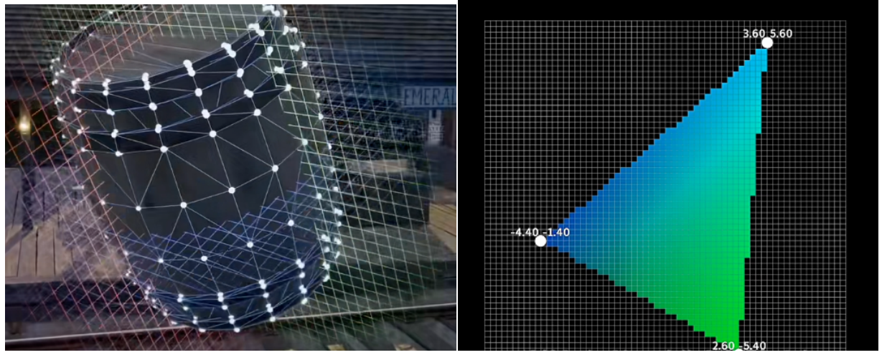

由两个点构成一个直线就可以发现，一根线我们只存储**两个端点的信息**，中间的像素点再时时计算渲染。我们可以由两个顶点坐标计算斜率和截距，就可以算出两条线中间的点的位置。虽然都是简单计算，只有大量简单的乘法和加法。但是 CPU 天生时执行复杂逻辑的，只能逐个计算，所以**计算时间非常长**。

人们就想到创造出可以**大量并行计算简单的乘法和加法**的计算单元，就是GPU。CPU和GPU没有优劣之分，只是用来执行不同功能的单元。GPU的计算单元被称作**CUDA核心**。

### 6.1.1 CPU（中心处理器）和GPU（图形处理器）的区别

CPU是我们最早接触的执行模型。程序按顺序运行，在单线程中逐步执行指令。要支持这种执行模式需要大型控制单元和快速运行能力，因为存在大量分支和条件控制逻辑。因此CPU会将大量芯片面积用于分支预测（下面这张图），虽然**核心数量有限但运行速度极快**。相比之下，GPU则拥有海量**计算单元**（ALU），就是那些绿色小方块。**只有极小部分芯片面积用于控制逻辑，用少量控制逻辑来协调海量并行运算的计算单元**。从概念上看，这体现了CPU和GPU的不同侧重点。

二者的设计目标截然不同，CPU优化延迟，追求**单个任务最快完成**。而**GPU优化吞吐量**，GPU不关心单个任务延迟，只追求所有任务整体最快完成。为此GPU配备大量可快速休眠唤醒的线程，虽然GPU每个任务的延迟较高，但整体完成时间反而领先CPU。这就是它们不同的设计理念和目标。因此，GPU的架构结构不同在于在于GPU会运行大量**流式多处理器**（SM）。

CPU设计初衷是用来最小化单任务延迟，快速响应复杂逻辑，大部分晶体管用于控制逻辑和缓存，核心数量通常有4-64，可以执行乱序执行、分支预测、推测执行等等任务。

GPU的设计初衷是最大化数据吞吐量，批量处理简单计算，大部分晶体管用于算术逻辑单元（ALU），核心多而简，可以达到数万个。优化**延迟**，追求单个任务最快完成。配备大型控制单元、分支预测器，核心数量少（4-32个）但时钟频率极高。

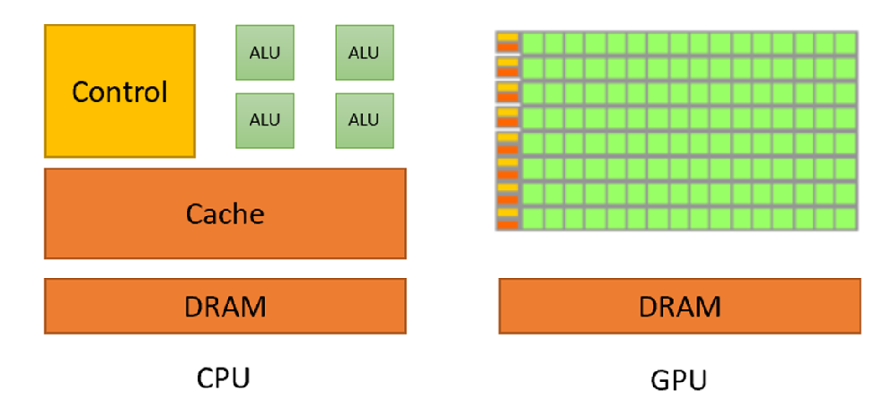

上面这幅图可以看到：**CPU的计算单元**（绿色部分）少，大部分用来**控制（Control）**和**缓存（Cache）**这决定了它可以进行**复杂的逻辑运算**，GPU则不同，他的**控制单元少（黄色部分）**,大部分都是**绿色的计算单元**，这决定了它可以进行**大量并行计算简单的乘法和加法运算**，复杂的逻辑和复杂的计算就不行了。GPU主要就是优化**吞吐量**，追求所有任务整体最快完成。控制逻辑仅占芯片面积的极小部分，计算单元（ALU）占绝大多数。所以我们在使用GPU时还要**CPU的调度**，一个好的GPU要配上好的CPU才能发挥作用。

到了AI时代，深度学习中的**矩阵**将GPU推上神坛。因为AI时代的核心是**神经网络**的计算，其中涉及到大量的**矩阵运算**，矩阵运算的本质是大量的**乘法和加法**，特别适合GPU来做这种**简单又重复**的运算，在2010年左右人们就开始利用GPU来进行AI相关的计算。

### 6.1.2 GPU发展：从图形芯片到AI引擎

#### 一、史前时代：图形显示的萌芽（1980年代前）

**没有GPU的时代**，电脑显示图形全靠CPU计算，**1981年**：IBM PC配备的CGA显示卡只能显示16色，像个"电子相框"，所有计算都由CPU完成，**1987年**：IBM推出VGA标准，能显示256色，但依然是纯"显示"功能，没有计算能力。

**关键突破**在于1985年ATi公司成立，开始用ASIC技术做图形芯片。1992年ATi的Mach32图形卡首次集成**图形加速**功能，这是GPU的"胚胎"。

---

#### 二、诞生期：3D加速卡群雄混战（1990年代）

90年代是"图形加速器"的黄金时代，但还没有"GPU"这个正式名称。

**里程碑事件**：**1994年**，3DLabs发布Glint300SX，**第一颗PC用3D加速芯片**诞生；**1996年**，3dfx的Voodoo芯片让普通PC能跑3D游戏，开启消费级3D时代；**1997年**富士通发布个人电脑首款3D几何处理器，三菱推出支持**变换和光照(T&L)** 的芯片。

但是各家标准混乱，互不兼容；只能处理特定3D任务，功能很"专一"；当时叫"3D加速卡"，还没GPU概念。

---

#### 三、GPU正式诞生：NVIDIA的逆袭（1999-2006）

**1999年**，NVIDIA发布GeForce 256，**首次提出"GPU"（图形处理器）概念**。这个名字区分了传统CPU，宣告：**显卡有了自己的大脑**。

GeForce 256具有革命性，**硬件T&L技术**上，将把**3D**图形的坐标变换、光照计算从CPU解放出来，变成了GPU专职。实现了**单芯片集成**，整合三角形构成、裁剪、纹理、渲染功能，并且是实现**性能飞跃**：让CPU的3D计算负担减轻80%以上。

在2000年市场大洗牌，2000年后，3dfx、Matrox等老厂商逐渐退出，只剩NVIDIA GeForce和ATI Radeon双雄争霸（ATI 2006年被AMD收购）。

---

#### 四、可编程时代：（2001-2012）

第一阶段：固定管线 Shader（2001-2006）

**2001年**，微软DirectX 8引入**顶点着色器**和**像素着色器**，GPU可以跑简单程序了。以前GPU是固定流水线上的"拧螺丝工人"，现在变成了能执行简单指令的"小机器人"。

第二阶段：统一渲染架构（2006-2012）

**2006年**，NVIDIA发布GeForce 8800 GTX（G80核心），**首个统一渲染架构GPU**。原来顶点着色器和像素着色器是分开的"专科医生"，现在变成了通用的"全科医生"。计算资源可以动态分配，利用率从50%提升到90%+；同时发布**CUDA**技术，让GPU能跑C语言程序。


| 架构  年份 | 核心突破 | 代表产品 |
|------------|----------|----------|
| Tesla (2006) | 引入CUDA，开启GPGPU | GTX 280 |
| Fermi (2010) | 支持双精度计算、ECC纠错 | GTX 480 |
| Kepler (2012) | 动态并行、高能效 | GTX 680 |

---

#### 五、通用计算时代：GPU变身"超算核心"（2012-2018）

**2012年**是转折点：AI研究人员用GPU训练深度神经网络，让AlexNet图像识别准确率震惊世界。从此GPU从"游戏显卡"升级为"AI发动机"。

英伟达构建了**NVIDIA CUDA生态**，让程序员轻松调用GPU算力

---

### 6.1.3 A100显卡核心的构成

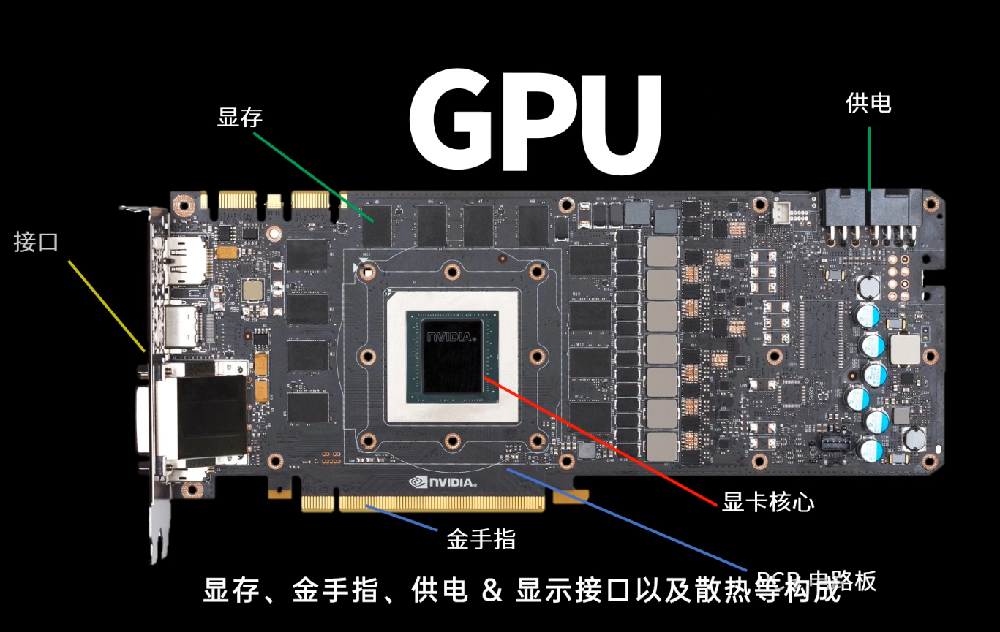

一张英伟达的的显卡剖面图如图，一张显卡由**供电、显卡核心、显存、显示接口和金手指**组成。

我们主要介绍显卡核心：显卡核心由**cuda core、控制单元和缓存单元等构成**。而 CPU 和 GPU 最大的不同就在于，GPU 负责的工作大多是重复性的 3D 建模或者渲染，而流处理器就是负责顶点运算或者像素运算，能动态的分配进行顶点运算和像素运算的流处理器数量，达到资源的高效利用。

**A100**是NVIDIA为数据中心设计的纯计算GPU，没有图形输出能力。

#### 第一层：产品形态

**PCIe版本**（常见形态）
**尺寸**为双槽全高，长267mm。**功耗**：250W（40GB版）/300W（80GB版）。**散热**是**被动散热**，无风扇（依赖服务器风道）。**接口**为PCIe 4.0 x16金手指 + NVLink桥接器接口；**重量**约1.4公斤。

---

#### 第二层：PCB板级组件

**GA100 GPU核心芯片**

**封装**：巨型BGA封装，尺寸约55mm×55mm。**位置**：板卡正中央，焊在PCB上。542亿个**晶体管**，7nm工艺，面积826mm²。

**HBM2e显存堆栈**（革命性设计）
不同于消费级GPU的GDDR显存颗粒，A100采用**3D堆叠技术**：

```
┌─────────────────────────┐
│   HBM2e显存堆栈 (8层)   │ ← 像个"芯片大楼"
│  ┌─────┐┌─────┐┌─────┐  │
│  │DRAM ││DRAM ││DRAM │  │ ← 每层8Gb容量
│  └─────┘└─────┘└─────┘  │
│      硅通孔(TSV)垂直互联   │
│          GPU SoC          │
└─────────────────────────┘
```

---

#### 第三层：GA100 GPU核心架构（芯片内部宏观结构）

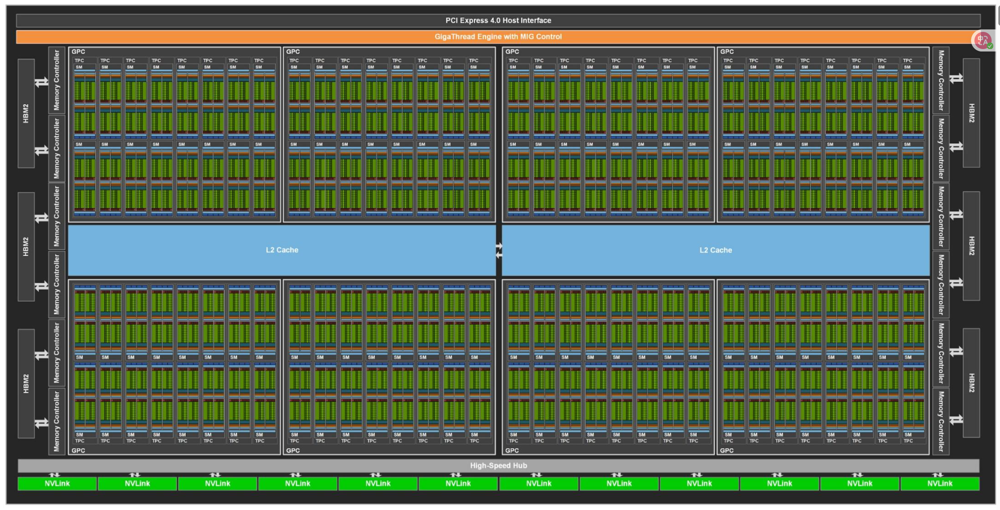

Ampere架构拓扑：

```
┌─────────────────────────────────────────┐
│            GA100 GPU核心                │
│                                         │
│  ┌─────────┐  ┌─────────┐  ┌─────────┐│ │
│  │  GPC 0  │  │  GPC 1  │  │  GPC 2  ││ │ 
│  │ (12 TPC)│  │ (12 TPC)│  │ (12 TPC)││ │ 
│  └─────────┘  └─────────┘  └─────────┘│ │
│                                         │
│  ┌─────────┐  ┌─────────┐  ┌─────────┐│ │
│  │  GPC 3  │  │  GPC 4  │  │  GPC 5  ││ │
│  │ (12 TPC)│  │ (12 TPC)│  │ (12 TPC)││ │
│  └─────────┘  └─────────┘  └─────────┘│ │
│                                         │
│  ┌─────────┐  ┌─────────┐  ┌─────────┐│ │
│  │  GPC 6  │  │  GPC 7  │  │  GPC 8  ││ │
│  │ (12 TPC)│  │ (12 TPC)│  │ (12 TPC)││ │
│  └─────────┘  └─────────┘  └─────────┘│ │
│                                         │
│  HBM2e控制器 ×8  ┌─────────────────┐    │
└──────────────────│  PCIe 4.0 ×16    │──┘
                   └─────────────────┘
```

A100有四个层级的架构拓扑，首先是**GPC（图形处理簇）**，一个显卡核心有8个（实际启用7-8个）GPC；每GPC12个**TPC（纹理处理簇）**，共96个TPC;每TPC 2个，共**192个SM**（实际启用108个）**SM（流式多处理器）**；每个SM有64个**CUDA核心**，一共有192 × 64 = **6,912个CUDA核心**。

然后是**Tensor Core**，每个SM有192个（实际启用432个第三代Tensor Core）。

---

#### 第四层：SM（Streaming Multiprocessor，流式多处理器）内部结构

A100的SM是Ampere架构核心，相比消费级GPU有本质增强：

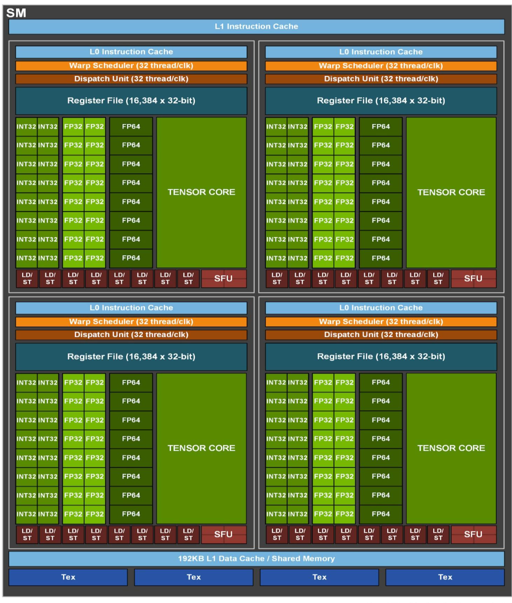

```
┌────────────────────────────────────────────┐
│              SM（流式多处理器）             │
│                                            │
│  ┌────────┐ ┌────────┐ ┌────────┐       │
│  │CUDA核心│ │CUDA核心│ │CUDA核心│       │
│  │  ×64   │ │  ×64   │ │  ×64   │       │ ← FP32/INT32单元
│  └────────┘ └────────┘ └────────┘       │
│                                            │
│  ┌──────────────────────────┐            │
│  │  第3代Tensor Core ×4     │            │ ← AI专用加速单元
│  │  支持FP64/TF32/FP16/INT8 │            │
│  └──────────────────────────┘            │
│                                            │
│  ┌──────────────────────────┐            │
│  │   共享内存 / L1缓存       │            │ ← 192KB
│  │        128KB             │            │
│  └──────────────────────────┘            │
│                                            │
│  ┌──────────────────────────┐            │
│  │   寄存器文件              │            │ ← 256KB
│  │        256KB             │            │
│  └──────────────────────────┘            │
└────────────────────────────────────────────┘
```

**SM的独特之处**是在于**CUDA核心**，64个/组，共4组 = 256个CUDA核心/SM（实际配置为64个FP32 + 64个INT32），同时还有**第三代Tensor Core**，支持**结构化稀疏**（性能翻倍），并和支持**双精度FP64**（消费级GPU没有）

---

####  **第五层：Tensor Core**

| 数据类型 | 性能（每SM） | 用途 |
|----------|--------------|------|
| **FP64** | 19.5 TFLOPS | 科学计算、高精度AI |
| **TF32** | 156 TFLOPS | 默认AI训练格式 |
| **FP16/BF16** | 312 TFLOPS | 混合精度训练 |
| **INT8** | 624 TOPS | 推理加速 |
| **INT4** | 1,248 TOPS | 极致推理优化 |

**核心技术**：

**结构化稀疏**：自动跳过0值计算，有效性能提升2倍
**多精度融合**：单周期内处理不同精度数据

---

## 6.2 GPU 的执行模型 SM（流式多处理器）

### 6.2.1 SM的核心作用

我们可以将流式多处理器视为一个**原子单元（即最小单元）**。当使用Triton这类工具编程时，操作层级就对应着SM。在每个SM内部，它包含许多**流处理器**（SP），而每个流处理器会**并行执行大量线程**。可以这样理解，SM拥有一套**控制逻辑**，能决定执行内容，比如实现**分支判断**；而SP则负责将相同指令应用于不同数据片段。这样就能实现海量并行计算。在这种架构下，每个**SM是控制粒度的基本单元**，而单个SP能独立完成大量计算。以上一代GPUA100为例，它包含128个SM——这远超大多数CPU的核心数量。每个SM内部都集成有大量SP和专用矩阵乘法单元，这就是其计算模型的基本形态。每个SM能操控其专属组件（如张量核心）进行计算。

#### 线程调度与执行
SM同时管理**数千个线程**，决定哪个线程在何时使用哪个计算单元。它不像CPU那样为每个线程保存大量状态，而是轻量级切换，几乎没有开销。

#### 指令流水线
SM内部有**4条独立的指令流水线**，每个时钟周期可以同时发射4条不同指令给不同的Warp（线程束）。

#### 数据缓存与共享
SM内置**192KB的L1缓存/共享内存**，供本SM内所有CUDA核心快速存取数据，延迟比全局显存低100倍。

---

### 6.2.1执行模型的核心名词详解

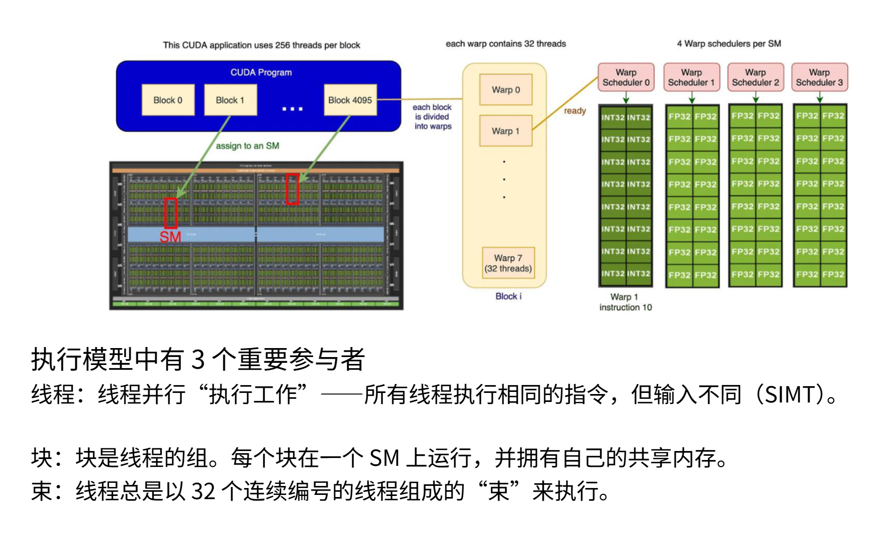

在GPU运行中，我们划分三个粒度层级来思考：**块（block）、线程束（warp）和线程（thread）**，这是粒度逐级细化的顺序。块是大型线程组，**每个块会被分配给一个SM处理**。可以把每个SM想象成**独立工作**的单元，而块就是分配给它的**处理单元**。在每个块内部包含**大量线程**，每个线程代表待执行的任务单元。这些线程在执行时会分组运行，这种分组称为线程束。每个线程束由32个连续编号的线程组成，从块中提取出来同步执行。通过这个示意图可以看到：多个块被分配给不同的SM，每个块内包含多个线程束，每个线程束又由大量线程组成。所有这些线程都会在不同数据上执行相同的指令，这就是基本执行模型。

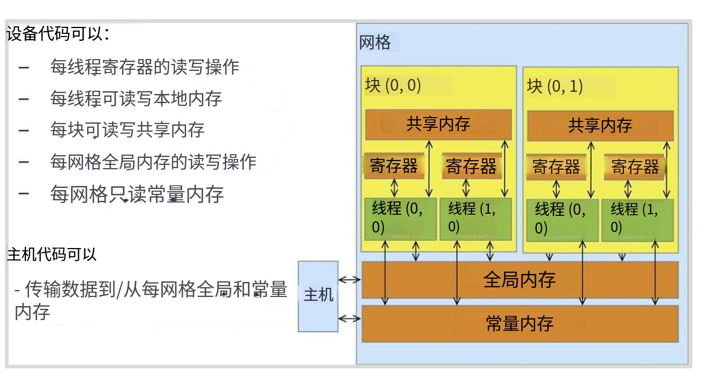

#### 1. Warp（线程束）

一个**Warp**是32个线程组成的固定小组，是SM调度的**最小单元**。**Warp像"公交车"**，32个乘客（线程）必须**同站同下**，执行完全相同的指令。如果某个线程需要走不同分支（if-else），全车人要等它，这叫**Warp Divergence（线程束分化）**。

SM同时驻留**64个Warp**，4个Warp调度器每个管理16个Warp；Warp内32线程在**SIMD单元**上同步执行

#### 2. Block（线程块）

Bock程序员指定的线程组，映射到**1个SM**上执行。**Block像"施工队"**，队内成员可以**共享工具**（共享内存），可以通过哨子同步。

每个Block独占SM的**共享内存**和**寄存器资源**；Block内所有线程必须**在同一SM内**执行（不能跨SM）；

#### 3. Thread（线程）

线程是**最细粒度的执行单元**，每个线程执行同样的Kernel代码，但操作不同数据。Thread像"流水线上的工人"，每人负责一个数据元素（如向量中的一个数）。

每个线程有**私有寄存器**（通常256个）；线程ID：`threadIdx.x` 决定它处理哪个数据

#### 4. SIMT（单指令多线程）

GPU执行模型，多个线程（Warp）共享同一条指令，但操作不同数据。SIMT像"大合唱"，指挥（指令）统一，但每个人唱自己的声部（数据）。

---

## 6.3 GPU的内存模型


**内存距离SM越近，访问速度越快**。因此存在**极高速的内存类型（如L1缓存和共享内存）**，它们位于SM内部，具有**极快的读写速度**。像**寄存器这类需要频繁读写的元件，就应该放置在L1和共享内存中**。

如图所示，这些绿色区域是SM集群，而**蓝色区域代表紧邻SM的L2缓存**,它们虽然不在SM内部，但物理位置仍然很近，**速度也相当快**（虽然比L1慢一个数量级）。在芯片外部（以这张3090或PCIeA100为例），GPU芯片旁边实际安装了**DRAM内存**，这意味着数据需要实际**离开芯片通过物理连接**进行传输。你可以在这张芯片图上看到边缘的这些黄色连接器。这些是HBM连接器，它们连接到实际GPU外部的DRAM芯片。

你可以从上图左侧看到访问这些存储所需的**速度**，SM内部存储器的访问速度要快很多，大约只需20个时钟周期就能从中获取数据，而访问L2缓存或全局内存则需要200到300个时钟周期。这个**10倍的差距会对性能造成严重影响**。如果某段计算需要访问全局内存，可能意味着你的SM会无工作可做，矩阵乘法全都完成了，任务耗尽，只能空转。这样**利用率就不会高**。这在某种程度上将成为思考内存架构的核心主题，也是理解GPU工作原理的关键。

首先是寄存器，**这是速度极快的存储单元**，用于保存单个数值型数据。本地内存、有共享内存、还有全局内存、他们在内存层次结构中逐级递增，速度也越来越慢。

**代码可以写入全局内存**，也可以写入常量内存（虽然这个不常用）。每个线程都能访问**自己的寄存器和共享内存**，但**跨线程块的信息需要写入全局内存**。这意味着当编写执行任务的线程时，理想情况下它们应该操作相同的小批量数据，这样就不用跨线程。我们可以将这小批量数据加载到共享内存中，所有线程都能高效访问共享内存，执行完毕后任务就完成了。这是最理想的执行模式。反之，**如果线程需要到处访问数据**，就必须访问**全局内存**，速度会非常非常慢。

---

### 6.3.1 第一层：全局内存（Global Memory）

| 特性 | 参数  说明 |
|------|------------|
| **物理位置** | GPU芯片外的HBM2e显存堆栈 |
| **容量** | A100: 40GB/80GB |
| **带宽** | **2,039 GB/s** (A100) |
| **延迟** | ~500 GPU周期 (~250ns) |
| **编程控制** | **手动管理** (`cudaMalloc`) |
| **可见性** | 所有线程可访问 |

全局内存可以存放模型的所有权重、激活值、梯度（如GPT-3的1750亿参数）；训练数据、中间结果、最终输出，将**数据持久化**；我们通过PCIe从主机内存拷贝数据，是**CPU-GPU传输通道**。

全局内存提供**海量容量**（80GB），能容纳大模型的巨大显存；成本相对低（HBM2e虽贵，但比SRAM便宜100倍）是GPU存储的基础。

---

### 6.3.2 第二层：L2缓存（二级缓存）

| 特性 | 参数  说明 |
|------|------------|
| **物理位置** | **GPU芯片内，所有SM共享** |
| **容量** | **40MB** (A100) |
| **带宽** | ~3TB/s |
| **延迟** | ~200周期 (~100ns) |
| **编程控制** | **自动管理** (硬件控制) |
| **可见性** | 所有SM所有线程 |


能够为**全局数据加速**，自动缓存全局内存的热点数据（如频繁访问的模型权重）；是**数据共享枢纽**，SM之间通过L2缓存交换数据（比直接走HBM快3倍）；能**数据一致性保证**，所有SM看到的L2数据一致。

能**缓解显存带宽瓶颈**，AI训练90%时间访问同一批权重，L2缓存命中可节省95%的HBM带宽；**硬件自动管理**程序员无需干预，降低编程复杂度。

---

### 6.3.3 第三层：L1缓存 / 共享内存（Shared Memory）

| 特性 | 参数  说明 |
|------|------------|
| **物理位置** | **每个SM内部** |
| **容量** | **192KB/SM** (A100, 可配置) |
| **带宽** | **1TB/SM** |
| **延迟** | **20-40周期** (~10-20ns) |
| **编程控制** | **完全手动** (`__shared__`) |
| **可见性** | **Block内所有线程可见** |


它是一个**线程协作的仓库**，块(Block)内线程通过共享内存交换数据（如矩阵乘法的分块（Tiling）数据）；可以**手动性能优化**，可将热点数据显式放入共享内存，实现接近寄存器的速度；**L1缓存功能**当不手动使用时，自动作为L1缓存缓存全局内存数据。

L1**速度比L2快5倍**，是GPU性能优化的核心战场；**灵活性**；高程序员可控，实现复杂算法（如规约、扫描、卷积）；有**成本效益**：192KB/SM × 108 SM = **20MB总容量**，比纯SRAM L2廉价。

---

### 6.3.4 第四层：常量内存（Constant Memory）

| 特性 | 参数  说明 |
|------|------------|
| **物理位置** | 芯片内专用缓存 |
| **容量** | **64KB** (全局常量) |
| **带宽** | 广播机制 (1次读取服务32线程) |
| **延迟** | ~5周期 (命中缓存) |
| **编程控制** | 只读, `__constant__`声明 |
| **可见性** | **全GPU所有线程只读** |

可以存储**广播数据**；同一Warp内所有线程读取同一常量时（如神经网络的学习率），只需1次内存访问；可以存储**配置参数**；存储Kernel调用参数、查找表、常量系数。


它具有**极致能效**；广播机制节省99%带宽；**专用缓存**，不占用L1/L2资源。

---

### 6.3.6 第六层：寄存器文件（Register File）

| 特性 | 参数  说明 |
|------|------------|
| **物理位置** | **SM内，每个CUDA核心旁** |
| **容量** | **256KB/SM** (A100) |
| **带宽** | **10TB/SM** (理论) |
| **延迟** | **1周期** (零开销) |
| **编程控制** | **完全自动** (编译器分配) |
| **可见性** | **线程私有** |

他能做到**零延迟计算**，它存储线程的局部变量、临时结果。并且做到**极致并行**，每个线程255个寄存器，支持深度流水线。

寄存器文件的特点是**速度快**，1周期延迟。但是**昂贵**，寄存器文件的容量少。他的**容量限制决定并行度**，寄存器用量越少，SM能驻留的Warp越多。

---

### 6.3.7 GPU内的内存为什么分这么多层

#### 三大核心矛盾决定了我们使用内存会这么麻烦

**矛盾1：速度 vs 容量**（核心矛盾）

| 内存类型 | 速度 | 容量 | 成本($/GB)（估计） |
|----------|------|------|------------|
| 寄存器 | 1周期 | 256KB/SM | $1,000,000 |
| 共享内存 | 20周期 | 192KB/SM | $100,000 |
| L2缓存 | 200周期 | 40MB | $10,000 |
| HBM2e显存 | 500周期 | 80GB | $100 |

如果只用寄存器，8万块不够造1张卡；如果只用显存，算力浪费90%。分层是**唯一经济可行方案**。这是速度容量和成本的妥协。

**矛盾2：通用性 vs 专用性**

全局内存是一个**通用仓库**，它什么都存，但速度慢。而共享内存是**专用仓库（共享内存）**，程序员往往精确控制，速度极快。L1L2则是**自动缓存**，由硬件智能预测，无需编程。

**矛盾3：局部性原理 vs 并行计算**

刚访问的数据很可能再次访问（如循环中的权重），这样放在全局内存的开销就很大。除此之外还有**空间局部性**，相邻数据很可能一起访问（如矩阵的同行元素）

**GPU的解决方案**是划分层级：**L2缓存**利用时间局部性，缓存重复访问的权重；**共享内存**利用空间局部性，手动加载分块（Tiling）数据；**Warp**利用常量内存的广播特性，1次读取服务32线程。后面我们还会介绍。

---

#### GPU内存和CPU内存：本质区别

| 特性 | GPU (A100) | CPU (Xeon) |
|------|------------|------------|
| **主存带宽** | 2TB/s | 100GB/s |
| **缓存控制** | 共享内存**手动控制** | 缓存完全自动 |
| **线程寄存器** | 255个/线程 | 16个/线程 (x86) |
| **延迟容忍** | 通过Warp切换**隐藏延迟** | 降低延迟至上 |
| **内存模型** | **共享内存显式同步** | 缓存一致性协议 |

**本质区别**是GPU内存系统是**为吞吐量优化**，容忍高延迟；CPU内存系统是**为延迟优化**，降低延迟。这导致GPU需要更多层级和手动控制。

---

## 6.4 TPU架构（Tensor Processing Unit）

**TPU**是Google自2015年起自主研发的ASIC芯片（专用集成电路），专为神经网络计算而生。如果说GPU是"图形计算王者转职AI"，那TPU就是"生来只为AI"的纯粹战士。TPU从电路设计第一天起，只干一件事：那就是加速张量（Tensor）运算。

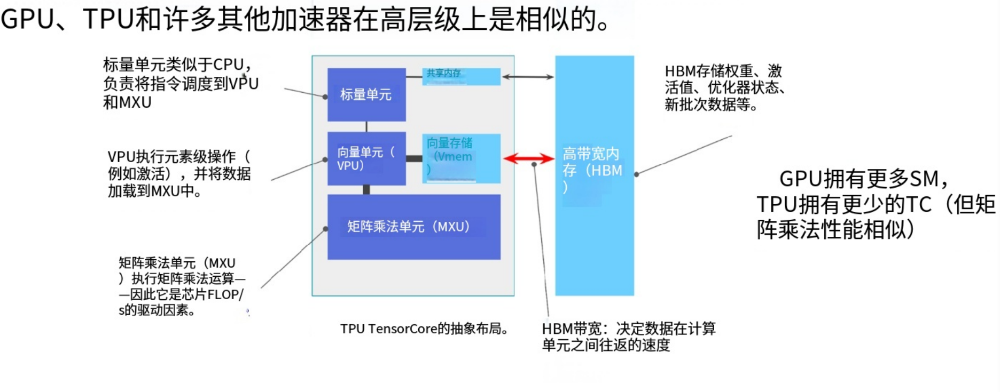

### 6.4.1 TPU与GPU的相似性

TPU内部具有**张量核心（Tensor Core）**，对应GPU的SM，是独立原子单元；TPU的**内部结构**包含标量单元（控制逻辑，类似CPU）、矢量单元（逐项向量运算）、**MXU（矩阵乘法单元）**：占芯片最大面积，专用于矩阵乘、矢量内存 + SM内存（片上高速存储）、 HBM（芯片外高带宽内存）。

TPU和GPU的**本质区别**是TPU**仅优化矩阵乘法**，不尝试执行通用计算，架构更简洁。TPU没有warp，只有块，只是矩阵乘法和非矩阵乘法的平衡。

**所谓的张量核心（tensorcore），可以将其类比为SM（流式多处理器**）。每个张量核心都是能处理数据的**独立原子单元**。它包含**标量单元（本质是控制单元）**，也能执行类似**CPU的任意操作**；还有能处理向量的**矢量单元**，适合进行逐项向量运算；芯片最大部分是专门用于矩阵乘法的**硬件模块MXU**；同时配备极快的矢量内存和SM内存（这些都是芯片内部/张量核心内存）。

此外还有位于芯片外部的**高带宽内存**。它与SM的相似之在于都是外部慢速内存，内部高速内存；以及专门的矩阵乘法硬件。核心结构高度一致，区别在于加速器互联方式。张量核心在某些方面非常简单，因为它们专为矩阵乘法优化。与GPU不同，**张量核心除了矩阵运算不尝试执行其他任务，因此架构上更为简洁**，但概念上是相通的。

张量核心之所以被称为张量处理器，**是因为它能处理任意维度的张量**。它确实能操作任意张量，它可以进行索引操作。MXU执行的核心运算是矩阵乘法，因此它始终像是针对张量进行批量矩阵乘法的操作。它能处理张量，但实际执行的始终是矩阵乘法，而非更复杂的张量运算。

GPU之所以如此成功，关键在于其卓越的**可扩展性**。只需增加**流式多处理器数量就能提升算力**，无需担忧提高时钟频率带来的散热问题。编程方面，CUDA看似复杂，但由于其编程模型设计，实际并没有那么可怕，因为每个流式多处理器内线程会对不同数据**执行相同指令**，这种概念易于理解。特别是在处理矩阵简单运算时，这种简洁模型优势尽显。此外，这些线程都非常轻量级，可随时暂停或启动，这使得GPU能在每个流式多处理器内实现极高的利用率。

## 6.5 性能扩展趋势

### 6.5.1 我们希望矩阵运算又快又好


从上图可以看出GPU的世系从P100开始，蓝色的非矩阵运算和黄色的矩阵运算就开始分道扬镳，展现了巨大的差异，这主要原因是GPU厂商特意为矩阵运算优化的张量核心（tensor core）是专门用于矩阵乘法的电路。

### 6.5.2 计算与内存扩展不平衡

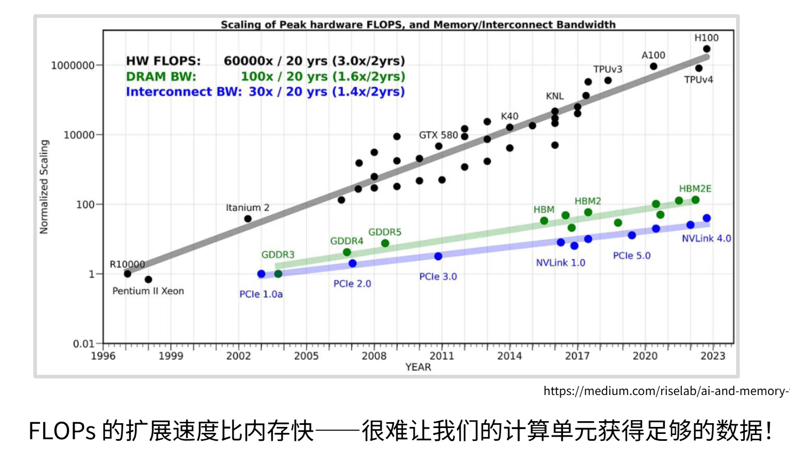

1980-2000年遵循**登纳德缩放定律**，即晶体管缩小，频率提升，功耗下降的趋势发展，但是**现状**是单线程性能**2000年后趋于平缓**，无法依靠频率提升。**现代扩展方式**是**并行扩展**（增加SM数量），从K20到H100，整数运算性能呈**超指数增长**（1-10万倍提升）。

但是其中的**核心矛盾**还没有解决---**内存扩展速度远低于计算扩展**。计算性能（灰线）是10万倍提升；内存带宽（绿线）大约100倍提升（GDDR-HBM2E）；互联带宽（蓝线）增长最缓慢。

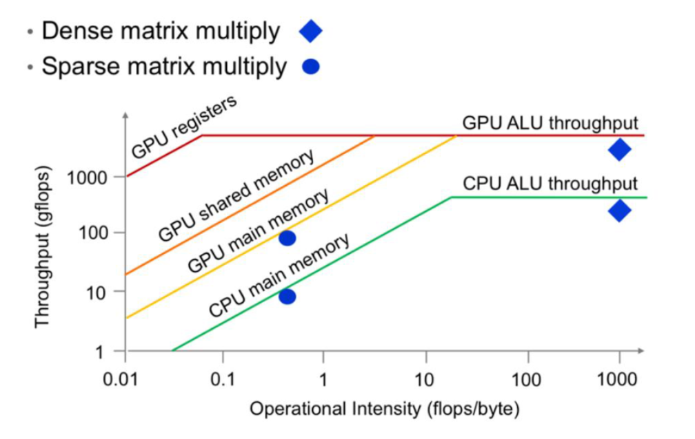

这是一个屋顶线模型，横轴是**操作强度（Operational Intensity）**，表示计算与数据移动的比率。当操作强度高时，意味着计算设备在进行大量计算而数据移动相对较少；当操作强度低时，意味着数据移动占主导。纵轴是**吞吐量（Throughput）**，表示计算设备每秒可以完成的浮点运算次数。

不同颜色的线代表不同的内存结构：

1. **GPU registers（GPU寄存器，红线）**：提供最高的吞吐量，因为寄存器访问速度非常快，但容量有限。
2. **GPU shared memory（GPU共享内存，橙线）**：速度次之，适用于需要在多个线程间共享数据的场景。
3. **GPU main memory（GPU主内存，黄线）**：速度较慢，但容量更大，适用于存储大量数据。
4. **CPU main memory（CPU主内存，绿线）**：速度更慢，因为CPU内存访问速度通常低于GPU内存。

它们到达的屋顶（内存墙）

1. **GPU ALU throughput**：表示GPU的算术逻辑单元在理想情况下的最大吞吐量。
2. **CPU ALU throughput**：表示CPU的算术逻辑单元在理想情况下的最大吞吐量。

图表显示，随着**操作强度**的增加，不同内存层次的吞吐量也会增加，直到达到某个**上限**。这个上限是由**内存层次的带宽和延迟特性**决定的。例如，GPU寄存器由于其**高速访问特性**，可以在较低操作强度下达到高吞吐量，但**容量有限**。而CPU主内存由于访问速度较慢，即使在高操作强度下，吞吐量也相对较低。

现在就可以看到**未来趋势**，**内存墙问题将持续恶化**，算法设计必须**以内存为中心**进行设计，不能浪费一丝一毫宝贵的内存，并且我们必须理解GPU内存的内存结构变化，使得计算快速进行不浪费内存。

当我们考察吞吐量或利用率时，会发现存在两种状态，位于**曲线左侧的区域属于内存受限状态**，而右侧区域则属于**吞吐量受限状态**。从某种角度理解，右侧区域意味着计算单元完全满载运行，所有矩阵乘法单元时刻保持运算状态；而对角线区域则存在某种内存瓶颈，此时计算能力受限于计算强度（即每字节浮点运算次数）。因此我们需要避开左侧的内存受限区域，力求处于**右侧区域以实现计算单元的完全利用率**，总之关键在于避免不必要的内存访问，尽可能减少对低速全局内存的访问频次。

## 6.6 性能优化技术

### 6.6.1 避免串行执行

下面是一个简单的**分支预测**

```c
// 代码示例
if (x < 4) {
    A; // x < 4 执行>
    B;
} else {
    X;  // x > 4 执行
    Y;
}
Z; // 无论X等于多少执行
```

GPU采用SIMT（单指令多线程）执行架构，**同一线程束（Warp）内的所有线程必须同步执行相同指令**（仅操作数据不同）。现代GPU中，一个Warp通常包含32个线程（NVIDIA）或64个线程（AMD）。

当Warp内的线程遇到条件分支时，若部分线程满足`x < 4`走`if`路径，另一部分满足`x >= 4`走`else`路径，便发生了**分支发散（Branch Divergence）**。此时GPU采用**掩码屏蔽机制**串行化处理：先执行`if`分支，走`else`路径的线程被临时屏蔽；待`if`完成后，再执行`else`分支，此时`if`线程被屏蔽。**两条路径的指令都会被执行**，只是各自只有部分线程生效。这导致该Warp的执行时间近似等于两条路径耗时之和，**计算资源利用率下降**。

因此，核心优化原则是：**避免同一线程束内的线程发散**，要尽量避免条件分支。若一个Warp内所有线程都走同一路径（如线程`x`均小于4），则分支开销几乎为零。此外，发散不仅延长执行时间，还可能破坏内存访问的合并性，进一步降低带宽效率。


### 6.6.2 低精度可以提升性能

**精度提升GPU速度**的本质是用**精度**换取更快的**计算**和"省得多"的**带宽**。这背后是硬件电路简化、存储数据量减少、专用加速单元三重优化叠加。最明显的是计算数据和权重等所有元素的比特数减少时，需要移动的比特量就会大幅降低。即便从全局内存访问这些比特，其影响也会变得微乎其微。

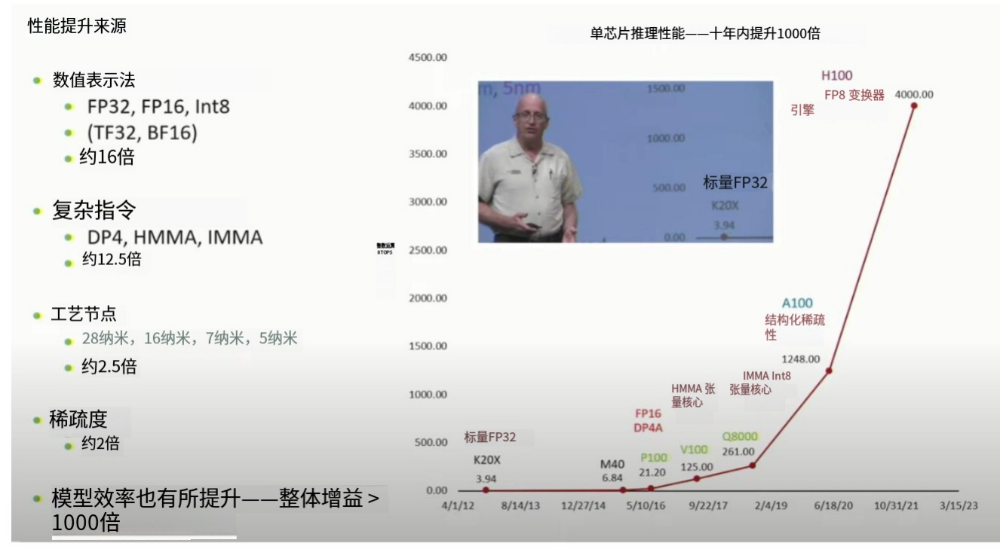

#### 一、常见的低精度格式

| 精度类型 | 位数 | 表示范围 | 典型场景 | 速度提升 |
|----------|------|----------|----------|----------|
| **FP32** | 32位 | 3.4×10³⁸ | 传统训练，精度敏感 | 基准 |
| **FP16** | 16位 | 6.5×10⁴ | 通用训练/推理 | **2-4倍** |
| **BF16** | 16位 | 3.8×10³⁸ | AI训练首选 | **2-4倍** |
| **TF32** | 19位 | 3.4×10³⁸ | A100+默认格式 | **5-10倍** |
| **INT8** | 8位 | 2⁸ ≈ 256 | 量化推理 | **8-16倍** |
| **INT4** | 4位 | 2⁴ = 16 | 极致推理 | **16-32倍** |
| **FP8** | 8位 | 动态范围 | Hopper/Blackwell | **10-20倍** |

---

#### 二、 低精度提速机制一：硬件因素

我们知道浮点运算器的复杂度与位宽平方成正比。也就是位数越大的浮点运算器的体积和复杂程度越大。FP16的乘法器晶体管数量仅为FP32的**1/4**。代表着能在同样面积里放更多低精度的浮点运算器。而更多的计算单元意味着计算能力更强。

FP16数据只占FP32一半的寄存器空间，同样256KB寄存器文件可存**两倍数据**，同时16位数据总线带宽需求减半，同样带宽可传**两倍数据**，并且FP16乘法器延迟更低，频率可更高。

#### 三、低精度提速机制二：内存带宽节省（数据量减少50%）

我们知道低精度下，同样参数量的模型文件，低精度下的占用的内存就是会比高精度下的低。比如**GPT-3 175B**参数，FP32 = **700GB**；BF16 = **350GB**；**激活值**，每层激活缓存，FP32 = 16GB；FP16 = **8GB**；**梯度**，反向传播梯度，FP32 = 16GB；FP16 = **8GB**。可以看出低精度下训练占用的内存会比高精度下的低得多。

我们可以进行简单的**带宽计算**，假设HBM2e带宽2TB/s，那么**FP32**下每秒传输500亿个参数；**BF16**下每秒传输**1000亿个参数**（翻倍）。

所以低精度下加载权重时间**成倍减小**；缓存命中率提升（同样缓存容量，存的数据更多），显存可容纳更大模型（350GB的LLaMA-65B在80GB显存上用BF16可跑）。

#### 低精度提速机制三：Tensor Core专用加速

Tensor Core是NVIDIA为低精度矩阵乘设计的**专用电路**，它不是缩小版FP32，而是**重构版矩阵引擎**。

**Ampere架构Tensor Core性能**：
| 精度 | 峰值算力 | 相对FP32 CUDA核心 |
|------|----------|-------------------|
| FP32 | 19.5 TFLOPS | 1× (基准) |
| TF32 | 156 TFLOPS | **8×** |
| FP16 | 312 TFLOPS | **16×** |
| BF16 | 312 TFLOPS | **16×** |
| INT8 | 624 TOPS | **32×** |

加速的原理：

**脉动阵列（Systolic Array）**：数据在阵列中流动，每个周期每个单元完成1次乘加，32×32阵列每周期完成1024次运算
**权重静止**：矩阵权重预加载到阵列寄存器，减少数据搬运
**累加器优化**：FP32累加器保证精度，输入输出用低精度

#### 提速机制四：并行度提升（同样芯片面积，计算单元翻倍）

**芯片面积优化**，之前提到过精度越高的运算单元复杂度越大，**1个FP32 CUDA核心**面积约0.1 mm²；**1个FP16 CUDA核心**面积约0.05 mm²（节省50%）；**1个INT8 CUDA核心**面积约0.025 mm²（节省75%）。

同时还有独特的**架构设计**，A100的SM中，Tensor Core复用寄存器文件，**FP32模式**64个CUDA核心活跃，每周期64次FMA；**FP16模式**：64个CUDA核心 + **4个Tensor Core活跃**，每周期64次FMA + **1024次矩阵运算**。

同样芯片面积，低精度可集成**4倍计算单元**，实现**4倍吞吐量**。

---

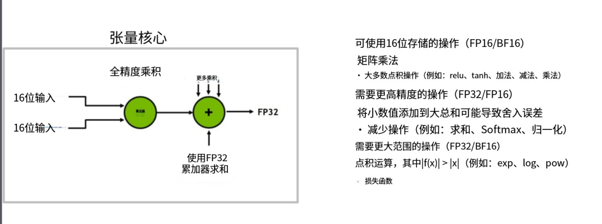

关键在于并非所有网络组件和训练算法**都适合低精度处理**。以矩阵乘法为例，混合精度矩阵乘法通常将输入设为16位低精度，但乘法运算会保持**全32位精度**。这是因为在**累加部分和**时，**中间计算需要高精度保障**，因此采用FP32累加器。张量核心最终输出FP32结果，可按需降回16位。由此可见输入数据可采用16位存储，但累加等操作需32位精度；某些运算（如指数函数）需要更大动态范围，可能适合bf16格式。要确保低精度训练时模型稳定性，需要大量精细的工程优化。但若能实现，当内存成为瓶颈时，从32位转为16位可直接使吞吐量翻倍。

### 6.6.3 算子融合（Operator Fusion）

算子融合通过**消除中间结果内存读写和减少Kernel启动开销**，实现2-5倍速度提升。

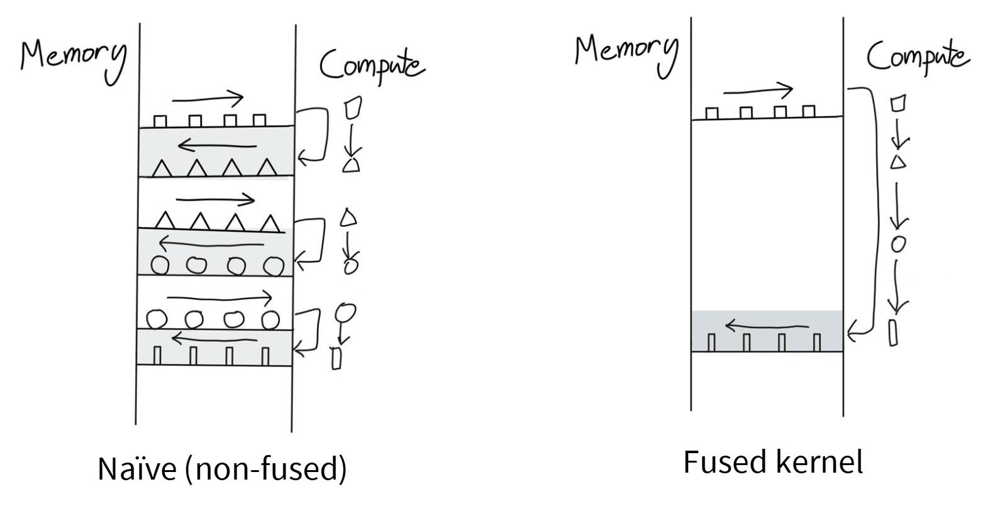

我们可以将**GPU计算单元**视为工厂，输入方形部件输出三角部件。**若计算能力增强但内存传输带宽有限**（好比传送带容量固定），新增的工厂设备将无法充分利用，整体性能仍受限于**内存到计算的传输速率**。

想象左边这张图的左侧是**内存区域**，右侧是**计算单元**。进行运算时，我们从一个方形数据开始，把方形数据从内存搬运到计算单元，执行某些操作后将其转为三角形，再把三角形移回内存。接着发现又需要这些三角形数据，于是重新将它们送入计算单元，三角形变成圆形，如此循环往复。数据在计算单元和内存之间来回传输，如果在GPU上直接进行简单运算，并立即将结果写回全局内存，最终就会形成这种模式。如果统计单块数据的往返次数，这种方式的**效率极其低下，会产生巨大的内存开销**。

现在观察**右侧**的计算流程：我们发现这些运算之间不存在**依赖关系**,所以将方形直接转为三角形再转为圆形，最后变成矩形再传回**内存**。我们让所有数据始终驻留在计算单元内。

这其实就是**融合核函数**的思维模型，当一系列运算需要按顺序处理同一数据时，与其每次都将中间结果写回存储，不如尽可能在单个计算单元完成所有操作，直到**必须传回内存时才进行传输**。这就是**核融合的核心思想**。

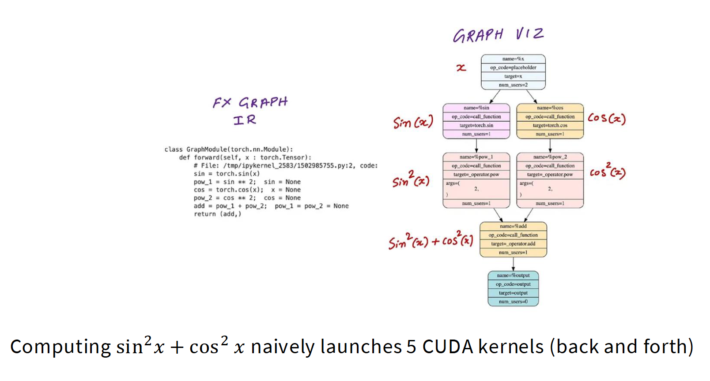

假设我编写了一个神经网络模块，输入x后同时输出sin²x和cos²x。代码很简单，但在PyTorch中运行时会生成这样的计算图：首先载入x，启动CUDA核函数计算sinx，再启动另一个计算cosx，接着计算sin²x和cos²x，最后计算sin²x+cos²x。为了完成这些运算，数据需要在内存和计算单元间反复传输，这正是之前展示的左侧低效模式。

但是我们发现这五个运算其实没有复杂依赖，仅需**少量内存**，完全可以将它们**融合成单个运算**，在GPU单线程上完成所有处理，无需将**数据写回全局内存**。

**本质**上算子融合是将多个连续操作**合并为单个CUDA核函数**，避免中间结果写回全局内存，


### 6.6.4 重计算（Recomputation）

**重计算的核心思想是通过增加计算量来避免内存访问。**

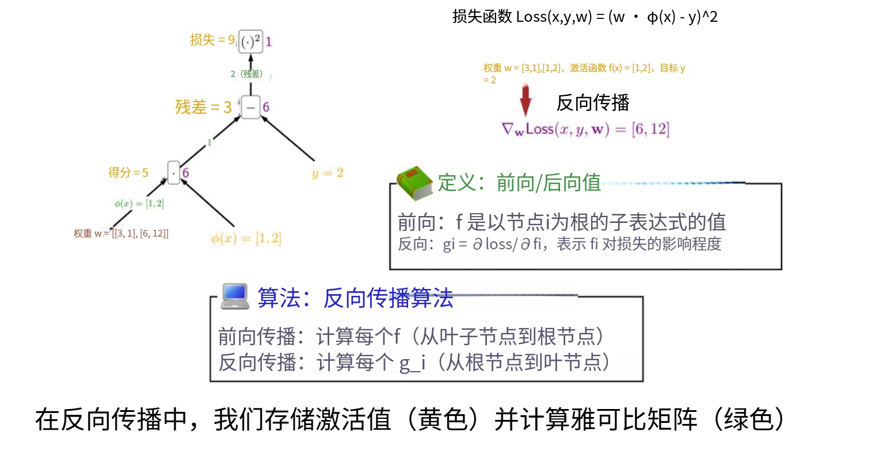

我们获取最底层的输入数据（黄色节点），然后我们向上传播激活值。这些也是树上的黄色数值。接着我们反向计算雅可比矩阵。这些是边上的绿色数值。为了计算梯度，我将进行反向传播，需要进行乘法运算。我们会将雅可比矩阵和激活值结合，反向传播梯度。仔细想想，前向传播后的那些黄色数值必须被存储起来。它们被存储后，需要从我们存放的全局内存中提取，并送入计算单元。

从机制上来说，这个过程是必然发生的。但这可能会导致海量的内存输入输出操作。但是能够避免这种情况。

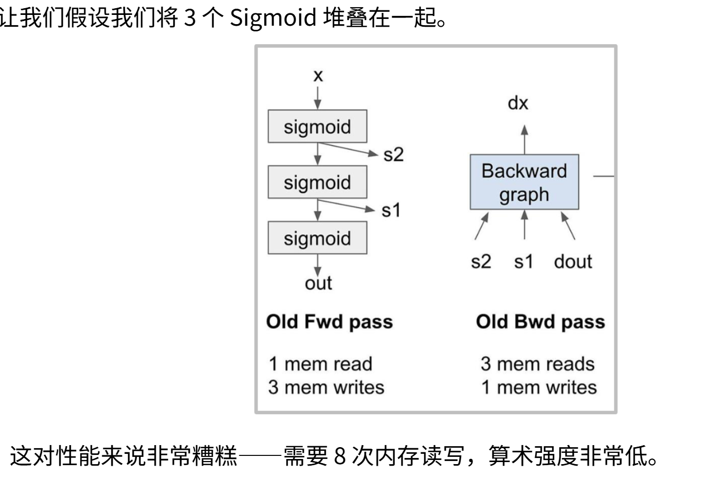

假如我们将三个 $sigmoid$ 函数层层堆叠。这是**前向计算图**。计算 $sigmoid$ 函数，并存储S1和S2这两个 $sigmoid$ 的激活值，最终得到输出结果，这就是我们的**前向传播过程**。但**反向传播过程**就显得有些棘手。当构建反向计算图时，我们需要调用**S1和S2**，接收从**输出端反传的梯度**，然后将其推入这个反向计算过程，最终得到 $x$ 的梯度。为了完成反向传播，需要执行**三次内存读取和一次内存写入**。而在前向传播中，需要读取一次 $x$ ，并对S1、S2和输出结果进行三次内存写入。它涉及相当数量的**内存读写操作**，总共需要**执行八次**。

**而重计算的核心思想就是**：不存储那些激活值也不会将它们放入内存，而是在反向传播过程中**动态重新计算**。在新的前向传播过程中，**不存储S1和S2**：输入 $x$，计算 $sigmoid$ 函数，直接获得输出。现在只需要一次 $x$ 的内存读取（即输入）和一次输出的内存写入。在反向传播时，由于没有现成的激活值，我们将同时获取来自上层的反向信号 $D_{out}$ 和输入 $x$ 进行计算，这需要两次内存读取。**然后在流处理器本地内存中动态计算每个 $sigmoid$ 函数，将其融入反向计算图**。

总的来说，这次的重计算不储存s1 和 s2，在反向传播中重新计算。这是**计算的时间成本和内存的写入和读取的内存和时间成本的考量**，**重计算适用于计算成本比读写成本小的场景**。

通过在本地内存中实时重算S1、S2和输出值，避免了**全局内存读取操作**，最后只需一次dx的内存写入。在完成相同计算的前提下，现在只需要5/8的内存访问量。付出的代价是**必须重新计算这三个sigmoid函数**。但如果**计算单元原本就因为内存瓶颈而处于闲置状态**，这就非常合算，用**过剩的计算能力换取紧缺的内存带宽**。

### 6.6.5 内存合并（Memory Coalescing）

GPU中的**慢速内存**（即全局内存/DRAM）实际上极其缓慢。为了**提升速度，硬件层面会进行特定优化**。

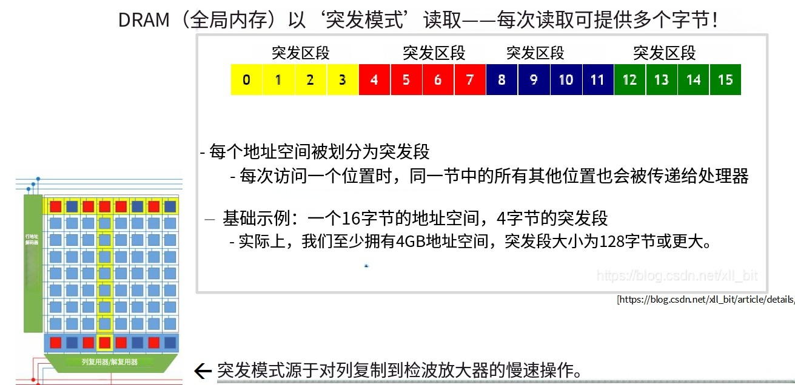

其中一项DRAM硬件优化是：当读取某个内存值时，实际获得的**不仅是目标值，而是整块内存数据**，**被称为突发模式**。假设读取大内存块的第一个值，内存不仅会返回0，还**会同时返回0123这四个值**。

每个地址空间都被划分为突发段，系统会直接返回整个突发段而非仅目标数据。当寻址内存时，数据传输到放大器是最耗时的步骤。而突发段作用是**一旦完成这个步骤，就能免费获取大量字节数据**。突发段设计正是为了优化耗时的数据迁移过程。**如果内存访问模式得当，就能显著加速内存访问**。比如要读取整个数据块，若采用随机访问，需要执行与查询长度相当的次数；但若先读取首值，就能立即获取整个突发段；接着读取第4个值，又能立即获得第二个突发段。**通过精心设计内存访问策略，仅从每个突发段提取所需数据，理论上可实现四倍吞吐量**，这就是内存合并技术。

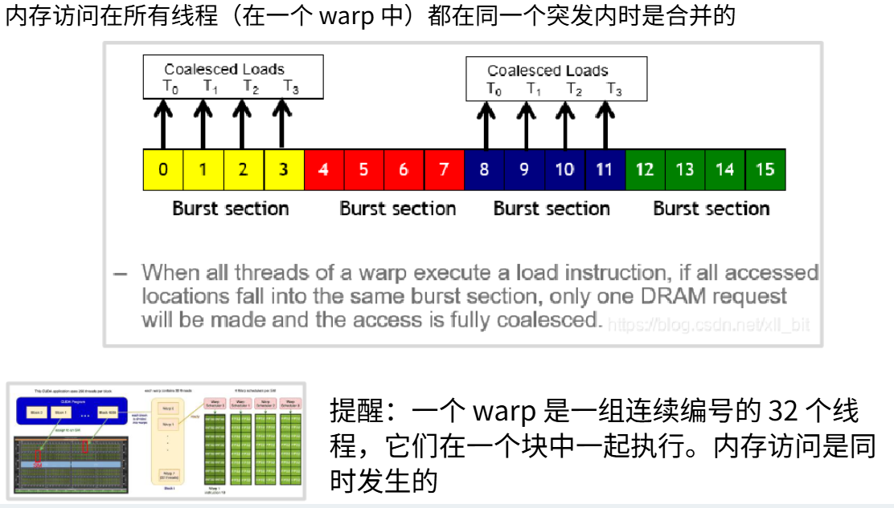

当线程束中的**所有线程都位于同一突发段**时，智能硬件和编程模型会将这些查询聚合**不再分别查询0123**，而是通过单次查询0即可从突发模式DRAM中同时读取所有四个值。**注意线程束包含32个有序线程**，这些线程的内存访问是同步进行的。通过优化可以一次性获取全部4字节数据，使**内存吞吐量提升四倍**。

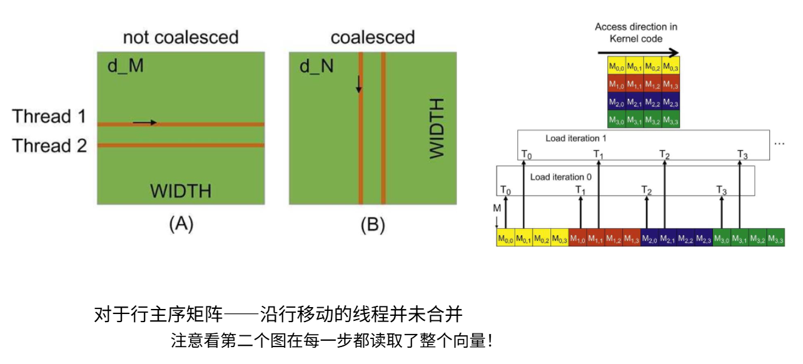

以矩阵乘法为例，假设有两种矩阵读取方式：按行遍历（每个线程处理一行）或按列遍历（每个线程处理一列）。实际上**左侧按列遍历的模式会非常缓慢**，因为**内存访问无法合并**；而右侧按行遍历时，线程内存访问地址连续，可以**实现内存合并**。

右侧是一个矩阵和矩阵在内存中的位置,以矩阵乘法为例，假设矩阵采用 row-major 方式存储。考虑两种线程访问模式：

**1）每个线程负责矩阵的一整行**；
**2）每个线程负责矩阵的一整列**。

当每个线程处理一行时，同一个 warp 内的线程会访问彼此相距较远的内存地址，这种访问模式无法实现内存合并（coalescing），因此内存带宽利用率很低，性能较差。相反，**当每个线程处理一列、并且在同一时间步访问同一行的不同列元素时**，warp 内线程访问的是连续的内存地址，可以实现完全的内存合并，从而显著提升访问效率。

从内存布局角度看，如果一组线程从左向右访问矩阵中同一行的连续元素，那么这些访问都落在同一个或相邻的内存块段中，只需一次或少量内存事务即可完成数据加载。**但如果线程访问的地址分散在多个不连续的内存块段中，则每个访问都可能触发独立的内存事务，导致实际内存访问速度远低于理论带宽。**

这种内存访问顺序的差异属于非常底层的优化细节，但在 GPU 程序中却至关重要；一旦遍历顺序设计不当，性能往往会出现数量级的下降。

### 6.6.6 分块（瓦片）（Tiling）

**分块的核心思想是通过分组内存访问来减少全局内存的访问量**。

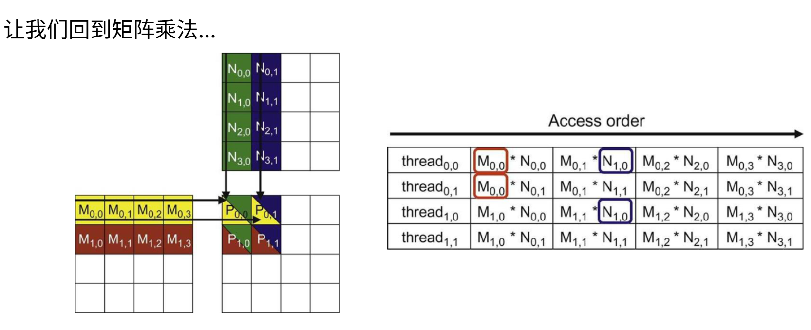

通过矩阵乘法的例子来解释，**原始的矩阵乘法算法严重问题**，从这个简单的矩阵乘法算法开始：左侧是 $M$ 矩阵，上方是 $N$ 矩阵。计算矩阵乘积时需要遍历 $M$ 的行和 $N$ 的列，进行内积运算后结果存入 $P$ 矩阵。这里标出了**每个线程对应的输出存储位置及其元素访问顺序**。

**这里的内存访问是非合并的**,行矩阵的**访问顺序是不连续**，且存在**重复**的内存访问。例如 $M_{0,0}$ 被首个线程访问后又被其他线程访问， $N_{1,0}$ 也在不同线程中被重复读取。这些值会从全局内存被多个线程反复读取，可能导致严重性能下降。可以从右侧的表格中看出。

问题在于能否避免过多的全局内存读写，理想方案是用一段时间将数据块从全局内存加载到高速的共享内存，在共享内存中完成大量计算，最后再处理下一数据块。这样能最小化全局内存访问。

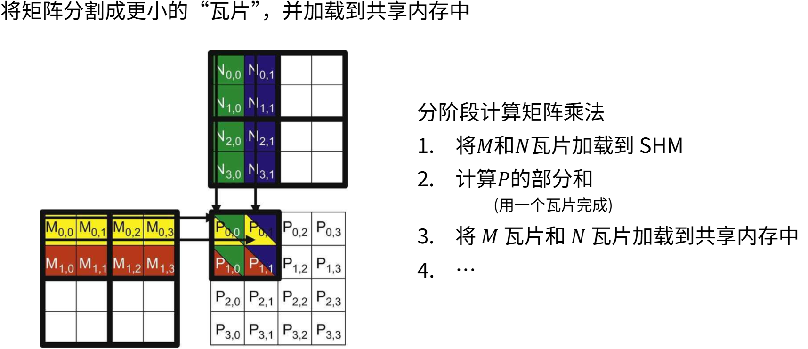

在矩阵乘法中我们将 $M$ 和 $N$ **矩阵划分成多个分块**（例如**2x2的子矩阵**），首先加载左上角的 $M_{0,0}$ 分块和 $N_{0,0}$ 分块到**共享内存**（都是2*2的小矩阵），这样就能计算部分求和结果。当处理完这两个数据块后就可以在这里加载**新的数据块**，然后利用已加载到共享内存中的 $M_{0,2}$ 块和 $N_{2,0}$ 块重复计算过程，再将部分和累加到 $P$ 中。通过有效整合并减少了全局内存访问量,一次性将尽可能多的数据加载到共享内存，在单个数据块上执行所有子矩阵运算，然后再处理下一个数据块。

另一个优势是由于加载的是**完整数据块**，我们可以**按任意顺序（例如列优先或行优先）遍历这些子矩阵**，从而在从全局内存加载数据块到共享内存时实现**内存访问的合并**。采用分块访问策略能带来全方位的性能提升。

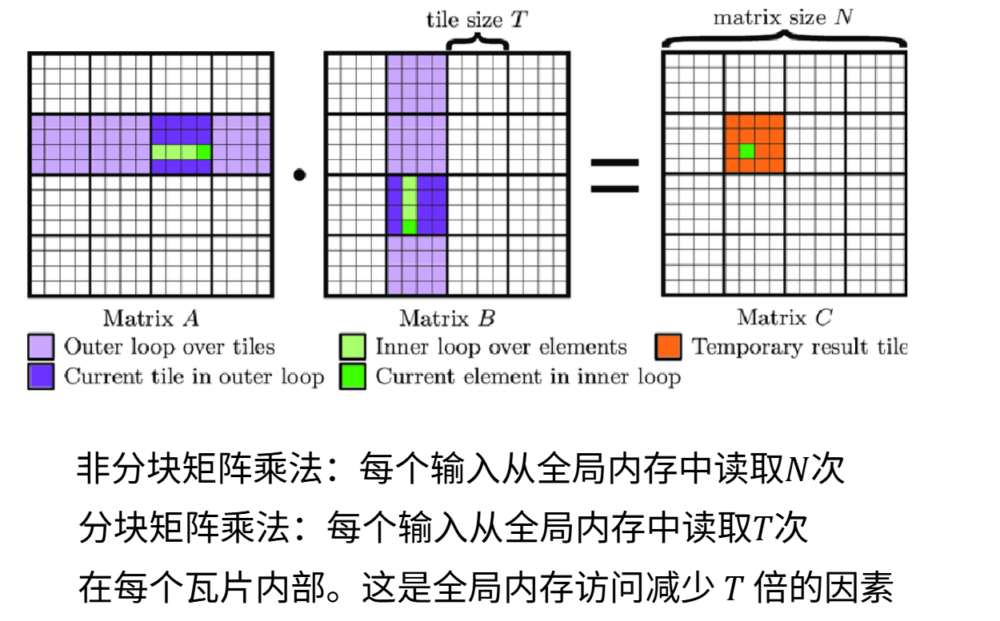

现在我们可以进行分块计算的数学分析。假设有矩阵 $A$ 、 $B$ 和 $C$，这三个 $N×N$ 的方阵，数据块尺寸为 $T$ 。对于N×N矩阵乘法，若采用非分块方式逐行逐列计算，每个输入元素每次处理时都需要从**全局内存读取**，即每个元素会被读取 $N$ 次。而采用分块计算时，全局内存读取以**数据块**为单位进行，每个输入元素从全局内存读取次数降为 $N/T$ 次，同时在每个数据块内部进行 $T$ 次读取。虽**然矩阵乘法运算的总读取次数无法减少，但通过将读取操作转移到高速共享内存，我们实现了 $T$ 次共享内存读取与 $N/T$ 次全局内存读取的配合。当共享内存能存储较大数据块时，这将使全局内存数据读取量减少 $T$ 倍**。

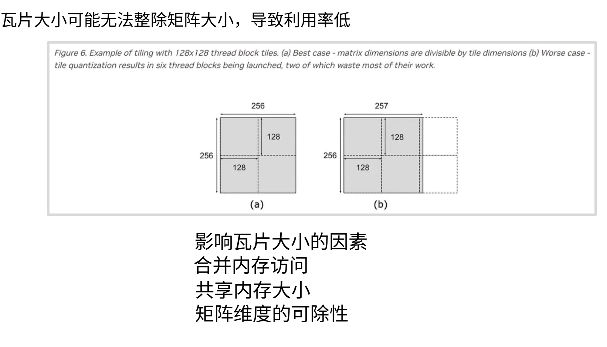

分块策略非常复杂，这是导致GPU和矩阵乘法性能表现令人困惑的根源之一。假设采用128这个规整的分块尺寸，当处理256尺寸的完整矩阵时效果很好，一个2x2的分块数据加载很顺畅。假设在列方向使用257大小的分块，那么需要**六个分块才能覆盖这个矩阵，而右侧的两个分块里面没有数据**。问题在于每个分块都会被分配给一个**流多处理器（SM）**，每个分块对应一个线程块，**线程会在各自分块（Tiling）内执行运算**。所以右侧那两个分块几乎不会执行什么计算，对应的SM基本上会处于闲置状态。

如果遇到计算瓶颈，我们希望更均衡地在SM之间分配负载，因此必须**优化分块尺寸**来避免这类情况。但是确定分块尺寸涉及很多复杂因素。必须实现内存访问的合并不能超过共享内存容量，所以分块不能太大；还要对矩阵维度进行划分，最好能均匀或接近均匀地分割，避免出现这种SM利用率极低的情况。

另一个非常深入细节的复杂问题是**分块划分与突发传输区段**的交互。假设矩阵布局很规整，每个**突发传输区段**都能与分块完美对齐。读取这个分块只需要获取**四个不同的突发传输区段，就能载入整个分块**。但如果在末尾增加一个元素，矩阵布局就会导致**突发传输区段错位**。

比如上图，加载分块时，第一行还能作为一个完整的突发传输区段载入，但第二行就分散在两个不同的突发传输区段里，需要**两次读取**才能获取，依此类推。仅仅因为**末尾多了一个元素**，就导致内存访问量翻倍——这是突发传输区段与对齐布局发生偏移造成的。本质上，如果分块或**矩阵尺寸不是突发传输区段的整数倍**，就容易出现这种行与突发传输区段不对齐的情况，导致内存访问量**翻倍**。解决方法是通过**填充**（padding）使矩阵尺寸变得规整，让突发传输区段与分块尺寸重新对齐。虽然这些内容非常底层，但要想充分压榨矩阵乘法的性能，就必须考虑这些细节。如果忽略这些，实际运行时就可能遭遇性能陷阱。

## 6.7 Flash Attention

众所周知，Flash Attention 能显著加速注意力机制。论文指出：在未优化的PyTorchTransformer实现中，通过内核融合等技术可获得显著加速。论文运用了两项成熟技术，分块和重计算，来解决精确注意力计算与次二次高带宽内存访问的技术挑战。虽然注意力计算本身无法低于二次复杂度，但通过优化实现了对高带宽全局内存的二次访问。**当内存成为瓶颈时，我们需要让计算承担二次复杂度成本而非内存来承担**。

### 6.7.1 FlashAttention核心思想

论文运用了两项**成熟技术，分块和重计算**，来解决精确注意力计算与次二次高带宽内存访问的技术挑战。虽然注意力计算本身无法低于二次复杂度，但通过优化实现了对高带宽全局内存的二次访问。当内存成为瓶颈时，我们需要让计算承担二次复杂度成本而非内存。

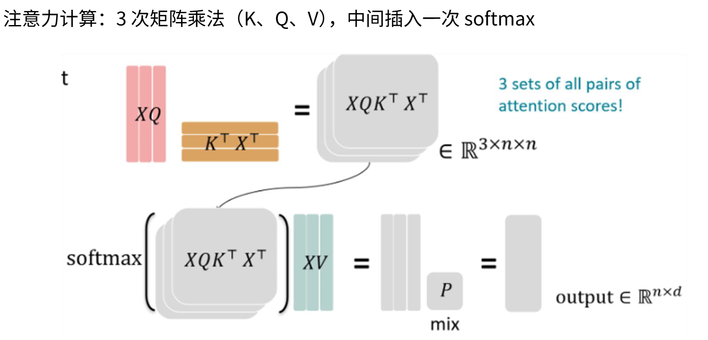

注意力机制的核心是三个不同的矩阵乘法运算。有一个 $K$ 、 $Q$ 和 $V$ 矩阵，中间夹着一个 $softmax$ 函数。**矩阵乘法可以通过分块计算来完成**。注意力机制关键就在于 $softmax$ 操作，这是难点。一旦处理好 $softmax$ ，之前提到的所有**矩阵乘法技巧**就都能派上用场。

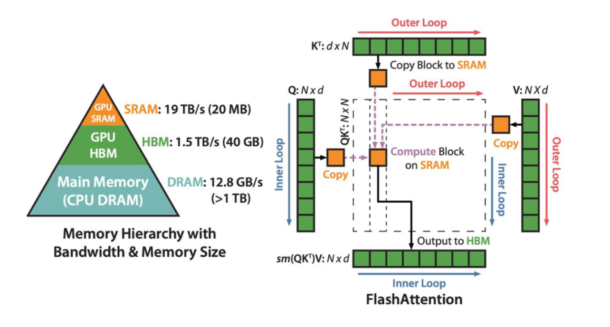

上面是**FlashAttention论文中的图1**，这是一个简单的分块矩阵乘法， $K$ 矩阵和 $Q$ 矩阵被分割成小块，这些小块被复制到 $SRAM$ 中进行乘法运算，然后进行累加,它们被发送到 $HBM$ 中执行 $softmax$ 运算，最后再与 $V$ 矩阵相乘。

softmax的问题在于它是一个**全局操作**。注意力机制中的 $softmax$ 是**逐行运算**的，**必须汇总整行数据才能计算 $softmax$ 的归一化项**，这样就与我们的分块运算的思想相冲突，我们希望**尽可能在每个分块内完成更多计算**。这里的关键就是使用所谓的**online softmax**。

### 6.7.2 online softmax

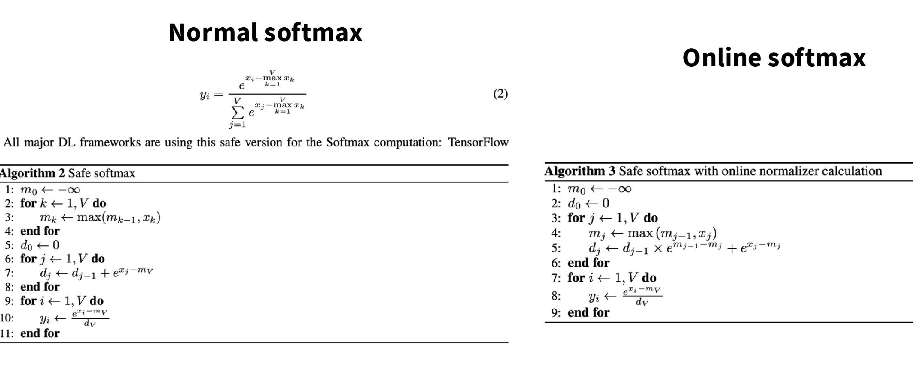

**online softmax**对于一串数值流，传统的 $softmax$ 会获取所有 $x_1$ 到 $x_n$的值进行指数运算、求和再相除。 而 $online softmax$ 则不同（这个算法来自Mikailov和Gimelshein2018年的研究），通过递推关系可以维护当前遇到的最大值和修正项。**具体维护当前迭代中 $x_1$ 到 $x_j$ 的最大值，以及修正项。当最大值更新时，修正项会相应调整，然后加入新的计算项**。这样最终计算出所需的归一化系数和标准化输出y(i)。

这种方法的关键优势在于**可以实时处理数据流，不需要预先获取全部 $x_1$ 到 $x_n$ 的值**。这使得我们能够分块计算softmax，**在每个分块内运行这个算法，计算该分块的部分softmax结果，只需记录必要的中间变量即可**。这样我们永远不需要实例化完整的n平方矩阵来计算softmax。一旦掌握这个核心思想，将其整合起来就能实现flashattention的前向传播。

### 6.7.3 完整流程

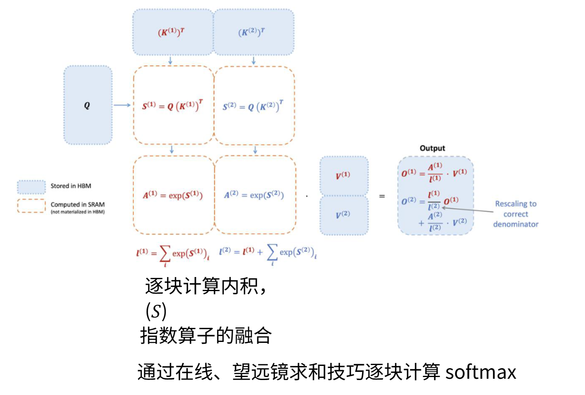

Flash Attention 在进行 $KQ$ 矩阵乘法运算时这个过程会被**分块处理**，这些数据块会进行相乘。然后维护一个指数求和值的运行记录，然后逐步更新并修正最大值项来计算 $softmax$ ，这样就能得到完整的 $softmax$ 输出。分块处理、合并访问和重新计算这些技术如何共同构成了FlashAttention。