# 第七章 GPU高性能编程

## 7.1 回顾GPU架构与执行模型

### 7.1.1 GPU硬件架构（以A100/H100为例）

以A100或H100为例，GPU包含大量**流式多处理器**（SM），每个SM内部有众多执行计算的处理单元比如**Int32或FP32单元**。每个SM会启动大量线程，内存层级结构包括**容量大但速度慢的DRAM（全局内存）**，以及更高速的缓存。特别要注意**寄存器文件**，这是每个线程都能访问的极高速存储器，在今天我们编写高性能GPU代码时将大量使用这些寄存器。

#### 执行模型的基本结构

上一章讲过块（block）、线程束（warp）和线程（thread），这是粒度逐级细化的顺序。块是大型线程组，**每个块会被分配给一个SM处理**。可以把每个**SM想象成独立工作的单元，而块就是分配给它的处理单元**。在每个块内部**包含大量线程，每个线程代表待执行的任务单元**。这些线程在执行时会分组运行，这种分组称为线程束。每个线程束由32个连续编号的线程组成，从块中提取出来同步执行。

warp本质上是一组共同执行的线程。warp存在的意义在于这些线程是同时执行的，不需要为每个线程单独配置控制单元，**只需每32个线程块配置**一个。所以计算单元的数量远多于warp调度器。这样就能在无需担心控制开销的情况下执行更多并行工作。这也是GPU与CPU的权衡之一：CPU会将更多硅片面积用于控制单元和分支预测等功能，而GPU则更侧重计算能力并采用更简化的控制机制。

**线程块**集合会被调度到单个SM上执行，这是我们在**Triton**等编程中需要重点考虑的基础单元。每个块内包含大量实际执行计算的**线程**。当需要对向量进行操作时让每个线程同时处理向量中多个元素的代码，**所有线程协同完成整个向量的处理**。所以我们会使用块而不是一个全局的上下文。

使用块可以实现**高效通信**，因为线程块内可通过**SM中高速的共享内存进行数据交换**。例如矩阵乘法运算需要线程间传递数据时，**块内通信极快（相当于L1缓存一样快），而跨块通信则代价高昂**。因此应尽量将数据保持在同个线程块（或同个计算单元）内，这样就能获得高速性能。虽然可以通过线程块实现线程间同步，但无法跨块同步，也无法精确控制执行流程。因此我们要尽量避免跨块通信。

实际运行时，**线程会被分组为连续的32线程单元（warp）**，在SM中批量执行。因此**应尽量确保**所有Warp的计算负载均衡，理想情况下**线程块数量应远多于SM数量**，且最好能被SM数量整除，这样才能**保证每个Warp的工作量均衡**（每个sm都有自己的块要处理，而不是闲置）。经验上块的数量应该大于四倍的SM的数量。

同时我们要介绍一下**算术强度**的概念：FLOPs / bytes，如果算术强度很高，意味着这个操作是计算受限的（这是好的表现），反之，则是内存受限的（我们要尽量避免内存受限）。

上一章中我们讨论过芯片的计算能力扩展速度远远快于内存扩展速度，所以计算最终会受限于内存带宽，导致无法充分发挥计算性能，一般来说，矩阵运算时计算受限的，其他所有操作都是内存受限的。**所以在GPU相关的编程中我们要尽可能的降低计算对内存的依赖程度**。

---

## 7.2 性能分析方法

编写高性能代码的高层原则是必须先对代码进行**基准测试和性能分析**。因为常常会有学生或开发者主观认定**某个部分是瓶颈**，然后花三个小时去优化，结果发现根本不是瓶颈所在，这就浪费了许多时间。

如果使用高性能或精细的性能分析器，就能准确**定位瓶颈所在和机器的实际运行状态**。掌握这些信息后我们就可以集中精力优化代码执行中最关键的部分，这就是这个高层理念重要性，因为关于GPU执行细节或如何编写softmax内核的具体方法可能会不断演变，甚至我们可以直接依赖Torch编译器的自动即时编译功能。**但性能分析的重要性永远不会随工具改变而改变**。

我们希望大家能内化这个观念：**要编写高性能代码，就必须持续进行性能分析**。

### 7.2.1 基准测试（Benchmarking）

首先我们定义MLP模型，然后生成随机高斯分布输入，最后在5个步长中运行，每次计算前向传播后执行反向传播，最终返回MLP输出的平均值。这里甚至没有损失函数，简单到只是运行MLP前向传播并在最后进行平均池化。

```python

class MLP(nn.Module):
    """简单的MLP: linear -> GeLU -> linear -> GeLU -> ... -> linear -> GeLU以此类推"""
    def __init__(self, dim: int, num_layers: int):
        super().__init__()
        self.layers = nn.ModuleList([nn.Linear(dim, dim) for _ in range(num_layers)])
    def forward(self, x: torch.Tensor):
        for layer in self.layers:
            x = layer(x)
            x = torch.nn.functional.gelu(x)
        return x

def run_mlp(dim: int, num_layers: int, batch_size: int, num_steps: int) -> Callable:
    # 定义一个随机权重的模型
    model = MLP(dim, num_layers).to(get_device())
    # 随机高斯分布的输入X
    x = torch.randn(batch_size, dim, device=get_device())
    def run():
        #  运行模型 `num_steps` 次（注意：无优化器更新）
        for step in range(num_steps):
            # 前向传播
            y = model(x).mean()
            # 反向传播
            y.backward()
    return run

```

我们会运行简单的**多层感知机**，设置**128**个维度，16个**网络层**，指定批次大小，进行5个训练步长。这里仅执行**前向传播和反向传播**各5次。

```python

# 进行基准测试（测量运行时间）和性能分析（探查函数内部的时间消耗分布）的伪代码

def benchmarking_and_profiling():
    run_mlp(dim=128, num_layers=16, batch_size=128, num_steps=5)
    benchmarking()       # 需要多长时间？
    profiling()          # 在哪里花费了时间

```


接下来则要做两件事：**进行基准测试（测量运行时间，benchmarking）和性能分析（探查函数内部的时间消耗分布，profiling）**。

我们先从基准测试开始。基准测试就是测量执行这些操作的实际耗时，这里**只需要关注多层感知机函数的端到端执行时间**。

我们进行基准测试的目的是要比较不同实现的性能：将**Triton实现与手写C++、Pytorch实现以及Torch编译进行对比**。我们需要评估编写CUDA内核是否值得，同时还想了解当矩阵乘法规模增大时，性能会下降多少。因此我们需要进行实证基准测试。

本章会一直使用这个基准测试函数，基准测试函数包含以下部分：**需要测试的运行函数、若干预热迭代次数、以及多次正式测试次数。**

####  预热

**首次运行PyTorch代码时会比迭代的时候慢很多**，因为首次运行代码会有**编译代码，向GPU发送指令**等各种初始化开销。预热能确保我们测量的是**稳定状态**下的速度而不是启动速度。当运行成千上万次迭代时，我们关心的正是稳定性能，而不是即时编译CUDA代码的速度。

#### CUDA同步

另一个重要点是调用 `torch.cuda.synchronize()` 。这是因为GPU和CPU是**两个独立的计算单元**，可以并行运行。我们的Python代码会在CPU上执行，当**运行相关计算时会向GPU分发CUDA内核**，此时CPU会继续执行后续代码而不等待GPU完成。这种特性虽然有利于编写高性能代码，但会给**基准测试**带来问题，如果GPU在异步执行而CPU在运行其他任务，就无法准确测量GPU执行时间，因为GPU是离线计算，**CPU不会等待GPU，而是继续执行代码，导致计时会提前结束**。

`torch.cuda.synchronize()` 能确保GPU和CPU达到同步状态，清空所有队列任务，使两者处于代码执行的同一节点。这样我们就能在真实同步状态下进行多次计时测量。

```python
# 基准测试代码

def benchmark(description: str, run: Callable, num_warmups: int = 1, num_trials: int = 3):
    """Benchmark `func` by running it `num_trials`, and return all the times."""
    # 热身：第一次运行可能较慢,因为要编译和缓存
    # 我们将多次要运行内核，因为重要的是稳态的运行时间。
    for _ in range(num_warmups):
        run()
    if torch.cuda.is_available():
        torch.cuda.synchronize()  # 等待 CUDA 线程完成（非常重要！）
    # 现在真正计时!
    times: list[float] = [] # @inspect times, @inspect description
    for trial in range(num_trials):  # 多次重复
        start_time = time.time()
        run()  # 实际执行计算
        if torch.cuda.is_available():
            torch.cuda.synchronize()  # 等待 CUDA 线程 完成同步
        end_time = time.time()
        times.append((end_time - start_time) * 1000) # @inspect times
    mean_time = mean(times) # 多次测量取平均
    return mean_time
```

这样如果CPU运行较快，它会等待GPU执行实际完成，反之亦然。现在测量**完成取平均值**，因为单次测量可能会因GPU的热特性等因素产生波动，因此需要多次**重复测量**，取平均值后返回结果。

这就是我们的基准测试代码，记住两个关键点：**进行预热操作**，**调用CUDA同步**。如果忘记执行就可能会得到极其异常的数据（比如显示大型矩阵乘法瞬间完成，这显然不符合事实）。

### 7.2.2 矩阵乘法的基准测试

现在我们可以进行矩阵乘法的基准测试。我将逐步演示部分结果，虽然只是用数据验证已知结论，但希望通过具体演示确保理解一致。我们会在课程使用的**A100GPU**上运行测试，针对**不同尺寸的矩阵乘法进行测量**，系统收集了各个维度的矩阵乘法耗时数据。
```python

    # 矩阵乘法基准测试代码

    '''
    Benchmarking 测量执行某些操作的实际耗时。它只给你端到端的时间，而不是时间花在哪里（性能分析）。
    比较不同的实现（哪个更快？），以及理解性能如何扩展（例如，随着维度的增加）。
    '''

    benchmark("sleep", lambda : time.sleep(50 / 1000)) #在上面实现的的基准测试函数
    
    if torch.cuda.is_available():
        dims = (1024, 2048, 4096, 8192, 16384)  # 不同维度
    else:
        dims = (1024, 2048)  # @inspect dims
    
    matmul_results = [] 
    for dim in dims:
        # @ inspect dim
        result = benchmark(f"matmul(dim={dim})", run_operation2(dim=dim, operation=lambda a, b: a @ b))
        matmul_results.append((dim, result))  # @inspect matmul_results

```

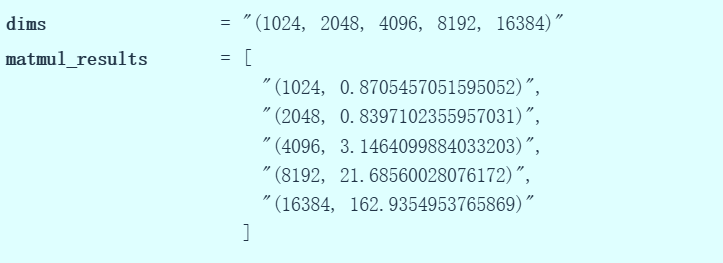

正如预期，随着矩阵尺寸增大，运行时间呈现**超线性增长**。不过在最小尺寸（如1024和2048）时，耗时基本没有增长，因为执行矩阵乘法存在**固定开销**，需要**将数据从CPU传输到GPU，启动内核也有开销，所以并非从零开始就一直保持超线性增长**。但当矩阵足够大时，确实观察到了预期的**缩放规律**。

### 7.2.3 MLP的基准测试

```python
def benchmarking():
    
    # 测试我们的MLP

    dim = 256  # @inspect dim
    num_layers = 4  # @inspect num_layers 
    batch_size = 256  # @inspect batch_size
    num_steps = 2  # @inspect num_steps
    mlp_base = benchmark("run_mlp", run_mlp(dim=dim, num_layers=num_layers, batch_size=batch_size, num_steps=num_steps)) # @inspect mlp_base
    

    #以下是基础扩展测试


    # 对步数进行缩放
    step_results = []

    for scale in (2, 3, 4, 5):
        result = benchmark(f"run_mlp({scale}x num_steps)", 
                         run_mlp(dim=dim, num_layers=num_layers, 
                                batch_size=batch_size, num_steps=scale * num_steps)) # @inspect result, @inspect scale, @inspect num_steps
        step_results.append((scale, result))  # @inspect step_results
    
    # 增加层数
    layer_results = []
    for scale in (2, 3, 4, 5):
        result = benchmark(f"run_mlp({scale}x num_layers)", 
                         run_mlp(dim=dim, num_layers=scale * num_layers, 
                                batch_size=batch_size, num_steps=num_steps)) # @inspect result, @inspect scale, @inspect num_layers, @inspect num_steps
        layer_results.append((scale, result))  # @inspect layer_results
    
    # 增加批次大小
    batch_results = []
    for scale in (2, 3, 4, 5):
        result = benchmark(f"run_mlp({scale}x batch_size)", 
                         run_mlp(dim=dim, num_layers=num_layers, 
                                batch_size=scale * batch_size, num_steps=num_steps)) # @inspect result, @inspect scale, @inspect num_layers, @inspect num_steps
        batch_results.append((scale, result))  # @inspect batch_results
    
    # 对维度进行缩放
    dim_results = []
    for scale in (2, 3, 4, 5):
        result = benchmark(f"run_mlp({scale}x dim)", 
                         run_mlp(dim=scale * dim, num_layers=num_layers, 
                                batch_size=batch_size, num_steps=num_steps)) # @inspect result, @inspect scale, @inspect num_layers, @inspect num_steps
        dim_results.append((scale, result))  # @inspect dim_results

```

现在让我们尝试对**MLP**进行基准测试。具体操作是：将MLP扩展至256维，设置四层网络，批处理大小为256，执行两个训练步。测得耗时6.2秒（mlp_base)。

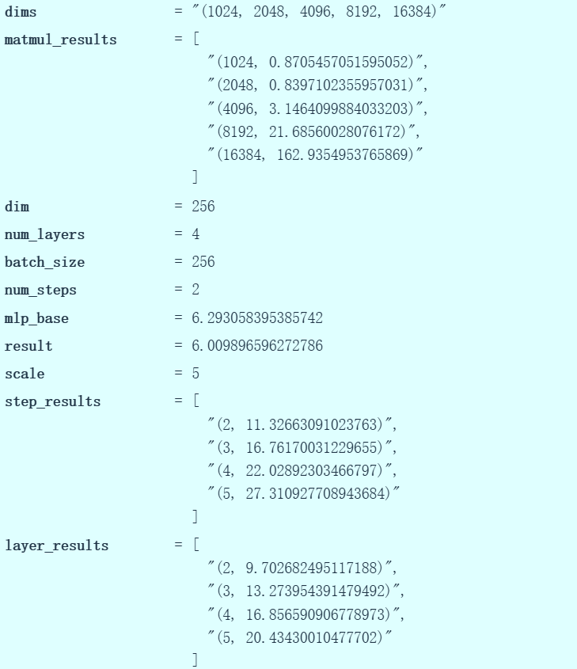

接着可以进行**基础扩展测试**：将训练步数从2逐步增加到5，分别进行基准测试。与矩阵乘法不同，当增加MLP的前向传播和反向传播次数时，运行时间应该呈线性增长，实际数据也印证了这一点，每次MLP执行约5秒，总体运行时间基本符合n×5秒的规律。同样地，当网络层数从2、3、4增加到5层时，运行时间也随之递增。这次仍然呈现线性增长趋势：单层运行约5秒（略少于5秒），总体耗时约为层数的四倍。再次验证了**线性缩放规律。**

这完全符合预期，无论是训练步数还是网络层数，都与运行时间存在线性关系。关于批处理规模的测试就此跳过，因为当前追踪的数据量已经有些过于庞杂。那么基准测试这部分就到此为止。

我们创建这个基准测试的函数，它进行少量预热操作，执行CUDA同步，并且能够测量我们所需的任何代码的运行时间。我们可以测量新架构的运行耗时。**但是基准测试是个粗粒度的测试工具**，它能告诉你代码运行缓慢，但无法指出**时间具体消耗在何处**。因此我们更倾向于**使用性能分析**这一个更加细粒度的测试。

## 7.3 性能分析（Profiling）工具

分析函数的结构大致如下，同样进行**预热**，执行TorchCUDA同步，然后调用分析器同时追踪CPU和GPU时间。接着运行目标代码，再次同步后输出所有时间的平均值表格。

```python
def profile(description: str, run: Callable, num_warmups: int = 1, with_stack: bool = False):
    # 预热
    for _ in range(num_warmups):
        run()
    if torch.cuda.is_available():
        torch.cuda.synchronize()  # 等待CUDA线程结束
    
    # 使用性能分析器运行代码
    
    with torch.profiler.profile(
            activities=[ProfilerActivity.CPU, ProfilerActivity.CUDA],
            # 输出堆栈跟踪以进行可视化
            with_stack=with_stack,
            #  需要导出堆栈跟踪以进行可视化
            experimental_config=torch._C._profiler._ExperimentalConfig(verbose=True)) as prof:
        run()
        if torch.cuda.is_available():
            torch.cuda.synchronize()  # 等待CUDA线程结束
    # 打印表格
    table = prof.key_averages().table(sort_by="cuda_time_total",
                                      max_name_column_width=80,
                                      row_limit=10)
    #text(f"## {description}")
    #text(table, verbatim=True)
    # Write stack trace visualization
    if with_stack:
        text_path = f"var/stacks_{description}.txt"
        svg_path = f"var/stacks_{description}.svg"
        prof.export_stacks(text_path, "self_cuda_time_total")
    return table
```

性能分析将是我们需要进行的更精细化的操作。性能分析它不仅能查明时间消耗在哪个**函数**，我们可以查看调用栈，通常我们接触的是PyTorch接口层，即直接调用的PyTorch组件，但在**PyTorch底层存在着完整的CUDA调用体系**。运行分析器时可以一直追踪到底层调用，看清实际执行的代码路径。这样能更直观地理解程序在硬件上的真实执行过程。PyTorch内置了非常便捷的分析器工具。这让我们不离开Python或者PyTorch环境就能获得清晰的输出结果。PyTorch 有一个很棒的内置分析器 https://pytorch.org/tutorials/recipes/recipes/profiler_recipe.html

### 7.3.1 sleep函数的性能分析

使用这个sleep函数示例，就是那个休眠函数。

```python 

def profiling():
    sleep_function = lambda : time.sleep(50 / 1000)
    sleep_profile = profile("sleep", sleep_function) 
```

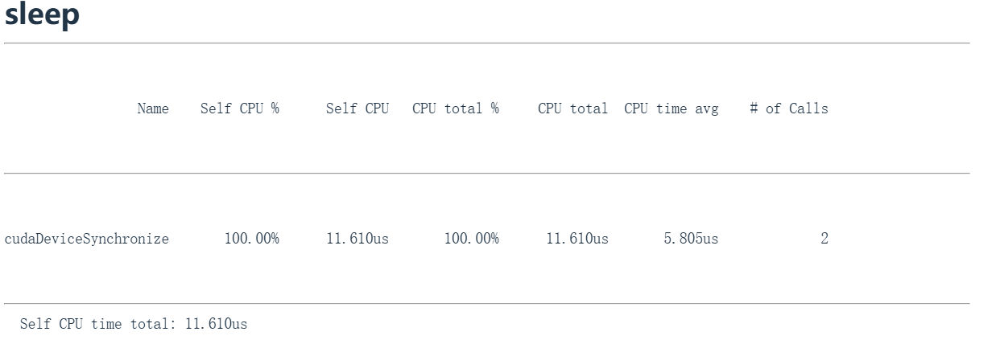

观察运行结果会发现100%的时间都消耗在名为CUDA设备同步（`cudaDeviceSynchronize`）的操作上，因为实际上**没有GPU计算任务**。我们现在就像是在分析空操作。

### 7.3.2 矩阵加法的性能分析

现在让我们看下面这个有实际意义的例子。这是个矩阵加法基础运算，先定义了接收参数A和B的加法函数执行矩阵相加。这个辅助函数会实例化两个随机高斯分布矩阵，然后调用操作参数中的内容。将两个2048维矩阵相加。

```python
def run_operation2(dim: int, operation: Callable) -> Callable:
    # Setup: create two random dim x dim matrices
    x = torch.randn(dim, dim, device=get_device())
    y = torch.randn(dim, dim, device=get_device())
    # Return a function to perform the operation
    return lambda : operation(x, y)

def profiling():
    add_function = lambda a, b: a + b
    add_profile = profile("add", run_operation2(dim=2048, operation=add_function))

```
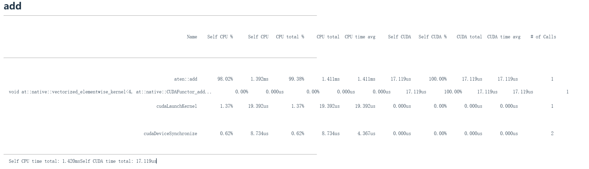

现在开始分析并调用分析器，会得到类似上面这个图片中的输出结果。这就是分析器返回的内容。

当我们在Python中调用加法函数时，我们显式接触的只有这个add函数，就是A加B。但底层发生的远不止这些。这个操作会被分派到GPU执行：首先经过 `aten:add` （PyTorch的C++接口层,在表格中第二行字），这个封装器被调用后确认执行**加法运算**，这是最外层的调用封装。接着会分派到具体的内核函数 `vectorized_elementwise_kernel4` （在表格中第三行），在 `nativeCUDA` 中执行**向量加法**等等，这才是实际执行加法的部分。同时还有CUDA启动内核操作也耗费时间，CUDA启动内核实际上是CPU执行指令并发送给GPU的过程，**即内核启动耗时**。最后**CUDA设备同步**需要等待GPU完成计算并传回数据，这个阶段同样耗时。仅仅同步这个操作本身就会消耗一定时间。最终我们得到的总时间是：CPU上1.4毫秒，CUDA上17微秒。

可见GPU运行极快，而CPU较慢。观察**CPU耗时**（即自占CPU时间），发现C++接口或C接口（比如 `aten:add` ）实际消耗了大量CPU时间，这些是向GPU传输数据时产生的开销。这就是加法函数的内部运行机制。

### 7.3.3 矩阵乘法

```python
def run_operation2(dim: int, operation: Callable) -> Callable:
    # Setup: create two random dim x dim matrices
    x = torch.randn(dim, dim, device=get_device())
    y = torch.randn(dim, dim, device=get_device())
    # Return a function to perform the operation
    return lambda : operation(x, y)


def profiling():
    matmul_function = lambda a, b: a @ b
    matmul_profile = profile("matmul", run_operation2(dim=2048, operation=matmul_function))
```

矩阵乘法也是类似情况。这里我对A乘以B进行矩阵乘法运算，再次使用2048维矩阵并进行性能分析。此时看到 `aten:matmul` 调用，这说明底层接口执行矩阵乘法的过程。然后就会调用 `Cutlass` ,这是英伟达的高性能矩阵乘法CUDA库，随后分派到特定的Cutlass内核，其中包含分块尺寸参数。这实际上指向特定的分块（瓦片）尺寸和线程块数量等参数化配置，正是这些在执行矩阵乘法。同样在底部看到两个熟悉项：内核启动（ `cuLaunchKernel` ）和CUDA设备同步（ `cudaDeviceSynchronize` ）。可以再次观察到CPU时间与CUDA时间的分配情况。**由于矩阵乘法比向量加法更耗时，CUDA部分占用时间显著增加**。


**这里还有一个矩阵乘法示例**

```python
def run_operation2(dim: int, operation: Callable) -> Callable:
    # Setup: create two random dim x dim matrices
    x = torch.randn(dim, dim, device=get_device())
    y = torch.randn(dim, dim, device=get_device())
    # Return a function to perform the operation
    return lambda : operation(x, y)


def profiling():
    matmul_function_128 = lambda a, b: a @ b
    matmul_profile_128 = profile("matmul(dim=128)", run_operation2(dim=128, operation=matmul_function_128))   
```

在这里乘以128维矩阵。128乘以128，比上面这个小得多。

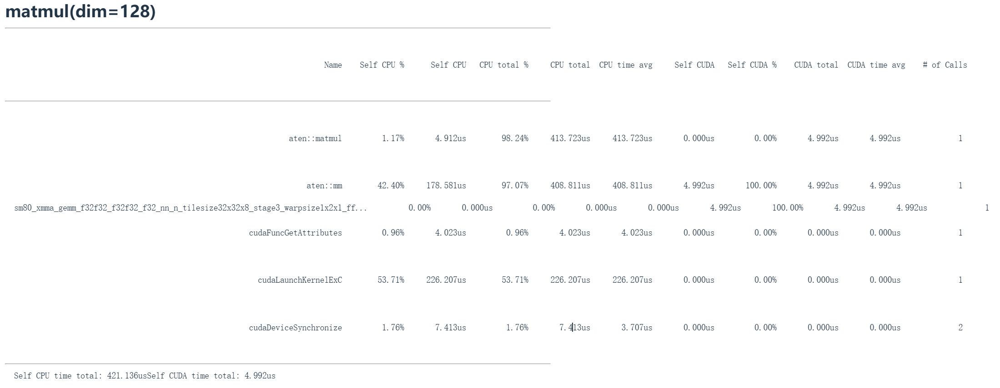

你会看到现在它实际上直接执行这个不同的命令，从 `sm80_xmma_gemm_f32f32_f32f32_f32_nn_n_tilesize32x32x8_stage3_warpsize1x2x1_ff` 这一行可以看到和上面的矩阵乘法的不同，它执行的是 `xmma_gemm` 。GEMM是一种矩阵乘法类型。后面跟着f32，即float32。从该内核的命名可以看出实际发生的情况，即这是一种瓦片（分块）的矩阵乘法。它没有经过 `Cutlass` ，而是直接执行这个特定命令。

**对于小矩阵乘法，我们会看到它现在分派到不同的内核**。由此可见矩阵乘法的复杂性。当我们在这种高度抽象层面操作时，我们只把矩阵乘法视为单一事物，比如我们调用A乘以B就完成了。但在底层程序会根据你拥有的维度和硬件，它实际上会分派到**完全不同的矩阵乘法原语**。这会表现为截然不同的性能特征。一个有趣的技巧是`Torch.compile`（我们后面会讲到） ，它**实际上有一个选项可以在你的硬件上对矩阵乘法性能进行宏观基准测试，然后它会为你的模型选择性能最高的矩阵乘法子程序**，过去我发现这能免费带来10%的速度提升。优化这些内容能在现实中带来免费增益。

性能分析器相比原始基准测试的高级之处在于，我们现在可以看到正在调用哪些CUDA内核。我们可以看到不同大小的矩阵会导致不同的CUDA内核。我们看到 `cutlass_80simtt_sgemm` ，来自`Cutlass`线性代数库，它告诉我们分块大小等信息。

到目前为止，这些操作在某种程度上非常简单。比如矩阵乘法和加法。它们基本是一一对应的：CPU端有一个操作，它就转换为GPU操作直接传输过去。我们可以做一些更加复杂的操作。

### 7.3.4 torch.cdist计算距离的复杂操作

```python
def run_operation2(dim: int, operation: Callable) -> Callable:
    # Setup: create two random dim x dim matrices
    x = torch.randn(dim, dim, device=get_device())
    y = torch.randn(dim, dim, device=get_device())
    # Return a function to perform the operation
    return lambda : operation(x, y)


def profiling():
    cdist_function = lambda a, b: torch.cdist(a, b)
    cdist_profile = profile("cdist", run_operation2(dim=2048, operation=cdist_function))
```

这个叫`torch.cdist`的操作，它的作用是**计算两组矩阵之间向量的成对欧几里得距离**。这将是我需要的A和B之间的大型距离矩阵计算，这就是cdist。这是一个更复杂的操作，要计算欧几里得距离需要**计算点积，还需要计算平方根**。


当我们计算cdist时就会看到上面这张图片，这是cdist的分析输出。我们看到这个Torch Python 命令在C接口中的map映射到一些较低级的cdist。第一行的 `aten::cdist` ，然后映射到 `aten::euclidean_dist` 。接着这会分解成一整套操作：比如 `aten::matmul、aten::pow` 等等，因为这些是计算所有向量间欧几里得距离所需的基本原语。

当执行每个矩阵乘法、连接和乘幂操作时，都有一个对应的CUDA命令在这里被调用。我们有熟悉的GEMM，这是矩阵乘法，占用了GPU 78%的计算时间。还有数组的复制和连接，占执行时间的6%。然后这个向量化逐元素内核（进行乘幂运算）占GPU时间的5%，3%用于求和。现在我们得到了GPU时间分配的详细细分。

由此我们可以知道应该把优化时间花在哪里，比如我们可以优化矩阵乘法，因为它占GPU70%以上的时间。

### 7.3.5 gelu 和 softmax 

```python
def run_operation2(dim: int, operation: Callable) -> Callable:
    # Setup: create two random dim x dim matrices
    x = torch.randn(dim, dim, device=get_device())
    y = torch.randn(dim, dim, device=get_device())
    # Return a function to perform the operation
    return lambda : operation(x, y)

def profiling():
    gelu_function = lambda a, b: torch.nn.functional.gelu(a + b)
    gelu_profile = profile("gelu", run_operation2(dim=2048, operation=gelu_function))
```

gelu是一个非线性激活函数。如果大家还记得我们第一章的内容，就会知道它是高斯误差线性单元。它由tanh和指数函数的乘积构成。我们将进行各种运算操作：首先执行A与B的加法运算，然后调用GELU函数，模拟我们在多层感知机中可能存在的线性加非线性结构。

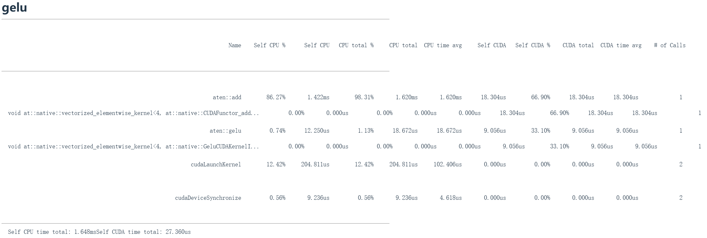

我们再次观察到基本相同的运算映射，比如 `aten::add` 对应A+B运算，接着看到其CUDA等效实现，最后这里还有一个完全用CUDA实现的GELU函数，这部分消耗了约33%的计算资源，比例很合理。

```python
def run_operation2(dim: int, operation: Callable) -> Callable:
    # Setup: create two random dim x dim matrices
    x = torch.randn(dim, dim, device=get_device())
    y = torch.randn(dim, dim, device=get_device())
    # Return a function to perform the operation
    return lambda : operation(x, y)

def profiling():
    softmax_function = lambda a, b: torch.nn.functional.softmax(a + b, dim=-1)
    softmax_profile = profile("softmax", run_operation2(dim=2048, operation=softmax_function))
```

随后我们看到softmax运算。由于这些运算模式会重复出现，将不再逐一展开详细说明。


但需要重点强调的精妙之处在于：像softmax和GELU这些核心基础算子都有专门编写的内核实现。这意味着GPU并非在执行基础原语操作，而是通过**融合算子**一次性完成所有计算，完全避免了CPU与GPU之间的来回数据传输（上一章中说到的算子融合操作，这章后面还会讲到）。

现在让我们思考一个更复杂的场景。以最初用于基准测试的MLP为例，假设我们需要优化这个MLP使其高速运行。理想情况下我们需要进行精细化的性能分析。

使用Torch性能分析器会得到这样的结果：回忆MLP结构中的堆叠线性层，包含前向传播和反向传播过程。可以观察到反向传播的相关操作，包括矩阵乘法、线性运算以及梯度累积操作。这里显示（从上到下）的是矩阵乘法的内核实现，由于界面限制只能显示10个条目。虽然分析结果被截断，但仍能清晰显示大部分时间消耗在矩阵乘法运算上。

但是在self CUDA一列仅有31%的时间停留在 xmma 模块，另外60%的时间去显示在 `aten::mm` ，但是没有对应的内核实现，这显得有些神秘。对于复杂模块而言，这种可视化呈现并不理想。

### 7.3.6 专业级分析工具 Nsight Systems

现在我们可以启用真正的专业级分析工具——NVIDIA **Nsight Systems**。这是NVIDIA提供的GPU**行为与性能详细分析方案，能让我们精确观察MLP运行时的实际状况**。

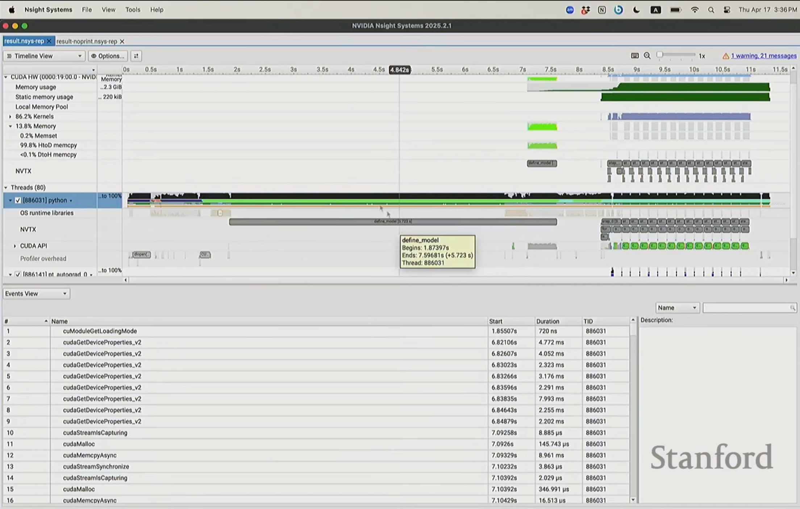

本质上，当我们观察分析结果时，会看到几个不同的组成部分，我们在左上角的栏目可以看到CUDA硬件部分（CUDA HW），往下看到线程部分（Threads）。上半部分这个CUDA区域展示的是GPU正在执行的工作。而在线程部分，我们看到的是CPU正在处理的任务。

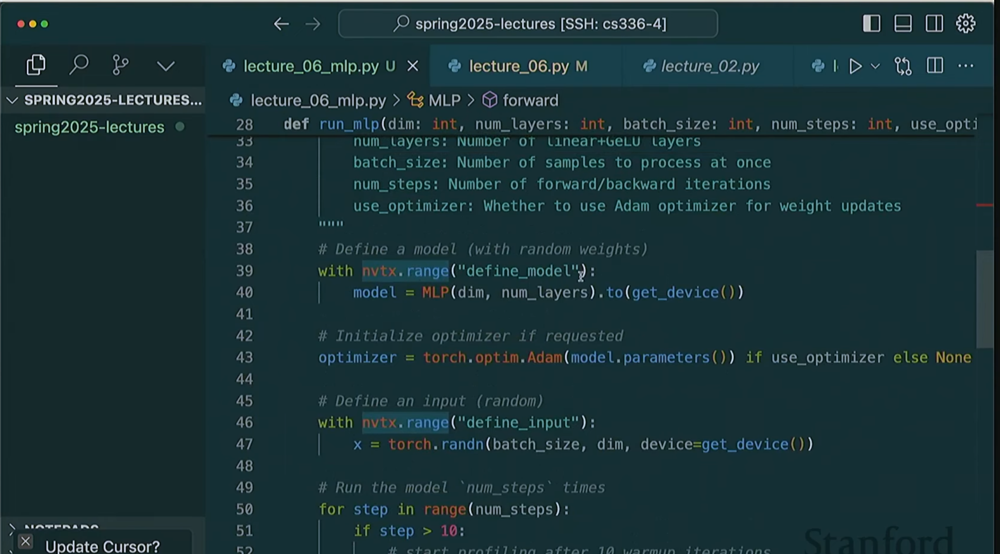

我们可以用NVTX工具对代码进行了标注，就像上面这一幅图一样，这样当性能分析器运行时，它就能识别出这段代码属于名为的 `define_model` 代码块（`with nvtx.range("define_model"):model = MLP(dim, num_layers).to(get_device())`）。

在调用分析器之前，我们应该已经在代码中添加了所有这些注释。

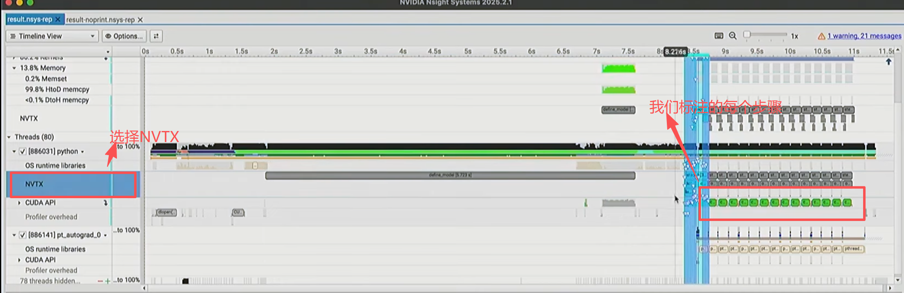

加载库文件之类的操作非常耗时，光是初始化所有内容就花费了7.5秒。然后在GPU上程序运行约7.5秒后才真正开始构建模型。

**CPU和GPU之间的协作机制**，其执行模型是这样的：当首次调用PyTorch代码时不会直接执行而是会实时编译代码。像运行时触发的模块加载这类操作，都是为初始化层和计算、将代码片段移入GPU所产生的开销工作，因此非常耗时。

我们可以通过这个工具来看每一步操作cpu和gpu都发生了什么，耗时在哪些操作上。

这个软件操作十分复杂，这里图文难以讲清楚，由于篇幅有限可以移步去看看视频来学习。

---

## 7.4 内核融合（Kernel Fusion）

我们在第六章中介绍过算子融合的概念，其**核心概念**是避免每次运算都在**DRAM和SM之间往返数据传输**，将多个操作合并为单个内核。

GPU的计算就像小型工厂，每次执行运算时都需要将数据从仓库运到工厂再返回。如果顺序执行一系列运算，就会产生大量往返仓库的**传输开销**。我们希望建立一次性完成所有运算的工厂，从而避免数据的传输。现在我们要实现GELU激活函数，并为其编写内核程序。我们将用几种不同方式编写这个内核，然后观察其性能表现。

### 7.4.1 pytorch 和 手工 实现 GeLU 的内核

GeLU的具体原理和细节可以在第四章中看到。

```python
# pytorch 实现的 gelu

def pytorch_gelu(x: torch.Tensor):
    # Use the tanh approximation to match our implementation
    return torch.nn.functional.gelu(x, approximate="tanh")

```

这是PyTorch实现的GELU函数，代码如上，调用 `torch.nn.functional.gelu` 时设置 `approximate=tanh` 参数，这是为了与接下来要实现的简单版本保持完全一致。这里实际上并非直接乘以高斯累积分布函数，而是采用更易计算的近似方法。

接下来我要演示手工实现方式。

```python
# 手工实现

def manual_gelu(x: torch.Tensor):
    return 0.5 * x * (1 + torch.tanh(0.79788456 * (x + 0.044715 * x * x * x)))
```

你们看到这段代码可能会说：这性能肯定很差。我们将在PyTorch中这样实现GELU： $0.5 x \left(1 + \tanh\left(0.79788456 \left(x + 0.044715 x^3\right)\right)\right)$ ，虽然这个公式看起来复杂，但它能近似GELU函数。但如此实现会涉及大量运算：包括双曲正切、立方运算、常数乘法、加法以及与0.5和x的乘法等。**如果这些操作需要调用多个不同的CUDA内核则执行效率必然低下**，我们从融合概念中可以得出的**直觉**判断。

```python
# 运行这两个实现

    x = torch.tensor([1.])  # @inspect x
    y1 = pytorch_gelu(x)  # @inspect y1
    y2 = manual_gelu(x)  # @inspect y2
    # 检查结果是否匹配
    assert torch.allclose(y1, y2)
```

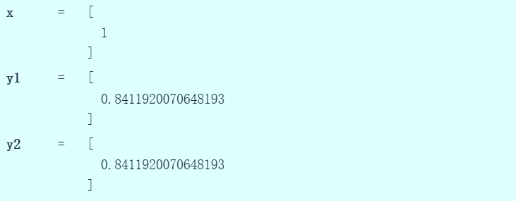

我们可以运行代码，可以看到上面这幅图显示两个实现的**计算结果相同**，如果可以你们可以在随机高斯分布上系统性地验证这一点。

**现在进行基准测试**：

```python
def run_operation1(dim: int, operation: Callable) -> Callable:
     # 创建一个 dim x dim 的随机矩阵
    x = torch.randn(dim, dim, device=get_device())
    # 返回一个执行操作的函数
    return lambda : operation(x)

manual_time = benchmark("manual_gelu", run_operation1(dim=16384, operation=manual_gelu))
pytorch_time = benchmark("pytorch_gelu", run_operation1(dim=16384, operation=pytorch_gelu))

```

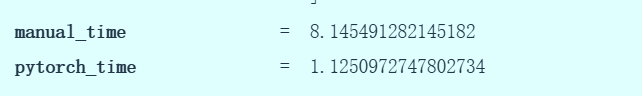

从上图看到手动实现处理超大数据量需要8.1毫秒，而PyTorch原生实现仅需1.1毫秒。

### 7.4.2 对两个实现进行性能分析

```python
    # 对两个实现进行性能分析

    manual_gelu_profile = profile("manual_gelu", run_operation1(dim=16384, operation=manual_gelu))
    pytorch_gelu_profile = profile("pytorch_gelu", run_operation1(dim=16384, operation=pytorch_gelu))
```

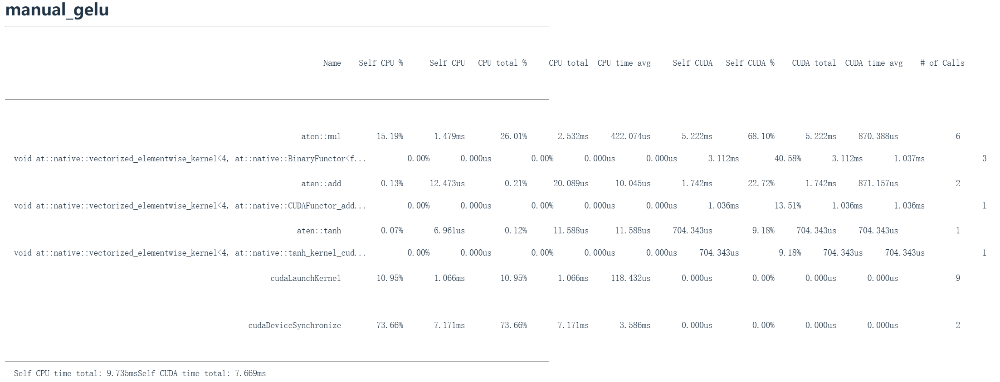

现在让我们剖析底层运行机制。手工版GeLU会执行大量运算，虽然进行了向量化处理，但这里启动了多个CUDA内核。**注意右侧显示该CUDA内核被调用了三次，因为存在大量浮点乘法运算，还包括加法运算和双曲正切计算，其中每个操作都可能产生延迟（大部分是通信的开销），最终导致相当大的时间开销**。

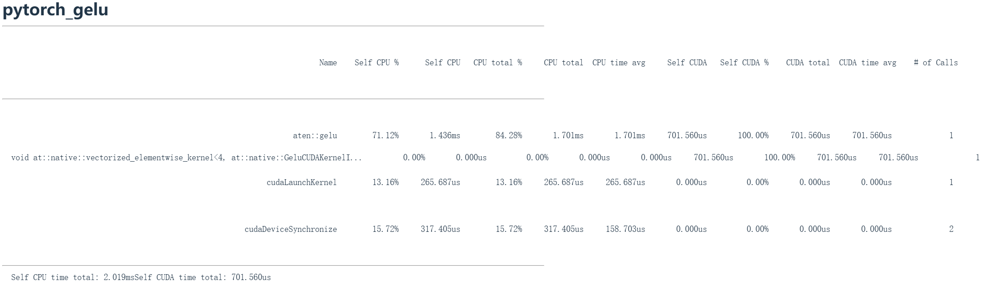

现在观察PyTorch版GELU的实现，**仅一次CUDA内核启动就处理了整个任务**。这种方式非常非常快，**因为它只启动了一个CUDA内核**。

我们希望能设法直接使用CUDA内核来实现这一点。你可能会想 PyTorch 团队肯定是用最低层级的语言实现了这个功能，所以我们也应该这样做。但我们不会直接使用最底层的语言，但会使用C++ API，用 C++ 编写 CUDA 内核。

### 7.4.3 使用C++ API编写内核

当我们提到CUDA时，实际上指的是用于连接和编程GPU的C语言API。基于之前描述的GPU逻辑模型，我们将编写一个函数f。当我们调用这个CUDA内核时，它会自动对向量或矩阵的所有元素执行f函数，从而实现我们所需的并行计算。

在术语方面。我们会有一个网格（grid），它是由线程块（threadblocks）组成的集合。可以这样理解：有一个任务，将其分割成若干块。在二维网格中，会有行坐标和列坐标，这在处理矩阵时非常有用。每个块都有其尺寸，即包含的线程块数量，这就是块的维度。每个块内部又包含一组线程，这样就形成了层级结构：网格中包含线程块，线程块中包含线程。

每个函数基本上会接收三个参数：块索引（指示属于哪个线程块）、块维度信息以及线程索引。通过这些参数，我们可以确定自己在矩阵或向量中的坐标，从而执行相应的逻辑。


```cpp
// 文件保存命名为gelu.cu ，C++的CUDA代码
//下面的python代码会使用 cuda_gelu_src = open("gelu.cu").read() 来调用这段代码
#include <math.h>
#include <torch/extension.h>
#include <c10/cuda/CUDAException.h>


// 第一部分 内核
__global__ void gelu_kernel(float* in, float* out, int num_elements) {
    int i = blockIdx.x * blockDim.x + threadIdx.x;
    if (i < num_elements) {
        out[i] = 0.5 * x * (1.0 + tanh(0.79788456 * (x + 0.044715 * x * x * x)));
    }
}

inline unsigned int cdiv(unsigned int a, unsigned int b) {
    return (a + b - 1) / b;
}

// 第二部分 gelu 函数

torch::Tensor gelu(torch::Tensor x) {
    TORCH_CHECK(x.device().is_cuda());
    TORCH_CHECK(x.is_contiguous());
    torch::Tensor y = torch::empty_like(x);
    int num_elements = x.numel();
    int block_size = 1024;
    int num_blocks = cdiv(num_elements, block_size);
    
    //启动内核
    gelu_kernel<<<num_blocks, block_size>>>(x.data_ptr<float>(), y.data_ptr<float>(), num_elements);
    C10_CUDA_KERNEL_LAUNCH_CHECK();
    return y;
}

```

现在来看 `GELU` 的 C++ 代码。这段代码分为两部分：第一部分是上方的 `gelu_kernel` ，这是实际的内核，负责计算工作。它会被发送到GPU执行计算并返回结果。第二部分是 `gelu` 函数，这是一个包装器，运行在CPU上，负责协调内核的启动，而内核实际是在GPU上执行的。

**第一部分**

现在让我们看内核本身：通过 `__global__ void gelu_kernel(float* in, float* out, int num_elements)` 定义函数，传入输入输出指针和元素数量。这里的__global__关键字，用于标识这是CUDA内核函数。

每个线程需要处理单个元素 i，但系统不会直接告知线程所处的坐标位置，因此需要自行计算即 `int i = blockIdx.x * blockDim.x + threadIdx.x;`：先获取块索引 `blockIdx.x`（因为是一维情况），乘以块尺寸 `blockDim.x` 得到当前块的起始位置，再加上线程索引 `threadIdx.x` ，最终得到全局坐标i。这个坐标计算模式在所有CUDA代码中都很常见。

由于没有内置越界检查机制，我们需要手动确保处理范围在有效区间内：通过判断i是否小于元素总数 `if (i < num_elements)` ，让处于内存越界位置的末端线程不执行任何操作。

我们执行计算操作。具体来说，我会进行这样的操作： `out[i] = 0.5 * x * (1.0 + tanh(0.79788456 * (x + 0.044715 * x * x * x)));` 获取输入数据，通过索引访问第i个元素，按照之前的方式计算gelu函数，将结果赋值给输出数组的第i个位置，这样就完成了。


**第二部分**

在gelu函数，在Triton或CUDA代码中有这两个关键步骤始终需要完成，我们总是要检查两件事，即 `TORCH_CHECK(x.device().is_cuda());TORCH_CHECK(x.is_contiguous());` ，第一个要**确保输入 x 位于GPU设备**上，比如是某种CUDA张量。如果不是那就会出问题，因为我们将无法在GPU上进行任何运算。第二，我们需要检查**确保 x 是连续存储的**，因为当我们对x进行索引时会执行大量索引运算，此时系统默认 x 存储在连续内存块中。如果不符合这个条件上就无法实现通用性处理,这意味着它必须位于连续的内存块中。

在计算gelu时，我们接收输入x，需要输出y，因此需要分配输出空间。通过 `torch::Tensory=torch::empty_like(x)` 语句，我们创建了一个与 x 维度相同的输出张量空间（或输出张量指针）。注意这里没有调用zeros函数，这样可以减少额外操作，因为后续会覆盖这些内存，这是个小优化但值得实施。

下面我们需要计算参数： `int num_elements = x.numel();` 是总元素数量； `int block_size = 1024;` 每个块的大小；即每个块包含多少线程； `int num_blocks = cdiv(num_elements, block_size);` 总共需要多少个块。

在计算块数量时会调用 `cdiv` 函数，本质上是用总元素数除以块大小后向上取整，这样能确保最后那些不能被块大小整除的元素也能被计算到。

完成这些基础工作后，就可以启动内核了。通过尖括号指定块数量和块大小即 `<<<num_blocks, block_size>>>` ，这些参数会传递给内核指令。然后传入x和y的指针以及元素总数 `x.data_ptr<float>(), y.data_ptr<float>(), num_elements` ，这些将用于计算内核的边界条件。


实际上内存几乎不会出现碎片化，因为系统会分配连续的内存空间，除非你在进行一些非常特殊的操作（比如说转置），否则不会出出现不连续的情况。所以在更高层次编码时要注意，如果你进行转置然后遍历某个按列存储的内容，那么内存就不再连续，在索引中所有元素之间会有跳跃。而块的大小取决于是否有足够的块来饱和流多处理器，每个块内是否有足够的工作量


```python
# 在python中编译运行
# CUDA 是 C/C++ 的扩展，具有管理 GPU 的 API。
# 写 f(i)，CUDA 内核计算 f(i) 对所有 i。

# 网格：线程块的集合：numBlocks = (2, 4)，blockDim = (1, 8)
# 线程块：线程的集合：blockIdx = (0, 1)
# 线程：单个操作单元：threadIdx = (0, 3).
# 你编写代码让线程执行，使用 (blockIdx, blockDim, threadIdx) 来决定要做什么。

import os
import torch
from torch.utils.cpp_extension import load_inline

# 设置调试模式，这样如果出现错误，CUDA 会告诉你出了什么问题。
os.environ["CUDA_LAUNCH_BLOCKING"] = "1"


def create_cuda_gelu():

    cuda_gelu_src = open("gelu.cu").read()
    # C++代码中定义了 gelu 函数

    cpp_gelu_src = "torch::Tensor gelu(torch::Tensor x);"
    Compile the CUDA code and bind it to a Python module.
    # 编译 CUDA 代码并将其绑定到 Python 模块。
    ensure_directory_exists("var/cuda_gelu")
    if not torch.cuda.is_available():
        return None
    
    # ` load_inline ` 函数使得编写 CUDA 代码并将其绑定到 Python 模块以立即使用变得方便。  
    module = load_inline(
        cuda_sources=[cuda_gelu_src],
        cpp_sources=[cpp_gelu_src],
        functions=["gelu"],
        extra_cflags=["-O2"],
        verbose=True,
        name="inline_gelu",
        build_directory="var/cuda_gelu",
    )
    cuda_gelu = getattr(module, "gelu")
    return cuda_gelu

```

调试CUDA时设置 `CUDA_LAUNCH_BLOCKING=1` 。这样会牺牲一些运行时性能，但能获得错误信息反馈。否则在编写和调试CUDA代码时会非常困难。

接下来就可以使用 `load_inline` 直接加载写好的CUDA gelu代码，然后在Python环境编译一个 python 模块。现在我们已经定义好了CUDA函数，我们可以在Python中直接调用它。我们会使用C绑定来调用这个函数。CUDAgelu的调用已经完成。我可以验证手动实现的gelu和CUDA版本的gelu结果是否一致。


现在让我们来对两个版本进行性能测试。

```python
if cuda_gelu is not None:
    cuda_time = benchmark("cuda_gelu", run_operation1(dim=16384, operation=cuda_gelu)) # @inspect cuda_time 
    cuda_gelu_profile = profile("cuda_gelu", run_operation1(dim=16384, operation=cuda_gelu))
```

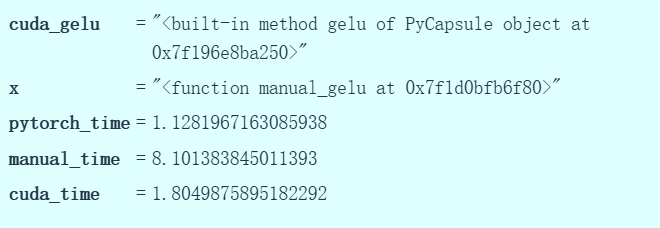

这里记录了运行PyTorch版本所需的时间，和上次测试结果类似，大约是1.1毫秒。而手动实现的时间记得是8.1毫秒。

我们的CUDA版本将时间降低到了1.8毫秒。虽然还没有完全达到PyTorch实现的水平，但已经非常接近了。从8毫秒提升到1.8毫秒，这个进步相当不错，毕竟那段C代码写起来并不复杂。

**接下来进行性能分析。**

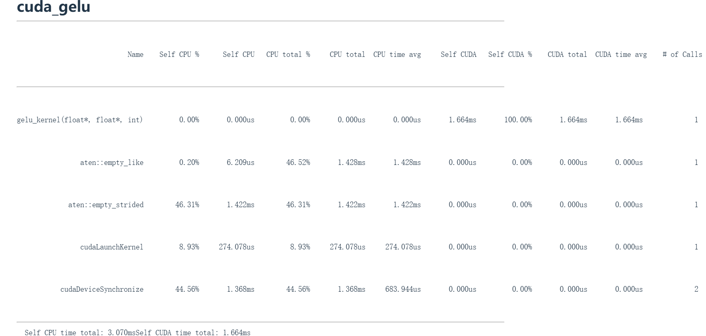

这里显示调用了 `gelu_kernel` 内核，这就是被发送到GPU执行的代码。然后调用了 `aten::empty_like` 进行初始化，接着是 ` aten::empty_strided `，随后是CUDA内核启动和设备同步操作。

在 Self CUDA 这一列中，这个单一的CUDA内核（ `gelu_kernel` ）占据了100%的GPU时间，这是我们想要的效果。

我们把所有操作符都融合在一起，很好地解决了内核融合的问题，因为我们把所有操作都融合在一起了，并且效果相当不错。这类逐元素操作在CUDA中很容易实现。如果你需要实现某种新的非线性函数，完全可以自己编写对应的CUDA内核。

但更复杂的操作比如说需要读取多个值的归约操作，会稍微复杂一些，就像Flashattention的实现会更难。

为什么我们的手动实现会比编写cuda版本慢呢，cuda版本会将数据从GPU发送回CPU然后x将驻留在GPU中。而手动版本中我们在GPU中分配它并向CUDA实现一样处理，但它上不会一直待在流多处理器中。所以一旦我们执行x平方，那是一个CUDA内核。这个乘法操作将从全局内存读取向量到流多处理器，执行计算然后写回。所以这全是DRAM到流多处理器的通信成本，而不是CPU到GPU的通信成本。当然，如果是CPU设备，那么除了DRAM传输成本还有CPU传输成本。

当然我们有更好的Python抽象来编写CUDA内核，那就是Triton。

## 7.5 Triton

Triton是OpenAI在2021年开发的领域特定语言，它使GPU编程更容易上手，因为不需要管理GPU的所有细节。而且我们可以使用Python编写一切而不再需要考虑线程，而是考虑线程块。

Triton管理了很多烦人但可以自动优化的东西，它可以管理内存的合并。我们上一章讲过突发模式：从DRAM中一次可以获取四个相邻的值，当你在内存检索数据但是它被分组为一次四个相邻元素或更多调用，它就能自动处理这些。

当需要管理在流多处理器内多个线程写入的内存时，它会进行共享内存管理。在每个流多处理器内我们有时需要停止或启动线程，Triton可以自动管理，但跨流多处理器的调度或不同流多处理器的操作是手动的。所以使用Triton时你将以流多处理器为中心来思考，编译器将处理更多底层细节。

Triton非常好的一点时它可以在很大程度上超越许多PyTorch实现。就像在熟悉的Python领域直接编写CUDA，它全在Python中，你可以单步调试.

### 7.5.1 使用Triton编写gelu

```python
@triton.jit
def triton_gelu_kernel(x_ptr, y_ptr, num_elements, BLOCK_SIZE: tl.constexpr):
    # 输入时 `x_ptr`，输出是 at `y_ptr`
    #     |        Block 0            |          Block 1          |      ...      |
    #                            BLOCK_SIZE                                 num_elements
    pid = tl.program_id(axis=0)
    block_start = pid * BLOCK_SIZE
    # Indices where this thread block should operate
    offsets = block_start + tl.arange(0, BLOCK_SIZE)
    # Handle boundary
    mask = offsets < num_elements
    # Read
    x = tl.load(x_ptr + offsets, mask=mask)
    # Approx gelu is 0.5 * x * (1 + tanh(sqrt(2/pi) * (x + 0.044715 * x^3)))
    # Compute (tl.tanh doesn't exist, use tanh(a) = (exp(2a) - 1) / (exp(2a) + 1)
    a = 0.79788456 * (x + 0.044715 * x * x * x)
    exp = tl.exp(2 * a)
    tanh = (exp - 1) / (exp + 1)
    y = 0.5 * x * (1 + tanh)
    # Store
    tl.store(y_ptr + offsets, y, mask=mask)

def triton_gelu(x: torch.Tensor):
    assert x.is_cuda
    assert x.is_contiguous()
    # 分配内存给输出张量
    y = torch.empty_like(x)
    # Determine grid (elements divided into blocks)
    num_elements = x.numel()
    block_size = 1024  # Number of threads
    num_blocks = triton.cdiv(num_elements, block_size)
    triton_gelu_kernel[(num_blocks,)](x, y, num_elements, BLOCK_SIZE=block_size)
    return y


```

`triton_gelu` 这是包装的Tritongelu代码，接收x，两个断言时用来确保x在GPU上并且恋雪。然后使用 `empty_like` 分配一个输出张量y。`triton_gelu_kernel[(num_blocks,)](x, y, num_elements, BLOCK_SIZE=block_size)` 中有基本上是在向我的内核传递相同的信息。

现在triangle内核就是 `triton_gelu_kernel` 。这实现我们之前cuda代码所做的相同功能，但现在是用Python优雅地编写而成。

输入`x_ptr`将位于x指针处。Y指针`y_ptr`是输出向量。 blocksize表示每个块的大小。num_elements将是我数组的末端位置。

```python
pid = tl.program_id(axis=0)
block_start = pid * BLOCK_SIZE
offsets = block_start + tl.arange(0, BLOCK_SIZE)
```

上面这三行则是在计算索引。 `block_start = pid * BLOCK_SIZE` 这里是在计算当前块的起始位置，也就是块ID乘以块大小，之后需要知道我在块内的位置，`offsets` 将是偏移量。但请注意一个区别：获取的不是单个偏移量，因为我们不是在编程线程，而是在编程块。这意味实际上我的偏移量是一个向量，**而不是单个值**。因为这本质上是要进行向量化操作，而向量化操作将由不同线程处理。所以这里 `offsets = block_start + tl.arange(0, BLOCK_SIZE)` 的偏移量是块的起始位置加上一个向量，即这个blocksize偏移范围。也就是说我的偏移量是块内所有这些坐标的集合。

当然如果在最末端，可能会超出边界，因此需要一个mask来处理向量边界外的所有情况,即 `mask = offsets < num_elements` 。

现在，我将通过单次向量化操作一次性加载所有数据， `x = tl.load(x_ptr + offsets, mask=mask)` 。所以x指针加偏移量就是我要处理的数值，经过掩码处理后加载到x中,这是我们需要的内部值，即内部临时向量。

使用这个临时向量，我将执行与之前完全相同的gelu计算。

```python
    a = 0.79788456 * (x + 0.044715 * x * x * x)
    exp = tl.exp(2 * a)
    tanh = (exp - 1) / (exp + 1)
    y = 0.5 * x * (1 + tanh)
```

这里没有tanh函数，所以需要手动计算，这个公式与我们之前使用的完全一致。然后y将是通过上方公式计算的结果。完成计算后，我们需要将其写回输出缓冲区也就是输出向量`tl.store(y_ptr + offsets, y, mask=mask)`。因此计算目标位置就是括号中的y指针加偏移量，还有临时值y和mask。然后进行存储。

这与之前的操作非常非常相似，但这是向量化版本。我们可以一次性操作整个块，所以不同于从线程视角思考，现在是从块的视角思考，但差异并不大。

### 7.5.2 triton的测试

```python
    manual_time = benchmark("manual_gelu", run_operation1(dim=16384, operation=manual_gelu)) # @inspect manual_time
    pytorch_time = benchmark("pytorch_gelu", run_operation1(dim=16384, operation=pytorch_gelu)) # @inspect pytorch_time
    cuda_time = benchmark("cuda_gelu", run_operation1(dim=16384, operation=create_cuda_gelu())) # @inspect cuda_time
    triton_time = benchmark("triton_gelu", run_operation1(dim=16384, operation=triton_gelu)) # @inspect triton_time
    triton_gelu_profile = profile("triton_gelu", run_operation1(dim=16384, operation=triton_gelu))
```

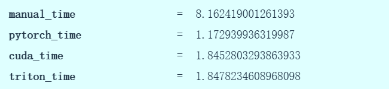

手动gelu耗时8.1毫秒，PyTorch版本1.1毫秒，CUDA版本1.84毫秒，Triton版本1.848秒。虽然速度没有提升，但编写Triton代码要容易得多。我们用Python编写，考虑块操作，还能进行向量化加法。如果处理更复杂的任务，Triton会帮你处理很多内存操作，这确实很不错。

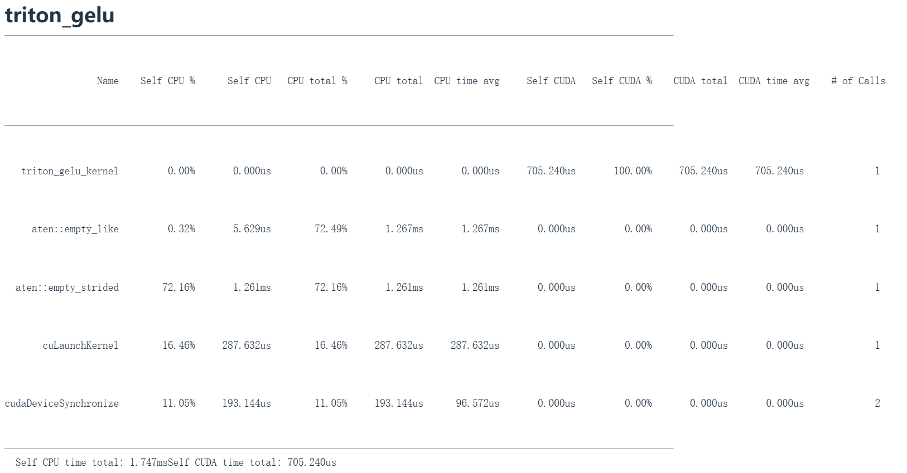

性能分析再次显示，单个内核启动消耗了所有GPU时间，这正是我们想要的。

## 7.6 torch.compil

```python
def pytorch_compilation():
    compiled_gelu = torch.compile(manual_gelu)
    check_equal(compiled_gelu, manual_gelu)
    if not torch.cuda.is_available():
        return
```

编写CUDA内核很好，但或许我们并不需要这么做，因为使用工具`torch.compil`就能实现自动优化，我们做的就是将立方和指数运算塞进单个CUDA内核（`compiled_gelu = torch.compile(manual_gelu)`）。`torch.compile`它**能够接收未优化的PyTorch代码并生成优化版本。它会尝试自动进行内核融合等优化。这个编译后的gelu在输出结果上与之前等效**。它实质上是利用PyTorch现有的JIT编译器自动优化代码

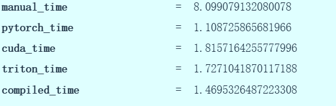

现在来看运行时间，手动8.1毫秒，PyTorch 1.1毫秒，CUDA 1.8毫秒，而torch.compile仅需 1.47毫秒。

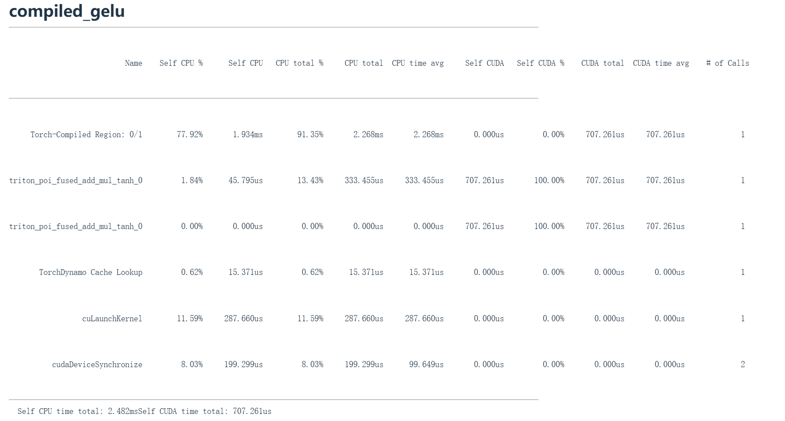

关键结论是：现代JIT编译器非常强大，能在无需人工干预的情况下实现操作融合等优化。比我们做的稍更优化。因此它的性能甚至比我们的代码还要稍好一些。所以`torch.compile`确实十分优秀。

什么时候用`torch.compile`是一个关键问题，对于简单操作比如基础的算子融合和阵乘法优化，`torch.compile`如果知道矩阵形状就能分配合适的内核，这些方面它已经非常出色，人工很难在这方面做得更好了。

但像FlashAttention1、2、3这类优化就相当复杂。如今 `torch.compile` 和Jax的XLA编译器确实能实现这些，但这是因为我们事后才明白这些是正确的优化方向。而且有些优化策略并不容易发现，**比如FlashAttention3利用了H100硬件的底层优化，这对JIT编译器来说并不直观，这些就是torch.compile难以处理，但人工可以优化的场景**。

不过核心观点是：**不用想着为每个模块都手写CUDA内核，因为这很可能是在浪费时间。但如果在开发新架构时遇到复杂模块，GPU利用率不理想却认为有优化空间，这时候就值得使用Triton了**。

