# 第八章分布式训练

今天的重点将完全围绕跨机器的并行性展开。我们的目标是从优化单个GPU的吞吐量，转向理解训练超大规模模型所需的复杂性和细节。当模型规模变大时，单个GPU已无法容纳，因此需要将模型拆分到不同机器上，同时还要充分利用所有服务器资源来实现快速训练。我们将面临计算和内存两方面的挑战，还需要处理不同机器间的异构通信。GPU之间存在不同层级的通信方式，这将催生多种并行化范式。实际应用中人们会同时组合使用多种并行策略，我们将逐一讲解最主流的方案，然后探讨如何将它们组合起来高效训练超大模型。最后我会通过实际案例展示这些并行策略如何应用于大规模分布式训练。本次讲座大致分为三个部分：首先介绍网络基础原理，接着分析不同网络硬件如何对应各类并行化策略，最后通过案例研究展示整体协作机制。

## 8.1 LLM网络的基础知识

### 8.1.1 GPU的拓展背景

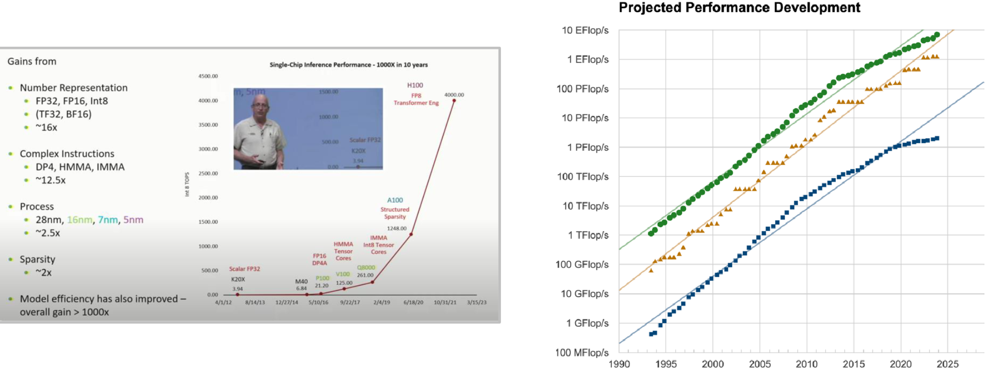


我们在GPU那章提到过GPU的算力增长曲线，虽然GPU算力的增长已经非常快了，但若想快速扩展计算和内存能力，单靠GPU是不够的，因为现在的大语言模型参数量的增长十分迅速，比如deepseek 671B需要的**显存已经是TB**级别的，算力更是一个天文数字，一张卡显得有些杯水车薪。虽然GPU内存也在增长，但单个GPU设备无法容纳如此庞大的模型。**下面这张图就体现了模型的尺寸变化（截至2022）**。

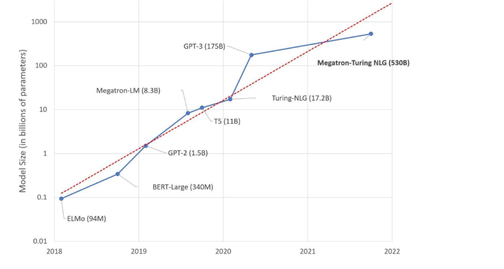

我们需要的是多机并行架构，即使用多张显卡来共同训练模型，第一幅图中的右侧图表中的**绿色曲线**代表全球最快的超级计算机，其算力已达到百亿亿次级别。它正是当前训练顶尖大模型必须依赖的基础设施。

**我们期望从多机扩展中获得线性内存扩展（最大模型参数随 GPU 数量增加而扩展）和线性计算扩展（模型 FLOPS 随 GPU 数量线性增加）**。

### 8.1.2 多GPU、多机并行架构

所谓的多GPU，多机并行就是一个机器上搭载多个GPU，多个机器同时进行计算。

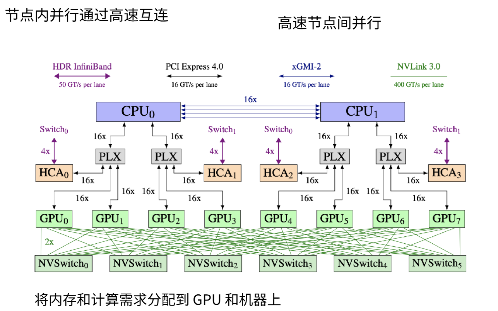

上面是GPTNeoX论文引用的示意图（虽然示例较旧，但原理适用于当前的H100机器），一个机器拥有多个GPU，八块GPU通过**高速互联与CPU连接**，底层**NVSwitch提供极快的机内互联**，但跨机通信必须经过网络交换机（图示紫色HDR InfiniBand 线），它是一个明显比NVLink慢的连接，数据的吞吐量明显慢八倍。这种硬件层级结构将直接影响我们实际采用的模型并行化方案。牢记：**单机内部的通信速度极快，而跨机通信则存在明显延迟。**

当我们跨越多台机器时速度会变慢，而根据所使用的硬件类型，一旦我们超越（比如）256块联网的GPU，甚至可能出现更严重的减速。许多学过系统或网络课程的同学可能已经知道这一点，但这里还是简单回顾一下**集体通信操作**。

### 8.1.3 集体通讯操作

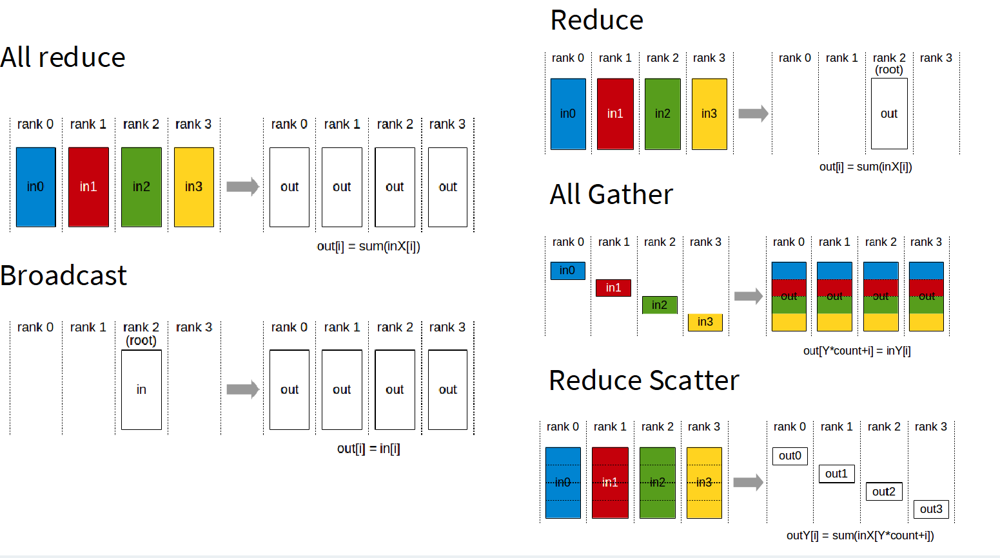

1. **All reduce操作（全归约）**

假设有四台机器（四个节点），每台拥有自己的数据。我们需要在每个节点上执行归约操作（比如对所有输入求和），然后将**四个结果复制到每台机器上**，简单来说就是这个操作的**成本大致是总归约数据量的两倍**。

2. **Broadcast操作（广播）**

这里以**节点2**的单个输入为例，将其**复制到所有其他节点。通信成本大致与输出总量成正比**。

3. **Reduce操作（归约）**

将不同输入（这里是四个）求和后，**仅发送到一台机器**。

4. **All Gather操作（全收集）**

AllGather是指（比如）将节点0的参数子组件**复制**到所有节点，节点1/2/3也执行相同操作。每个节点处理不同参数分区，并将其复制到其他机器。它将所有节点的数据块拼接后，完整复制给每一个节点（与 AllReduce 的"聚合"不同，AllGather 只做"收集"不做"计算"）。

5. **Reduce Scatter（归约分散）**

Reduce Scatter则是将各行数据求和后，仅将结果发送给节点0。即先对所有节点的数据进行归约计算，再将结果分块，每个节点只获得属于自己的那一部分。

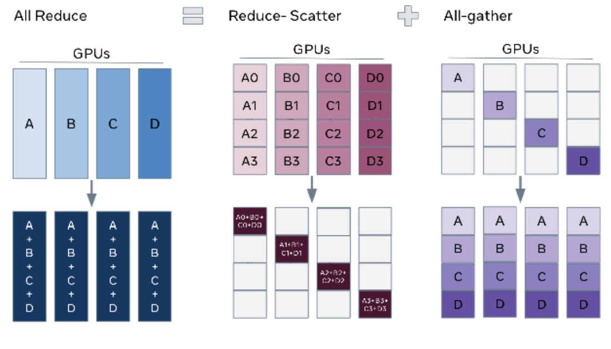

All Gather和Reduce Scatter之所以重要，是因为它们本质上是构建众多并行化算法的**基础组件**。

例如在执行All Reduce时：假设不同GPU（A/B/C/D）处理不同数据点，然后我们需要对梯度求和并传回所有GPU，这是典型的四GPU数据并行操作。但这个过程可以用Reduce Scatter和All Gather两个操作替代：前者对各行列求和后将结果分别留在GPU A到D，后者再将结果复制到其他GPU。在带宽受限场景下，这是最优方案。All Reduce的最高性能基本等同于Reduce Scatter加All Gather的带宽极限，通过对比两种操作的通信次数可以验证这一点。

### 8.1.4 GPU和TPU

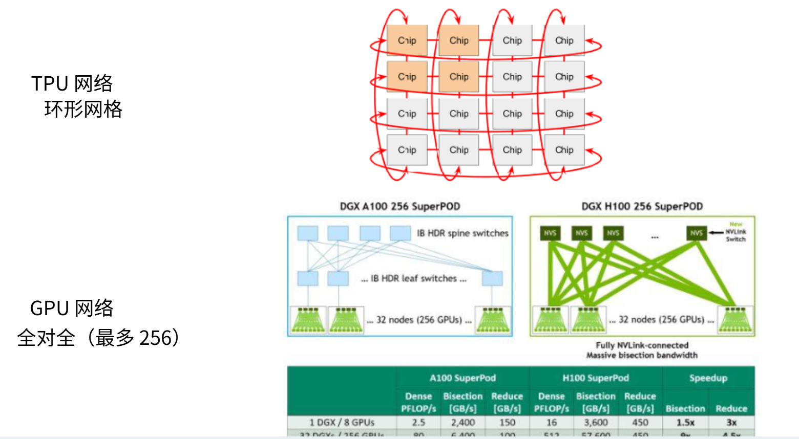

我们简要说明**GPU与TPU**的差异。

GPU的组网方式如上图所示，单节点包含8块GPU，通过**交换机实现高速互联**，最多**256块GPU可实现全互联高速通信**。超过这个阈值（约单个机柜容量）后，就需要通过速度更慢的switches 和  spine switches,通信。

而谷歌的TPU采用截然不同的组网方式：单个TPU芯片与**相邻节点**实现极速通信，形成可轻松扩展的**环面网格结构**，但**仅支持相邻节点通信**。

我们在讲解AllReduce后立即讨论这个，是因为在环面网格上执行集体通信（如All Reduce或Reduce Scatter）的效率与全互联方案相当。如果纯粹针对集体通信优化，TPU网络架构比GPU网络更具优势。之后我们就会讨论一个数据中心而非单个GPU。

---

##  8.2 核心并行策略  

我们需要重点考虑**三种并行策略**。

首先是**数据并行**，其核心思想是在**不同GPU间复制参数副本**，不涉及参数拆分，但会将**训练批次**进行划分，让不同GPU或机器处理数据批次的不同切片，这就是数据并行。

其次是**模型并行**。随着模型规模扩大，一个GPU难以塞下所有的模型的参数。因此需要**分割模型让**不同GPU处理模型的不同部分。

最后是**激活并行**。日常开发中我们很少关注激活值，因为PyTorch已做了透明处理。但随着模型规模和序列长度的增长，激活内存会成为严峻挑战。若要使用超大批次训练巨型模型，必须**有效管理激活值的内存占用**，因此也需要对激活值进行**分割**处理。

当这三种并行策略协同工作时，我们就能获得在庞大机器集群上优雅地进行扩展计算。

### 8.2.1 数据并行（Data Parallelism）

核心思想是复制模型，分片数据批次。

数据并行的起点是最朴素的随机梯度下降(SGD)。

$$
\theta_{t+1} = \theta_t - \eta \sum_{i=1}^{B} \nabla f(x_i)

$$

其中：
$\theta_{t+1}$ 是更新后的参数，
$\theta_t$ 是当前的参数，
$\eta$ 是学习率，
$B$ 是批量大小（Batch size），
$\nabla f(x_i)$ 是函数 $f$ 在 $x_i$ 处的梯度。

如图所示公式，我们获取批次大小B，**累计所有梯度后更新参数**。最基础的数据并行就是将批次B进行**分割并分发到不同机器**，每台机器计算**部分梯度求和**。然后会在每次**梯度更新前同步所有梯度**，具体就是先**交换所有梯度进行同步，再执行参数更新**。

数据并行是非常有效，每台机器的每个GPU将分配到B/M个样本。当批次规模**足够大**时，每个GPU都能获得相当规模的批次数据，可以**充分饱和计算资源**，但是每批次需要传输**两倍**参数量的数据，因为**全归约操作的通勤成本约等于待归约数据量的两倍**。当**批次规模较大**时，这种开销尚可以被接受，因为频繁同步梯度的通信成本可以被**掩盖**。

但是当前方案则完全未作优化内存。每个GPU都需要完整**复制参数和优化器状态**，这对内存扩展极为不利。实际训练中内存始终是瓶颈，我们都遇到过大模型加载到GPU时PyTorch报显存不足的错误。这直接影响训练效果，因此理想情况下需要节省内存。

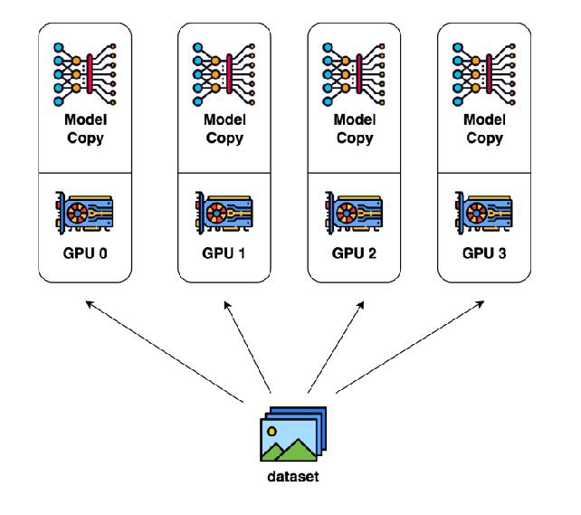

在普通的数据并行的内存使用，中我们需要存储大量模型副本，根据训练精度，每个参数约需**16字节存储空间**，**实际上需要保存约5个权重副本**。

单从模型参数角度看，存储FP或者BF16理论上仅需2字节，还需要存储**梯度**（BF16精度下另需2字节）、**优化器状态**：SGD累积更新需要4字节主权重，Adam一阶矩估计需要4（或2）字节（用于记录历史梯度），二阶矩估计（梯度方差）又需4（或2）字节。

#### ZeRO 解决DP（数据并行）的内存开销问题

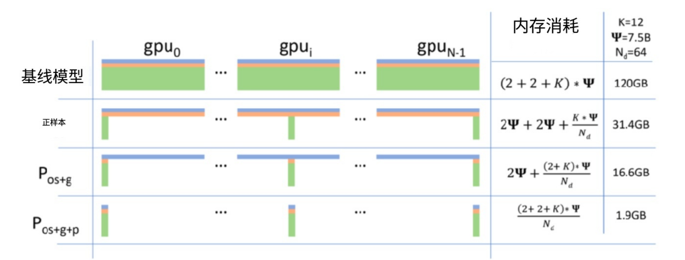

**蓝色部分是参数占的内存，橙色是梯度，绿色是优化器状态的内存**

通过图示可以直观看到，在参数内存占用中，**Adam优化器状态占了大部分**，所以内存消耗主要取决于优化器状态的字节数，通常甚至**超过核心参数和梯度的内存用量**。

以分布在64个加速器上的75亿参数模型为例，其内存占用极其庞大，且总内存随GPU数量线性增长，这显然不可接受。

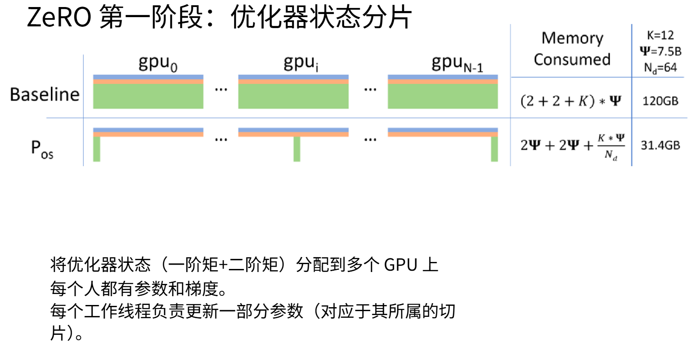

参数和梯度跨设备复制是数据并行的必要环节，但**所有优化器状态不必存在于每台机器**上，即优化器状态分片。由上面的这张图可以看到，通过这种技术，总内存占用可从**120 GB 降至 31.4 GB**。若进一步对梯度分片，内存使用可压缩至16.6 GB。当参数也实施分片后，最终能将内存占用极致优化到1.9GB。这将是一个相当理想的状态，因为现在我们已经完全分片了所有需要的优化器状态、参数和梯度内存。

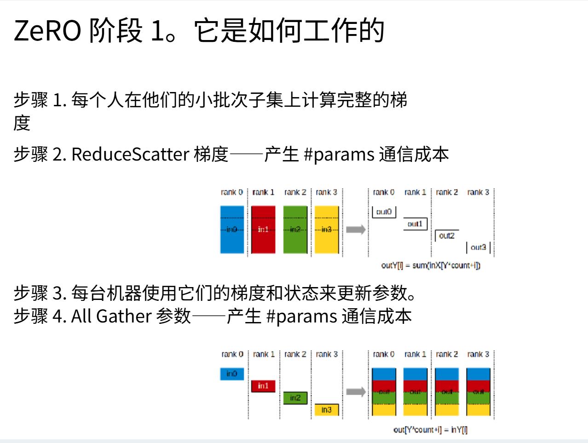

第一步：假设每个GPU获取不同的数据点。假设有 GPU0 到 4，每个GPU处理单个样本，并基于自有样本计算完整梯度。

第二步：执行梯度归约散射操作，收集每个GPU持有的梯度。假设GPU0负责前四分之一参数。通过归约散射操作，确保GPU0获得所有其他GPU针对其负责参数子集的所有梯度信息。这样它就汇集了来自GPU1/2/3的梯度信息，全部归约到GPU0中。现在GPU0拥有更新自身参数所需的所有信息，持有对应第一部分参数的优化器状态，也拥有该部分完整的聚合梯度。

第三步：使用梯度和状态对这部分参数执行梯度更新。

第四步：GPU 0 中已获得该参数子集的完整更新版本，最后只需要通过全收集操作将所有更新后的参数同步回所有计算节点。

这里的关键是我们正在进行reduce scatter和all gather。reduce scatter 加上 all gather的成本与all reduce相同。我们之前在所有梯度上进行all reduce，以确保每个人的梯度同步，那花费了我们参数数量的2倍。我们可以在reduce scatter和all gather两个步骤之间进行一些计算。这给了我们相同的计算通信成本但是更多的计算操作。

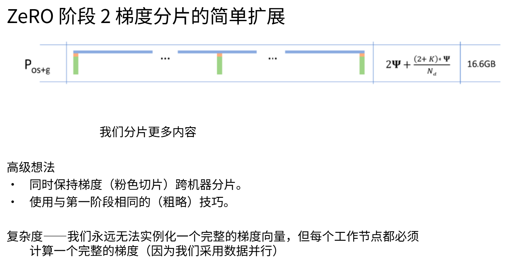

接下来进一步扩展分片范围，将梯度分片。完整参数+分片梯度+分片优化器状态。

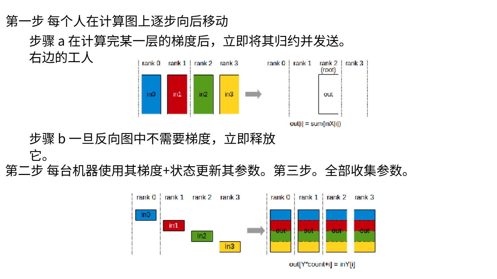

具体的过程是在反向计算梯度的过程中，每当完成某个层的梯度计算，就立即将其发送到对应的GPU上.所有计算节点各自持有批次数据分量，沿着计算图逐步反向计算。假设我们按层进行操作（各层被原子化分片到不同GPU），那么在反向计算图中每完成一个层的梯度计算后，立即调用归约操作将梯度发送给对应工作节点。比如某个层属于2号GPU，我们就立即执行归约操作并发送给该节点。此时梯度数据就不再需要保留，因此不需要将梯度存储在0、1、3号计算节点上，可以立即释放显存，原因就是单个GPU无法保存所有梯度。

如此循环往复，最终所有机器都会获得**完整更新的梯度**。现在每个机器都持有对应参数分量的完整梯度，也拥有对应参数分量的完整优化器状态，各自更新参数后再通过全收集操作整合参数。虽然看起来通信量有所增加（因为每层都要执行归约操作），但这仅涉及少量参数（毕竟已经分片），总体通信量保持不变。ZeRO第二阶段确实会产生额外开销（需要逐层同步确保梯度正确发送），但开销非常有限，整体实现仍然简洁直观。

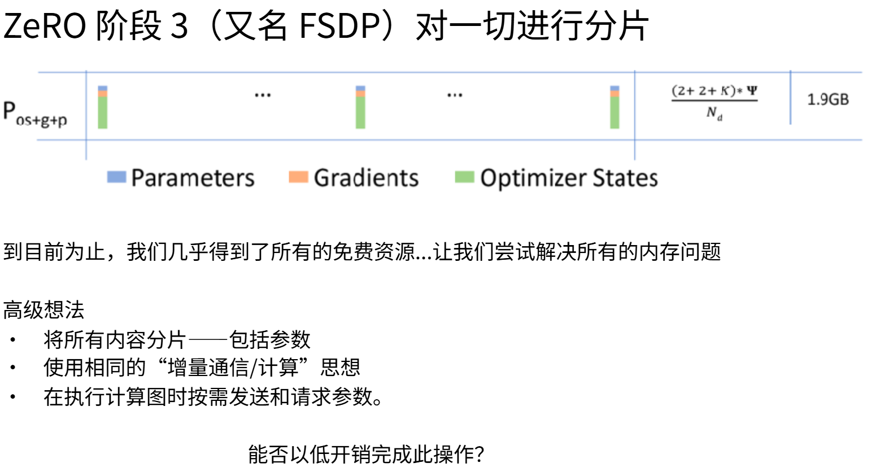

最后来到ZeRO第三阶段，更复杂但收益也更大，现在**所有组件**（包括参数）都可以根据GPU数量进行**均分**，实现最大程度的内存节省。

FSDP（全分片数据并行）本质上就是ZeRO第三阶段的具体实现。

**核心思路**是对所有组件（包括参数）进行分片，沿用ZeRO第二阶段的增量通信计算策略，避免保存庞大的梯度向量。在遍历计算图（包括前向和反向传播）时，按需发送和请求参数。关键在于尽可能降低开销。

FSDP最令人惊叹的是能以相对**较低的开销实现**。

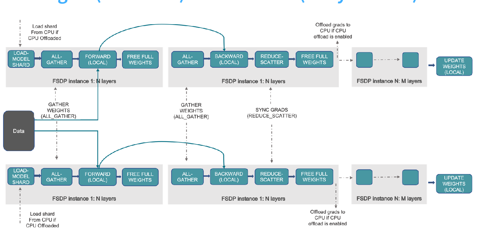

上图揭示了**开销控制**的原理，我们将通过全收集操作动态整合模型权重，对于每一层单个GPU都不会拥有**全部参数**，不像常规做法那样直接让GPU0执行前向传播。假设GPU0仅持有最底层参数，它完成该层计算后就会暂停，并向所有其他工作节点**请求参数**。此时它会暂停并执行全收集操作（即图中标注的all gather 步骤），通过汇集所有参数获得执行前传所需的数据。随后它便能继续前传计算原本缺失的层，完成后立即释放权重数据。接着继续全收集下一层参数，执行前传并释放权重，如此循环往复。但激活值必须保留，导致激活内存不断增长，这最终会成为问题。

若暂不考虑激活值，这种模式非常理想：加载单层参数、执行前传、立即释放，内存开销极低。完成前传后，反向传播也遵循相同逻辑：每次在神经网络中反向计算时，全收集所需参数，通过归约散射（reduce scatter）更新已计算的梯度，随后释放权重。最终既可释放不需要的梯度数据，也能释放参数，得到完整更新的模型。

这里需要关注三种核心操作：**两次全收集和一次归约散射**，本质上是在梯度更新后完成模型同步。从概念上看，这仅是比ZeRO第二阶段多了一步操作，但确实带来了更多开销。总通信成本现在更高了：之前是两倍参数量的通信量，某种程度上算是零成本；而现在达到三倍参数量通信成本，还需要承担通信等待带来的额外开销。

FSDP最精妙之处在于其开销意外地低，尽管需要持续请求和传输参数，你可能认为这会导致严重延迟，但通过通信与计算重叠的核心设计，GPU能在后台通信的同时持续工作，类似预取机制。当需要某些数据时，它们早已传输就绪。

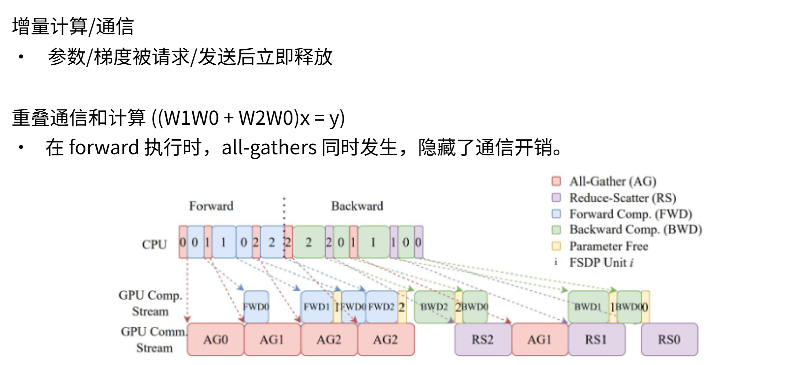

如上图所示 $(W_1 \cdot W_0 + W_2 \cdot W_0) x$ （假设输入为y）。当运行FSDP时，最终会得到如图所示的通信计算流程。**首先CPU会分派指令**，询问GPU的通信单元获取参数，同时指示 GPU 执行矩阵乘法，cpu会比GPU超前运行。

现在观察设备上通信与计算的时序当计算第1层时，通信单元已**预取**第2层参数；计算第2层时，通信单元又**预取**第3层参数，形成**流水线作业**。这种设计使得通信几乎被完全隐藏，虽然**理论上需要三倍通信量**，但实际效率损失可能仅为**10%-20%**。

所以在最开始，我们必须确保每个设备都拥有第0层的权重，即这里的 $W_0$ 。所以执行了all gather 0 操作，并等待其完成，而一旦完成，我们就可以对W0执行前向计算步骤，比如计算 $x$ 乘以 $W_0$ 。此时，all gather1 操作恰好在 all gather0 结束时同步启动。这样当我们进行矩阵乘法运算时，实际上已经在开始加载下一组需要的参数了。当然通信速度相对较慢，所以会存在一些间隙，但最终完成时间比初始加载**快得多**。现在可以执行前向计算1（FWD1）了。在后台又开始加载第2组参数。这里的黄色区块表示我正在释放与前向计算1相关的参数。另一个重点是 $W_0$ 被重复使用了两次，因此不需要重新通信.

这个过程非常迅速。在需要之前，前向计算2所需的参数已经**提前加载完成**，所以这里不存在**空档期**。随后又可以释放第2组参数。至此完整的前向传播过程结束。可以看到这里的间隙相对较小，我们在实际计算发生前就完成了大量加载操作。通过这种巧妙的预加载权重请求队列机制，可以避免大量通信开销。当前向计算2完成时，前向传播全部结束。我可以释放第2组权重，并开始反向传播。可以看到反向传播所需的 all gather2 操作早已完成，因此可以立即开始反向计算2和反向计算0，而权重0已经存储就绪。

反向传播阶段会出现较高开销，因为需要执行reduce scatter和all gather等操作。尽管我们采用了这种极端的分片策略（回顾之前图示，我们对参数、梯度和优化器状态进行了完全分片），但所需总带宽仅**为3倍而非2倍**，这还算不错。实际出现的**空档**并不严重，通信资源几乎被完全利用，计算停滞时间也很短。这说明我们实际上非常高效地利用了现有资源。

**关于预加载权重的存储位置问题**：由于GPU显存已满，这些权重预加载到哪里了呢？我们需要一个缓冲区来存储这些权重，读取当前层权重会产生一定开销，另外还有个重要因素是我们完全没有讨论激活值，而这部分会占用很大空间，因为整个模型的激活值集合在某种程度上需要持续驻留。

数据并行的并行成本为 2乘参数量的通讯

#### 下面分析ZeRO

从某种角度说，**ZeRO**的做法就是人们**高效实现分布式数据并行**的方式。阶段 1基本是**零成本**的，它采用与朴素数据并行相同的通信模式，但还能分片优化器状态。**ZeRO阶段2**的通讯的参数数量**是原来的两倍**，因此总带宽消耗相同，但在**反向传播过程中需要逐步释放梯度会带来额外开销**。**ZeRO阶段3**更为复杂，程序通信成本达到三倍，但实际表现不错。我们之前看到的图示中确实存在一些开销，但如果巧妙设计通信模式，效果其实相当理想。因此即使在网络连接较慢的情况下，人们仍会使用这种数据并行。这种方法的另一个优势在于数据并行对架构几乎没有任何特殊要求。所有细节都被高度抽象化了，这也解释了为何FSDP如此受欢迎，只需编写一个封装器就能并行化任意神经网络，无需深入理解架构的具体运作机制。

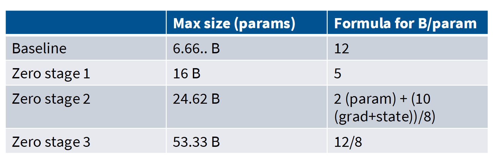

这里有些具体案例。可以看到在8块A10080G显存的节点上能承载的最大模型规模,基线情况下仅能勉强容纳60亿参数模型，而使用ZeRO阶段3时则能承载约500亿参数模型。通过FSDP等智能内存优化技术，我们获得了承载更大模型的显著能力提升。


最后强调数据并行的关键：**批次大小**是核心限制因素。由于每台机器最多处理一个样本实例，数据并行度无法超过批次大小。当批次大小达到上限时，数据并行将无法继续扩展。大家可能会发现当批次大小**超过某个临界点**后，优化收益会出现明显递减。关于这个课题已经有很多论文发表。OpenAI有一篇很好的论文讨论临界批大小，他们基本观点是超过某个临界点后，每个训练样本对优化能力的贡献会出现急剧的收益递减。直观理解是：低于某个批大小时，梯度噪声很大，**此时减少噪声非常有益**；但达到某个程度后，根本限制因素就变成了**梯度更新次数而非方差缩减**。这意味着单纯的数据并行无法实现任意规模的并行化，**批大小**是非常重要的资源。本质上我们存在固定的最大批大小上限，但可以通过不同方式分配使用，因为其他类型的并行化同样受益于更大的批大小。我们需要在特定环节合理分配批大小。数据并行仍存在**固有局限：ZeRO第1/2阶段无法扩展内存**，第3阶段理论上不错但**运行缓慢**。更重要的是这与之前的问题相关，它无法减少**激活值内存**。

最理想的情况是将模型完全分割成**独立部分**，这样激活内存也会随之减少。因此我们需要**更好的模型分割方案**，才能将超大规模模型装入GPU显存。这就引出了**模型并行**。我们的目标是保持批大小不变的前提下扩展内存容量，并找到不需要依赖大批量就能实现并行化的新维度。具体实现方式是将参数分布到多个GPU上，某种程度上类似ZeRO3，但不再传递参数而是传递激活值，这会产生关键差异，因为有时激活值会比参数小得多，这对我们非常有利。

---

### 8.2.2 模型并行（Model Parallelism）

模型并行的核心思想就是讲参数分布在多个GPU上，就像ZeRO3,但是通讯的是激活值而不是参数。

我们会介绍两种模型并行方式：**流水线并行**概念简单但实现复杂，**张量并行**概念较隐晦但实现更优雅且应用更广泛。它们对应着**两种不同的模型分割方法**。

#### 流水线并行（Pipeline Parallelism）

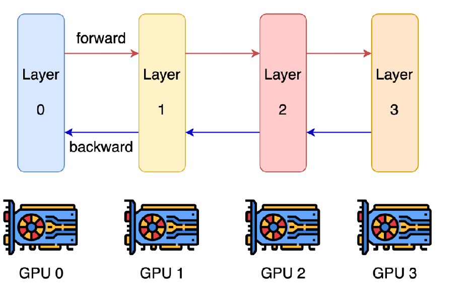

**流水线并行**可能是最直观的神经网络分割方式。深度神经网络由多层组成，我们很自然就会想到**按层边界进行切割**，每个GPU处理部分层，通过传递激活值进行通信。这种情况下每层专属一个GPU，GPU之间正向传递激活值，反向传播时从3号GPU向0号GPU回传梯度。这方案看似完美，但问题在于大多数GPU大部分时间处于**闲置状态**，利用率极其**低下**，因为是逐层的，在上一层的激活值没有算完之前，后面的层数的GPU都在等待。

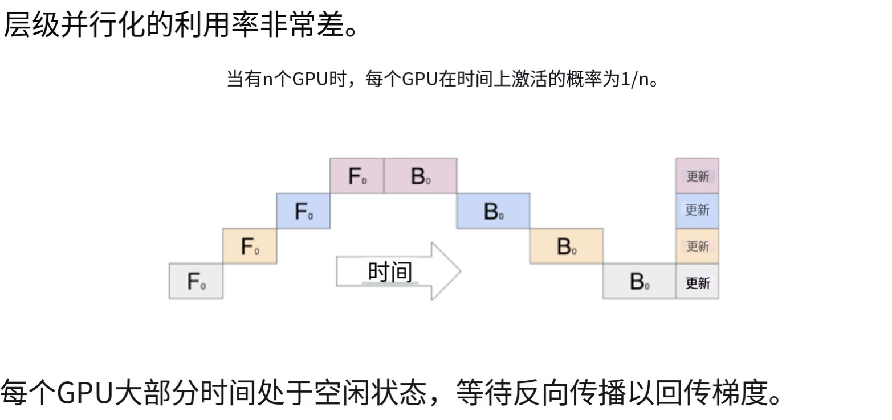

如果采用这种朴素的并行方案：假设每层包含前向计算且仅处理单个样本，时间线图示会呈现这样的场景：上图中不同行代表不同层（对应不同GPU），横轴是时间维度。可以看到最左侧首先计算**第一层**，激活值传递至**第二层后GPU2开始工作**，依此类推。等到开始反向传播时，会出现巨大的“空泡”，这段空白期完全不进行计算，GPU有效工作时间仅占1/n。所以在某种意义上，这可能实现的最差并行方案了，虽然增加了4块GPU，但获得的吞吐量却和单块GPU相当。

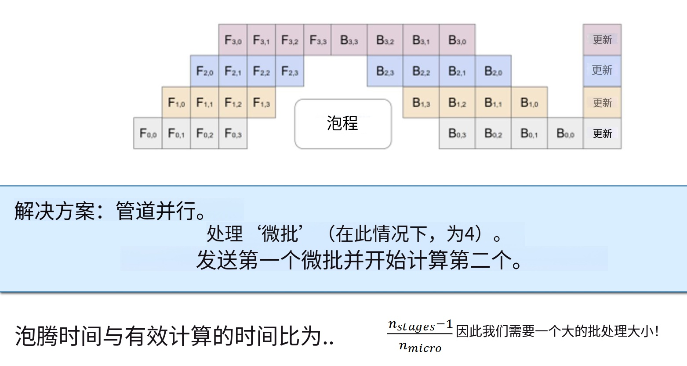

因此可以采取更巧妙的处理方式：构建流水线架构。不再简单按层切分任务，而是**创建需要每块GPU按序处理的任务序列**。假设现在有一个微批次，每台机器处理四个样本。当完成第一个数据点的处理后，可以立即将其激活值发送给第二块GPU，然后立即开始处理第二个数据点。这样就实现了通信与计算的叠加——在第一块GPU持续工作的同时，第二块GPU也能开始工作。通过增大批次尺寸，可以有效缩小流水线中的空闲时段（气泡）。这也能解释为何之前将批次尺寸称为资源：在固定批次尺寸下进行流水线并行时，既可以利用它缩小流水线气泡，也可以用于数据并行。单一批次尺寸可以通过不同方式进行多重划分。微批次尺寸实际上控制着气泡时长。具体而言，系统开销与有效计算量的比值等于流水线阶段数的负一次方除以微批次数量。当批次尺寸足够大时，流水线并行可能实现高效运行。但如前所述，批次尺寸存在上限，无法任意扩大。

总体来看流水线并行似乎**表现不佳**，为何我们仍要采用这种会带来气泡开销的并行方案？主要有以下原因：与数据并行相比，流水线并行有助于**节省显存**，虽然ZeRO-3也会分片参数，但流水线方案还能分片激活值；其**通信特性更优**，仅依赖激活值传输且采用点对点通信；根据网络拓扑结构，**在慢速网络链路上使用流水线并行往往更具优势**。因此在节点间、甚至跨机架的场景中，可能会采用流水线并行。

谷歌工程师曾举例说明TPU的一大优势：由于其环形网格拓扑提供高速互联，在256个GPU规模内无需频繁使用流水线并行，只有遇到慢速链路时才需切换至该方案。

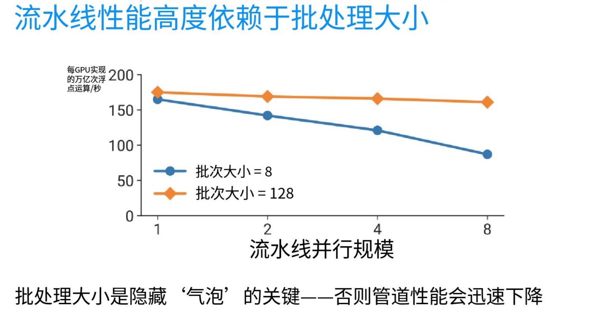

上图是NVIDIA论文中的实例：当批次尺寸为8时，随着流水线并行设备数量的增加，单GPU利用率**急剧下降**；而当批次尺寸达到128时，即使采用较大规模的流水线并行，仍能保持较高利用率。这说明**批次尺寸对掩盖气泡时长至关重要**。

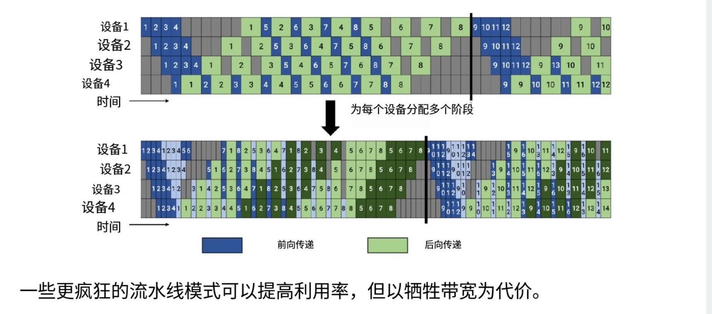

当然还可以采用更先进的流水线调度策略，通过将计算图细分为**更精细的阶段**，将**不同子层分配至不同设备**，在**不同时段执行不同计算**，从而实现更好的**流水线交错**。

特别值得关注的是**零气泡流水线技术**（在DeepSpeed中称为**双流水线**），其核心技巧在于：在反向传播计算梯度时，将其**分解为两个组件**，一是沿残差连接反向传播激活值，即计算关于激活值的导数；二是计算梯度。

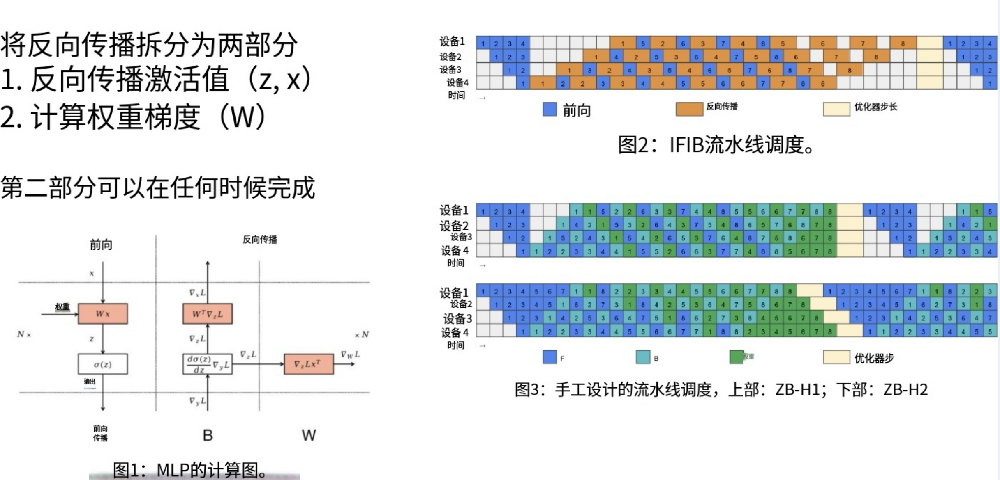

让我们看看上图左下的这个**图1：MLP的计算**。在这个图中，你会看到前向传播过程（第一个示例图，F）。这是一个简单的多层感知机单元，我们先进行权重乘法运算，然后执行非线性变换，最后输出非线性变换结果。这算是多层感知机中最基础的一个单元。现在来看（第二个示例图，B）反向传播过程，我们得到了关于损失函数的导数输入，然后可以计算这个导数会如何改变输入x，这相当于计算关于此处激活值的导数。在计算这些导数的过程中可以用它们来计算更新权重所需的梯度。

但关键在于这最右边的这部分（W），为权重计算梯度的这个环节，它其实可以在任何时候进行，因为它不存在依赖关系，因此可以将这个计算重新安排到计算图中的任意位置。具体操作时，你可以对存在序列依赖的部分采用标准的流水线并行处理。而任何仅用于更新参数的计算，都可以被重新调度到任意位置。这样我们就知道**F、B、W**的含义，就可以看到右侧的这部分。

核心思路是从优化的**1F-1B流水线**开始，看到上图 图2的IFIB流水线调度（这种调度能有效减少计算气泡），然后将其分解为两部分：B代表反向传播计算，W代表计算权重梯度所需的部分。这样就可以在原本会出现计算气泡的位置（那些白色闲置区域）插入W计算。通过**精确分析序列依赖关系**，最终能实现GPU计算资源的高效利用。需要说明的是这种做法极其复杂。如果要实际实现这种流水线并行，你必须**干预自动微分系统的计算过程**，需要建立队列来跟踪数据流向。

最近听到一个趣闻：某前沿实验室训练大语言模型时，团队中只有两个人真正理解流水线并行的基础设施实现。其中一人离职后，整个训练基础设施就只剩一个核心人员支撑。这类情况确实存在，虽然这里看起来简单，但是流水线并行在基础设施层面非常非常复杂，。

#### 张量并行（Tensor Parallelism）
 
和流水线并行相比，张量并行简单得多，很多框架都能实现它，即使是训练超大规模模型的团队也主要依赖这种模型并行。

我们的大部分操作都是**矩阵乘法**。在大模型中绝大多数计算和参数都来自**矩阵运算**。因此如果能够并行化矩阵乘法效果就会很好。张量并行的思路就是将大型矩阵乘法**分解成若干可并行计算的子矩阵**。

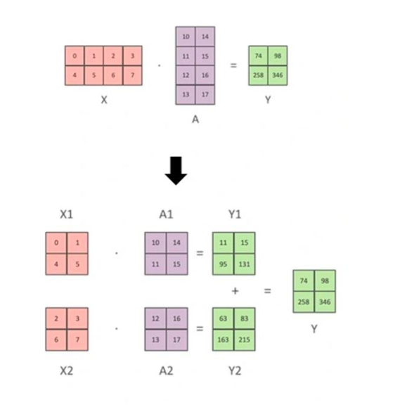

比如顶部的矩阵乘法 $X \cdot A = Y$ ，我可以将 $X$ 和 $A$ 都切分成两半，分别计算子矩阵乘积后再求和，最终得到结果。概念上，流水线并行是沿着**网络深度（层维度）**进行切分，而张量并行则是沿着矩阵乘法的宽度维度进行划分。所以我们将把矩阵分解为子矩阵，然后进行部分求和。

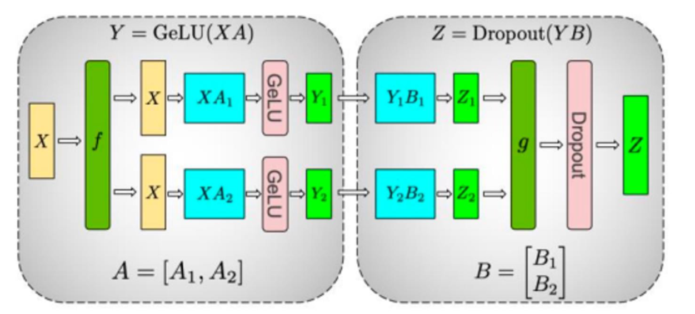

上面是一个在多层感知机（MLP）中的示例，每个GPU处理大型MLP矩阵乘法的不同子矩阵，然后通过集体通信在需要时同步激活值。

具体操作如下：上面是一个MLP结构，上半部分和下半部分代表两条不同的路径，用于**分割矩阵**。我们需要计算 $Y=GeLU(X \cdot A)$ ，将矩阵 $A$ **分割**为 $A_1$ 和 $A_2$ ；右侧需要计算 $dropout(Y \cdot B)$ ，最终返回结果 $Z$ ，因此同样将矩阵 $B$ 分割。

左侧图中，在正向传播过程中，输入 $X$ 会被复制两份，每个GPU获得**相同**的输入数据，分别与 $A_1$ 和 $A_2$ 进行运算。由于矩阵行维度相同，运算可以正常执行。通过 $X \cdot A_1$ 和 $X \cdot A_2$ 得到激活值 $Y_1$ 和 $Y_2$ ，这些激活值将输入 $B_1$ 和 $B_2$ ，最后通过**全归约操作求和**，这正是之前展示的示意图：复制数据后执行全归约，最终获得结果 $Z$ 。在反向传播过程中，梯度反向传递时操作顺序恰好相反。梯度 $G$ 将保持恒等关系，因此两侧的导数都需要复制，全程执行反向运算。当到达 $f$ 点时需要进行**全归约**操作，因为两条路径都会传入导数，需要将其重新聚合。

这里的F和G就是**同步过程**，**正向传播执行一次全归约，反向传播也执行一次全归约**，只是位于计算图中的不同位置。通过这个示例可以看出，对于任何矩阵乘法运算，都可以通过分割矩阵实现跨设备并行计算。

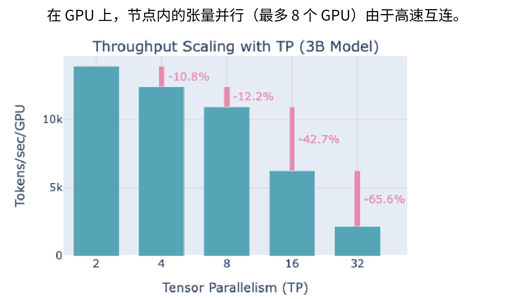

**但需要注意的是**，这种方法的**成本**较高，因为每层都存在**同步**的过程，在单次前向-反向传播中需要传输两倍残差激活值的数据量。因此张量并行这种简单直接的方法需要依赖**高速互联设备**。

经验法则是：张量并行通常应用于单个节点内部，例如搭载8个GPU的NVIDIA设备箱，这些GPU通过高速互联实现快速通信，在这8个设备间使用**高带宽需求**的张量并行方案是合理的选择，因为通常张量并行会部署在单台机器的8个GPU上，这样性能损失最小。Hugging face的并行化教程示例（上图）显示，**随着张量并行程度提高，吞吐量会逐步下降**，8 GPU 时约有 10% - 12% 的 性能损失，尚可接受；但扩展到16设备时会出现惊人的 **42% 性能下降**  ，32设备时吞吐量**再降 65%** 。通过可视化数据可以直观看出，张量并行在 8 GPU 时达到最佳平衡点，这是由硬件互联特性决定的。

与流水线并行相比，张量并行**不需要处理之前提到的流水线气泡问题**。我们不需要**消耗更大的批次尺寸来减少气泡**，而且应用张量并行的复杂度相对较低，我们真正需要了解的是大型矩阵乘法在哪里，能否将它们拆分并放置在不同的设备上。前向和后向操作仍然保持不变。

**缺点**是通信开销要大得多。在流水线并行中，每个微批次都有批次大小乘以序列长度乘以残差维度的点对点通信。在张量并行中，每层有八倍的通信量，并且还有全归约通信，可能需要处理的通信量可能非常大。所以我们有一个经验法则，张量并行用于**低延迟、高带宽互连**的情况。根据拥有的机器类型，在实践中会看到 2 到 16 个张量并行。

还有就是我们可以同时使用两种并行策略。我们可以看到在大规模运行中经常使用**张量并行**，然后**流水线并行**通常在此基础上使用。据我所知，我知道的唯一只使用流水线并行而不使用张量并行的例子是DeepSeek V3。所以假设你有五台不同的机器，也许前20%的参数分布在一台机器的范围内，你使用张量并行。然后通过流水线并行进入第二台机器进行下一步。我们会在**机器内部使用张量并行**，在**机器之间结合数据和流水线并行**。基本上使用**流水线并行**是因为你的**模型无法完全装入内存**。如果整个模型能装入内存，我们只需使用**数据并行加张量并行**，或者甚至只使用数据并行。

### 8.2.3 序列并行


在某种意义上**内存是并行化的一个非常重要的部分**，因为我们**训练大模型**时实际上**激活**占用了内存使用的很大一部分。在标准的前向-后向传递中内存使用是非常动态的。在上图中可以发现在训练时内存总是会**有静态**的参数，这部分是不变的，在第零次迭代中，因为此时没有优化器状态，优化器那部分内存使用还不存在。但当前向和后向传递时，激活内存会逐渐增长，激活值在积累。当**开始后向传递**时，激活内存下降，因为激活值被使用并且释放，同时在积累梯度。所以**梯度内存使用上升**。**峰值**实际上出现在**后向传递还没有释放所有激活同时还在积累梯度**的某个阶段。

这个图的意思是，我们已经考虑了所有其他部分；我们考虑了**参数**，考虑了**优化器状态**，考虑了梯度。但我们还没有**深入考虑激活**。

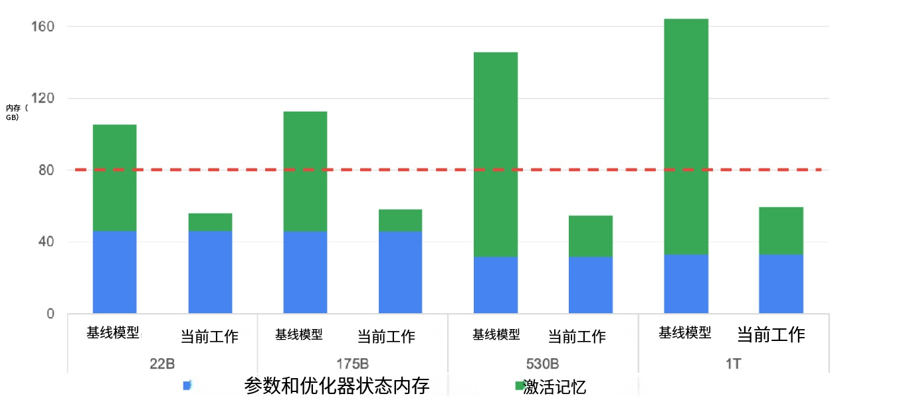

张量和流水线并行可以线性减少大多数东西。但它实际上**不能减少所有的激活内存使用**。上面这张图来自NVIDIA一篇论文，讨论如何减少激活内存。一个非常有趣的点是：从左到右看，模型越来越大，如果采用激进的并行化策略，**参数和优化器状态内存可以保持不变**。但激活内存会**持续增长**，因为其中某些部分**无法实现彻底并行化**。无论有多少设备上都无法消除每个设备上激活内存的增长。

而如果采用更巧妙的方法（比如重计算，在前两章讲过）就能将激活内存维持在较低水平，而这对**并行化某些超大型模型至关重要**。

**我们可以通过这个便捷公式计算每层所需的激活内存**：

$$每层激活内存 = sbh \left(34 + 5 \frac{as}{h}\right)$$

$5 \frac{as}{h}$ 项来自于包括dropout在内的二次注意力项
与flash attention一样，我们可以通过重新计算来忽略这个项

**其中**：
$a$ | 注意力头的数量
$b$ | 微批次大小
$h$ | 隐藏层维度大小
$L$ | Transformer层的数量
$p$ | 流水线并行大小
$s$ | 序列长度
$t$ | 张量并行大小
$v$ | 词汇表大小

$sbh \cdot 34 + 5 as/h $ ,虽然看起来神秘，但其实很有规律：左边项 $sbh$ 来自MLP和其他逐点运算（即 $sbh×34$ 的由来），这些取决于残差流尺寸h；右边项实际是 $as^2b$ （h被约去），对应注意力机制中 $softmax$ 等二次项的内存需求。若使用flash Attention 和重计算技术则第二项内存可大幅削减。

这张图片提供了一个关于Transformer模型中每层激活（activations）所需内存的计算公式，以及相关术语的定义。以下是核心内容的整理：


$$ 
\text{Activations memory per layer} = sbh \left(10 + \frac{24}{t} + 5\frac{as}{ht}\right) 
$$

$a$：注意力头的数量（number of attention heads）
$b$：微批次大小（microbatch size）
$h$：隐藏层维度大小（hidden dimension size）
$L$：Transformer层的数量（number of transformer layers）
$p$：流水线并行大小（pipeline parallel size）
$s$：序列长度（sequence length）
$t$：张量并行大小（tensor parallel size）
$v$：词汇表大小（vocabulary size）

假设全面实施张量并行（包括MLP、KQ计算和注意力运算），每层激活内存除以设备数t后效果显著，但仍有 $sbh \cdot 10$ 的残留项未被削减——这些对应LayerNorm、Dropout、注意力输入和MLP等非矩阵乘法组件。这些运算会随模型规模持续增长且难以并行化。

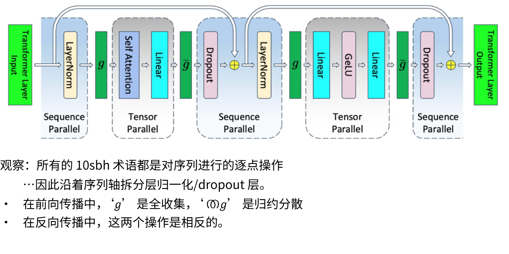

最后需要处理的是此前未并行的简单逐点运算。以层归一化为例，序列中不同位置的归一化互不干扰。假设序列长度为1024，可将其分割后由不同设备分别处理层归一化或Dropout操作。这些逐点运算现在可以完全沿序列维度分割，但需要同步机制来聚合并行计算结果，前向传播使用all-gather，梯度反向传播使用reduce-scatter，两者形成对偶关系。具体流程是：层归一化阶段分散数据后需重新聚合以执行标准计算，Dropout阶段则再次分散至并行组件。反向传播时按相反顺序执行。

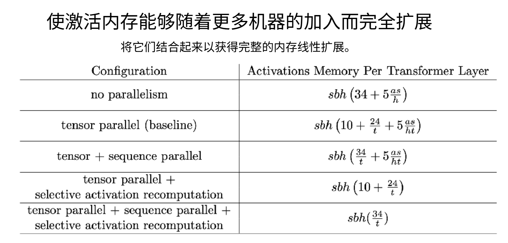


这个称为**序列并行**的方案本质是对此前未并行组件的最终优化。现在将所有模块整合，从完全无并行开始，先通过张量并行使所有非逐点运算内存除以t，再应用序列并行理念使剩余组件内存再次除以t，最终实现全面优化。然后我们可以做一些事情，比如激活重计算——这是FlashAttention的技巧——来消除第二项。你能够轻松实现的最小内存将是底部的这个公式：sbh34除以t。如果你在查看Transformer算术的不同公式，想知道使用了多少激活内存，就会经常会看到类似sbh34的表达式，并且如果有t个张量并行，就除以t，因为这是你能为那种内存轻松获得的最小值。

### 8.2.4 其他的并行策略

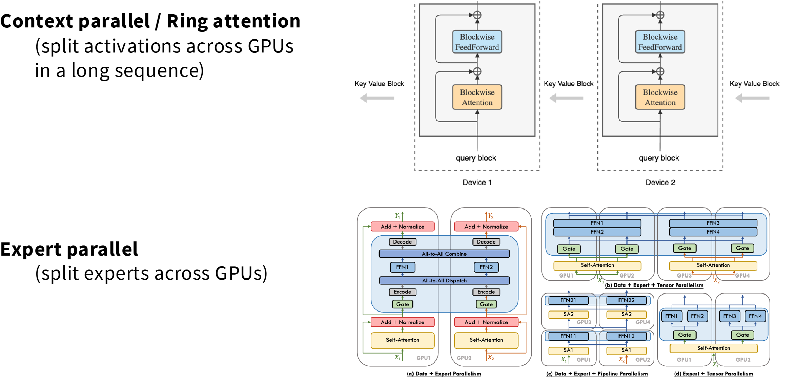


第一个是上下文并行或环形注意力，这本质上是一种拆分计算和激活成本的方法，用于计算非常大的注意力，基本上就是让键和值在不同的机器之间传递。所以每台机器负责不同的查询，然后键和值将以环形方式在机器之间传输，以计算KQV内积。

我们在FlashAttention中做过分块（tilling）。所以我们知道注意力可以以这种在线逐块的方式计算。

**专家并行**，它几乎看作是张量并行的一种，把一个大的MLP拆分成更小的专家MLP，然后把它们分散到不同的机器上。专家并行的关键区别在于专家是稀疏激活的。所以要稍微考虑一下路由问题，路由不会像我们之前在张量并行中看到的 all-to-all 通信那样可预测，因为可能有一个专家过载了，所以网络配置会稍微复杂一些。

### 8.2.4 总结

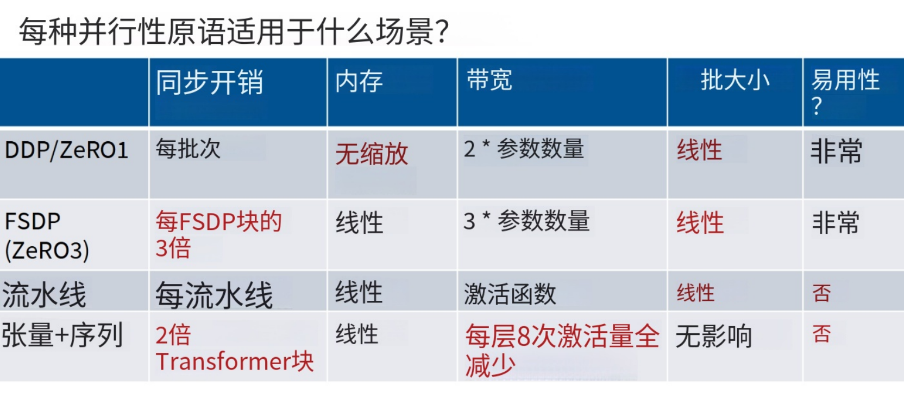

所以简单回顾一下我们讨论过的所有内容，**我们有ZeRO1中的DDP，这有点像做的朴素数据并行**。每个批次有一些开销，没有内存扩展，带宽特性合理，但需要消耗批次大小才能做到这一点，我们需要**大的批次大小来实现大的数据并行**。

还有**FSDP，这是ZeRO1的一个更好版本**，因为可以获得内存扩展，但要在不同层之间支付开销。所以现在有了更高的通信成本，并且可能有同步屏障导致利用率低下。

流水线并行的好处在于我们不再依赖于**批次**，可以获得线性内存扩展，但我们有另一个问题，就是这也消耗批次大小，而且设置和使用起来非常麻烦。所以如果可能的话，很多人喜欢避免使用流水线并行。

张量并行在带宽和需要进行的同步量方面成本非常高。但它有一个非常好的特性，就是对批次大小没有影响。所以这是一种可以使用的并行策略，因为在全局批次大小方面没有成本。所以我们必须平衡一些有限的资源。内存、带宽和算力。然后我们有批次大小，这是一种非传统的并且有限资源，

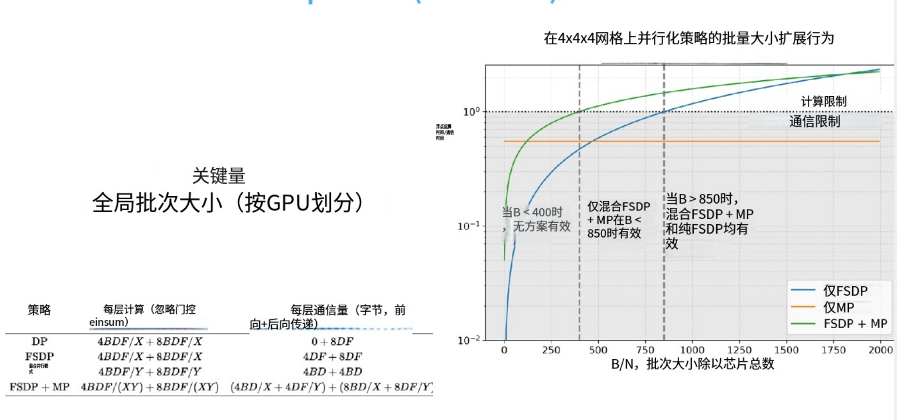

我们来看一个例子，他们有一个非常棒的并行部分，所以关键的量是**批次大小**。根据批处理大小与GPU数量的**比例**，不同的并行策略会达到最优效果。他们通过特定公式计算每种模型所需的通信量和计算量，这张图表就是基于简化公式生成的。可以明显看到当批处理规模过小而GPU数量过多时，系统效率必然低下，因为此时始终受限于通信瓶颈，即图表下半部分所示。实际上大部分时间都耗费在通信上。随着批处理规模逐步增大，当结合使用FSDP（即ZeRO第三阶段）与张量并行(MP)时，最终能实现计算瓶颈状态。此时计算单元不再因等待通信而浪费浮点运算能力。当批处理规模足够大时，仅需纯数据并行即可满足需求，因为纯FSDP方案能使计算耗时显著高于通信耗时。这个示意图生动阐释了混合并行策略的价值；何时需要混合使用、为何批处理规模属于资源范畴。

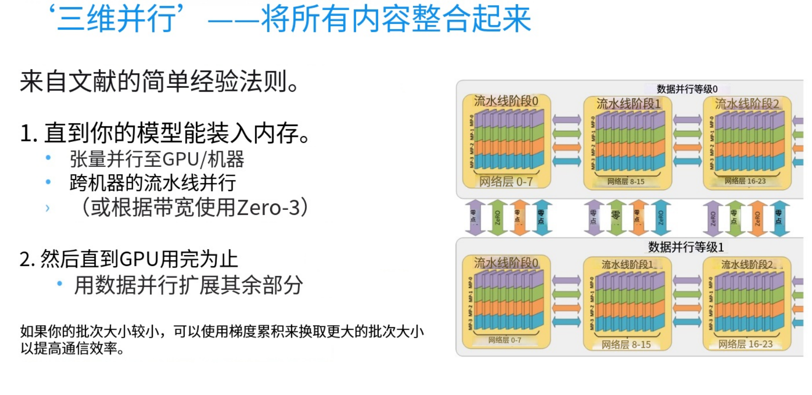

当整合所有并行维度时，就构成了所谓的3D或4D并行方案（近期甚至出现了5D并行概念）。虽然第五维度的具体含义尚待考证，但现有维度组合已形成简明实用的经验法则，首要原则是确保模型及激活值能被内存容纳，这是训练的前提条件。当单机内存不足时，首先采用张量并行策略，在单机GPU数量范围内这是最高效的方案。随后根据流水线并行的适用性及带宽限制，跨机器采用ZeRO3或流水线并行直至模型完全载入内存。

在GPU资源耗尽前，剩余扩展全部通过数据并行实现，因为这种方案既适应低带宽环境又实施简便。若批处理规模较小，可通过梯度累积技术实现等效的大批量处理，以此提升通信效率（减少机器间同步频率）。这套方法论能保证模型训练始终维持合理效率。

**为具体说明，最后展示几个典型案例**

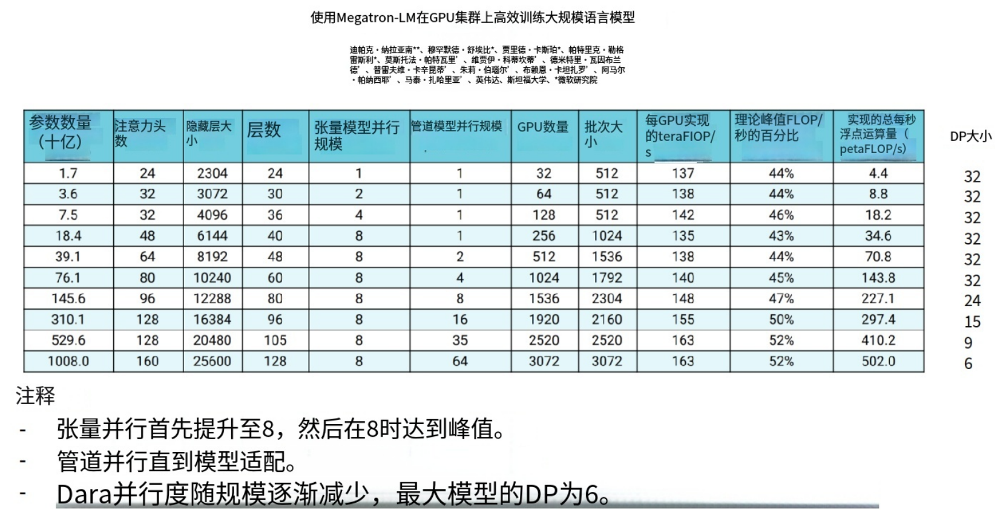

2021年论文中的可视化论证（附大量消融实验），以及去年部分模型的实践数据。这个参数规模从17亿到1万亿的模型训练表显示，所有方案都实现了**40%-52%的理论峰值浮点算力利用率**。

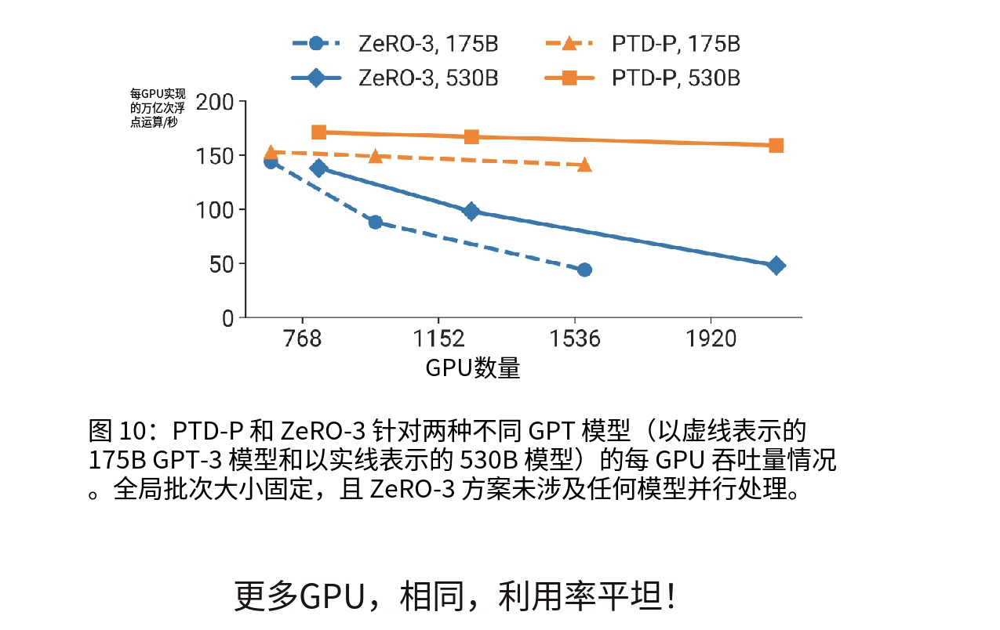

可以清晰看到：张量并行从1开始逐步增至8后封顶；流水线并行初始为1，随着模型膨胀才逐步增加；数据并行规模则从最大值开始递减——因为流水线并行的增加本质上会消耗批处理容量。因此如果GPU在某种程度上被用于流水线并行就无法有效实现那么大的批次大小。所以精心设计的**3D并行策略能带来聚合浮点运算次数的线性增长**。

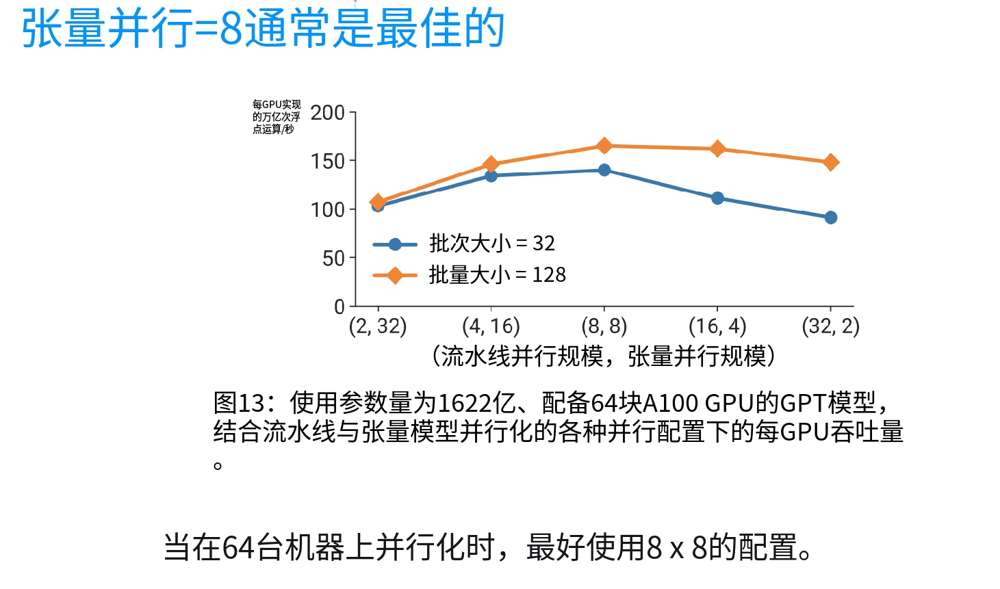

通过精细的3D并行配置，每块GPU能保持非常平稳的实际算力表现，这意味着增加GPU数量就能实现总吞吐量的线性扩展，这非常理想。张量并行设置为**8通常是最优解**。这里展示的是流水线并行规模与张量并行规模的对应关系。可以看到当张量并行设为8，配合128的批次大小时效果最佳。即使批次规模较小，**张量并行维度保持8仍然是最优选择**。

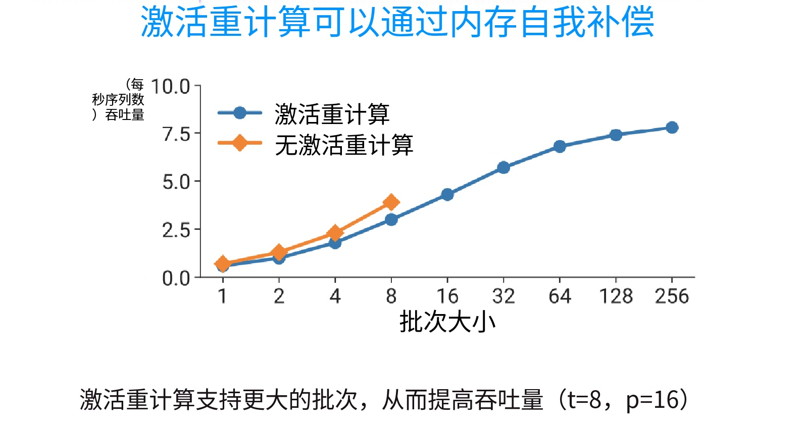

而激活重计算技术则能支持更大的批次规模。值得注意的是，更大的批次反过来有助于掩盖流水线并行的开销。因此激活重计算虽然会增加计算量，但其收益足以抵消成本。这个现象我们在FlashAttention中已经见证过。接下来谈谈近期大语言模型的实践方案。

多篇论文来可以了解业界常用的并行化策略：OLMo和Dolma论文对70亿参数模型采用全分片数据并行(FSDP)；DeepSeek初代论文使用ZeRO第一阶段配合张量序列与流水线并行，这正是我先前介绍的基础方案。而V3版本则略有不同：采用16路流水线并行+64路专家并行（本质是张量并行变体），数据并行策略采用ZeRO第一阶段。另一国产模型Yi再次使用ZeRO第一阶段配合张量/流水线并行；Yi-lightning因采用混合专家模型，用专家并行替代了张量并行。

若想了解最前沿的分布式训练细节，Llama3的技术报告非常值得精读。其中详细记载了网络架构设计及各类实践细节，再次验证了我先前的观点：可见张量并行设为8，上下文并行（仅适用于长文本训练阶段），前两个阶段同时采用流水线并行与数据并行。首阶段小批次训练是为保证稳定性也可忽略。通过分析其并行策略设计逻辑，你会发现完全印证了我的论述：按带宽需求排序应优先配置TP→CP→流水线并行→DP，因为数据并行能容忍较高网络延迟，支持异步获取分片模型参数。他们正是运用这套策略训练了某些顶级模型。关于Llama3有个趣闻——可能你们在非正式交流中听说过：超大规模训练时GPU故障频发。因故障GPU导致148次训练中断，占总中断次数的30%。此外还有机器突发维护等32类意外状况。训练如此庞大的模型时，除了算法设计，还需要构建容错架构来应对这些挑战。我更听闻真正令人担忧的并非显性模型故障，而是数据静默损坏——GPU可能无预警输出垃圾数据，直接毁掉整个训练任务。最后以Gemma2为例收尾，这是TPU的典型案例：他们采用近似FSDP的ZeRO第三阶段，结合模型并行与数据并行。正如前述，TPU架构允许更大程度的模型并行。整体而言，要实现超大规模扩展必须采用多GPU多节点并行方案。没有单一万能解，需要融合三种并行方式发挥各自优势。实践中存在简单可解释的经验法则来指导并行策略实施。

---

## 8.3 多GPU并行优化与分布式训练系统实践基础

### 8.3.1 基础构建模块 

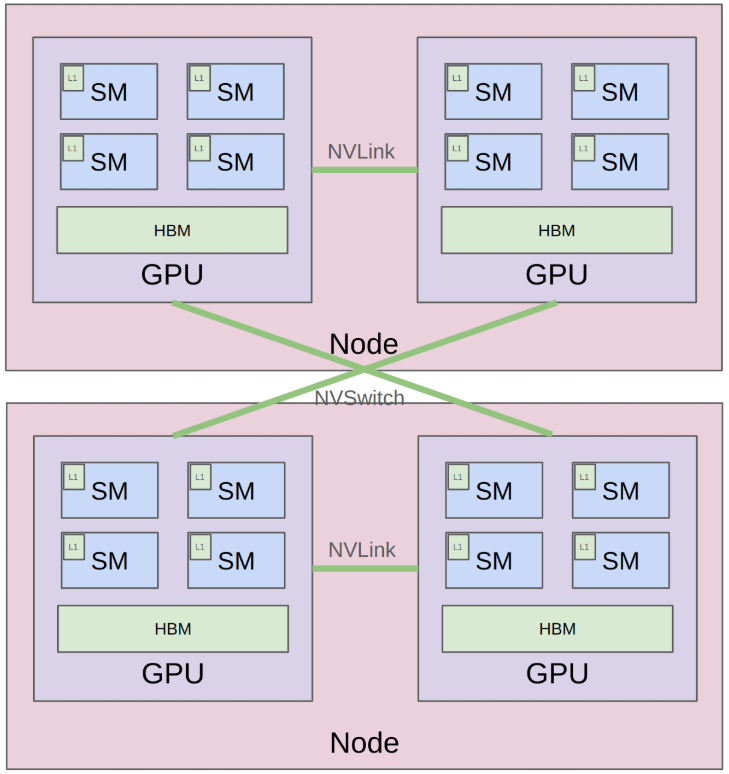

我们将探讨跨多GPU的并行化，大家脑海中应该有这样像上面一样的一个**架构图**。它拥有多个**节点**，这些本质上都是**计算机**，每台配备若干**GPU**，通常是8个，每个GPU内部包含**多个流式多处理器**（SM），实际计算工作由它们完成。图中**绿色部分**代表内存和通信组件，每个SM内部有极小的 L1 缓存，GPU上配备容量更大的高带宽内存（HBM），还有**连接不同GPU的互联链路（那些绿色的线）**。

核心思路是，**计算必须发生在SM内部的算术逻辑单元（ALU）**上，计算过程需要**读取输入并写入输出**，而且通常输入输出数据可能距离较远，理想情况在**L1缓存**中，**次优情况在HBM中**。而这次讨论的多GPU/多节点训练中，**所需数据可能位于其他GPU**上。因此关键在于如何**设计计算结构以避免数据传输瓶颈**。

核心目标是**保持高算术强度**，**让GPU满载运行**。由于数据传输通常慢得多，是主要瓶颈。我们之前学习了GPU内部的优化技术（如算子融合和内存平铺），**其核心思想是避免直接读写HBM**，转而将**数据载入L1缓存（或同等速度的共享内存）**，在本地暂存器完成计算后，再谨慎写回HBM。**这次我们将聚焦跨GPU/节点的通信，涉及模型参数复制与分片、状态优化**等操作，这些实现方式将**直接决定通信成本**。

**最快最小**的是单GPU上的**L1缓存**；**其次是单GPU的HBM**；然后是同节点**GPU间的NVLink**；最后是**NVSwitch**（当然这整套属于NVIDIA生态）。本次将重点通过代码实现具体化理论概念。我们上面已出色地概述了各类并行化方案。我们将尝试通过代码锚定这些概念，以便深入理解实现原理。

这次第一部分探讨基础构建模块，集体通信操作，包括NCCL和PyTorch中的实现方式，并进行基准测试；第二部分实际研究分布式训练中的数据并行、张量并行和流水线并行。

### 8.3.2 集体通信原语   

现在从集体通信操作开始。这些**原语**广泛用于分布式编程，“集体”意味着涉及多个节点。这些概念其实非常古老，至少可追溯到80年代的并行编程文献。相比自行管理点对点通信，它们提供了更优雅的抽象方案，是经过时间考验的可靠原语。

先明确术语：

**世界大小（worldsize）指设备总数**，**rank**仅表示设备编号（注意与线性代数中的秩概念区分）。当有四个设备时，排名分别为0、1、2、3。

**集体通信**操作包括：

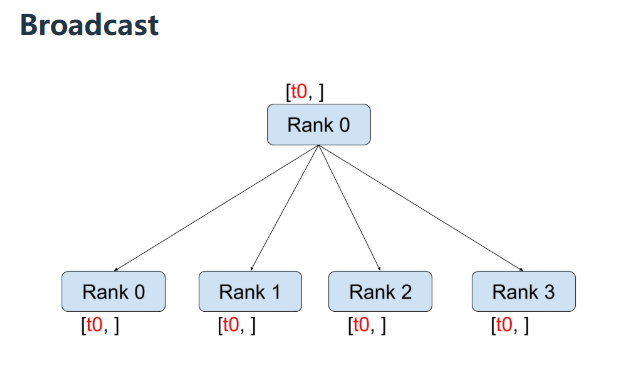

**广播（broadcast）** 指将某个rank上的张量t0分发到所有rank；

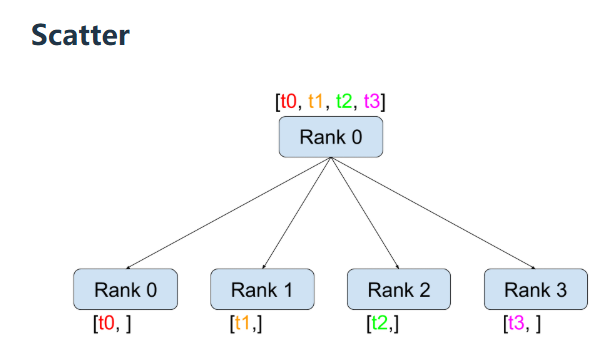

**散射（scatter）** 类似，但将四个不同值分别发送到不同rank。所以每个rank获得不同的值，而不是相同的值。

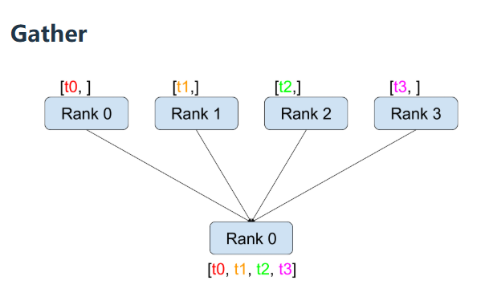

**Gather**是scatter的逆操作，即每个rank拥有不同的值，然后将它们汇集到一个rank上。

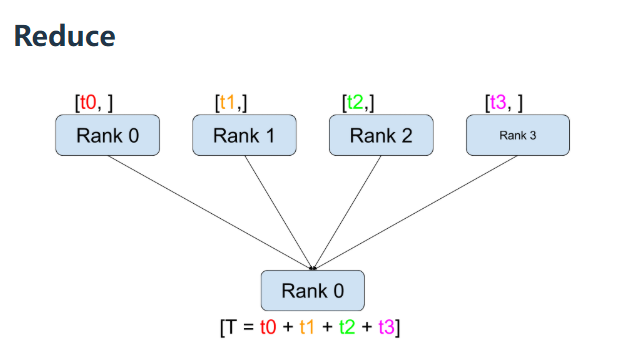

**Reduce**与gather类似，区别在于不是拼接，而是对值进行相加。

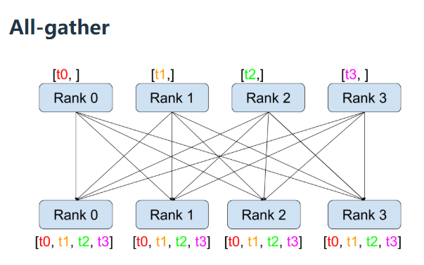

**all_gather**与gather相同，区别在于它是为所有目标rank执行的。

**Gather**仅针对rank 0，rank1或rank 2，或任何单个rank。

**all_gather**则是为所有rank执行。

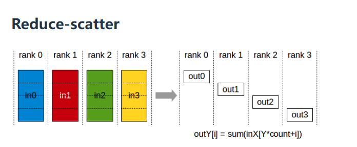

**reduce_scatter**，这里复用上次的图类似于reduce，即取一组不同的值，对它们进行相加或其他可交换操作，并将结果放在一个等级上。

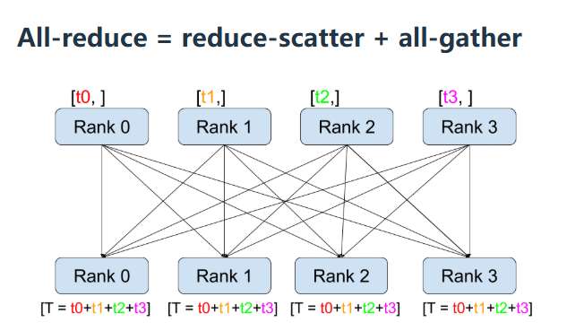

**all_reduce**等同于reduce加上all_gather。

**reduce**仅表示你执行某种关联和可交换操作，如求和、最小值、最大值或平均值，**Broadcast/scatter**是gather的逆操作。而“all”仅表示目标为所有设备。希望这是对内容的复习。

## 8.4 硬件架构与通信层级

### 8.4.1 GPU的硬件架构

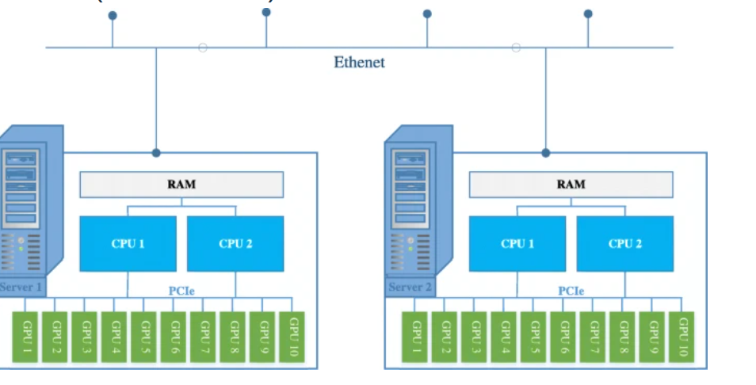

从硬件开始。上面是**典型**的**GPU硬件架构**：在家庭环境中的一台电脑有CPU，在节点上有GPU通过PCI-E总线进行通信。如果需要在不同节点之间通过以太网进行通信。同一节点上的 GPU 通过 PCI(e) 总线（v7.0，16 通道 => 242 GB/s）进行通信，不同节点上的 GPU 通过以太网进行通信（~200 MB/s）。如果我们购买GPU用于游戏或其他用途，这是我们设置的样子。

PCI-E的数据仍然必须经过CPU，PCI-E是为诸如声卡、SSD或硬盘等其他设备连接而开发的。所以它并不是专门为GPU设计的，它是一种通用的设备通信总线。

但是这并不理想，因为**有很多开销**。比如当数据需要从**GPU传输到GPU**时，它必须经过**内核**，复制到**缓冲区**，然后通过以太网传输，这引入了很多开销。因此在现代科学计算和深度学习中，如果把一堆GPU连接在一起并共同执行任务，我们会直接连接GPU。

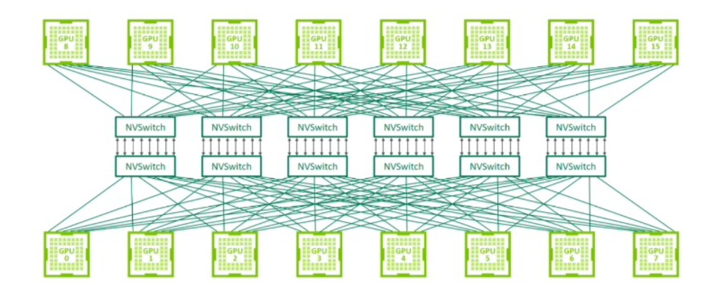

在**NVIDIA生态系统中，我们有NVLink直接连接GPU**，从而**绕过CPU**，不需要经过主机的内核，甚至跨节点时，我们也可以通过NVSwitch直接连接GPU。因此绕过了以太网。因为以太网是很久以前开发的，显然不是为这类应用设计的。所以NVSwitch和NVLink跳过了所有这些，直接为我们感兴趣的**工作负载类型**进行优化。

如果你看H100，每个GPU有18个第四代NVLink。这提供了总共900GB的带宽。它肯定比PCI-E和以太网快得多。但是考虑到从**SM到读取高带宽内存的成本**，HBM 的内存带宽为 3.9 TB/s，那仍然快大约4倍左右。随着新的Blackwells推出还会增加两到三倍。

### 8.4.2 NCCL

NVLink仍然需要与CPU通信。每对GPU之间都有NV18连接，还有这些网卡之类的东西，网卡本质上就是提供PCI-E连接和CPU的部件。

英伟达花了大量时间在他们优秀的硬件基础上开发了非常出色的软件。开发了一个名为**NCCL**的集合通信库，这个库本质上将我们之前讨论的集合操作（例如all_reduce）转换为需要在GPU之间传输的低层级数据包。这个库实际承担了大量工作，因为它让程序员只需在“我需要这个张量出现在所有机器上”的层级进行操作，然后就能自动实现。

简单说明其运作原理：**当你配置启动NCCL时会激活一组设备。系统会通过通信来探测硬件拓扑结构，优化GPU间的传输路径**。当你实际调用这些集合通信操作时，它会启动CUDA内核来收发数据。

它以库的形式提供。但NCCL的使用层级还是偏低，因为我们大部分工作都在Python中进行。因此PyTorch提供了 `torch.distributed` 库，本质上为这些集合操作提供了简洁接口。可以在 PyTorch 程序中轻松地编写all_gather等操作，张量就会自动出现在所有不同rank的进程中。它还有个很好的特性是支持多种硬件后端。特别要记住NCCL是用于GPU的，但集合操作并不局限于GPU，它适用于任何设备集合。还可以使用名为gloo的后端在CPU上运行。比如在笔记本电脑上调试作业时，即使没有GPU也能通过gloo正常运行。这就是拥有高层原语的另一个优势，它们比仅限于GPU特定功能的方案具有更好的可移植性。当然实际性能取决于硬件，但至少能确保代码在逻辑上正常运行。分布式库还支持其他高层功能如FSDP（上面讲过），


#### 我们看几个torch.distributed集合操作的实际例子

```python
spawn(collective_operations_main, world_size=4)
```

上面工具函数，它接收一个函数并通过Python多进程包装器启动四个进程来执行这个函数。当运行这个函数时，你应该理解为有 `world_size` 个进程在执行相同函数，rank 的索引从0开始一直到 `world_size` 减1。

```python

def setup(rank: int, world_size: int):
    # 指定主服务器所在位置（排名 0），用于协调（实际数据通过 NCCL）
    os.environ["MASTER_ADDR"] = "localhost"
    os.environ["MASTER_PORT"] = "15623"
    if torch.cuda.is_available():
        dist.init_process_group("nccl", rank=rank, world_size=world_size)
    else:
        dist.init_process_group("gloo", rank=rank, world_size=world_size)

def cleanup():
    torch.distributed.destroy_process_group()

def collective_operations_main(rank: int, world_size: int):
    """此函数针对每个进程（rank = 0, ..., world_size - 1）异步运行。"""
    setup(rank, world_size)
    
    # All-reduce
    dist.barrier()  # Waits for all processes to get to this point (in this case, for print statements)
    tensor = torch.tensor([0., 1, 2, 3], device=get_device(rank)) + rank  # Both input and output
    print(f"Rank {rank} [before all-reduce]: {tensor}", flush=True)
    dist.all_reduce(tensor=tensor, op=dist.ReduceOp.SUM, async_op=False)  # Modifies tensor in place
    print(f"Rank {rank} [after all-reduce]: {tensor}", flush=True)
    
    # Reduce-scatter
    dist.barrier()
    input = torch.arange(world_size, dtype=torch.float32, device=get_device(rank)) + rank  # Input
    output = torch.empty(1, device=get_device(rank))  # Allocate output
    print(f"Rank {rank} [before reduce-scatter]: input = {input}, output = {output}", flush=True)
    dist.reduce_scatter_tensor(output=output, input=input, op=dist.ReduceOp.SUM, async_op=False)
    print(f"Rank {rank} [after reduce-scatter]: input = {input}, output = {output}", flush=True)
    
    # All-gather
    dist.barrier()
    input = output  # Input is the output of reduce-scatter
    output = torch.empty(world_size, device=get_device(rank))  # Allocate output
    print(f"Rank {rank} [before all-gather]: input = {input}, output = {output}", flush=True)
    dist.all_gather_into_tensor(output_tensor=output, input_tensor=input, async_op=False)
    print(f"Rank {rank} [after all-gather]: input = {input}, output = {output}", flush=True)
    
    #Indeed, all-reduce = reduce-scatter + all-gather!
    cleanup()

```

#### All-reduce

```python
    # All-reduce
    dist.barrier()  # Waits for all processes to get to this point (in this case, for print statements)
    tensor = torch.tensor([0., 1, 2, 3], device=get_device(rank)) + rank  # Both input and output
    print(f"Rank {rank} [before all-reduce]: {tensor}", flush=True)
    dist.all_reduce(tensor=tensor, op=dist.ReduceOp.SUM, async_op=False)  # Modifies tensor in place
    print(f"Rank {rank} [after all-reduce]: {tensor}", flush=True)
```

通常流程中，进程首先需要初始化自身。多个进程需要相互发现对方，它们会连接到**同一主机**来确认彼此存在（使用`setup`）。注意这里不是数据传输通道（数据通过NCCL传输），这只是协调机制，因为我们有GPU，所以使用 NCCL 后端，否则会用 gloo 。初始化完成后，我们开始实际操作。

有个实用的 barrier 函数（`dist.barrier()`） ，它会等待进程组中所有**进程都到达这个同步点**。所有**操作都是异步运行的，所以需要设立同步点**，barrier 就用于此目的。这里使用它是为了将**打印语句分组**显示，后续还会看到其他使用场景。

` tensor = torch.tensor([0., 1, 2, 3], device=get_device(rank)) + rank ` 来为每个进程组创建张量,内容是0123加上当前rank值。在执行all_reduce操作前，打印每个rank的张量状态。

现在显示结果：

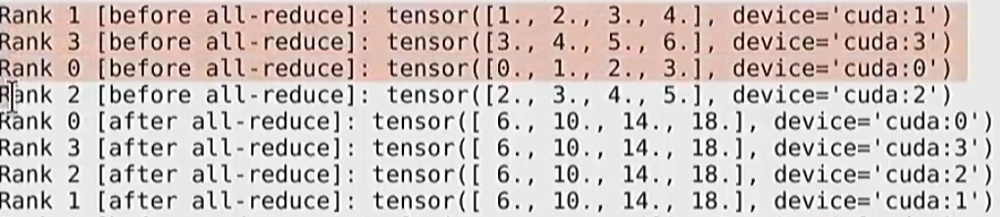


rank 0 显示0123，rank 1显示 1234，以此类推。注意由于**异步执行**，所以打印顺序是**乱序**的。每个rank拥有不同的张量，然后执行 all_reduce操作，`dist.all_reduce(tensor=tensor, op=dist.ReduceOp.SUM, async_op=False)` 传入张量并指定求和操作。在这种情况下**不使用异步操作**，但可以采用**异步方式**，这对重叠通信和计算很有用。在all_reduce操作之后，正如打印出来的那样，对于第一个组件（前四行），它们相加得到6。后四行可以看到得到10、14和18。所以在all_reduce之后，这个张量基本上会被相应的和覆盖。使用起来非常非常简洁方便。

#### Reduce-scatter

```python

    # Reduce-scatter
    dist.barrier()
    input = torch.arange(world_size, dtype=torch.float32, device=get_device(rank)) + rank  # Input
    output = torch.empty(1, device=get_device(rank))  # Allocate output
    print(f"Rank {rank} [before reduce-scatter]: input = {input}, output = {output}", flush=True)
    dist.reduce_scatter_tensor(output=output, input=input, op=dist.ReduceOp.SUM, async_op=False)
    print(f"Rank {rank} [after reduce-scatter]: input = {input}, output = {output}", flush=True)

```

现在来演示**reduce_scatter**。对于reduce_scatter创建一个维度为`world_size`的输入，这里`world_size`是4。然后会分配一个输出，因为reduce_scatter不会**原地操作**，输出将是一个标量。


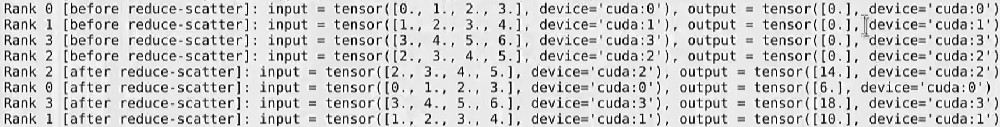

在 reduce_scatter 之前，数据是上图的前四行，输入和之前一样，输出碰巧是 0 ，但由于未初始化，它可以是任意值。执行reduce_scatter后，当传入输入和输出并执行求和时，结果是后四行，对于第一列，求和后结果放在rank0；第二列求和后放在rank1，依此类推。正如你所注意到的，它执行的操作与all_reduce相同，只是输出分散在所有不同的rank上。

#### All-gather

```python
    
    # All-gather
    dist.barrier()
    input = output  # Input is the output of reduce-scatter
    output = torch.empty(world_size, device=get_device(rank))  # Allocate output
    print(f"Rank {rank} [before all-gather]: input = {input}, output = {output}", flush=True)
    dist.all_gather_into_tensor(output_tensor=output, input_tensor=input, async_op=False)
    print(f"Rank {rank} [after all-gather]: input = {input}, output = {output}", flush=True)
    
```
现在我们来演示 **all_gather**。我们将直接使用 reduce_scatter 的**输出作为输入**，然后为输出分配一个空数组。

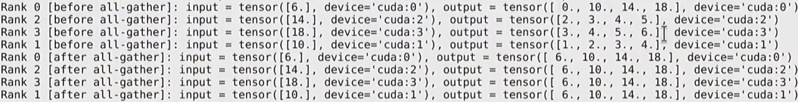

在all_gather之前（前四行），输出（output）是任意值。执行all_gather后（后四行），所有这些张量会出现在所有设备上。这只是一个示例。希望现在你完全相信reduce_scatter加上all_gather就等于all_reduce，因为计算出了与all_reduce完全相同的结果。

最后当进程运行结束时，只需进行清理即可。

### 8.5 基准测试


到目前为止，我们讨论了这些集合通信操作，以及它们在PyTorch中的实现方式，涉及**NCCL和PyTorch**。现在让我们进行一些基准测试。


```python

def all_reduce(rank: int, world_size: int, num_elements: int):
    setup(rank, world_size)
    # 创建张量
    tensor = torch.randn(num_elements, device=get_device(rank))
    # 预热
    dist.all_reduce(tensor=tensor, op=dist.ReduceOp.SUM, async_op=False)
    if torch.cuda.is_available():
        torch.cuda.synchronize()  # 等待CUDA内核完成
        dist.barrier()            # 等待程序到这里
    # Perform all-reduce
    start_time = time.time()
    dist.all_reduce(tensor=tensor, op=dist.ReduceOp.SUM, async_op=False)
    if torch.cuda.is_available():
        torch.cuda.synchronize()  # 等待CUDA内核完成
        dist.barrier()            # 等待程序到这里
    end_time = time.time()
    duration = end_time - start_time
    print(f"[all_reduce] Rank {rank}: all_reduce(world_size={world_size}, num_elements={num_elements}) took {render_duration(duration)}", flush=True)

    # 测量带宽
    dist.barrier()
    size_bytes = tensor.element_size() * tensor.numel()
    sent_bytes = size_bytes * 2 * (world_size - 1)  # 2x because send input and receive output
    total_duration = world_size * duration
    bandwidth = sent_bytes / total_duration
    print(f"[all_reduce] Rank {rank}: all_reduce measured bandwidth = {round(bandwidth / 1024**3)} GB/s", flush=True)
    cleanup()
```


以**all_reduce**为例,创建一个包含1亿个元素的张量，`world_size`为4。首先分配张量。需要注意的是，在进行基准测试时，必须小心清理环境。这里我先预热，即运行一次操作，然后同步并执行`dist.barrier() `.确保所有内核加载完毕且所需计算都完成。

接着开始计时，执行all_reduce，再次同步后停止计时。下面可以查看耗时。

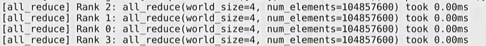

这里应该使用微秒，使用毫秒不直观。不过执行得非常快。

```python
    # 测量带宽
    dist.barrier()
    size_bytes = tensor.element_size() * tensor.numel()
    sent_bytes = size_bytes * 2 * (world_size - 1)  # 2x because send input and receive output
    total_duration = world_size * duration
    bandwidth = sent_bytes / total_duration
    print(f"[all_reduce] Rank {rank}: all_reduce measured bandwidth = {round(bandwidth / 1024**3)} GB/s", flush=True)
    cleanup()
```

现在测量带宽，即每秒实际传输的总千兆字节数。计算方法需要考虑实际传输的数据量，`size_bytes = tensor.element_size() * tensor.numel()`，这个张量的元素数量乘以每个元素的大小（这里是float32，占4字节），得到总字节数。

这里有个细节：实际发送/接收的字节数是多少？每个rank上的张量大小为`size_bytes`，需要发送给其他`world_size-1`个rank。但这里有一个系数2是因为在执行all_reduce操作（将所有不同的元素发送到同一个位置进行求和，然后结果需要返回给所有节点），所以每个计算节点需要先发送输入，再接收输出，这就是存在系数2的原因。因此总耗时为`world_size`乘以实际经过的时间。

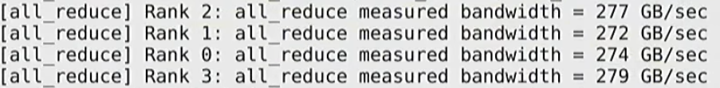

带宽就是字节数除以耗时,我们得到的结果是大约是每秒**277GB**。之前提到**H100**的带宽约为每秒**900GB**。实际性能会因**张量大小、设备数量等各种因素而异，存在多种变量**。所以实际性能可能有所不同，最好通过基准测试来确认实际获得的GB/s数值。

```python
def reduce_scatter(rank: int, world_size: int, num_elements: int):
    setup(rank, world_size)
    # 创建张量
    input = torch.randn(world_size, num_elements, device=get_device(rank))  # Each rank has a matrix
    output = torch.empty(num_elements, device=get_device(rank))
    # 预热
    dist.reduce_scatter_tensor(output=output, input=input, op=dist.ReduceOp.SUM, async_op=False)
    if torch.cuda.is_available():
        torch.cuda.synchronize()  # 等待CUDA核心完成
        dist.barrier()            # 等待程序
    # Perform reduce-scatter
    start_time = time.time()
    dist.reduce_scatter_tensor(output=output, input=input, op=dist.ReduceOp.SUM, async_op=False)
    if torch.cuda.is_available():
        torch.cuda.synchronize()  # 等待CUDA核心完成
        dist.barrier()            # 等待程序
    end_time = time.time()
    duration = end_time - start_time
    print(f"[reduce_scatter] Rank {rank}: reduce_scatter(world_size={world_size}, num_elements={num_elements}) took {render_duration(duration)}", flush=True)

    # 测量带宽
    dist.barrier()
    data_bytes = output.element_size() * output.numel()  # How much data in the output
    sent_bytes = data_bytes * (world_size - 1)  # How much needs to be sent (no 2x here)
    total_duration = world_size * duration  # Total time for transmission
    bandwidth = sent_bytes / total_duration
    print(f"[reduce_scatter] Rank {rank}: reduce_scatter measured bandwidth = {round(bandwidth / 1024**3)} GB/s", flush=True)
    cleanup()
```

reduce_scatter操作会非常类似，我们快速过一遍：我们创建了`world_size`乘以元素数量的输入，每个计算节点都会拥有这个矩阵。先进行预热，然后开始计时，执行 reduce_scatter，停止计时并计算耗时。

我们来看带宽计算。这里发送字节数也存在系数2，因为 reduce_scatter 本质上是将输入发送到指定位置。如果只考虑reduce操作，所有元素会汇集到一处；而scatter意味着张量的不同部分会分发到不同位置，但本质上仍类似reduce操作。

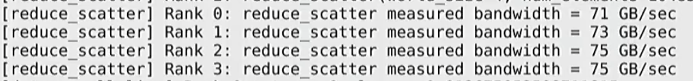

按相同方式计算，这里得到的结果大约是70。不确定为什么恰好是70而不是其他数值，可能因为all_reduce通常会产生更多通信流量，且all_reduce可能经过更多优化。英伟达硬件有加速技术，能在实际网络中执行部分计算从而节省一半时间，但不确定这是否能完全解释此处的差异。

**NCCL内部实现复杂，很难精确推演性能表现，所以需要基准测试**。需要明确的是，我们假设输入数据已存在于设备上，因此未计入该时间，仅计算执行reduce_scatter所需的操作。

通过对比可见，reduce_scatter和all_gather各自都不含2倍系数，两者叠加才产生2倍系数，这也印证了all_reduce需要两倍通信量。有关基准测试和集合操作的详细参考资料可供查阅。

## 8.6 分布式训练

我们将通过深度MLP的简易实现来演示每种策略。需要注意的是，在Transformer中MLP通常是计算瓶颈而不是注意力机制。因此尽管架构简单，但能很好代表实际工作负载类型。

首先从数据并行开始。需要说明的是，数据并行、张量并行和流水线并行可以理解为对模型或数据的不同划分方式，稍后会进行可视化展示。

### 8.6.1 数据并行实践

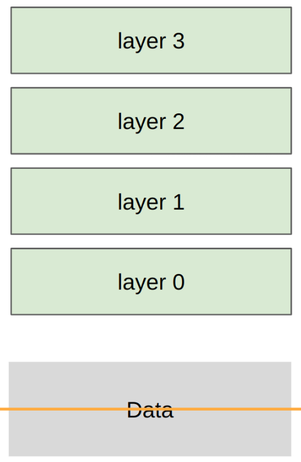


在数据并行中，假设模型包含四个层，每个MLP层都是矩阵乘法运算。数据也是矩阵形式（批次维度×隐藏维度），数据并行会沿**批次维度**将数据切分成更小的分片，每个计算节点获得不同的数据切片。

让我们通过示例来说明。假设我的批次大小为128，隐藏维度为1024，然后随机生成一些数据。数据维度为批次大小乘以特征维度，接下来我将运行这个数据并行算法（DDP）。

```python
# 生成随机数据
def generate_sample_data():
    batch_size = 128
    num_dim = 1024
    data = torch.randn(batch_size, num_dim)
    return data
```

```python
# 数据并行
def data_parallelism_main(rank: int, world_size: int, data: torch.Tensor, num_layers: int, num_steps: int):
    setup(rank, world_size)
    # 获取此rank对应的数据切片（实际上，每个rank应该只加载自己的数据）
    batch_size = data.size(0)  # @inspect batch_size
    num_dim = data.size(1)  # @inspect num_dim
    local_batch_size = int_divide(batch_size, world_size)  # @inspect local_batch_size
    start_index = rank * local_batch_size  # @inspect start_index
    end_index = start_index + local_batch_size  # @inspect end_index
    data = data[start_index:end_index].to(get_device(rank))

    # 创建 MLP 参数 params[0], ..., params[num_layers - 1]（每个层级包含所有参数）
    params = [get_init_params(num_dim, num_dim, rank) for i in range(num_layers)]
    optimizer = torch.optim.AdamW(params, lr=1e-3)  # 每个 rank 都有自己的优化器状态
    for step in range(num_steps):
        # 前向传播
        x = data
        for param in params:
            x = x @ param
            x = F.gelu(x)
        loss = x.square().mean()  # 损失函数是平均平方幅值
        # 反向传播
        loss.backward()
        # 同步工作节点间的梯度（标准训练和 DDP 之间的唯一区别）
        for param in params:
            dist.all_reduce(tensor=param.grad, op=dist.ReduceOp.AVG, async_op=False)
        # 更新参数
        optimizer.step()
        print(f"[data_parallelism] Rank {rank}: step = {step}, loss = {loss.item()}, params = {[summarize_tensor(params[i]) for i in range(num_layers)]}", flush=True)
    cleanup()
```

现在我需要处理传入的数据，数据包含批次大小和维度信息。将批次大小除以全局进程数，得到本地批次大小。这个数值代表单个计算节点上的批次规模。接着根据当前进程编号，计算出需要访问的起始和结束索引（索引范围对应本地批次大小），并提取相应的数据子集。本质上就是根据进程编号截取对应的数据行。

然后开始搭建多层感知机（MLP），这里采用最基础的实现方式。创建MLP参数时，每个层本质上是一个矩阵，维度为1024×1024（num_dim是1024）。

然后初始化优化器。请注意整个函数会在所有计算节点上异步运行，四个节点分别以编号0/1/2/3执行相同代码。接下来启动训练流程。在多个训练步中会执行前向传播：依次进行矩阵乘法、非线性激活、矩阵乘法、非线性激活（共四层）。计算损失值（具体损失函数无关紧要，仅为示例），然后执行反向传播。

这就像标准SGD的实现，关键区别在于实现DDP时只需插入一行梯度同步代码：对每个网络层调用all_reduce操作（`dist.all_reduce(tensor=param.grad, op=dist.ReduceOp.AVG, async_op=False)`），对所有工作节点的参数梯度进行均值归并。这就像在标准SGD代码中插入控制语句：“注意，我将在反向传播后统一融合所有梯度”。

完成梯度同步后，照常更新参数。从SGD的视角看，整个过程似乎没有变化，但实际梯度已被混合处理。

现在打印输出信息：

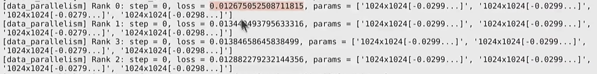

在数据并行环境下，各节点的损失值确实不同（因为数据分布不同），但经过all_reduce操作后所有参数保持同步。这是机器学习中all_reduce操作的典型教科书应用。

关于如何确保所有异步运行的进程保持同步步调，all_reduce本身是同步点，它会阻塞所有进程直到完成归约操作。需要注意如果某个节点缺失all_reduce调用，整个系统就会挂起，其他进程会持续等待该节点。

**总结DDP特性**：各计算节点的**损失值**不同，但通过**梯度归约实现参数同步**。本质上这是并行运行多个SGD实例，通过同步机制确保行为一致性。可以类比激活检查点技术，有时为了减少存储开销宁愿增加计算量。同理，虽然可以传输优化器状态，但直接更新优化器状态远比传输参数更高效。

### 8.6.2 张量并行实践 

接下来讲解张量并行。那么这里的情况是保持数据不变，要做的是沿着隐藏维度切割模型。每个计算节点将获得**所有层**，但只获得**每层的一部分**。最终我们将**传输所有数据和激活值**。

```python
def tensor_parallelism_main(rank: int, world_size: int, data: torch.Tensor, num_layers: int):
    setup(rank, world_size)
    data = data.to(get_device(rank))
    batch_size = data.size(0)  # @inspect batch_size
    num_dim = data.size(1)  # @inspect num_dim
    local_num_dim = int_divide(num_dim, world_size)  # Shard `num_dim`  @inspect local_num_dim
    # 创建模型（每个rank获得 1/world_size 的参数）
    params = [get_init_params(num_dim, local_num_dim, rank) for i in range(num_layers)]
    # 前向传播
    x = data
    for i in range(num_layers):
        # 计算激活值（batch_size x local_num_dim）
        x = x @ params[i]  # 注意：这仅针对参数的一个切片。
        x = F.gelu(x)
        # 为激活分配内存（世界大小 x 批次大小 x 本地维度数）
        activations = [torch.empty(batch_size, local_num_dim, device=get_device(rank)) for _ in range(world_size)]
        # 通过 all gather 发送激活
        dist.all_gather(tensor_list=activations, tensor=x, async_op=False)
        # 将它们连接起来得到 batch_size x num_dim
        x = torch.cat(activations, dim=1)
    print(f"[tensor_parallelism] Rank {rank}: forward pass produced activations {summarize_tensor(x)}", flush=True)
    # Backward pass: homework exercise
    cleanup()
```

我们生成相同的样本数据，现在来看张量并行。和之前一样设置了批大小和维度数。

然后切割维度数（之前切割的是批大小），所以本地维度数等于1024除以节点总数，即256。每个节点获得模型的一部分，即参数总量的1/节点总数。

**我们之所以要做并行，是因为模型无法放入单个GPU**，所以需要将其分片到多个GPU上。现在参数矩阵的维度是‘总维度数×本地维度数’。这里我们只实现前向传播，不包含完整训练循环。现在开始逐层处理。首先计算激活值。这看起来基本正常，但要注意激活值实际上是‘批大小×本地维度数’而非‘总维度数’，因为现在每个rank只持有部分激活值。

但获得激活值后需要进行**通信**（` activations = [torch.empty(batch_size, local_num_dim, device=get_device(rank)) for _ in range`）。这里需要为所有激活值分配内存。此时每个节点都有x，但每个x代表不同的激活值部分。现在我要分配‘批大小×本地维度数’但乘以节点总数的内存。本质上每个节点将持有节点总数个‘批大小×本地维度数’的矩阵。

然后执行全局收集操作（` dist.all_gather(tensor_list=activations, tensor=x, async_op=False)`），发送所有激活值。这个过程相当简单，x是‘批大小×本地维度数’且每个节点的x不同。

执行全局收集后将其放入激活值张量，该张量包含节点总数个与x同形状的矩阵。现在每个节点都拥有相同的激活值，即完整模型的全部激活值。最后将它们拼接起来得到x。现在x恢复为‘批大小×总维度数’的维度。如此循环往复。可以看到这里发生了相当多的通信，这就是为什么之前说**张量并行需要高速互联**，因为会频繁传递这些激活值。后续每层都重复这个过程，原理相同。

现在输出打印结果：

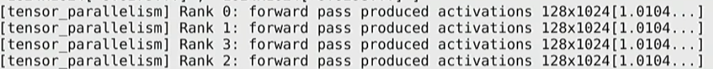

张量并行的前向传播生成完整尺寸的激活值，最终所有节点拥有相同的激活值。反向传播我暂且跳过，因为实现起来比较繁琐。

### 8.6.3 流水线并行实践

现在来看流水线并行，它按层切割模型。所有rank获得该层的全部数据。

```python
def pipeline_parallelism_main(rank: int, world_size: int, data: torch.Tensor, num_layers: int, num_micro_batches: int):
    setup(rank, world_size)
    # 使用所有数据
    data = data.to(get_device(rank))
    batch_size = data.size(0)  # @inspect batch_size
    num_dim = data.size(1)  # @inspect num_dim
    # 拆分图层
    local_num_layers = int_divide(num_layers, world_size)  # @inspect local_num_layers
    # 每个rank都获得一个层子集
    local_params = [get_init_params(num_dim, num_dim, rank) for i in range(local_num_layers)]
    # Forward pass
    # 分成小批量生产以最大程度减少气泡
    micro_batch_size = int_divide(batch_size, num_micro_batches)  # @inspect micro_batch_size
    if rank == 0:
        # The data
        micro_batches = data.chunk(chunks=num_micro_batches, dim=0)
    else:
        # 为激活分配内存
        micro_batches = [torch.empty(micro_batch_size, num_dim, device=get_device(rank)) for _ in range(num_micro_batches)]
    for x in micro_batches:
        # 获取上一级别激活次数
        if rank - 1 >= 0:
            dist.recv(tensor=x, src=rank - 1)
        # 计算分配给此rank的层
        for param in local_params:
            x = x @ param
            x = F.gelu(x)
        # 派往下一级k
        if rank + 1 < world_size:
            print(f"[pipeline_parallelism] Rank {rank}: sending {summarize_tensor(x)} to rank {rank + 1}", flush=True)
            dist.send(tensor=x, dst=rank + 1)
    Not handled: overlapping communication/computation to eliminate pipeline bubbles
    # Backward pass: homework exercise
    cleanup()

```

采样数据后为所有rank运行这个函数。这里要计算每个rank分配到的层数（`local_num_layers`），本例中是2层。我们有个四层网络，两个rank，所以每个rank获得两层。

执行前向传播时要注意，如果简单实现会产生之前提到的**流水线气泡问题**，这需要通过进一步优化来解决。缓解这一问题的一种方法是将**批次拆分为微批次**，这里将把这个批次划分为大小为32的批次，也就是4个大小为32的批次。然后现在每个计算rank基本上都会等待前一个rank传递激活值给它，应用对应的层处理后再转发给下一个rank。

从基础情况开始，我们从rank编号为0开始（`if rank == 0:`），将数据切分成若干**微批次**（`micro_batches`），逐个处理每个微批次。

首先**接收张量**（这里使用点对点通信原语而非集合通信原语），本质上就是接收张量x，然后计算分配给该节点的层（本例中仅有两层），接着发送给下一个rank（发送操作属于点对点通信）。后续批次重复此流程，这里就跳过了。

这就是**流水线并行的基础实现**，至少其最朴素版本在概念上相对简单。但需要指出，这个基础实现缺失了很多要素：我们完全没有实现通信与计算的重叠（例如接收和发送是同步操作，实际应改为异步），同时前向传播的执行顺序（这里仅演示了前向传播，未涉及反向传播）也需要优化，当引入反向传播后，**还需统筹安排前向与反向步骤的交替执行**。

关于异步实现的疑问：实际运行时GPU会持续监听其他节点传递的数据，但当前实现中只有前序层级传递完成后才会开始处理。实际上这种**严格锁步的执行模式与事件驱动有本质区别**，事件驱动通过事件处理器响应随机事件（如鼠标点击/文件就绪），而当前实现虽然需要等待前驱节点的数据，但数据来源是确定的而非任意随机。异步训练在十多年前曾流行过，采用更接近事件驱动的模式（如梯度就绪即上传的服务器架构），但现代训练即使规模扩展也普遍采用同步范式。虽然各节点进程是异步运行的，但整体仍通过严格的同步机制保持协调。

对于如何实现**通信计算重叠**的改进方案：例如执行发送操作时无需等待数据传输完成，可立即触发异步发送（通过GPU内核启动实现非阻塞），然后继续处理下一个微批次。具体可通过异步发送函数返回句柄，批量发起所有发送操作后统一等待完成。当引入反向传播时，还需要在此框架内进行调度优化。

关于多路通信的区分：张量名称本身不重要，关键是通过源节点标识确定消息来源。若同一节点需要发起多次发送，虽然操作会被放入流中保持顺序，但跨节点的发送时序可能任意交错。若发生发送后无接收方的情况，进程会陷入等待状态直至超时或连接建立，进程可能一直在运行。

最后一个层级会发生什么：在最后阶段，最后一个层级拥有所有的激活值。这基本上相当于完整前向传播的结果。然后如果实现反向传播，实际上就是在计算损失函数的梯度，接着会逐级回传，从层级n传递到层级n-1，依此类推。

我们已经介绍了三种简单的并行化示例：数据并行、张量并行和流水线并行。当然这些是针对简单MLP网络的。实际应用中你们肯定希望用更复杂的模型（比如Transformer）来实现。我之前论证过，至少核心概念可以通过MLP来理解。不过显然在真实训练场景中，大家需要训练的是Transformer而非深层MLP。因此仍然需要实现完整的复杂逻辑。另外这里没有涉及通信与计算重叠的优化，当前实现并未仔细处理这一点。通常还需要通过更复杂的代码来维护状态记录。我建议大家参考Megatron-LM或PyTorch的FSDP实现。这些代码会相当复杂。以FSDP为例，如果要处理任意架构，就需要解析参数并维护大量状态记录，还要判断层结构等。而在MLP案例中，我们只是简单地按照特定方式分割模型。

### 8.7 Jax、TPU 和总结

本课程全程使用PyTorch，但大家有必要了解围绕Jax和TPU构建的整个技术生态，其在某些方面颇具优势。Jax的核心思想是只需定义模型和分片策略，编译器会自动处理后续工作。斯坦福基于Jax开发了名为Levanter的工具包，通过Jax直接指定要分割的维度以及到TPU的映射关系，编译器就能自动编译出处理数据交换的底层原语。这比直接操作集合通信的抽象层级更高。

不过我们坚持使用PyTorch是因为它能揭示底层运行机制。但在实际开发中，显然不需要从头实现所有这些功能。

总结来说，我们已经了解了多种并行化方法。每种方法都可以看作沿着某个维度进行分割，可能是数据批次维度、宽度维度、深度维度或上下文长度维度。我们还反复看到计算策略的权衡，可以重计算，可以存储在内存中承担传输开销，在多GPU/多节点环境下甚至可以将数据存储在其它GPU内存中（通信速度更慢）。这些**方案需要权衡取舍**。通常重计算反而更优，但显然无法全部重算。实际场景往往受**通信或内存限制**。

最后需要说明的是：虽然硬件在不断升级，但不要认为这些技术五年后就会过时，即便L1缓存或HBM内存容量增长，物理限制始终存在，模型规模总会突破硬件极限。这种层次化结构自计算机系统诞生之初就伴随我们，未来也将持续存在。

Jax生态允许声明式定义模型，在Google的TPU系统内相当完善；而DeepSeek则处于另一个极端，需要深入NCCL层级进行优化来弥补GPU互联性能的不足。硬件利用方式实际上取决于所处的生态系统。

PyTorch和Jax都提供了API来指定需要重新计算的部分，毕竟我们既不想全部重算也不想完全不重算。通常每隔几层设置，比如在大矩阵乘法之后。如果某个计算结果能轻松复现，存储一个版本就够了。

GPU是否会被Transformer专用硬件取代：推理领域已经出现这类趋势，比如Grok和Cerebras的专用芯片能进行推理和训练。这些硬件主要优势在于更大的片上内存，例如Cerebras的巨型L1缓存避免了数据迁移。由于GPU设计于需要处理分支运算的时代，而深度学习不需要这些冗余功能，因此专用硬件存在优化空间。

这些技术能否用于增量训练，比如获得新数据时，不仅能微调还能避免全量重算：可以，我们操作的基本单元就是梯度更新，半训练模型完全可以继续训练。

关于模型专用硬件的物理限制问题：GPU确实无法无限扩大。除了散热问题，带宽也存在瓶颈。Cerebras通过芯片集成内存的制造工艺实现突破，虽然会牺牲灵活性。更宏观来看，GPU延续了以控制流为核心的CPU时代设计思路，而深度学习本质是数据流，计算图从开始就是静态的，本应能更智能地规划计算，无需应对临时计算的不确定性。

