# 第九章 缩放定律（Scaling Laws）

## 9.1 引言：为何我们要关注缩放定律？

缩放定律（Scaling Laws）的核心价值在于它提供了一种高效、可预测的工程范式，用以指导大规模语言模型（LLM）的开发。想象一个场景：你拥有一个月内使用10万台H100 GPU的权限，目标是构建一个顶尖的开源语言模型。

面对如此庞大的资源，你需要做出一系列关键决策：

- 基础设施：搭建分布式训练框架。
- 数据：构建一个高质量的预训练数据集。
- 模型：选择架构、超参数，并决定模型规模和训练时长。

传统的深度学习范式是通过在大规模上进行大量昂贵的实验来调整超参数，这在LLM时代是不可行的。缩放定律提供了一种替代方案：在小规模上进行实验，建立性能与规模（数据、模型、计算）之间的可预测关系，然后将这些规律外推到大规模。这使得我们能够有目标的进行模型训练和优化，避免在千亿甚至万亿参数级别上进行盲目的试错。

## 9.2 缩放定律的历史与背景

缩放定律并非凭空出现，它深深植根于统计学习理论和早期机器学习的实证研究。

### 9.2.1 理论起源：样本复杂度

理论家们早就开始研究“缩放”问题。在统计学习理论中，**样本复杂度（Sample Complexity）**描述了要达到一定的学习效果需要多少样本。例如，VC维(Vapnik-Chervonenkis dimension) 理论给出了一个泛化误差的上界：

$$ \epsilon(\hat{h}) \le \epsilon(h^*) + \mathcal{O}\left(\sqrt{\frac{d}{m}}\right) $$

这本质上就是一个理论版的缩放定律，它预测了误差（Error）会随着样本量（m）的增加而以 $1/\sqrt{m}$ 的速率下降。但这些是**理论上的最坏情况上界**，并非实际的损失值，往往过于悲观。

如果你想要了解更多关于统计学习中关于样本复杂度的讨论，请参考：
- [卡内基·梅隆大学 - VC Dimension and Model Complexity](https://www.cs.cmu.edu/~epxing/Class/10701/slides/lecture16-VC.pdf)
- [南京大学-高级机器学习-计算学习理论](https://www.lamda.nju.edu.cn/aml22/PPT/Chap12.pdf)

### 9.2.2 早期实证研究

    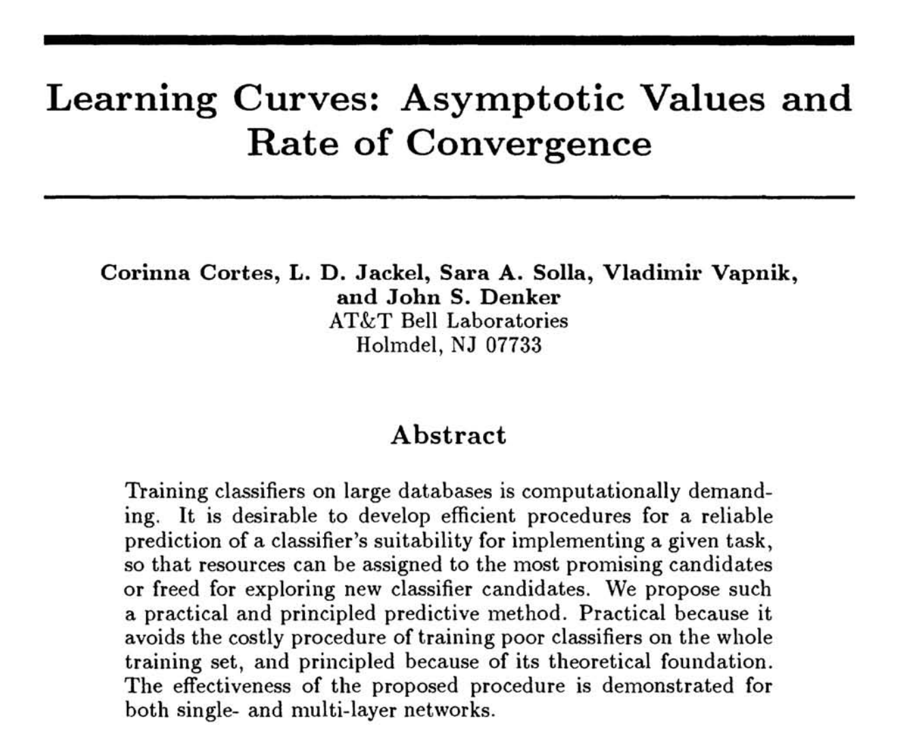
    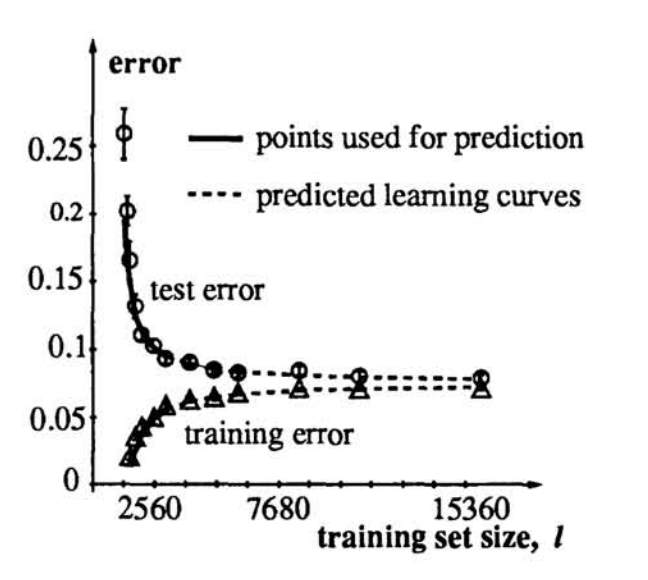
    
图9.1 早期贝尔实验室关于（数据）缩放定律研究

这篇来自贝尔实验室并发表在 NeurIPS 1993 上的论文[《Learning Curves: Asymptotic Values and
Rate of Convergence 》](https://proceedings.neurips.cc/paper/1993/file/1aa48fc4880bb0c9b8a3bf979d3b917e-Paper.pdf)，可以说是最早的（数据）缩放定律研究。他们发现，分类器的测试误差会随着训练集大小的增加而呈现幂律衰减，并提出可以通过在小数据集上拟合学习曲线来预测模型在大数据集上的性能。这与现代缩放定律的思想如出一辙。

> 神经信息处理系统大会（英语：Conference on Neural Information Processing Systems，NeurIPS），前称NIPS，是一个机器学习和计算神经科学领域的学术会议，每年12月举行。1986年，加利福尼亚理工学院和贝尔实验室的学者提出设想。1987年首届举办。2000年前举办地均在美国丹佛，此后曾在美国、西班牙、加拿大多地举办。

   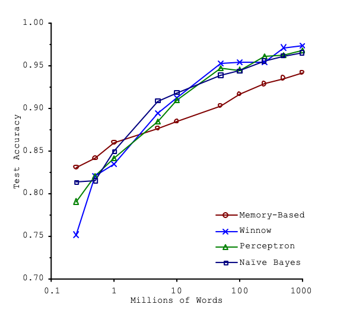
   
图9.2 混淆集消歧任务上的学习曲线

Banko & Brill 这篇发表在 ACL 2001 上的经典的 NLP 论文[《Scaling to Very Very Large Corpora for Natural Language Disambiguation》](https://aclanthology.org/P01-1005.pdf)指出，在某些任务上，增加数据量带来的性能提升远超改进算法本身。他们绘制了对数-线性的性能曲线，并提出了一个至今仍有影响力的观点：我们应该权衡“花钱做算法研发”和“花钱做数据收集”的投入。

> Confusion Set Disambiguation（混淆集消歧） 是一种自然语言处理任务，旨在根据上下文，从一组容易混淆的单词中选出正确的那一个。
例子：
>混淆集：{to, two, too}
>句子：I am going ___ the store.
>任务：模型需要根据上下文判断，这里应该填 to，而不是 two 或 too。

    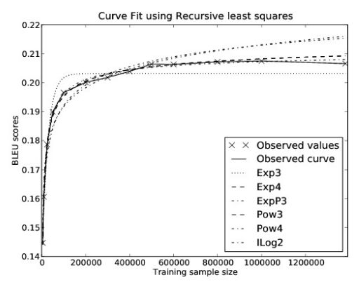
    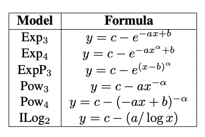
    
图9.3 使用不同的曲线簇对测试数据集进行曲线拟合

Kolachina 等人发表在 ACL 2012 上的一项研究[《Prediction of Learning Curves in Machine Translation》](https://aclanthology.org/P12-1003.pdf)，它验证了“数据量”与“模型性能”之间存在可预测的数学关系（特别是幂律关系）。研究团队使用了当时主流的 Moses 统计机器翻译系统，在 30 种不同的语言对和领域组合（如英语-德语、英语-西班牙语新闻等）上进行了大规模实验。他们尝试用不同的数学公式来拟合“训练数据量 (x)”与“翻译质量 (y, BLEU分数)”之间的关系。

指数簇：$Exp_{3}$, $Exp_{4}$, $ExpP_{4}$
幂律簇：$Pow_3$, $Pow_4$
对数簇：$ILog2$

论文得出了几个关键结论：
- **幂律（Power Law）拟合效果最好**。参数的幂律函数（Pow3）通常能最准确地描述机器翻译系统的学习曲线。这意味着只要持续增加数据，模型性能就会持续提升，这否定了“性能会快速饱和”的悲观假设
- **性能是可预测的**。如果只有很少的平行语料（比如 1万句），他们的方法可以将预测误差控制在 1.5 BLEU 以内。即使完全没有平行语料，仅通过分析单语数据的特征（如形态复杂性），也能粗略预测出学习曲线的形状。

    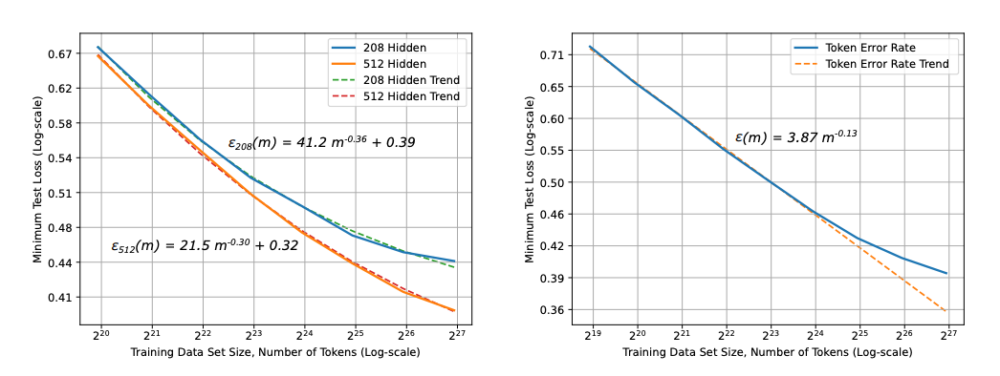
    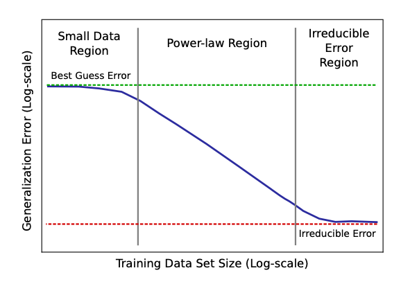
    
图9.4 神经机器翻译学习曲线

Hestness（2017） 等人在[《Deep Learning Scaling is Predictable, Empirically
》](https://arxiv.org/abs/1712.00409) 中，进行了最早的大规模神经网络缩放定律研究。他们发现，在机器翻译、语言建模、语音识别等多个任务中，模型性能都遵循一个可预测的幂律关系。他们还提出了著名的“三阶段”学习曲线：

- 小数据区 (Small Data Region)：数据太少，模型性能接近随机猜测。
- 幂律区 (Power-law Region)：性能随着数据量增加而稳定提升，在对数-对数坐标系下呈线性。
- 不可约误差区 (Irreducible Error Region)：数据量足够大，性能达到瓶颈，受限于模型容量或任务本身的固有难度。

这篇论文极具前瞻性，已经预示了“涌现”、“计算缩放”和“性能-精度权衡”等现代 LLM 领域的关键概念。

   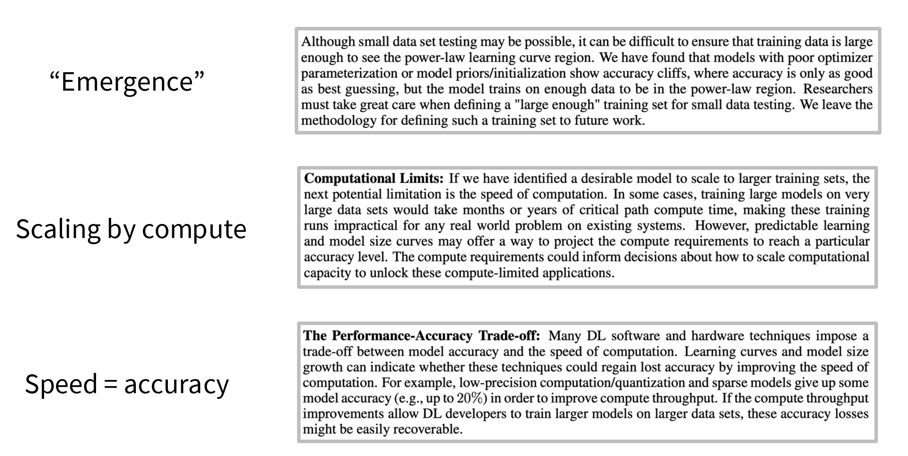
   
图9.5 Hestness（2017）提出的关键概念

## 9.3 LLM 的缩放行为

当缩放数据集大小或参数时，总是假设另一个变量处于饱和程度。例如，如果正在缩放数据集大小，模型规模大小要远大于数据集大小所能使之饱和的程度。因为如果数据量远多于参数量，最终会达到饱和（渐近线），但我们试图避免接近渐近线。

OpenAI 在[《Scaling Laws for Neural Language Models》](https://arxiv.org/abs/2001.08361) 中发现，语言模型性能与计算量 (Compute, C)、模型参数量 (Parameters, N) 和数据集大小 (Data, D) 之间都存在幂律关系。

   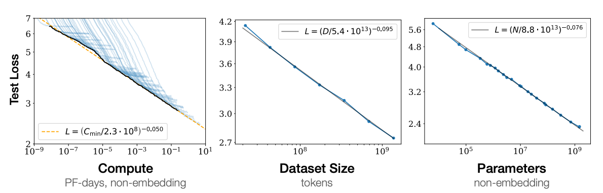
   
图9.6 随着模型规模、数据集规模和训练所用计算资源的增加，语言建模性能稳步提升

通常我们假设训练数据和测试数据分布是一样的。但即使训练数据和测试数据不同源（例如用 Common Crawl 训练，用 Wikipedia 测试），缩放定律依然成立。

   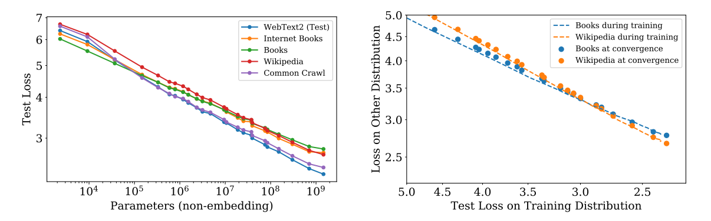
   
图9.7 训练数据和测试数据不同源下的缩放定律

### 9.3.1 数据 vs. 性能

当我们提到数据缩放定律之类的概念时，意味着有某种简单的公式，将数据集大小(n)映射到超额误差（Excess error）。

> **超额误差**指的是你当前模型的泛化误差与理论最优模型（或贝叶斯最优模型）所能达到的最小可能泛化误差之间的差值。超额误差衡量的是你能通过更好的算法、更多数据、更优模型来“改进”的那部分误差，而不是无法通过改进模型或增加数据来消除的**不可约误差**（irreducible error）。

下图展示了误差从 Best Guess Error（最佳猜测误差）到不可约误差。

    
    
图9.8 神经机器翻译学习曲线

- 在最佳猜测误差，此时模型的表现等同于“瞎猜”（比如在分类任务中，总是预测出现频率最高的那个类别）。在这个阶段，增加少量数据对性能几乎没有帮助；
- 在幂律阶段，数据量的指数级增加会带来误差的线性下降。只要在这个区域内，堆数据就能稳定地提升效果；
- 不可约误差区，无论你再加多少数据，误差也降不下去了。这通常是因为：
   - 数据本身的噪音（例如图片模糊、标注错误），这被称为贝叶斯误差（Bayes Error）。
   - 模型容量不足（模型太小，学不动了）。

我们主要关注的是从幂律区域（Power-law Region）到不可约误差区域，它能帮助我们判断当前模型是处于“缺数据”的状态（第二阶段），还是已经触碰到了“天花板”（第三阶段）。

    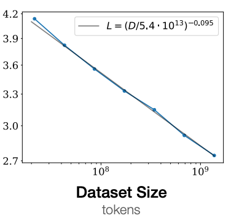
    
图9.9 数据大小与模型误差之间的幂律关系

一个经验性的观察是，在x轴上绘制数据集大小，在y轴上绘制模型误差（Test Loss）。在双对数坐标系（log-log plot）上，它们呈现出线性关系。在数学上，双对数图上的直线意味着两个变量之间存在 **幂律（Power Law）** 关系。

> Log-log plot (双对数图)：一种特殊的图表，横轴和纵轴的刻度都是按 $10^1, 10^2, 10^3...$ 这样指数级排布的。这种图专门用来检测幂律关系。

横轴代表训练模型所用的数据量（token的数量），纵轴代表模型在测试集上的损失值（Loss）。Loss 越低，代表模型预测得越准，性能越好。图中的蓝点是实际实验数据，灰线是拟合的直线。

我们期望误差是单调的，用更多数据训练，误差会下降。但并不知道精确的函数形式，当我们说是幂律时，意思是在对数空间中是线性的。如果某个关系在对数坐标下是线性的，意味着存在一个多项式来表达 x 轴和 y 轴之间的关系。但为什么是多项式的？下面通过两个示例来解答。

#### 示例1：均值估计

假设我们有一堆数据点 $x_1, ..., x_n$，它们服从正态分布 $N(\mu, \sigma^2)$。$\mu$ 是真实的均值（我们要猜的目标），$\sigma^2$ 是方差（数据的波动程度）。我们的**任务**是通过计算样本的平均值 $\hat{\mu} = \frac{\Sigma x_i}{n}$ 来估计真实的均值 $\mu$。

这样计算的误差是多少？

**均方误差（Mean Squared Error, MSE）** 衡量了你的估计值 $\hat{\mu}$ 和真实值 $\mu$ 之间差距的平方的期望计算公式如下：
$$\mathbb{E}[(\hat{\mu} - \mu)^2] = \frac{\sigma^2}{n}$$

我们发现误差与样本数量 $n$ 成反比。分母是 $n$，意味着**样本量 $n$ 越大，误差越小**。从“多项式视角”看，原误差$Error = \frac{\sigma^2}{n} = {\sigma^2}*n^{-1}$，属于 n 的 −1 次多项式。

对误差公式两边取对数：
    $$ \log(\text{Error}) = -\log(n) + 2\log(\sigma) $$

如果你画一个坐标图，横轴是 $\log n$（数据量的对数），纵轴是 $\log(Error)$（误差的对数）。你会得到一条**直线**，其斜率是 $-1$。这解释了为什么在之前的内容（如 Kaplan 2020）中，我们在双对数坐标系下看到的是直线。

通用情况，scaling law 的斜率为 $1/n^\alpha$，其中$\sigma > 0$ 是斜率参数（决定误差随 n 下降的速度）。

经典统计模型（如线性回归）的误差衰减速率通常是 $1/n$（即 $\alpha=1$）。但神经网络的缩放指数通常要小得多，在不同的任务中，查看缩放的斜率。机器翻译中是-0.13，语音是 -0.3，语言模型是 -0.095。这些比 $1/n^\alpha$ 的速率慢得多。为什么呢？

    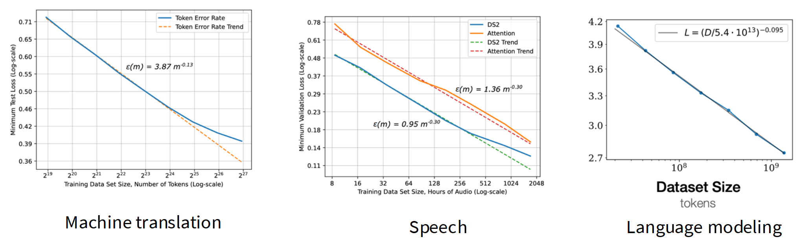
    
图9.10 三种不同任务的缩放指数

神经网络是非参数模型，可以拟合任意复杂函数。对于一个 $d$ 维空间中的非参数学习问题，其误差衰减速率近似为 $n^{-1/d}$。这意味着，**缩放定律的指数 $\alpha$ 反映了数据流形的“内在维度”**。指数越小，意味着任务的内在维度越高，学习难度越大。

> 这里的“非参数”不是说没有参数，而是指参数的数量不固定，或者说模型的复杂度可以随着数据量的增加而无限增长。

#### 示例2：2D 预测任务

假设我们在一个二维平面（2D unit box）上均匀撒下 $n$ 个点 ($x_1...x_n$)。我们要预测目标函数 $f(x)$。真实值 $y$ 包含噪音 $N(0,1)$。

既然我们不知道 $f(x)$ 长什么样（非参数），最笨但也最有效的方法就是**“切格子”**（直方图法）。我们将这个 2D 平面切成很多小方块，方块的边长设定为 $n^{-1/4}$。

> 为什么这样切？
这里有一个隐含的**偏差-方差权衡（Bias-Variance Tradeoff）**：
> - **方块太小**：每个方块里落入的样本太少，算出来的平均值波动很大（方差高）。
> - **方块太大**：方块里的函数变化太大，用一个平均值代表整个方块不准确（偏差高）。
>
> 因此，这里取了一个**最佳平衡点**，给出了最佳切法边长 $n^{-1/4}$。

边长是 $n^{-1/4}$，二维面积是 $(n^{-1/4})^2 = n^{-1/2} = 1/\sqrt{n}$，总面积是 1，所以方块总数是 $\sqrt{n}$ 个。

总样本 $n$ 除以方块数 $\sqrt{n}$，等于 $\sqrt{n}$。也就是说，**每个方块里平均有 $\sqrt{n}$ 个样本**。

统计学告诉我们，用 $k$ 个样本估算均值，误差（方差）与 $1/k$ 成正比。这里 $k = \sqrt{n}$。所以，**误差（Error） $\approx \frac{1}{\sqrt{n}}$**。

如果不是 2D，而是 $d$ 维空间，上述逻辑依然成立，只是指数变了。在 2D 时，误差是 $n^{-1/2}$；在 $d$ 维时，误差公式推广为：
    $$ Error = n^{-1/d} $$

如果我们把上面的公式取对数（画在双对数图上）$\log(Error) = -\frac{1}{d} \log(n)$，令 $y = \log(Error)$， $x = \log(n)$。这就得到了直线方程：**$y = -\frac{1}{d}x + C$**。

[Bahri 等人 (2021) 的研究](https://arxiv.org/pdf/2102.06701)，试图通过实验数据来证明：**Scaling Law 的斜率 $\alpha$ 确实是由数据的内在维度 $d$ 决定的。**

    
    
图9.11 维度与 scaling laws 斜率之间的关系

图中的**粉色点** (Teacher-Student)是人工合成的数据。可以看到它们完美地落在了一条直线上（黑色虚线）。这证明了在理论控制的实验中，Scaling Law 的斜率确实严格由维度决定。**其他颜色点 **(Real Datasets) 代表真实世界的图像数据集（如 CIFAR-10, MNIST）。有趣的是，它们也大致排列在直线上（虽然有些偏离，落在灰色虚线附近）。

这有力地支持了“内在维度理论”。它表明，无论是人工数据还是真实数据，**数据的内在维度越高（横轴越往右），Scaling Law 的斜率 $\alpha$ 就越小（纵轴值越大，因为是倒数），模型就越难训练。**

但是，内在维度的估计方法很不靠谱，所以这个结论并非无懈可击。对于像“猫的照片”或“莎士比亚的文字”这样的复杂数据，我们其实**无法精确计算**它的内在维度到底是多少。目前的估算算法（Estimators）往往误差很大，结果不稳定。因此，虽然图表显示出了相关性，但这可能部分归功于我们选择的估算方法凑巧吻合了理论。我们还不能 100% 确定 Scaling Law 完全只由内在维度决定。

##### 数据的构成（Data Composition）如何影响缩放定律？

迄今为止的数据缩放：数据集大小与性能有何关系？
相关问题：数据集组成如何影响性能

在 [OpenAI 的 Scaling Laws 原论文](https://arxiv.org/pdf/2001.08361)中也发现，数据集的组成只影响偏移量（即，y=kx+b中的b），不影响斜率。这意味这，如果你想选择一个好的数据集，不一定非要在超大规模下训练你的模型，可以将模型缩小，在小得多的模型上进行数据选择实验。

    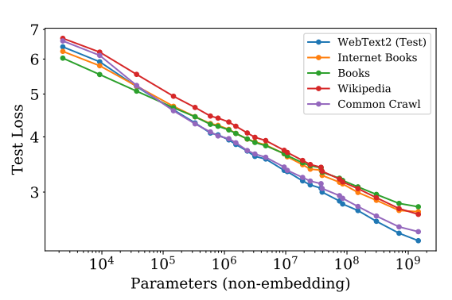
    
图9.12 数据组成只影响偏移量

Hashimoto 2021 在 [Model Performance Scaling with Multiple Data Sources](https://proceedings.mlr.press/v139/hashimoto21a/hashimoto21a.pdf) 论文中，系统研究了数据的构成（Data Composition）如何影响缩放定律。

    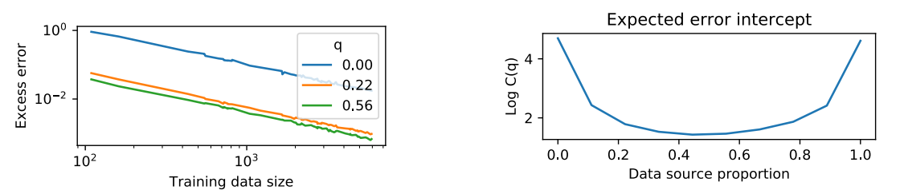
    
图9.13 数据混合比例如何影响缩放定律

左图三条线代表三种不同的数据混合比例 $q$（例如 $q=0$ 代表全用数据源 A，$q=0.56$ 代表混合了数据源 B）。无论 $q$ 是多少，这三条线的**斜率（Slope）是一样的**。这意味着，无论你怎么混合数据，模型随着数据量增加而变强的**速率（Rate）**是不变的（即指数 $\alpha$ 不变）。虽然斜率一样，但线条的**高低位置（截距 Intercept）**不同。橙色线（$q=0.22$）明显比蓝色线（$q=0.00$）要低。这意味着在相同的数据量下，**更好的数据配比能带来更低的误差**。

右图横轴表示数据源的比例 $q$（从 0 到 1），0 代表只用数据源 A，1 代表只用数据源 B，0.5 代表各一半。当你只使用单一数据源（$q=0$ 或 $q=1$）时，误差截距最高（效果最差）。当 $q \approx 0.5$ 时，曲线达到最低点。这意味着**混合两种数据源（多样性）能显著降低模型的误差**

总结一下：
- **指数 $\alpha$（斜率）**：由模型架构或任务的内在维度决定。**单纯改变数据的混合比例，无法改变这个“学习速率”。**
- **常数 $C$（截距）**：由**数据质量和配比**决定。这张图告诉我们，通过优化数据配比（比如让数据更多样化），我们可以降低常数 $C$。

#### Data repetition

在实际训练中，数据量是有限的（Finite Data）。如果我们把同样的数据给模型看很多遍（即增加 Epochs），模型的性能还能像看新数据那样持续提升吗？

通常的 Scaling Laws 假设我们有无限的、不重复的新数据。但实际上，数据是有限的。出自[Scaling Data-Constrained Language Models](https://arxiv.org/pdf/2305.16264)论文的这张图展示了重复训练数据（多轮 Epochs）带来的收益递减效应。

    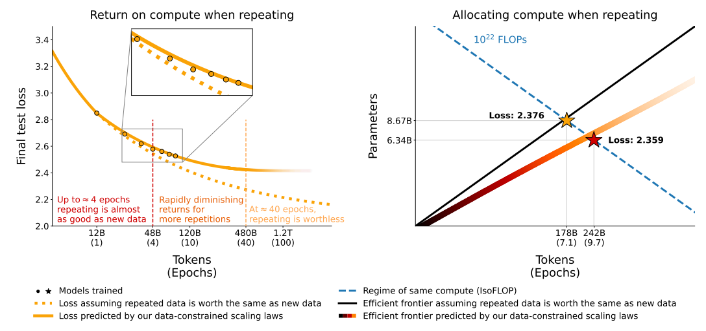
    
图9.14 重复数据与新数据对模型性能的影响

左图的横轴虚线表示理想情况。假设“重复的数据”价值等同于“全新的数据”，如果这样，Loss 会一直线性下降。实线表示现实情况，可以看到这条线逐渐变平，不再下降。

4个 Epoch 以内实线和虚线几乎重合。这意味着重复数据在早期（约4次以内）的效果几乎和新数据一样好；超过4个 Epoch 后，实线开始明显偏离虚线，重复数据带来的收益迅速递减；约40个 Epoch 实线彻底变平。这意味着重复数据变得毫无价值（Worthless），此时再怎么训练，模型也学不到新东西了，甚至可能开始过拟合。

右图回答了"如果我必须重复数据，我该如何分配我的算力（模型做多大？训练多久？）"

蓝虚线代表固定的算力预算，在这条线上的任何点，花费的钱/时间是一样的。黑实线假设数据无限时的最佳配置（Chinchilla Optimal）。红实线是数据受限（必须重复数据）时的最佳配置。黄星 (标准策略)是建议训练 178B Tokens (7.1 Epochs)，用更大的模型 (8.67B 参数)。红星 (数据受限策略)建议训练 242B Tokens (9.7 Epochs)，用稍小的模型 (6.34B 参数)。

当你面临数据短缺，不得不重复使用数据时，为了达到最佳效果，你应该稍微缩小模型规模，并增加训练的轮数（Epochs）。但即便如此，你能达到的最低 Loss（2.359）也只能比标准策略（2.376）好一点点，无法改变大局。

有效数据量计算：

$$ D' = U_D + U_D R_D^* (1 - e^{\frac{-R_D}{R_D^*}}) $$

这个公式试图量化“重复数据到底值多少新数据”。$D'$ (Effective data)表示有效数据量，即模型感觉自己学到了多少知识；$U_D$ (Unique tokens)是唯一数据的数量（原始数据集大小）；$R_D$ (Repetition)是重复次数（Epochs）。公式里的第一项 $U_D$ 是基础数据量。第二项包含 $(1 - e^{-x})$ 形式，这是一个典型的**饱和函数**。

随着重复次数 $R_D$ 增加，这一项会逐渐趋向于一个常数上限。这意味着无论你重复多少次，有效数据量 $D'$ 都有一个天花板，不会无限增长。

如果要在大数据环境下进行数据选择，重复10次wiki 和 包含新的数据，哪一种会更好？下面这项来自于 CMU 的研究，本质上是**在重复使用数据与选择质量较低的新数据之间进行权衡**。

    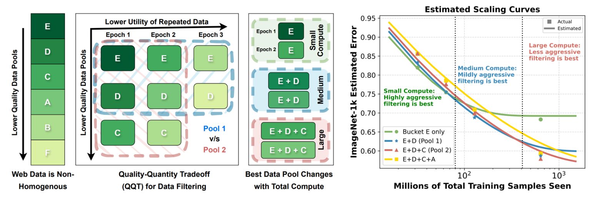
    
图9.15 大数据下的数据选择策略

图中将数据质量分成了不同等级的“池子”（Pools），E是最高，
D, C, A, B, F：质量依次递减。右图的绿线(Bucket E only)只用最高质量数据；蓝线 (E+D)混合了次优数据；红/黄线 (E+D+C)：混合了更多普通数据。

上述研究的主要发现是数据选择策略应当随着训练规模（算力预算）的变化而变化。
- 如果你只是训练一个小模型（或做个Demo），只用最高质量的数据，哪怕数据量少点也没关系
- 如果你要训练 GPT-4 级别的超大模型，过于严格的数据过滤反而有害。你需要放宽标准，把那些“还凑合”的数据也喂给模型，因为在大规模下，新数据比数据质量更重要

---

回顾：
- 数据和误差之间存在对数-对数的线性关系
- 这种关系在不同领域和不同类型的模型中都很稳健
- 以均值估计为例，可以很好地理解理论
- 应用：数据收集/管理

---

### 9.3.2 数据 vs. 模型大小

缩放定律同样适用于模型大小。通过在小规模上比较不同架构或超参数的缩放曲线，可以预测其在大规模下的表现。

问题：Transformer 真的比 LSTM 好吗？好多少？

训练一系列不同大小的 Transformer 和 LSTM 模型，绘制它们的性能-参数曲线。

    
    
图9.16 不同参数规模下Transformer 和 LSTM 性能的对比

Transformer 的曲线始终在 LSTM 的下方，且存在一个恒定的偏移。在对数坐标系中，这意味着 Transformer 在同等参数量下，比 LSTM 的计算效率高出一个常数倍。

    
    
图9.17 不同模型及架构的计算-性能（FLOPs vs 性能）图

在 [Scaling Laws vs Model Architectures: How does Inductive Bias Influence Scaling?](https://arxiv.org/pdf/2207.10551) 研究中，不交了标准 Transformer 与各种 Transformer 变体的负对数困惑度。

    
    
图9.18 Transformer 及其各种变体的计算量与性能之间的关系

绿色点代表标准的 Transformer，红色点代表 Transformer 架构的特定变体或配置。标签（如 Mini, Small, Base, Large, XL）表示模型的大小（参数量）

在 Transformer 及其各种变体中，性能（以 Negative Log-Perplexity 衡量）与计算量（FLOPs）之间存在着强烈的正相关关系，并且这种关系在不同模型架构和不同模型大小下都普遍成立。

### 9.3.3 超参数 vs. 性能

#### 优化器选择：Adam vs SGD

同样的方法可以用于比较优化器。[实验表明](https://arxiv.org/pdf/1712.00409)，Adam 通常比 SGD 具有更好的缩放特性（即曲线更低）。

    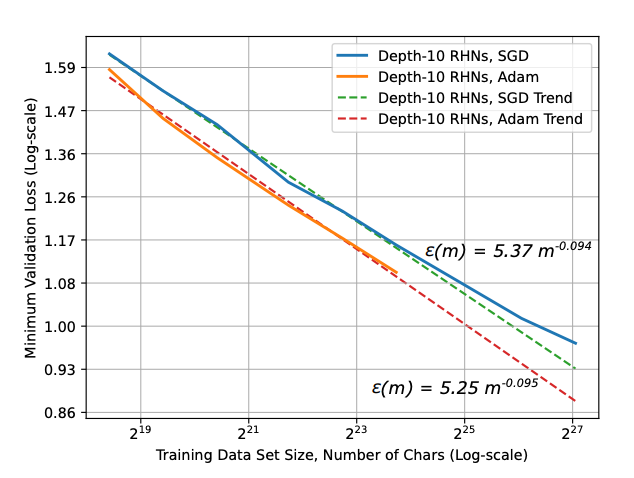
    
图9.19 优化器对比

> RHN是 Recurrent Highway Nets，循环高速网络

#### 深度/宽度: layers 的数量

一般认为，层数越深，效果会显著提升。但从[右图](https://arxiv.org/pdf/2001.08361)可以看出，从 1 层增加到 2 层会带来巨大性能提升。超过一定层数后，继续增加深度带来的收益会递减。

    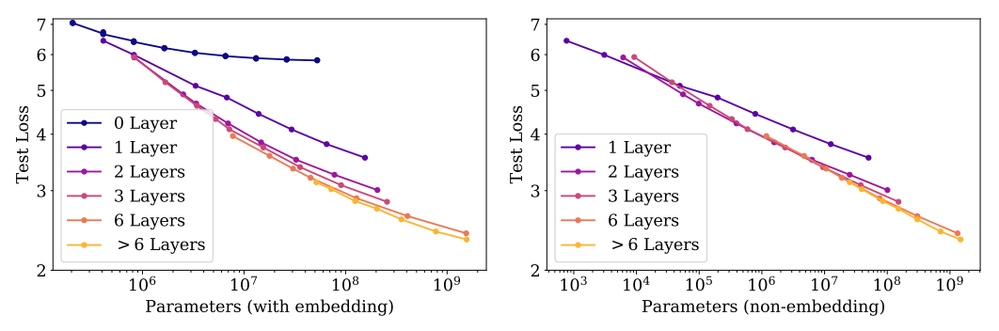
    
图9.20 layers数量对模型性能的影响

需要注意的是，并不是所有参数得到的 scaling law 都是一样的！如果把 embedding 参数当做模型的一部分，得到的 scaling law 会非常不同（如左图）。呈现出来的不是线性关系。

下图中，中间图的横坐标是宽度与深度的比值，不仅有不同大小的模型，还有不同的宽度/深度比值。在不同的横坐标，曲线的形状相似。可以看到在10~100之间表现最优。

    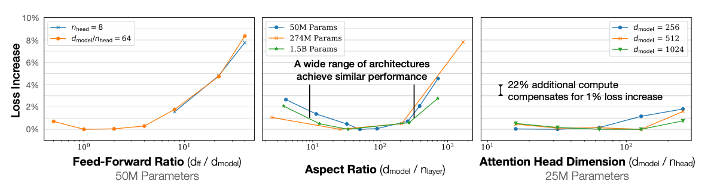
    
图9.21 模型的宽度和深度对性能的影响

前馈层比例 (Feed-Forward Ratio) $d_{ff} / d_{model}$，这是 Transformer 内部 MLP 层（前馈网络）的宽度与模型隐藏层维度（Embedding size）的比例。在 $10^0$ (1) 到 $10^1$ (10) 之间，曲线几乎是平的。这意味着，这个比例设为 2、4 还是 8，对模型效果几乎没影响。只有当你把它设得特别大（比如 >10），模型参数都浪费在 MLP 上了，效果才会变差。

宽高比 (Aspect Ratio)$d_{model} / n_{layer}$，数值小代表 $d_{model}$ 小，$n_{layer}$ 大。模型是 **高瘦型**（Deep & Narrow）。数值大代表 $d_{model}$ 大，$n_{layer}$ 小，模型是**矮胖型**。你可以训练一个 **48层、1600维** 的模型，也可以训练一个 **6层、4288维** 的模型。只要总参数量一样，它们的最终 Loss 差距不到 3%。

注意力头维度$d_{model} / n_{head}$，即每个注意力头（Head）的大小。无论你把头的大小设为 64 还是 128，只要总参数量不变，对最终效果几乎没有影响。

#### 批量大小 (Batch Size)

noise scale：在 batch 内随机采样时，你所预期的梯度噪声

    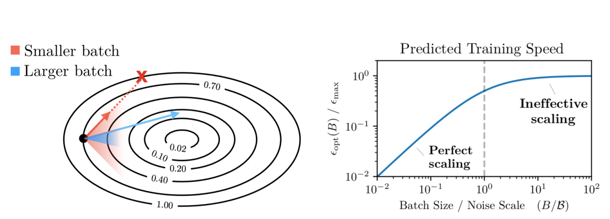
    
图9.22 批量大小与临界值

当批量大小小于临界值时，增大批量大小能有效降低梯度噪声，训练速度近似线性提升（Perfect Scaling）。当批量大小超过临界值时，收益迅速递减（Ineffective Scaling）。

    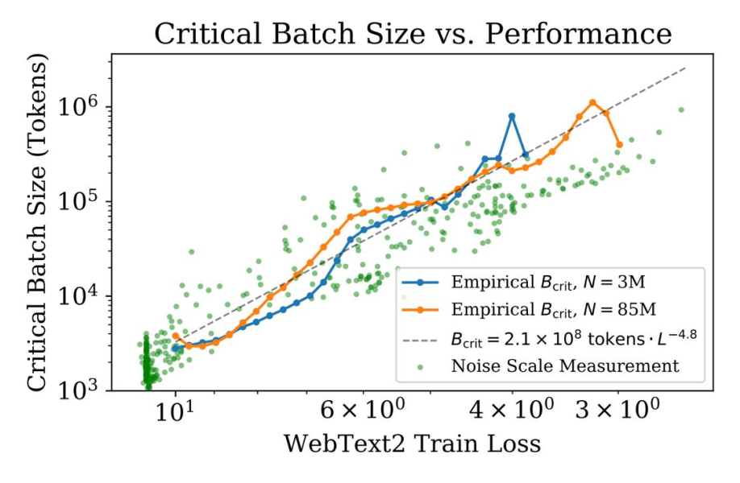
    
图9.23 临界批量大小与模型性能

当你尝试降低损失，也就是图形从左向右移动（横坐标是 10->6->4->3），critical batch size 会变大，相应的，整体的 batch size 就会更大。

所以，目标损失越小，可以使用的整体batch size 就越大。

    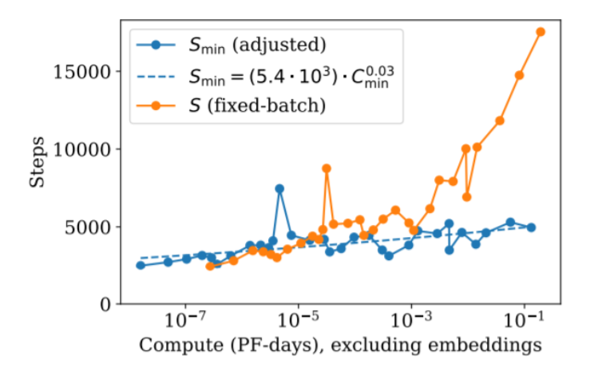
    
图9.24 选择最优的批量大小

随着计算量和模型规模的增加，我们应该如何扩展训练规模？

- 大 batch size，步数不变
- 固定 batch size，更多步数

#### 学习率 (Learning Rate)

当我们把模型做大时，学习率应该如何调整？通常如下左图所示，我们最优学习率依赖于模型规模。模型越大，最优学习率通常越小。

[μP (Maximal Update Parametrization)](https://arxiv.org/pdf/2203.03466) 这项工作（右图），通过一种特殊的参数化和初始化方案（尺度感知初始化），可以使得最优学习率在不同模型规模下保持稳定。这意味着你可以在小模型上找到最优学习率，然后直接将其用于训练万亿参数的大模型，无需重新调整。

    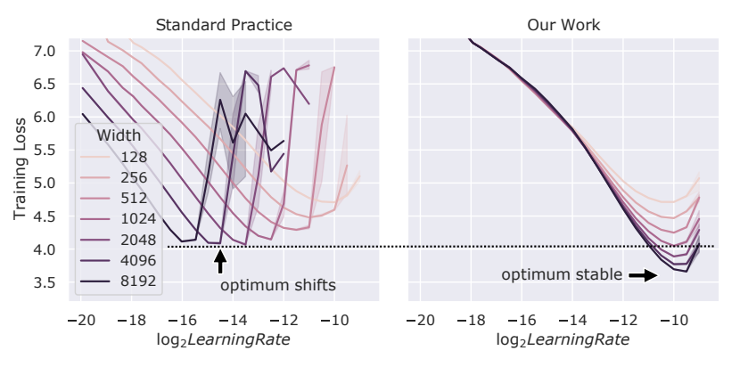
    
图9.25 标准做法与μP的改进

下面的[表格](https://arxiv.org/pdf/2304.06875)展示了如何实现 $\mu$P。核心思想是根据模型的宽度变化比例 $r$ 来调整初始化和学习率。

    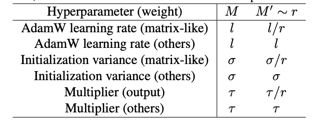
    
图9.26 μP的不同实现

假设我们要把模型 $M$ 放大到 $M'$，宽度扩大了 $r$ 倍：
*   **AdamW Learning Rate (matrix-like)**: 对于矩阵类的参数（如 Transformer 中的权重矩阵），学习率需要**除以 $r$** ($l/r$)。这是最关键的一步，通常意味着大模型的学习率要比小模型小。
*   **Initialization Variance (matrix-like)**: 初始化的方差也需要**除以 $r$** ($\sigma/r$)。这意味着大模型的初始权重应该更接近 0，以防止信号在深层网络中爆炸。
*   **Others**: 对于向量类参数（如 Bias, LayerNorm），通常保持不变。

总而言之，如果我们只是简单粗暴地把模型做大（Naive scale up），最佳学习率会变，导致训练困难。我们需要一种 **“感知缩放（Scaling Aware）”** 的初始化和学习率设置策略（即 $\mu$P），让超参数在不同规模的模型间保持稳定。

### 9.3.4 scaling 在不同的下游任务上表现不同

    
    
图9.27 scaling 在不同的下游任务上表现不同

左图，横坐标是计算量，纵坐标是困惑度，采用的都是log对数的形式。呈现出很好的相关性。

右图，纵坐标是 superGLUE 准确率，就没有线性关系了。有的模型明显比其他模型更好。

### 9.3.5 实践建议

在训练前可以有效选择优化器、模型深度、模型架构。先训练小模型，然后将结果外推，预测大模型的表现。

步骤：

- 在小模型上训练
- 建立某种扩展定律
- 设置最优超参数

## 9.4 联合缩放：模型、数据与计算 (Joint Scaling)

### 9.4.1 联合缩放定律

#### 模型大小 (N) 和数据量 (D)的联合缩放

在固定的计算预算下，我们应该训练一个更大的模型，还是用更多的数据训练一个较小的模型？

为了科学地解决这个问题，我们需要一个公式，能同时把“数据量 ($n$)”和“模型大小 ($m$)”都考虑进去。这就是**联合缩放定律**。

**Rosenfeld et al. (2020)** 提出 $ Error = n^{-\alpha} + m^{-\beta} + C $，这个公式直观地把误差拆成了三部分：
- **数据带来的误差** ($n^{-\alpha}$)：数据越少，这部分误差越大。
- **模型带来的误差** ($m^{-\beta}$)：模型越小，这部分误差越大。
- **不可约误差** ($C$)：任务本身的难度底线。

这意味着，如果你的模型太小（$m$ 很小），中间那一项就会很大，无论你怎么增加数据（$n$），总误差都降不下来。

**Kaplan et al. (2020)** 提出 $ Error = [m^{-\alpha} + n^{-1}]^\beta $，这是 OpenAI 提出的另一种形式，同样描述了模型大小和数据量之间的耦合关系，但考虑的是可约误差项，所以没有常数项C

下图展示的是，在绿色的小数据和小模型上训练，再扩展到红色的大数据和大模型上训练：

    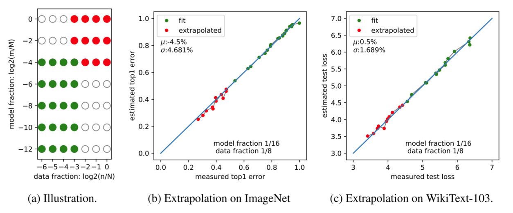
    
图9.28 参数_计算_数据的联合缩放

横轴是参数量，颜色代表计算量，数据量是第三个轴。

#### Compute vs performance 上的权衡

这张图（来自 Kaplan et al. 2020/2021）展示了在不同算力预算下，模型大小与性能的关系。

    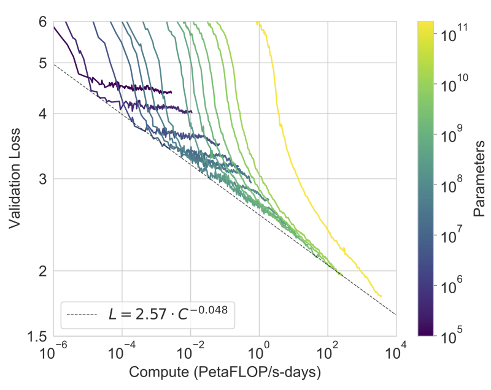
    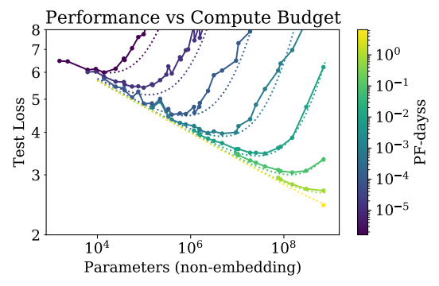
    
图9.29 不同算力预算下模型大小与性能的关系

左图每一条颜色的线代表一个固定的算力预算。对于每一个固定的算力预算，都存在一个唯一的最优模型大小。如果你钱多，就应该造大模型；如果你钱少，造大模型反而效果不如小模型。

右图小模型一开始 Loss 下降很快（起步快），但很快就变平了。大模型一开始 Loss 比较高（起步慢，因为参数多难训练），但随着算力投入增加，它会反超小模型，并且 Loss 能持续下降到更低的位置。

### 9.4.2 chinchilla

DeepMind 的 Chinchilla 论文 (Hoffman et al., 2022) 通过大规模实验，精确地拟合了这个联合缩放定律，并给出了一个惊人的结论：

> 对于给定的计算预算，模型大小和数据量应该按比例增加。

之前的模型（如 GPT-3）普遍是“模型过大，数据不足”（Over-trained on too little data）。Chinchilla 发现，要达到计算最优（Compute-optimal），数据量（tokens）和模型参数量的比例大约应为 20:1。

这意味着，一个 70B 的模型（Chinchilla-70B），应该用大约 $70B \times 20 = 1.4T$ tokens 来训练，其性能可以超过一个用更少数据训练的 175B 模型（GPT-3）。

Chinchilla 使用了三种方法来寻找在固定计算预算（FLOPs）下，模型大小（N）和数据量（D）的最优组合：

- 最小值包络法（Minimum over runs）：取所有训练曲线的下包络线。
- 等计算量分析法（IsoFLOPs）：在固定FLOPs下，扫描不同 N 和 D 的组合，找到性能最优的点。
- 联合拟合法（Joint fits）：在 N-D 网格上训练模型，直接拟合一个联合缩放函数。

这三种方法都指向了同一个结论：最优的 D 与 N 的缩放指数几乎都是 0.5，这意味着最优的 D/N 比例是常数。Chinchilla 得出的具体比例是 约 20 tokens per parameter。这意味着，与其训练一个巨大的模型，不如用相同的计算预算训练一个更小但数据量更充足的模型，后者性能更优。

### 9.4.3 从训练最优到推理最优

Chinchilla 定律是训练最优 (Train-optimal) 的，它的目标是在固定的训练计算预算下，获得性能最好的模型。但在实际部署中，推理 (Inference) 成本占据了模型生命周期总成本的大头。一个推理成本更低的小模型，即使训练成本稍高，也可能更具经济效益。

因此，业界趋势是**“过度训练” (Over-training)** 小模型，即用远超 Chinchilla 比例的数据来训练模型，以换取更强的推理能力。

- GPT3 – 2 tokens / param
- Chinchilla – 20 tokens / param
- LLaMA65B – 22 tokens / param
- Llama 2 70B – 29 tokens / param
- Mistral 7B – 110 tokens / param
- Llama 3 70B – 215 tokens / param

这种趋势表明，为了降低推理时的延迟和成本，业界愿意在训练阶段投入更多的计算资源，以获得一个在给定能力下参数量更小、更高效的模型。

## 9.5 扩散模型的缩放法则

在此之前，Scaling Laws 主要是在自回归模型（Autoregressive Models，即像 GPT 这样的大语言模型）上被广泛研究。[Likelihood-Based Diffusion Language Models](https://arxiv.org/pdf/2305.18619) 研究了缩放定律（Scaling Laws）在扩散模型（Diffusion Models）上的验证结果,主要发现是扩散模型也遵循同样的缩放法则

    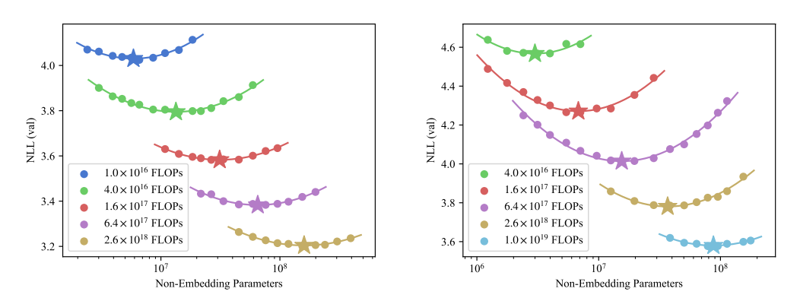
    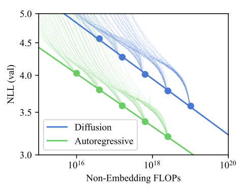
    
图9.30 不同算力预算下模型大小与性能的关系

Iso 前缀意味着“相等”，IsoFLOPS 是在固定总计算预算的前提下，去寻找模型大小（参数量）和训练数据量的最佳平衡点。左图是自回归模型的 IsoFLOP 曲线。中图是扩散模型的 IsoFLOP 曲线。右图把左图和中图里所有的“星星”（最佳点）连了起来，在双对数坐标下，这些最佳点连成了一条直线，这意味着扩散模型也严格遵循幂律（Power Law）。只要我们增加算力，我们就能精准地预测出扩散模型能达到多好的效果。

## 9.6 SCALING 的案例研究及实现细节

随着大语言模型进入产品化时代，业界对核心缩放策略（如数据-模型权衡、超参选择）的披露变得愈发谨慎。因此，我们只能通过少数公开、详实的研究案例来窥探其内部逻辑。本节将深入剖析三个典范：Cerebras-GPT、MiniCPM 和 DeepSeek，使读者了解现代顶尖语言模型（如 DeepSeek, MiniCPM）的开发者究竟是如何运用缩放定律来设计和优化其模型的。

### 9.6.1  Cerebras-GPT

[Cerebras-GPT](https://arxiv.org/pdf/2304.03208) 遵循Chinchilla扩展法则，每个参数对应20个token，训练了从 0.1B 到 13B 的 7 个 GPT-3 风格模型。并首次公开验证了 muP (Maximal Update Parametrization) 在大模型扩展中的有效性。

- 采用 muP 的模型在扩展时表现出 **更稳定的（stable）** 规模化扩展

    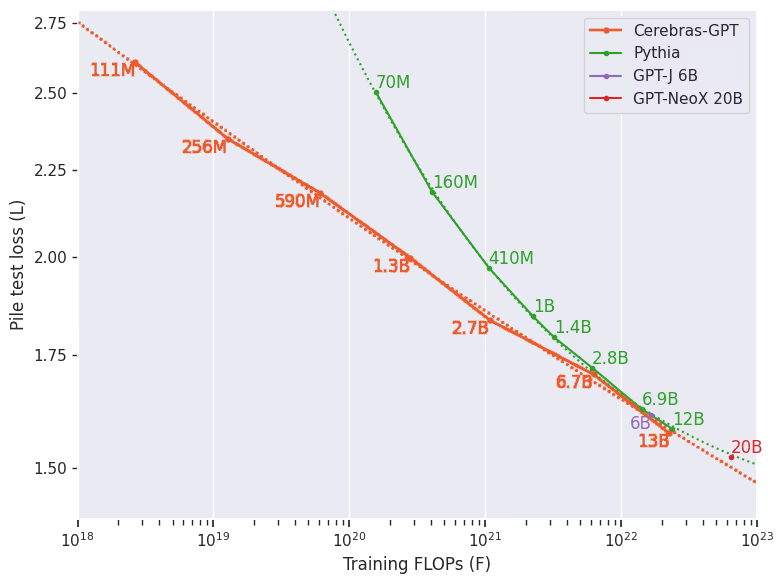
    
图9.31 使用mμP展现了更稳定的扩展规律

- 使用 mμP 带来 **更可预测（predictable）** 的规模化扩展

研究人员首先使用 mμP 缩放定律训练了一个小型模型（10M 参数），然后将这些超参数迁移到更大的 Cerebras-GPT 模型上。

    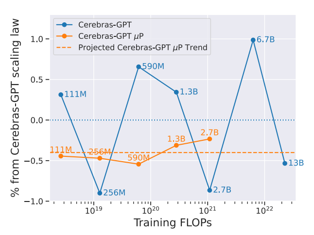
    
图9.32 使用mμP展现了更可预测的扩展规律

使用标准参数化（Standard Parameterization, SP） 和 最大更新参数化（Maximal Update Parameterization, µP） 训练的 Cerebras-GPT 模型，在不同训练 FLOPs 下相对于 Cerebras-GPT SP 拟合的 scaling law（缩放律） 的损失偏差。并且 mµP 的超参数是从一个 40M 的小模型上调优后通过 µTransfer 直接迁移到上述所有规模。

文章附录也给出了 Standard Parameterization (SP) 和 mμP 比较的详细实现细节：

    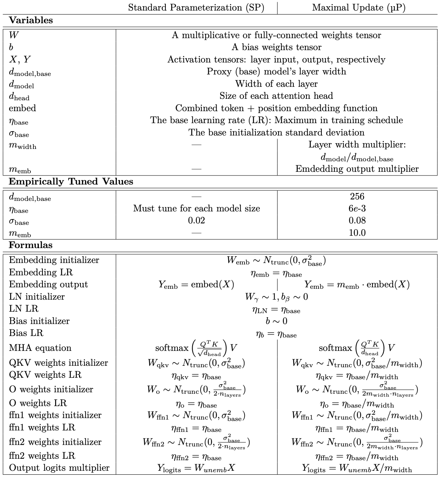
    
图9.33 SP和mμP的详细实现细节比较

展示了 Cerebras 团队如何为他们的 µP 模型找到最优的超参数。其核心思想是 “µTransfer”：即在小模型上找到一组好的超参数，然后直接将它们应用到大模型上，无需为每个大模型重新调参。

在 40M 参数的小模型上对三个关键超参数进行随机超参数搜索：

    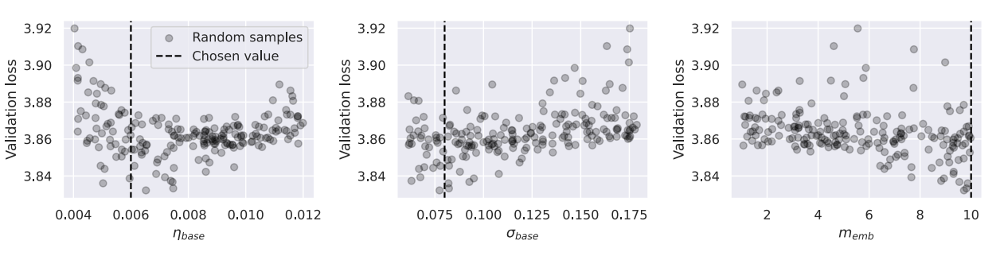
    
图9.34 在小模型对三个关键超参数进行随机超参数搜索

左图：η_base (基础学习率)
中图：σ_base (基础权重初始化标准差)
右图：m_emb (嵌入层缩放因子)

最终确定了以下三个超参数：η_base = 6e-3, σ_base = 0.08, m_emb = 10

通过在小模型上的一次性搜索，就能获得适用于大模型的超参数，极大地简化了大模型训练流程，降低了成本和复杂度。

### 9.6.2 MiniCPM

MiniCPM 是由面壁智能推出的系列大语言模型，这家从清华计算机系自然语言处理实验室走出来的创业公司，是国内最早研发大模型的团队之一，具有很强的实力和独特的技术路线。值得一提的是，2025 年 6 月斯坦福学生AI团队训练出的开源多模态模型，被传“套壳”了面壁智能的 MiniCPM-Llama3-V2.5 后，这家清华系大模型创业公司再次受到了社会关注。当前他们的发展路线更多聚焦于端侧模型，走出了一条与众不同的路。

放在 2024 年他们推出 MiniCPM 模型时，在开源模型中也属于第一梯队，以更小的 2B 模型打败了当时的一众 7B 规模的模型。

    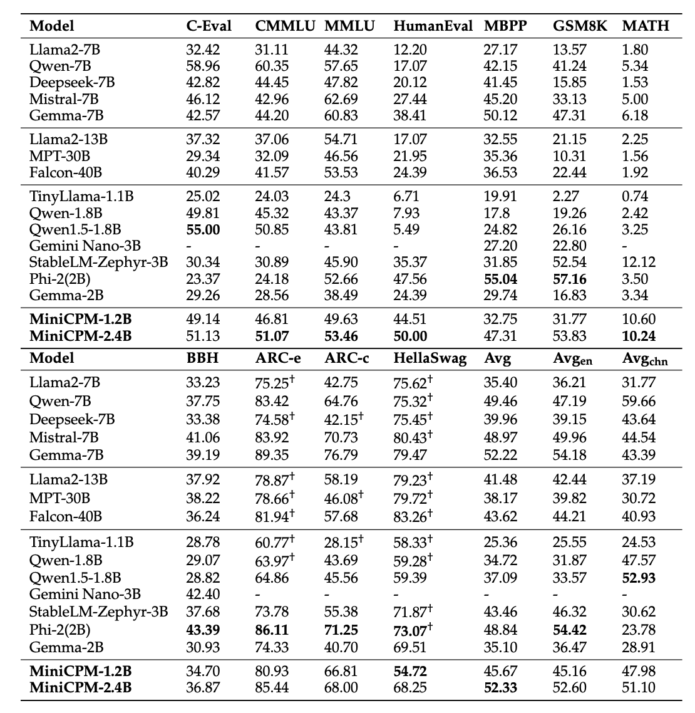
    
图9.35 MiniCPM与其他SOTA模型的性能比较

#### MiniCPM 同样使用 muP 用于稳定扩展

    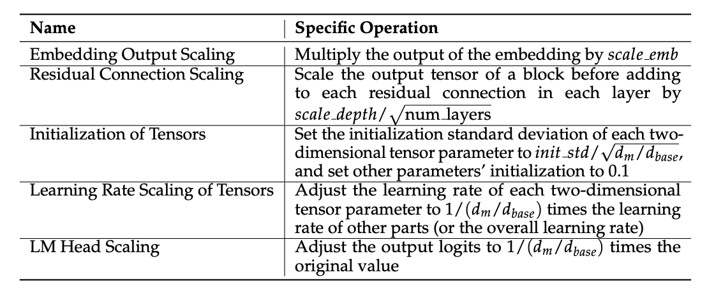
    
图9.36 使用muP稳定扩展

- MiniCPM 的结果：Scale_emb = 12, scale_depth = 1.4, init_std = 0.1, lr =0.01
- CerebrasGPT 的结果：Scale_emb = 10, lr=6e-3, init_base = 0.08

我们发现 MiniCPM 和 CerebrasGPT 得到了同样类型的缩放嵌入，相似的学习率（大约相差两倍左右）。总的来说，他们在超参数方面得到了相似的结果。

#### MiniCPM 模型缩放策略

MiniCPM 项目在进行“模型风洞实验”（Model Wind Tunnel Experiments）时所使用的模型缩放策略总结为以下三点：

- 使用 μP 来初始化模型参数：这确保了无论模型大小如何变化，其内部结构和超参数（尤其是学习率）都能保持稳定，从而可以公平地比较不同规模模型的性能。
- 固定长宽比 (aspect ratio)：这里的“长宽比”指的是模型架构的“深度”与“宽度”的比例。具体来说，就是保持 d_m (模型隐藏层维度) 和 L (层数) 之间的相对比例大致不变。这样做的目的是为了隔离变量，确保性能差异主要是由模型规模（参数量）的变化引起的，而不是由架构形状的根本改变导致的。
- 放大整体模型尺寸: 即通过增加 N(B)（非嵌入参数数量）、d_m、L 等参数，逐步构建从 9M 到 500M 参数的不同规模模型。

    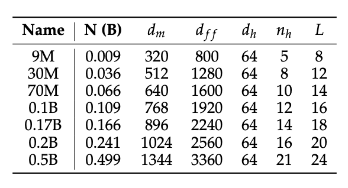
    
图9.37 缩放曲线中的模型配置和训练配置

这张表里最大的模型是 0.5B (500M) 参数。但最终发布的 MiniCPM 主模型（如 1.2B 和 2.4B）要大得多，大约是这个最大实验模型的 5倍。这说明，作者们先用一系列小模型（9M-500M）进行了详尽的“风洞实验”，找到了最佳的超参数和缩放规则（如 μP），然后才将这套成功的经验直接应用到了更大规模的 1.2B 和 2.4B 模型上，避免了对大模型进行昂贵且耗时的盲目调参。

他们没有为每个大模型单独做网格搜索。而是通过分析这些小模型（9M-500M）的训练数据，拟合出最优的批大小 (batch size)、学习率 (LR) 以及数据量与模型大小的比例 (token-to-size ratios)。然后，将这些通过“缩放分析”得到的经验公式，直接应用到 1.2B 和 2.4B 的大模型上。

#### 最优批次大小

展示了三个不同规模的模型（9M, 30M, 170M 参数）在不同数据量和批大小组合下的训练损失情况。

    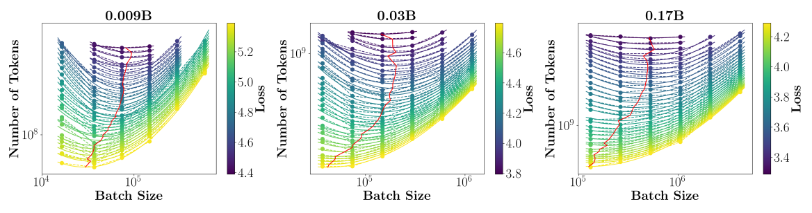
    
图9.38 三种不同规模模型使用不同批次大小进行训练的损失曲线

X轴（Batch Size，即每次梯度更新所使用的样本数量）；Y轴（已处理的总 token 数量，代表训练进度或计算量）；图中的每一列垂直排列的点，代表一个固定的批大小下，随着训练进行（Y轴增加），损失的变化曲线；红色曲线连接了在每一个特定数据量（Y轴值）下，能够达到最低损失的那个批大小，即“最优批大小”轨迹。

从三张子图可以看出，无论模型大小如何（9M, 30M, 170M），都存在一条清晰的红色曲线。这表明，对于任何给定的训练数据量，都存在一个最优的批大小，能使模型在该数据量下达到最佳性能。这个最优批大小会随着训练数据量的增加而增大。

然后，我们将这三条线连接起来，发现这些线在对数空间中很好地连接成线性关系，由此我们得到批次大小 bs 与 C4 损失 L 之间的以下关系：

$$ bs = \frac{1.21 \times 10^9}{L^{6.24}} $$

    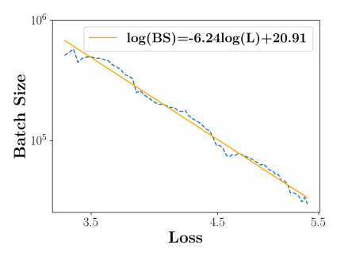
    
图9.39 连接最优批次大小

想要让模型达到更低的损失（即更好的性能），就需要使用更大的批大小。

#### 最优学习率

根据 mμP 理论，当模型规模扩大时，最优学习率应该保持稳定。这个理论在实践中成立吗？

    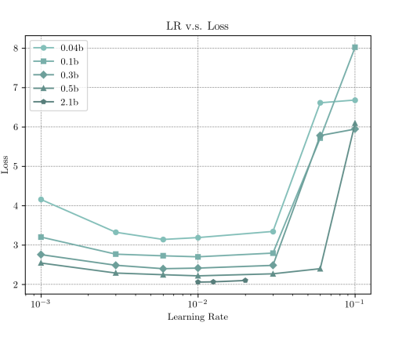
    
图9.40 MiniCPM使用mμP保持了学习率的稳定性

从 0.04B 扩大到 2.1B（增长了 50 倍），所有不同规模模型的“最低点”（即最优学习率）都集中在 0.01 附近。这个结果完美地验证了 mμP 学习率的稳定性。

#### 如何高效地研究模型大小与数据量之间的缩放关系（Scaling Law）？

要精确拟合一个缩放律，需要对每一个模型大小和每一个数据量组合都从头开始完整训练一次。如果有 m 个模型大小和 n 个数据量，那么总共需要进行 O(mn) 次完整的训练实验。这在资源上是极其昂贵的，对于大模型训练来说几乎是不可行的，那么我们该如何来避免这这种情况呢？

为了解决 Chinchilla 分析中早停（early-stopping） 的问题，他们引入了 WSD (Warmup-Stable-Decay) 学习率调度。

    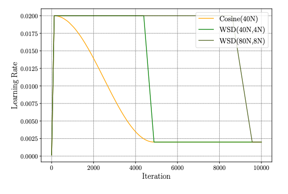
    
图9.41 学习率策略比较

WSD 由三个阶段组成：预热（Warmup）、稳定（Stable）和衰减（Decay）。图中的两条 WSD 曲线（WSD(40N,4N) 和 WSD(80N,8N)）共享了相同的稳定训练阶段。这意味着，你可以在一个较长的稳定阶段（如 80N 步）训练后，随时从中间的某个检查点（如 40N 步）开始，仅进行短时间的衰减（如 4N 步），就能获得一个性能优秀的模型。这允许从单次完整训练中，通过在稳定阶段的不同点上执行衰减，来近似模拟不同数据量下的训练结果，从而极大地降低了 Chinchilla 风格分析的计算成本。

    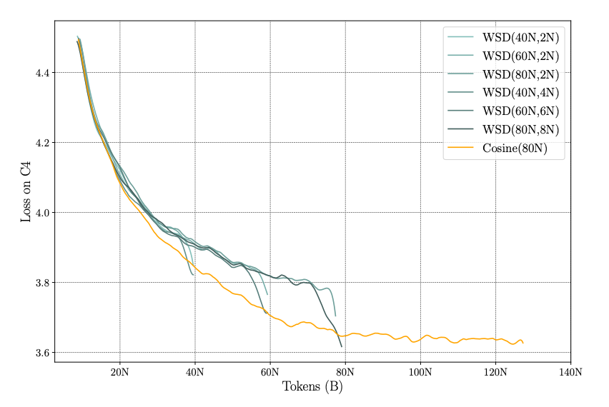
    
图9.42 模型训练损失在WSD的衰减阶段突然下降

使用 WSD 进行训练时，模型损失（Loss）随处理的 token 数量变化的真实情况。稳定阶段缓慢下降，衰减阶段模型的损失却会急剧下降，并在很短的时间内达到甚至低于传统 Cosine 的最终损失水平；衰减阶段通常只需要占总训练步数的 ~10% 左右（例如 WSD(80N,8N) 中，8N 是 80N 的 10%），就能实现性能的飞跃。

结合 WSD 和多尺度训练，他们采用 Chinchilla 方法1（下包络线）和方法3（联合拟合）来确定数据-模型的最优比例。他们得出了一个极高的比例（~192 tokens/param），这暗示了通过精细调优，我们可以显著超越早期的 Chinchilla 基准（20 tokens/param）。

#### 估算 chinchilla 曲线的其他方法

Gadre 等人在[Language models scale reliably with over-training and on downstream tasks](https://arxiv.org/abs/2403.08540)论文里，提出基于拟合曲线的方法去估算chinchilla 曲线。

    
    
图9.43 验证集损失与计算量的关系

核心思想:是 “过度训练带来的‘惩罚’是稳定的”。这意味着，当模型在给定计算量下被训练到最优损失时，其性能瓶颈主要由模型大小和数据量决定，而不是由训练不充分导致。

下方给出了用于拟合缩放律的经典公式：

$$ L(N, D) = E + AN^{-\alpha} + BD^{-\beta} $$

这个公式是描述模型损失 L 与模型参数量 N 和训练数据量 D 之间关系的通用形式。

- E: 损失的一个基础常数项，代表了模型能力的理论下限或无法通过增加参数或数据消除的“不可约损失”。
- $AN^{-α}$: 代表由模型大小不足导致的损失。A 是一个拟合常数，α 是模型规模的缩放指数。当 N 增大时，这一项会减小，表明更大的模型能更好地捕捉数据中的模式。
- $BD^{-β}$: 代表由数据量不足导致的损失。B 是一个拟合常数，β 是数据量的缩放指数。当 D 增大时，这一项会减小，表明更多的数据能让模型学到更丰富的知识。

Hoffmann et al. (2022) 通过拟合大量实验数据发现，α 和 β 的值非常接近（约为 0.35），这意味着为了达到最优性能，模型参数 N 和数据量 D 应该以相同的比例增长。

下面公式是对上述公式的一种数学变换，它将损失 L 重新表达为总计算量 C 和数据-模型比 M 的函数。这是为了更直观地分析在固定计算预算下，如何分配资源（即选择多大的模型和多少数据）才能获得最佳性能。

$$ L(C, M) = E + \left(aM^{\eta} + bM^{-\eta}\right) C^{-\eta} $$

- C: 总计算量（FLOPs），近似为 C = 6ND。
- M: 数据-模型比（Token Multiplier），定义为 M = D/N。M 越大，表示模型相对于数据越“小”，更容易过拟合。
- η: 新的缩放指数，定义为 η = α/2。
- a, b: 新的拟合常数，由 a = A(1/6)^{-η} 和 b = B(1/6)^{-η} 计算得出。

#### Chinchilla-type 分析

作者们采用了 Hoffmann et al. (2022) 提出的缩放律公式 L(N, D) = C_N * N^(-α) + C_D * D^(-β) + L_0 来拟合他们的实验数据。目标是在给定总计算量 C = 6ND 的前提下，找到使损失最小的最优模型大小 N_opt 和最优数据量 D_opt，并计算它们的比例 N_opt / D_opt。
给出了计算最优比例的公式 N_opt / D_opt = K² * (C/6)^η。这个公式表明，最优比例与总计算量 C 有关。

MiniCPM 团队选择了两种方法进行分析：“下包络法(lower envelope)” 和 “联合拟合法(joint fit)”。

“Lower envelope” 指的是对于每一个固定的计算量，选取所有不同规模模型中能达到的最低损失。这些最低损失点连成的曲线就是“下包络线”。下图展示了三个不同任务（Code, English Wikihow, Chinese Wikihow）下的损失随计算量变化的趋势。

    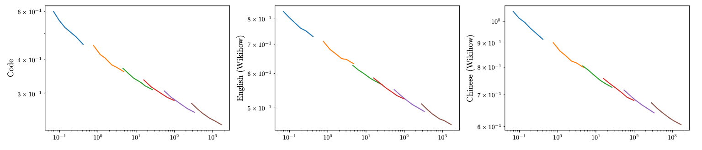
    
图9.44 验证集损失与计算量的关系

不同颜色代表不同模型。它们的运行结果表明，由于数据带来的收益递减效应相对较低。这暗示着，在当前的模型规模下，增加数据量仍然能带来显著的性能提升。

“Joint fit” 指的是将模型大小 N 和数据量 D 作为两个独立变量，同时对所有实验数据点进行一次全局拟合，以得到统一的缩放律公式。

    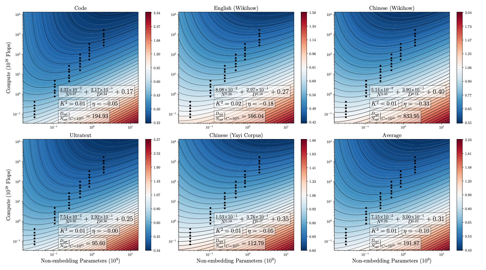
    
图9.45 使用WSD在三种任务上进行扩展实验的fit结果

最重要的结果以子图4为例，D_opt / N_opt | C=10²¹ = 95.60。这意味着，在给定 10²¹ FLOPs 的计算量下，最优的数据量应该是模型大小的 95.6 倍。这个比例（约 100:1）远高于 Chinchilla 研究中提出的 20:1。

#### 小模型配大量数据

在给定的计算预算下，为了达到最佳性能，模型应该被“喂”上比其自身参数量大 192 倍的数据。这个数字（192）与 Hoffmann et al. (2022) 在 Chinchilla 研究中提出的“20:1”比例形成了鲜明对比。作者强调，尽管趋势一致（即随着计算量增加，最优数据-模型比会变化），但绝对数值存在巨大差异。

这一发现是基于 WSD 调度器进行的高效实验得出的。通过在稳定阶段训练后，仅用少量衰减步骤即可评估不同数据量下的性能，从而能够以线性成本探索数据轴，最终拟合出这个高比例。像 LLaMA 3 这样的新模型也采用了更高的数据-模型比，这表明“20倍法则”只是一个经验之谈，通过更精细的优化，可以超越它。

#### 缩放曲线拟合效果良好

图中包含 12 个小图，分别对应不同的模型大小（从 0.031B 到 2.0B）和不同的下游任务（Code, English (Wikihow)）。

    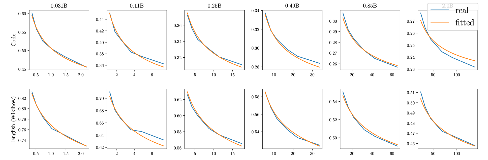
    
图9.46 在不同模型规模和不同下游任务上使用WSD的缩放曲线

这证明了他们使用 WSD 调度器进行高效实验的方法是可靠的，收集到的数据具有很高的质量

### 9.6.3 Deepseek

作为 DeepSeek 基座模型的开篇工作[DeepSeek LLM: Scaling Open-Source Language Models with Longtermism](https://arxiv.org/abs/2401.02954)，正式开源了 DeepSeek-V1 ，似然 V1 的性能不像 V3 那么亮眼，但是在当时在同等规模上也达到了和 LLaMA 2 相当。

    
    
图9.47 DeepSeek与其他SOTA模型的性能比较

在 Scaling strategy 上，DeepSeek 代表了另一种务实的技术路线，他们没有使用 muP，而是选择直接拟合缩放定律来指导超参选择。

    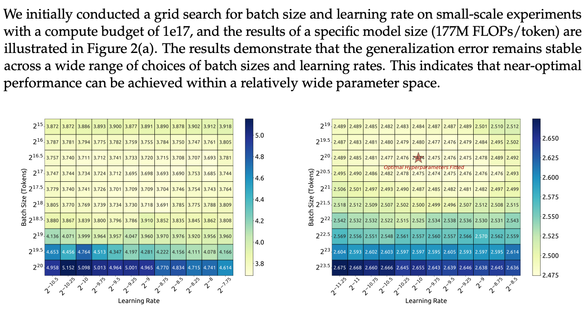
    
图9.48 给定预算下批次大小和学习率的组合

本图旨在经验性地研究在给定的计算预算下，哪些批次大小和学习率的组合能够使模型达到最优或接近最优的性能。图中颜色最深、泛化误差最低的区域集中在右下角。这表明对于这个特定的计算预算和模型规模，较大的批次大小和相对较小的学习率可以获得更好的性能。

这张图展示了DeepSeek LLM在不同计算预算（Non-Embedding Training FLOPs）下，训练过程中最优批次大小（Optimal Batch Size）和最优学习率（Optimal Learning Rate）的变化趋势。

    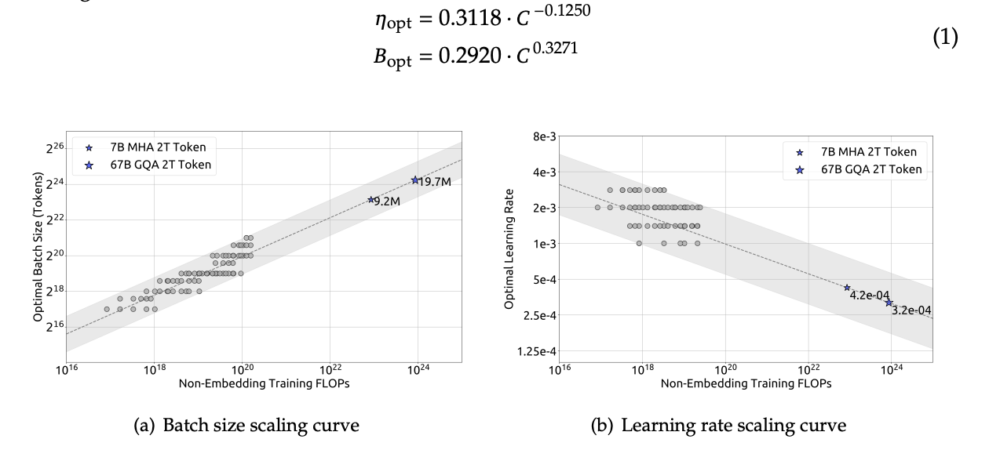
    
图9.49 不同计算预算下最优批次大小和最优学习率的变化趋势

(a) 批次大小缩放曲线 (b) 学习率缩放曲线。通过对大量实验数据的拟合，论文作者确定了批次大小和学习率这两个关键超参数与训练计算预算之间的幂律关系。

我们可以发现，批次大小拟合曲线很好的呈现出线性关系，但是学习率拟合曲线并非看起来是完美的线性，数据点有聚集。而在论文里将这描述为“近乎最优超参数存在一个宽泛区间”，笔者个人认为“宽泛区间”是一种现实对理想情况的一种承认和“让步”，它接受了现实中的非完美性。

    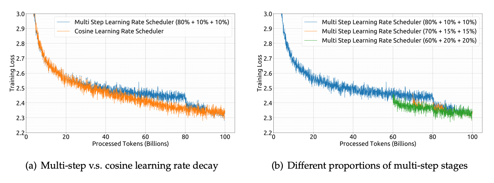
    
图9.50 不同学习率调度器对训练损失的影响

图 （a）尽管两种调度器在训练过程中损失下降的趋势略有不同，但最终在处理完 1000 亿 tokens 后，它们的训练损失非常接近。这表明多步学习率调度器在模型最终性能上与余弦调度器基本保持一致。但选择多步学习率调度器的一个重要原因是它更便于进行“持续训练”（continual training），即在原有模型基础上继续训练，可以重复利用第一阶段的训练成果。同时，他们(图 b )也验证了多步调度器中不同阶段比例的选择对最终性能的影响有限。

    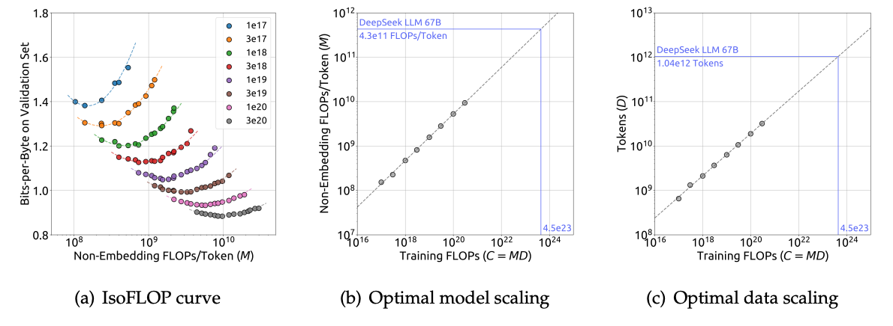
    
图9.51 计算预算-模型规模和数据规模之间的Scaling-Law

IsoFLOP 分析 = 在相同总计算量（FLOPs）下，比较不同 (N,D) 组合的模型性能

该图展示了大型语言模型训练中的缩放定律，具体说明了计算预算 (C)、模型规模 (M) 和数据规模 (D) 之间如何相互影响，以及如何找到最优的模型和数据分配策略以最小化泛化损失。图（a）的每条虚线代表一个固定的总计算预算 (C)，从 1e17 FLOPs 到 3e20 FLOPs。每个点表示在该计算预算下，不同模型规模 (M) 所对应的 Bits-per-Byte 性能。 每条曲线都呈现出类似“U”形的趋势，表明在固定的计算预算下，存在一个最优的模型规模 (M)，使得 Bits-per-Byte 达到最低（即性能最好）。随着计算预算 (C) 的增加（从蓝色曲线到灰色曲线），曲线的最低点（最优性能点）会向右下方移动。这表明：
- 在更大的计算预算下，模型可以更大（最优 M 值更大）。
- 在更大的计算预算下，模型可以实现更低的泛化损失（最低 Bits-per-Byte 更低），意味着性能更好。

图（b）揭示了模型规模的最佳增长路径。研究发现，最优模型规模 $M_{opt}$​ 与计算预算 C 之间存在幂律关系，即 $M_{opt} \propto C^a$，其中 a 是模型缩放指数。这意味着随着计算资源的增加，模型应该变得更大。

图（c）揭示了数据规模的最佳增长路径。研究发现，最优数据规模 $D_{opt}$​ 与计算预算 C 之间也存在幂律关系，即 $D_{opt} \propto C^b$，其中 b 是数据缩放指数。这意味着随着计算资源的增加，模型训练所需的数据量也应相应增加。

    
    
图9.52 DeepSeek在不同训练计算预算下在验证集上的性能表现

这张图展示了DeepSeek LLM模型在不同训练计算预算下，其在验证集上的性能表现，即所谓的“性能缩放曲线”。它验证了论文中提出的缩放定律能够有效预测大规模模型的性能。该图的关键在于，DeepSeek LLM 7B 和 67B 这两个大规模模型的实际性能（蓝色星形点）与通过小规模实验数据拟合出的缩放曲线（虚线）高度吻合。这表明通过小规模实验得到的缩放定律可以准确**预测**计算预算增加数百甚至上千倍后（例如 10^{20} 量级的实验可以预测 10^{23} 或 10^{24} 量级的模型）大规模模型的性能。这为研究人员和开发者在投入巨大计算资源训练大型模型之前，提供了可靠的性能预期和优化资源分配的指导。

### 9.6.3 其他模型的 Scaling Law

#### LLaMA 3 (2024) Scaling laws

下面的图表有力地证明了 [Llama 3](https://arxiv.org/abs/2407.21783) 团队在模型开发中运用缩放定律的成功。

    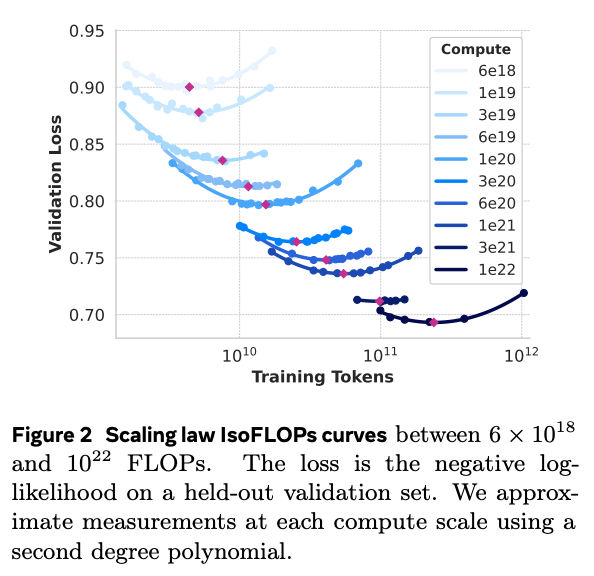
    
图9.53 Llama3的IsoFLOPs的Scaling-Law曲线

这张图展示了 Llama 3 团队在模型开发过程中，如何利用缩放定律（(39-1 ratio)）来指导预训练，以在不同计算预算下达到最佳模型性能。

    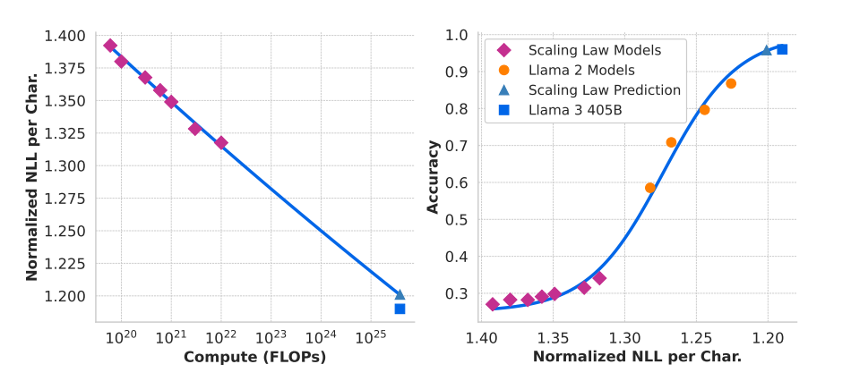
    
图9.54 对ARC-Challenge的Scaling-law预测

这张图展示了 Llama 3 团队如何利用缩放定律（Scaling Laws）来预测其模型 Llama 3 405B 在特定下游任务（这里是 ARC Challenge 基准测试）上的表现。左图是计算量 (FLOPs) 与标准化负对数似然 (NLL) 的关系，右图是标准化负对数似然 (NLL) 与准确率 (Accuracy) 的关系。

#### Hunyuan-1 (2024) large scaling laws

    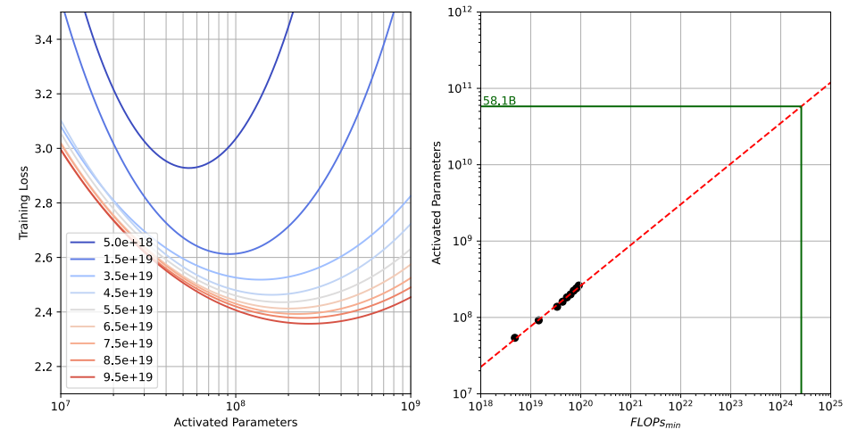
    
图9.55 Hunyuan混合专家模型的Scaling-Law

这张图展示了Hunyuan-Large模型在进行预训练时，关于**混合专家（MoE）**模型缩放法则的重要发现。左图是不同计算预算下的训练损失与激活参数关系，右图是激活参数与最低计算预算的缩放关系。另外，该研究指出在大型语言模型（特别是MoE模型）的预训练中，为了达到计算效率最优，理想的配置是每激活一个参数，大约需要使用96个训练 token 进行训练。

#### MiniMax-01 (2025)

    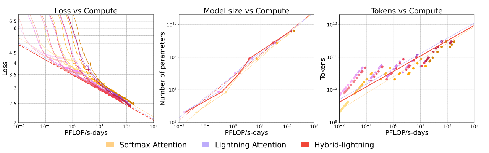
    
图9.56 MinMax-Scaling-Laws

这张图展示了在不同计算预算（以 PFLOP/s-days 为单位）下，三种不同的注意力机制（Softmax Attention, Lightning Attention, Hybrid-lightning）在模型性能（Loss）、模型规模（Number of parameters）以及训练数据量（Tokens）方面的扩展规律。

MiniMax-01 使用了自己开发的针对不同注意力机制的**架构缩放定律**，并且在确定模型规模和训练数据量以最大化计算效率和性能方面，借鉴了 Chinchilla 论文提出的计算**最优性缩放**方法论。这使得他们能够在庞大的参数规模和长上下文能力之间取得平衡，并优化训练过程，最终构建出 MiniMax-01 系列模型。

#### 总结

##### CerebrasGPT

- 使用 mμP 技术使超参数在模型规模变化时保持不变
- 直接使用 Chinchilla 缩放公式

##### DeepSeek 

- 假设大部分 Transformer 超参数在模型规模变化时保持不变
- 对批次大小/学习率进行缩放分析，以找出最优缩放比例
- 进行 IsoFLOP 等计算量分析，以确定模型大小
    - 使用分段线性调度器来降低 Chinchilla 式缩放的成本

##### miniCPM 

- 使用 mμP 技术使 Transformer 架构和学习率在模型规模变化时保持不变
- 使用分段线性调度器（WSD, Warmup-Stable-Decay）来获取用于 Chinchilla 方法 3（曲线拟合）的样本

##### LLaMA 3 / Hunyuan

- 只遵循等计算量原则，无其他详细缩放细节

##### Minimax

- 架构选择/决策缩放